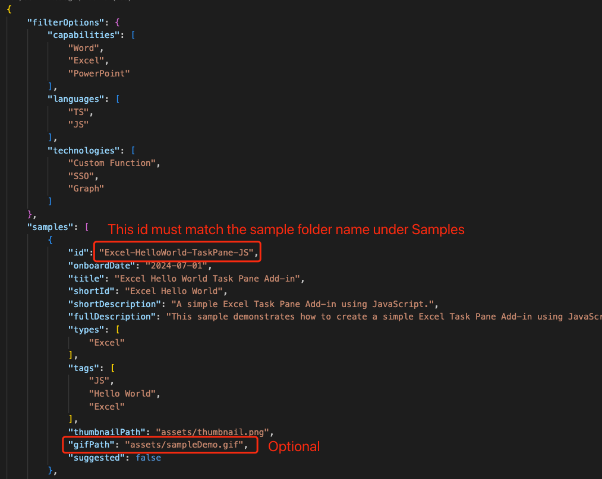

# Contributing
## How it works?
When developers open the sample gallery of the Dev Kit. It will try to fetch the [samples-config-v1.json](./samples-config-v1.json) file in the `main` branch and consumes it. When developer decides to create from a sample in the sample gallery, the Dev Kit will concat the repo url and sample config id to construct a url and fetch it, to download the zip of sample project from this repo and unzip it to the designated path.
```
"filterOptions": { // Consumed by the search filters
    "capabilities": [
    ],
    "languages": [
    ],
    "technologies": [
    ]
},
"samples": [ // All config in this config list are presented in the sample gallery
    {
        "id": "Excel-HelloWorld-TaskPane-JS",
        "onboardDate": "2024-07-01",
        "title": "Excel Hello World Task Pane Add-in",
        "shortId": "Excel Hello World",
        "shortDescription": "A simple Excel Task Pane Add-in using JavaScript.",
        "fullDescription": "This sample demonstrates how to create a simple Excel Task Pane Add-in using JavaScript.",
        "types": [
            "Excel"
        ],
        "tags": [
            "JS",
            "Hello World",
            "Excel"
        ],
        "thumbnailPath": "assets/thumbnail.png",
        "gifPath": "assets/sampleDemo.gif",
        "suggested": false
    },
]
```


## Branch
Default branch is `dev`. You should set `dev` as the target branch of PRs. `dev` will be merged into `main` regularly after testing.

`main` branch is the release branch, which means all content in this branch will be directly consumed by the [Office Add-ins Development Kit](https://marketplace.visualstudio.com/items?itemName=msoffice.microsoft-office-add-in-debugger)'s sample gallery:


## Testing
TBD

## Check in new sample into Sample Gallery
1. Make sure the sample project folder is under the **Samples** directory. (You can add new samples under this directory or check in the existing ones)
    1. Make sure it's runnable and well tested.
    2. Add README.md and RUN_WITH_EXTENSION.md. You can use the README_TEMPLATE.md under root directory.
2. Add a new config to the [config file](samples-config-v1.json) with following format.
    1. Fill in these values.
    2. Make sure **id** has identical value with the folder name you just created
    