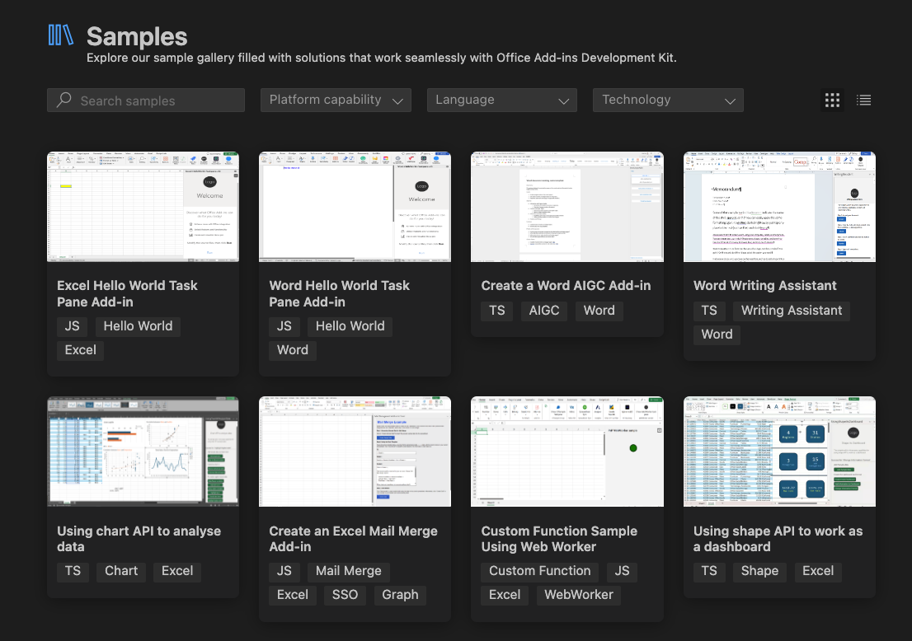
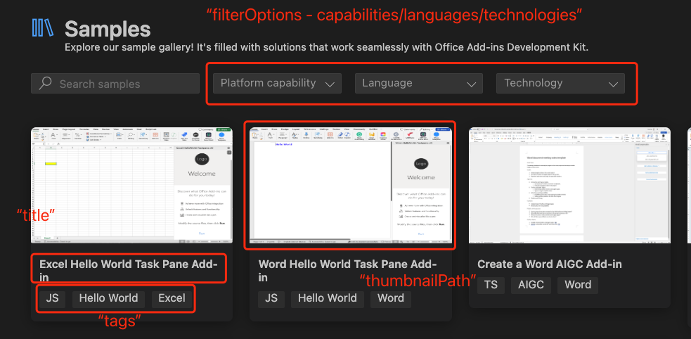

# How to add samples to the sample gallery of the Office Add-ins Development Kit

The sample gallery provides samples from this repo in the [Office Add-ins Development Kit](https://marketplace.visualstudio.com/items?itemName=msoffice.microsoft-office-add-in-debugger).

## Branch

For new samples, use `dev` as the target branch for pull requests. The `dev` branch will be merged into `main` after testing.

`main` branch is the release branch. All content from the `main` branch appears in the [Office Add-ins Development Kit](https://marketplace.visualstudio.com/items?itemName=msoffice.microsoft-office-add-in-debugger)'s sample gallery.

## Testing

1. Uninstall the installed Office Add-ins Development Kit 
2. Download the [test package extension](./assets/dev-kit-test-package.vsix) and install it manually in VSCode.
3. Set the environment variable `OTK_SAMPLE_CONFIG_BRANCH` to `dev` or other branch with a valid [sample-config.json](./.config/sample-config.json) of this repo on your development machine. Setting this variable will force sample gallery to use the config in the dedicated branch instead of `main`.
4. Open Dev Kit. Select `View Samples` to view sample gallery and do testing. 

## Check in the new sample into the sample gallery

1. Add the new sample project folder under the **Samples** directory.
    1. Be sure the sample project folder contains a `.vscode` folder with a `launch.json` file that has at least one launch config in it. This ensures that the user can press `F5` to launch, which is a key experience of the development kit. When the user presses `F5` to open the sample project, the first profile in `.vscode/launch.json` will be executed to launch the sample. Node and webpack is also required if you want support starting a local dev host and attaching the debugger.
        * Refer to [this sample](./Samples/excel-get-started-with-dev-kit/) as an example.
    2. Make sure the new sample runs correctly and has been tested on the supported platforms.
    3. Add the **README.md** and **RUN_WITH_EXTENSION.md** files. Use the **README_TEMPLATE.md** under the root directory as a starting point.
2. Add a new config to the [config file](./.config/sample-config.json) with following format.
    * Make sure **id** has an identical value with the folder name you just created.

## JSON config of sample gallery

### Configure the sample for the developer kit

The developer kit's sample gallery uses the [samples-config.json](./.config/sample-config.json) file from this repo's `main` branch. It uses the sample configuration ID to find the files. It also downloads a .zip file of the sample project from this repo, and unzips that file in the designated path.

### JSON properties

* `filterOptions`: Defines the options of the filter bar at the top of the sample gallery
    * `capabilities`: platforms that samples in this sample gallery support, it's supposed to be a subset of the host apps of Office like ["Word", "Excel", "PowerPoint", "Outlook"]
    * `language`: the programming language of samples
    * `technologies`: technologies used in samples like "SSO", "Graph", "Azure"
* `samples`: this property should be a list of sample configs in sample gallery.
    * `id`: the configuration id and the folder name under Samples folder
    * `onboardDate`: when this sample onboard sample gallery
    * `title`: title of the sample add-in, will show in the sample card of sample gallery
    * `description`: a description of the sample id, will used for sample matching when users search samples in sample gallery
    * `types`: the platform type this sample supports, should be a subset of `capabilities` of `filterOptions`
    * `tags`: tags of this sample, will show in the sample card of the sample gallery below title. You can set the tags referring the values in filterOptions
    * `thumbnailPath`: the image (.png/.img) that shows in the sample card. Use relative path to the sample folder
    * `suggested`: if this sample is suggested, default value is `false`. if set `true`, the suggested samples will be presented like showcases at the top of sample gallery above all other samples.

