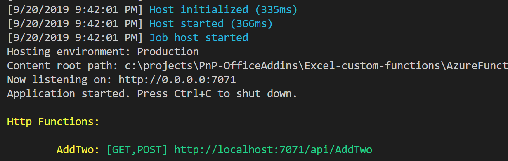
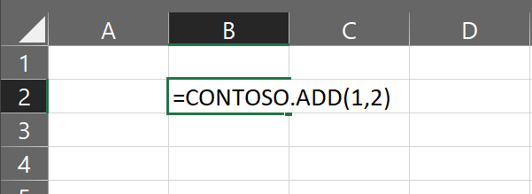
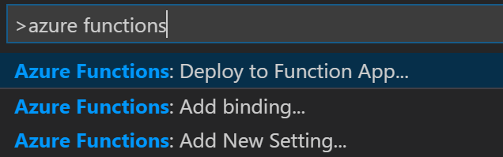
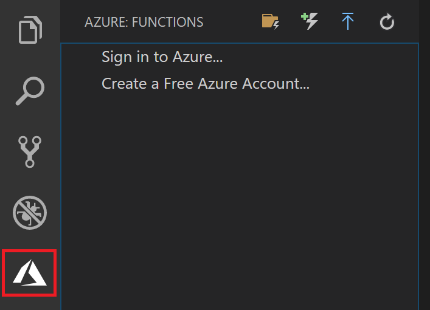

# Integrate an Azure function with your custom function

You can expand the capabilities of Excel custom functions by integration with Azure functions. An Azure function allows you to move your code to the cloud so it is not visible from the browser, and you can choose additional languages to run in besides JavaScript. Also an Azure function can integrate with other Azure services such as message queues and storage. And you can share the function with other clients.

This sample shows how to move the code from the `Add` custom function into an Azure function.

## Applies to

-  Excel, PowerPoint, Word on Windows, Mac, and in a browser.

## Prerequisites

To set up your development environment:

1. Install [Visual Studio Code](https://code.visualstudio.com) on one of the supported platforms.
2. Install version 2.x of the [Azure Functions Core Tools](https://docs.microsoft.com/azure/azure-functions/functions-run-local#v2). Note: The sample does not use extension bundles so you will install the .NET Core 2.x SDK in a later step.
3. Install the [C# extension](https://marketplace.visualstudio.com/items?itemName=ms-vscode.csharp). You can also search for the C# extension in the VS Code Extensions view (Ctrl + Shift + X) and typing 'C# for Visual Studio Code'. Note: You will be notified to install the .NET Core 3.0 SDK, but this is not needed for this sample.
4. Install the [Azure Functions extension](https://docs.microsoft.com/azure/azure-functions/functions-create-first-function-vs-code#install-the-azure-functions-extension). You can also search for the Azure Functions extension in the VS Code Extensions view (Ctrl + Shift + X) and typing 'Azure Functions'.
5. Download and install [.NET Core 2.2](https://dotnet.microsoft.com/download/dotnet-core) which is the required version for Azure functions to build projects correctly.

You will also need the following:

- An [Azure subscription](https://docs.microsoft.com/en-us/azure/guides/developer/azure-developer-guide#understanding-accounts-subscriptions-and-billing). You can create a [free account](https://azure.microsoft.com/free) before you begin.
- An Office 365 account. You can join the [Office 365 Developer Program](https://aka.ms/devprogramsignup) that includes a free 1 year subscription to Office 365.

## Solution

Solution | Author(s)
---------|----------
Azure function integration | David Chesnut (**Microsoft**)

## Version history

Version  | Date | Comments
---------| -----| --------
1.0  | October 2, 2019 | Initial release

## Disclaimer

**THIS CODE IS PROVIDED *AS IS* WITHOUT WARRANTY OF ANY KIND, EITHER EXPRESS OR IMPLIED, INCLUDING ANY IMPLIED WARRANTIES OF FITNESS FOR A PARTICULAR PURPOSE, MERCHANTABILITY, OR NON-INFRINGEMENT.**

----------
## Try out the Azure function from localhost

This sample moves the `Add` custom function to an Azure function named `AddTwo()`. The Azure function adds the two numbers and returns the result. The next steps will run the sample. If you want to know how it works, jump down to the explanation section.

### Build and run the Azure function

1. Clone or download this repository to a local project folder.
2. Start Visual Studio Code and open the **AzureFunction/AzureFunctionProject** folder in the project.
3. Open the **.vscode/tasks.json** file and locate the entry for "type": "func".
4. Modify the `"command": "host start"` entry so that it reads as follows.
    ```json
    "command": "host start --cors https://localhost:3000",
    ```
    This will modify the tasks so that when you run the project it opens port 3000 for CORS. This allows the Office Add-in to call the function in later steps since it will run on port 3000.
5. From the **Debug** menu, choose **Start Debugging** (F5). The Azure function project will compile and start running.
    >Note: You may see an alert to allow func access through the firewall.
    After running you should see output similar to the following image. It will list the URL you can use to call the Azure function.
    
6. You can test that the Azure function is working by calling it from a browser. Open a browser window and enter the following URL to add two numbers.
`http://localhost:7071/api/AddTwo?first=1&second=2`. You should see the result `{ "answer": 3}` returned to the browser.

### Build and run the custom function

1. Start another instance of Visual Studio Code and open the **AzureFunction/CustomFunctionProject** folder in the project.
2. Run the following commands in the **AzureFunction/CustomFunctionProject** folder using a Visual Studio terminal (CTRL + SHIFT + `) or the command line.
    ```command&nbsp;line
    # this will download the node modules needed to run this add-in
    $ npm install
    
    # this will build the add-in 
    $ npm run build
    ```
3. If you want to run the custom function add-in in Excel on Windows, use the following command to automatically start Excel and sideload the custom function add-in.
    ```command&nbsp;line
    $ npm run start
    ```
    
    -- or --
    
    If you want to run the custom function add-in in Excel on the web, use the following command to start the web server. Then you can sideload the add-in to Excel on the web using the guidance at https://docs.microsoft.com/office/dev/add-ins/testing/sideload-office-add-ins-for-testing
    ```command&nbsp;line
    $ npm run start:web
    ```
3. In Excel with the add-in loaded, try out the custom function by entering `=CONTOSO.ADD(1,2)` into a cell. The cell should call the custom function, which then calls the Azure function, and returns the result of 3.
    

## Deploy to an Azure function app

You can also deploy and run the Azure function from your own Azure account.

1. Start Visual Studio Code and open the **AzureFunction/AzureFunctionProject** folder in the project.
2. In Visual Studio Code, press F1 to open the command palette. In the command palette, search for and select **Azure Functions: Deploy to function app....** and then choose your subscription.
    
    >Note: If you are not signed-in, you are prompted to **Sign in to Azure**. You can also **Create a free Azure account**. After successful sign in from the browser, go back to Visual Studio Code.
4. Choose **+ Create New Function App in Azure**.
5. Type a globally unique name that identifies your function app and press Enter. Valid characters for a function app name are `a-z`, `0-9`, and `-`.
6. Choose the location where you want the function app to deploy.
    
    When you press Enter, the following Azure resources are created in your subscription:
    
    - Resource group: Contains all of the created Azure resources. The name is based on your function app name.
    - Storage account: A standard Storage account is created with a unique name that is based on your function app name.
    - Hosting plan: A consumption plan is created in the West US region to host your serverless function app.
    - **Function app**: Your project is deployed to and runs in this new function app.
    
    A notification is displayed after your function app is created and the deployment package is applied. Select **View Output** in this notification to view the creation and deployment results, including the Azure resources that you created.
7. Select the Azure icon on the Activity bar. You should see an Azure Functions area in the Side Bar.
    
8. In the **Azure: Functions** area, expand the new function app under your subscription. Expand **Functions**, right-click **AddTwo**, and then choose **Copy function URL**.
9. You can test that the Azure function is working by calling it from a browser. Open a browser window and enter the URL you just copied. If you want to add numbers, append the following query string to the URL `?first=1&second=2`. You should see the result `{ "answer": 3}` returned to the browser.

### Add CORS support for the custom function 

You'll need to enable CORS support for the Office Add-in before it can call the Azure function online.

1. Open the Azure portal and sign in. You can do this by selecting the Azure icon on the Activity bar in Visual Studio Code. Then right-click your Azure subscription for the Azure function and choose **Open in Portal**.
2. In the Azure portal, select the function app.
3. Choose **Platform features**.
4. Choose **CORS** in the **API** section.
5. Add a new entry in the **Allowed Origins** list for `https://localhost:3000`. This will enable the custom function to call into the Azure function app. 
6. Choose **Save**.

>**Note:** If you deploy the Excel custom function add-in, be sure to update the Allowed Origins list to support the new domain location.

## Update the Excel custom function to call into the Azure function app

Once the Azure function is deployed you can update the custom function to call the cloud version of the Azure function instead of the localhost version.

1. Start Visual Studio Code and open the **AzureFunction/CustomFunctionProject/src/functions/functions.js** file in the project.
2. Go to the add function which sets the url string. The code appears as the following:
    ```js
    function add(first, second) {
      //If you publish the Azure function online, update the following URL to use the correct URL location.
      let url = "http://localhost:7071/api/AddTwo";
      ...
    ```
3. In the `let url` assignment replace the localhost URL with the Azure function URL you copied from the previous exercise.
4. Run the following commands to build and start the custom function add-in on Excel on Windows. If the project was still running from a previous step, stop it and close Excel before restarting it.
    ```command&nbsp;line
    $ npm run build
    $ npm run start
    ```
    
    -- or --
    
    If you want to run the custom function add-in in Excel on the web, use the following command to start the web server. Then you can sideload the add-in to Excel on the web using the guidance at https://docs.microsoft.com/office/dev/add-ins/testing/sideload-office-add-ins-for-testing
    ```command&nbsp;line
    $ npm run build
    $ npm run start:web
    ```
2. Try out the custom function by entering `=CONTOSO.ADD(1,2)` into a cell. The cell should call the custom function, which then calls the Azure function, and returns the result of 3.

## Key parts of this sample

### The Azure function

The Azure function is named `AddTwo()` and is in the **AzureFunctionProject/AddTow.cs** file. First the function needs to get the two parameters `first` and `second`. They might be passed as URL query parameters, or in a JSON body. So the code handles both scenarios. Notice the use of `??` and `?.` operators when retrieving values from the JSON body. It's possible a parameter was not passed and we don't want the code to fail because of a null. So these operators help work around any null parameters. For more information see [?? operator (C# reference)](https://docs.microsoft.com/dotnet/csharp/language-reference/operators/null-coalescing-operator) and [Null-conditional operators ?. and ?[]](https://docs.microsoft.com/dotnet/csharp/language-reference/operators/member-access-operators#null-conditional-operators--and-)

```csharp
//retrieve parameters if passed on URL. They are passed in string format (convert them later)
string first = req.Query["first"];
string second = req.Query["second"];

//Check if parameters were passed in body JSON.
string requestBody = await new StreamReader(req.Body).ReadToEndAsync();
dynamic data = JsonConvert.DeserializeObject(requestBody);
first = first ?? data?.first;
second = second ?? data?.second;
```

Now that the parameters are retrieved, they need to be converted from strings to numbers. The `TryParse` method will do this, and if they cannot be parsed, the function returns an error.

```csharp
int n1,n2;
if (!int.TryParse(first,out n1)||!int.TryParse(second,out n2))
{
  return new BadRequestObjectResult("Please pass two number parameters in the query string or in the request body");
}
```

Finally the function returns the sum of the two numbers in an `OkObjectResult`.

```csharp
//add and return the result as a string
return new OkObjectResult((n1+n2).ToString());
```

### The custom function

The Excel custom function is named `Add` and is in the **CustomFunctionProject/src/functions/functions.js** file. The `Add` function calls the `AddTwo` Azure function and just passes along the `first` and `second` parameters. The fetch function is used to call the Azure function, and the returned answer string is returned to Excel.

```js
function add(first, second) {
  //If you publish the Azure function online, update the following URL to use the correct URL location.
  let url = "http://localhost:7071/api/AddTwo";
 
  return new Promise(function(resolve,reject){
  
    //Note that POST uses text/plain because custom functions runtime does not support full CORS
    fetch(url, {
      method: 'POST',
      headers:{
        'Content-Type': 'text/plain'
      },
      body: JSON.stringify({"first": first ,"second": second})
    })
      .then(function (response){
        return response.text();
        }
      )
      .then(function (textanswer) {
       resolve(textanswer);
      })
      .catch(function (error) {
        console.log('error', error.message);
      });
    });  
}
```

## Security notes

### AzureFunctionProject notes

The Azure function is configured to allow anonymous access which means anyone can call the function if they have the URL. This is only for development purposes. In production code, you should configure [authentication and authorization in Azure App Service](https://docs.microsoft.com/azure/app-service/overview-authentication-authorization), to ensure only authorized users and code can call your Azure functions.

### CustomFunctionProject notes

In the webpack.config.js file, a header is set to  `"Access-Control-Allow-Origin": "*"`. This is only for development purposes. In production code, you should list the allowed domains and not leave this header open to all domains.

You'll be prompted to install certificates for trusted access to https://localhost. The certificates are intended only for running and studying this code sample. Do not reuse them in your own code solutions or in production environments.

You can install or uninstall the certificates by running the following commands in the project folder.

```command&nbsp;line
npx office-addin-dev-certs install
npx office-addin-dev-certs uninstall
```

## Questions and comments
We'd love to get your feedback about this sample. You can send your feedback to us in the Issues section of this repository. Questions about developing Office Add-ins should be posted to Stack Overflow. Ensure your questions are tagged with [office-js].

## Additional resources
* [Office Add-ins documentation](https://docs.microsoft.com/office/dev/add-ins/overview/office-add-ins)
* [Create your first function using Visual Studio Code](https://docs.microsoft.com/azure/azure-functions/functions-create-first-function-vs-code)


## Copyright
Copyright (c) 2019 Microsoft Corporation. All rights reserved.

This project has adopted the [Microsoft Open Source Code of Conduct](https://opensource.microsoft.com/codeofconduct/). For more information, see the [Code of Conduct FAQ](https://opensource.microsoft.com/codeofconduct/faq/) or contact [opencode@microsoft.com](mailto:opencode@microsoft.com) with any additional questions or comments.


