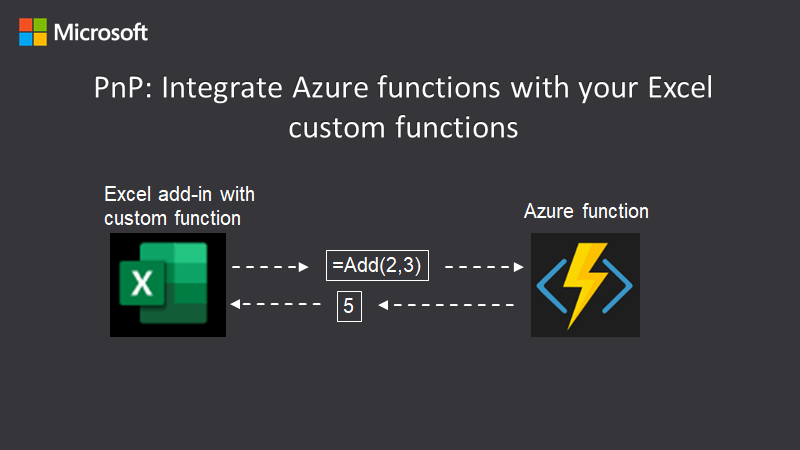

# Integrate an Azure Function with your Excel custom function

You can expand the capabilities of Excel custom functions by integrating with Azure Functions. An Azure Function allows you to move your code to the cloud so it is not visible from the browser, and you can choose additional languages to run in besides JavaScript. Also an Azure Function can integrate with other Azure services such as message queues and storage. And you can share the function with other clients.

This sample shows how to move the code from the `Add` custom function into an Azure Function.



## Applies to

- Excel on Windows, Mac, and in a browser.

## Prerequisites

To set up your development environment:

1. Install [Visual Studio Code](https://code.visualstudio.com) on one of the supported platforms.
2. Install the [Azure Functions extension](https://marketplace.visualstudio.com/items?itemName=ms-azuretools.vscode-azurefunctions). You can also search for the Azure Functions extension in the VS Code Extensions view (<kbd>Ctrl</kbd>+<kbd>Shift</kbd>+<kbd>X</kbd>) and typing 'Azure Functions'.

You will also need the following:

- An Azure subscription. You can create a [free account](https://azure.microsoft.com/free) before you begin.
- Microsoft 365 - Get a [free developer sandbox](https://developer.microsoft.com/microsoft-365/dev-program#Subscription) that provides a renewable 90-day Microsoft 365 E5 developer subscription.

## Solution

Solution | Author(s)
---------|----------
Azure Function integration | David Chesnut (**Microsoft**)

## Version history

Version  | Date | Comments
---------| -----| --------
1.0  | October 2, 2019 | Initial release.
1.1  | March 17, 2022 | Update to use JavaScript Azure Function, and GitHub hosting for add-in project.

## Try out the Azure Function from localhost

This sample contains an `Add` custom function that calls an Azure Function named `AddTwo()` to perform the calculation. The Azure Function adds the two numbers and returns the result. The next steps will run the sample. If you want to know how it works, jump down to the explanation section.

### Build and run the Azure Function

1. Clone or download this repository to a local project folder.
1. Start Visual Studio Code and open the **AzureFunction/AzureFunctionProject** folder in the project.
1. Choose **Run** > **Start Debugging** (F5). If you are prompted to install the **Azure Functions Core Tools**, choose **Install**. The Azure Function project will compile and start running.

    >Note: You may see an alert to allow func access through the firewall.

    >Note: If your default terminal in VS Code is set to PowerShell, you may see an error that "func.ps1 cannot be loaded." To work around this error, open a command prompt or bash terminal and enter the command "func host start".

    After running you should see output similar to the following image. It will list the URL you can use to call the Azure Function.

    

1. You can test that the Azure Function is working by calling it from a browser. Open a browser window and enter the following URL to add two numbers.
`http://localhost:7071/api/AddTwo?first=1&second=2`. You should see the result `{ "answer": 3}` returned to the browser.

### Run the custom function add-in

Run the **CustomFunctionProject** in Excel on the web. The add-in web files are served from this repo on GitHub.

1. Locate the **manifest.xml** file in the **AzureFunction/CustomFunctionProject** folder.
1. Sideload the **manifest.xml** file in Excel on the web by following the manual instructions in the article [Sideload Office Add-ins in Office on the web for testing](https://learn.microsoft.com/office/dev/add-ins/testing/sideload-office-add-ins-for-testing).

### Try it out

In Excel with the add-in loaded, try out the custom function by entering `=CONTOSO.ADD(1,2)` into a cell. The cell should call the custom function, which then calls the Azure Function, and returns the result of 3.
    

### Optional: Run the custom function from localhost

If you prefer to host the web server for the custom function on your computer, follow these steps.

1. Install a recent version of [npm](https://www.npmjs.com/get-npm) and [Node.js](https://nodejs.org/) on your computer. To verify if you've already installed these tools, run the commands `node -v` and `npm -v` in your terminal.
1. You need http-server to run the local web server. If you haven't installed this yet, run the following command.

    ```console
    npm install --global http-server
    ```

1. Run the following command to install dev certificates for the add-in.

    ```console
    npx office-addin-dev-certs install
    ```

1. The `office-addin-dev-certs` command will list the location of two files: localhost.crt, and localhost.key. Copy these files to the **AzureFunction/CustomFunctionProject** folder.
1. Rename the certificate files as follows:

    - **localhost.crt** > **cert.pem**
    - **localhost.key** > **key.pem**

    > Note: you can also use a tool such as openssl to generate a self-signed certificate if you prefer.

1. From a command prompt, go to the **AzureFunction/CustomFunctionProject** folder and run the following command.

    ```console
    http-server -S --cors . -p 3000
    ```

1. Sideload `manifest-local.xml` in Excel on the web by following the manual instructions in the article [Sideload Office Add-ins in Office on the web for testing](https://learn.microsoft.com/office/dev/add-ins/testing/sideload-office-add-ins-for-testing).
1. [Try out the custom function!](#try-it-out)

## Try out the Azure Function deployed to an Azure Function App

You can also deploy and run the Azure Function from your own Azure account.

1. Start Visual Studio Code and open the **AzureFunction/AzureFunctionProject** folder in the project.
1. In Visual Studio Code, press <kbd>F1</kbd> to open the command palette. In the command palette, search for and select **Azure Functions: Deploy to function app....** and then choose your subscription.
    
    >Note: If you are not signed-in, you are prompted to **Sign in to Azure**. You can also **Create a free Azure account**. After successful sign in from the browser, go back to Visual Studio Code.
1. Choose **+ Create New Function App in Azure**.
1. Type a globally unique name that identifies your function app and press <kbd>Enter</kbd>. Valid characters for a function app name are `a-z`, `0-9`, and `-`.
1. Select the most recent Node.js LTS version for the runtime stack.
1. Select a geographical location near you for the location for new resources.

    When you press <kbd>Enter</kbd>, the following Azure resources are created in your subscription:
  
    - Resource group: Contains all of the created Azure resources. The name is based on your function app name.
    - Storage account: A standard Storage account is created with a unique name that is based on your function app name.
    - Hosting plan: A consumption plan is created in the geographical region you selected to host your serverless function app.
    - **Function app**: Your project is deployed to and runs in this new function app.

    A notification is displayed after your function app is created and the deployment package is applied. Go to the **Output** window to view the creation and deployment results, including the Azure resources that you created.

1. Select the Azure icon on the Activity bar. You should see an Azure Functions area in the Side Bar.
    
1. In the **Azure: Functions** area, expand the new function app under your subscription. Expand **Functions**, right-click (or select and hold) **AddTwo**, and then choose **Copy function URL**.
1. You can test that the Azure Function is working by calling it from a browser. Open a browser window and enter the URL you just copied. If you want to add numbers, append the following query string to the URL `?first=1&second=2`. You should see the result `{ "answer": 3}` returned to the browser.

### Add CORS support for the custom function

You'll need to enable CORS support for the Office Add-in before it can call the Azure Function online.

1. Open the Azure portal and sign in. You can do this by selecting the Azure icon on the Activity bar in Visual Studio Code. Then, right-click (or select and hold) your Azure subscription for the Azure Function and choose **Open in Portal**.
1. In the Azure portal, select the function app.
1. Choose **CORS** in the **API** section.
1. Add a new entry in the **Allowed Origins** list for `https://localhost:3000`. This will enable the custom function to call into the Azure Function app.
1. Choose **Save**.

>**Note:** If you deploy the Excel custom function add-in, be sure to update the Allowed Origins list to support the new domain location.

### Update the Excel custom function to call into the Azure Function app

Once the Azure Function is deployed you can update the custom function to call the cloud version of the Azure Function instead of the localhost version.

1. Start Visual Studio Code and open the **AzureFunction/CustomFunctionProject/functions.js** file in the project.
1. Go to the add function which sets the url string. The code appears as the following:

    ```js
    function add(first, second) {
      //If you publish the Azure Function online, update the following URL to use the correct URL location.
      const url = "http://localhost:7071/api/AddTwo";
      ...
    ```

1. In the `const url` assignment replace the localhost URL with the Azure Function URL you copied from the previous exercise. Save the file.
1. Follow the steps in [Run the custom function from localhost](run-the-custom-function-from-localhost) to start the add-in and sideload it to Excel.
1. Try out the custom function by entering `=CONTOSO.ADD(1,2)` into a cell. The cell should call the custom function, which then calls the Azure Function, and returns the result of 3.

## Key parts of this sample

### The Azure Function

The Azure Function is named `AddTwo()` and is in the **AzureFunctionProject/AddTwo/index.js** file. First the function needs to get the two parameters `first` and `second`. They might be passed as URL query parameters, or in a JSON body. So the code handles both scenarios.

```javascript
module.exports = async function (context, req) {
  context.log("JavaScript HTTP trigger function processed a request.");

  //retrieve parameters if passed on URL.
  let first = req.query.first;
  let second = req.query.second;

  //Check if parameters were passed in body text.
  if (req.body !== undefined) {
    if (req.body.first !== undefined) {
      first = req.body.first;
    }
    if (req.body.second !== undefined) {
      second = req.body.second;
    }
  }
```

Now that the parameters are retrieved, they need to be checked to ensure they are numbers and not strings. If they are not numbers, the function returns an error. Also the `Number` function is used to ensure the numbers are added and not concatenated.

The `context.res` object is used to return the result (either an error, or the JSON answer).

```javascript
 if (isNaN(first) || isNaN(second)) {
    context.res = {
      status: 400, //bad request
      body: "Please pass (first,second) number parameters in the query string or in the request body",
    };
  } else {
    context.res = {
      // status: 200, /* Defaults to 200 */
      body: {
        answer: Number(first) + Number(second),
      },
    };
  }
};
```

### The custom function

The Excel custom function is named `Add` and is in the **CustomFunctionProject/functions.js** file. The `Add` function calls the `AddTwo` Azure Function and just passes along the `first` and `second` parameters. The fetch function is used to call the Azure Function, and the returned answer string is returned to Excel.

```javascript
function add(first, second) {
  //If you publish the Azure Function online, update the following URL to use the correct URL location.
  const url = "https://excel-custom-functions.azurewebsites.net/api/addtwo";

  return new Promise(async function (resolve, reject) {
    try {
      //Note that POST uses text/plain because custom functions runtime does not support full CORS
      const response = await fetch(url, {
        method: "POST",
        headers: {
          "Content-Type": "text/plain",
        },
        body: JSON.stringify({ first: first, second: second }),
      });
      const jsonAnswer = await response.json();
      resolve(jsonAnswer.answer);
    } catch (error) {
      console.log("error", error.message);
    }
  });
}
```

## Security notes

### AzureFunctionProject notes

The Azure Function is configured to allow anonymous access which means anyone can call the function if they have the URL. This is only for development purposes. In production code, you should configure [authentication and authorization in Azure App Service](https://learn.microsoft.com/azure/app-service/overview-authentication-authorization), to ensure only authorized users and code can call your Azure Functions.

### CustomFunctionProject notes

If you installed dev certificates using 1office-addin-dev-certs`, the certificates are intended only for running and studying this code sample. Do not reuse them in your own code solutions or in production environments.

You can install or uninstall the certificates by running the following commands in the project folder.

```command&nbsp;line
npx office-addin-dev-certs install
npx office-addin-dev-certs uninstall
```

## Questions and comments

We'd love to get your feedback about this sample. You can send your feedback to us in the Issues section of this repository. Questions about developing Office Add-ins should be posted to Stack Overflow. Ensure your questions are tagged with [office-js].

## Additional resources

- [Office Add-ins documentation](https://learn.microsoft.com/office/dev/add-ins/overview/office-add-ins)
- [Quickstart: Create a JavaScript function in Azure using Visual Studio Code](https://learn.microsoft.com/azure/azure-functions/create-first-function-vs-code-node)

## Copyright

Copyright (c) 2019 Microsoft Corporation. All rights reserved.

This project has adopted the [Microsoft Open Source Code of Conduct](https://opensource.microsoft.com/codeofconduct/). For more information, see the [Code of Conduct FAQ](https://opensource.microsoft.com/codeofconduct/faq/) or contact [opencode@microsoft.com](mailto:opencode@microsoft.com) with any additional questions or comments.


