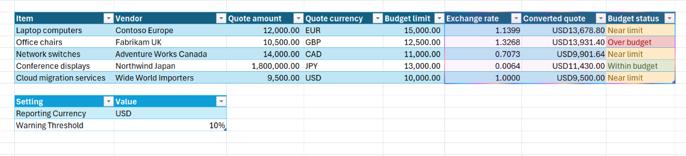
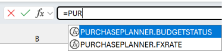
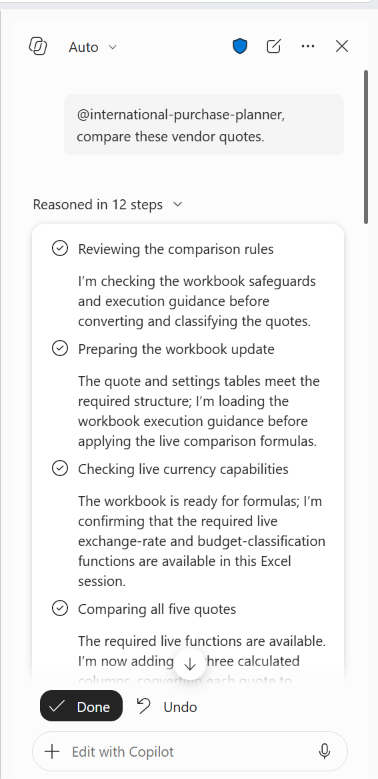
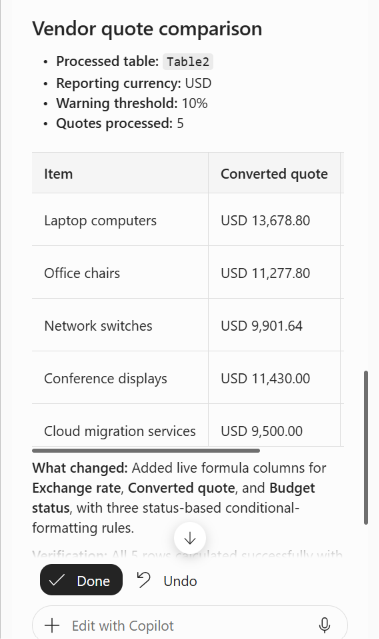

# International Purchase Planner for Excel (preview)

This educational sample combines a custom skill for Copilot in Excel with custom functions hosted in a JavaScript-only runtime. The skill finds a qualifying vendor quote table, converts every quote to the workbook's reporting currency, and classifies each quote against its budget.

The skill adds or updates three calculated columns:

- **Exchange rate**
- **Converted quote**
- **Budget status**



The sample runs from `https://localhost:3000`. The skill files are included in the app package, but the custom function JavaScript and metadata are served from localhost while the sample is running.

> **Important**:
> The custom skill runs only in Copilot in Excel. It does not run in standalone Copilot, or Copilot in any other application.

## Applies to

- Excel on Windows and Mac
- Copilot in Excel
- Custom functions in Excel

## Prerequisites

- [Node.js](https://nodejs.org/)
- [Microsoft 365 Agents Toolkit CLI](https://learn.microsoft.com/microsoftteams/platform/toolkit/microsoft-365-agents-toolkit-cli)
- A Microsoft 365 work or developer account with access to Copilot in Excel
- Microsoft 365 on Windows Version 2608 (Build 20305.20002) or later, or Microsoft 365 on Mac Version 16.112.26070718 or later.
- A Microsoft 365 subscription in the **Beta** or **Current Channel (Preview)** update channel

   > **Note:** If you don't already have an Microsoft 365 subscription, you might qualify for a Microsoft 365 E5 developer subscription through the [Microsoft 365 Developer Program](https://aka.ms/m365devprogram); for details, see the [FAQ](https://learn.microsoft.com/office/developer-program/microsoft-365-developer-program-faq#who-qualifies-for-a-microsoft-365-e5-developer-subscription-). Alternatively, you can [sign up for a 1-month free trial](https://www.microsoft.com/microsoft-365/try) or [purchase a Microsoft 365 plan](https://www.microsoft.com/microsoft-365/business/compare-all-microsoft-365-business-products-g).

## How the sample works

The sample has two cooperating parts:

1. The packaged **international-purchase-planner** skill validates workbook data and runs an Office.js script that adds formulas, formatting, and conditional formatting.
1. The localhost **PURCHASEPLANNER** custom functions provide the latest exchange rate and budget classification used by those formulas.

A minimal task pane runtime provides the activation surface that Excel currently needs to register custom functions from this unified manifest. The pane does not implement purchase-planning features or add a ribbon button.

The custom functions are:

```excel
=PURCHASEPLANNER.FXRATE(sourceCurrency, reportingCurrency)
=PURCHASEPLANNER.BUDGETSTATUS(convertedQuote, budgetLimit, warningThreshold)
```

The skill inserts formulas equivalent to:

```excel
=PURCHASEPLANNER.FXRATE([@[Quote currency]],"USD")
=[@[Quote amount]]*[@[Exchange rate]]
=PURCHASEPLANNER.BUDGETSTATUS([@[Converted quote]],[@[Budget limit]],10%)
```

The reporting currency and warning threshold come from the workbook's `Settings` table.

## Key project files

Only the most important files and folders are shown here.

```text
custom-functions-skill/
|-- README.md
|-- Test.xlsx
|-- international-purchase-planner.zip
|-- appPackage/
|   |-- assets/
|   |-- manifest.json
|   |-- skills/
|       |-- international-purchase-planner/
|           |-- SKILL.md
|           |-- resources/
|           |   |-- excel-vs-agent-execution.md
|           |   |-- workbook-data-guardrails.md
|           |-- scripts/
|               |-- prepare-purchase-comparison.js
|-- assets/
|-- env/
|-- images/
|-- infra/
|-- src/
|   |-- functions/
|   |   |-- functions.html
|   |   |-- functions.ts
|   |-- taskpane/
|-- package.json
```

- `SKILL.md` tells Copilot when to use the skill and defines its workflow and response.
- The resource files define workbook validation and execution boundaries.
- `prepare-purchase-comparison.js` validates the workbook and inserts formulas and formatting with Office.js.
- `functions.ts` implements `FXRATE` and `BUDGETSTATUS`.
- `manifest.json` registers the skill, custom-functions runtime, metadata URL, and minimal activation surface.

> **Note**:
> There is a task pane runtime configured in the manifest, and task pane files in **/src/taskpane**. These are required because custom functions in a JavaScript-only runtime aren't registered if there isn't also a browser-based runtime in the add-in. There is no ribbon button for the task pane. 

For more information, see:

- [Create custom functions in Excel](https://learn.microsoft.com/office/dev/add-ins/excel/custom-functions-overview)
- [Create a Copilot skill for Excel](https://learn.microsoft.com/office/dev/add-ins/excel/excel-skills)
- [Create a Copilot skill for Excel that uses Office.js](https://learn.microsoft.com/office/dev/add-ins/excel/excel-copilot-skill)

## Workbook requirements

> **Note**:
> The sample includes `Test.xlsx` in the sample root **custom-functions-skill**. You can use it for testing or prepare another workbook that follows the same contract.

### Settings table

The workbook must contain an Excel table named `Settings` with columns named `Setting` and `Value`. The values shown below are in `Test.xlsx`, but you can change them.

| Setting | Example value | Requirement |
| --- | --- | --- |
| Reporting currency | `USD` | Three-letter currency code |
| Warning threshold | `10%` | Numeric value from 0 through 1 |

Enter the warning threshold as a number or Excel percentage. Text such as `"10%"` does not qualify.

### Quote table

The workbook must contain at least one Excel table (with any name) with these columns:

| Column | Requirement |
| --- | --- |
| Item | Nonblank text |
| Vendor | Nonblank text |
| Quote amount | Nonnegative number |
| Quote currency | Three-letter currency code |
| Budget limit | Positive number in the reporting currency |

Every required source cell must contain a value of the appropriate type. The skill processes the first qualifying table in workbook order. It does not repair incomplete data or prompt for missing settings.

When invoked, the skill adds missing output columns or updates existing columns named `Exchange rate`, `Converted quote`, and `Budget status`.

## Run the sample

1. Install @microsoft/m365agentstoolkit-cli in a Windows command prompt, Mac system prompt, or bash shell with the following command.

   ```bash
   npm install -g @microsoft/m365agentstoolkit-cli
   ```

   If you're prompted to sign in, use your Microsoft 365 developer account credentials. 

1. In the same window, navigate to the **custom-functions-skill** sample root, and run the following command.

   ```bash
   npm install
   ```

1. Start the server with the following command.

   ```bash
   npm run dev-server
   ```

   If this is the first time you've run a development add-in on your computer, or the first time in a month, you may be prompted to delete expired certificates and install new ones. Respond **Yes** to both prompts.

1. Sign in to Microsoft 365 with the following command.

   ```bash
   atk auth login m365
   ```

1. Install the package with the following command.

   ```bash
   atk install --file-path ./international-purchase-planner.zip --scope Personal
   ```

   A successful installation returns output that includes a TitleId and AppId for your account.

## Activate and test the skill

1. Open `Test.xlsx` from the **custom-functions-skill** sample root and ensure that you are signed into Excel with the same account used to install the package.
1. Verify that the custom functions are installed by entering `=PUR` in the formula bar. You should see **PURCHASEPLANNER.BUDGETSTATUS**  and **PURCHASEPLANNER.FXRATE** in the autocomplete drop down that opens.

   > **Note**
   > If the custom functions do not appear in the autocomplete list, select **Home > Add-ins** and then select **Purchase Planner** on the flyout to activate the add-in. If **Purchase Planner** doesn't appear on the **Add-ins** flyout, close and reopen Excel, then *wait two minutes* and open the flyout again.

   

1. Open Copilot in Excel.
1. In the chat box, submit a prompt that includes the full skill name with "@" appended to the start. For example:

   ```text
   @international-purchase-planner, compare these vendor quotes.
   ```

   Or:

   ```text
   @international-purchase-planner, show me which quotes are near or over budget.
   ```

   

1. Approve the request to run the workbook script if Excel asks for confirmation.
1. Verify that the skill:

   - processes the first qualifying quote table in workbook order
   - adds or updates the three output columns
   - fills every quote row with formulas rather than static values
   - autofits each output column after the formulas finish calculating
   - applies green, yellow, and red conditional formatting to budget statuses

1. Verify that Copilot reports:

   - the processed table name
   - the reporting currency
   - the warning threshold
   - the number of processed rows

   

### Test workbook guardrails

Use a copy of the workbook for these tests.

#### Invalid quote table

1. Remove a required value or replace a numeric source value with text.
1. Invoke the skill again.
1. Verify that the skill does not modify the invalid table. If no other table qualifies, Copilot should report that no qualifying quote table was found.

#### Invalid settings table

1. Remove one of the required settings, enter an invalid currency code, or enter the warning threshold as text.
1. Invoke the skill again.
1. Verify that the skill stops without modifying the quote table and reports the settings error.

> **Important**:
> Always uninstall the app completely when you are finished working with it. See [Uninstall the sample](#uninstall-the-sample).

## Modify the sample

Open the **custom-functions-skill** sample root in Visual Studio Code.

After changing custom-function TypeScript or JSDoc metadata, take the following steps:

1. Stop the development server.
1. Restart it with `npm run dev-server` to regenerate and serve the latest files.

After changing the manifest, skill instructions, resources, or skill script:

1. Build and validate the project.

      ```bash
   npm run build:dev
   ```

1. Validate the manifest.

   ```bash
   npm run validate
   ```

1. Recreate the ZIP package with the following command.

   ```bash
   atk package --manifest-file ./appPackage/manifest.json --output-package-file ./appPackage/build/international-purchase-planner.zip --output-folder ./appPackage/build
   ```
1. Completely uninstall the previous package. See [Uninstall the sample](#uninstall-the-sample).
1. Install the updated package with the following command.

    ```bash
   atk install --file-path ./appPackage/build/international-purchase-planner.zip --scope Personal
   ```

1. Close and reopen Excel before retesting.

> **Important**:
> Do not change the required folder structure under `appPackage\skills`. The package service and Copilot use that structure to discover the skill.

## Troubleshooting

### The skill does not appear in Copilot

- Confirm that Excel and the Agents Toolkit CLI use the same Microsoft 365 account.
- In Copilot, select **+**, select **Choose plugins and skills**, and then search for **Purchase Planner**.
- Close and reopen Excel after installation.
- Allow a few minutes for a newly installed package to become available.
- Uninstall an older copy of the package before installing a replacement. See [Uninstall the sample](#uninstall-the-sample).

### Custom functions do not appear in formula bar autocomplete drop down

- Confirm that the dev server is still running.
- Close and reopen Excel if the app was just installed.
- Open **Home > Add-ins** and select **Purchase Planner** in the flyout.

### A function returns `#NAME?`

Excel has not registered the custom-function metadata. Confirm that the add-in is installed and activated and that the server is serving `https://localhost:3000/public/functions.json`.

### A function remains at `#BUSY!`

Confirm that the server is serving `https://localhost:3000/public/functions.js`. Stop the server and restart it with `npm run dev-server` to refresh the files.

### A formula is displayed as text

Change the cell or table column number format from **Text** to **General** or **Number**, then re-enter the formula. 

## Uninstall the sample

Always uninstall the app completely when you finish testing or before installing an updated package.

1. Close Excel.
1. Open Teams and sign in with the same account used to install the package.
1. On the Teams app bar, select the **+** icon.
1. In the upper right of the **Store** page, select the gear icon.
1. Find **Purchase Planner**.
1. Expand the app entry, select the trash can icon, and confirm **Remove**.
1. Stop the localhost server with **Ctrl+C**.

   

## Solution

Solution | Author(s)
---------|----------
Create skill for Copilot in Excel that inserts custom functions | Microsoft

## Version history

Version  | Date | Comments
---------| -----| --------
1.0  | September 28th, 2026 | Initial release

