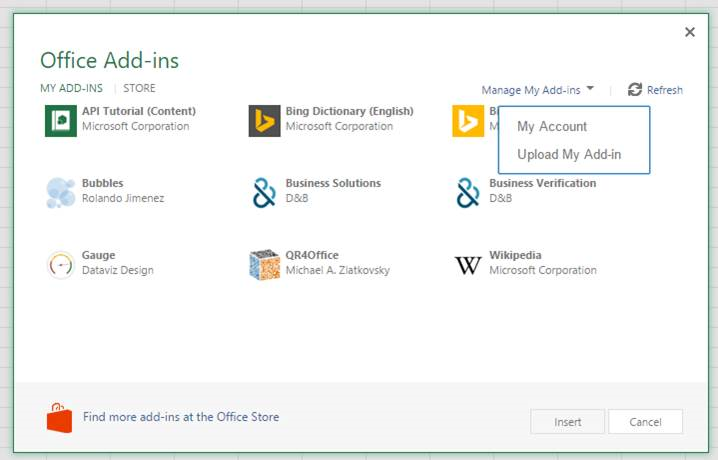

# Custom function sample using web worker

## Summary

This sample shows how to use web workers in custom functions to prevent blocking the UI of your Office Add-in.

## Features

- Custom Functions
- Web workers

## Applies to

- Excel on Windows, Mac, and in a browser.

## Solution

| Solution                                        | Author(s) |
| ----------------------------------------------- | --------- |
| Office Add-in Custom Function Using Web Workers | Microsoft |

## Version history

| Version | Date       | Comments        |
| ------- | ---------- | --------------- |
| 1.0     | 12-16-2020 | Initial release |

## Disclaimer

**THIS CODE IS PROVIDED _AS IS_ WITHOUT WARRANTY OF ANY KIND, EITHER EXPRESS OR IMPLIED, INCLUDING ANY IMPLIED WARRANTIES OF FITNESS FOR A PARTICULAR PURPOSE, MERCHANTABILITY, OR NON-INFRINGEMENT.**

---

## Scenario

When using the shared runtime, custom functions block the UI of your Office Add-in when they run. If you have long-running custom functions, this can cause poor performance in your Office Add-in UI when the spreadsheet is calculated. For example, if someone has a table with thousands of rows, each of which is calling a long-running custom function, this can lead to the UI being blocked during a recalculation.

You can unblock the UI by using web workers to do the calculations for your custom functions.

## Run the sample

You can run this sample in Excel in a browser. The add-in web files are served from this repo on GitHub.

1. Download the **manifest.xml** file from this sample to a folder on your computer.
1. Open [Office on the web](https://office.live.com/).
1. Choose **Excel**, and then open a new document.
1. Open the **Insert** tab on the ribbon and choose **Office Add-ins**.
1. On the **Office Add-ins** dialog, select the **MY ADD-INS** tab, choose **Manage My Add-ins**, and then **Upload My Add-in**.
   
1. Browse to the add-in manifest file, and then select **Upload**.
   
1. Verify that the add-in loaded successfully. You will see a **Web worker task pane** button on the **Home** tab on the ribbon.

Now you can use the following custom functions:

```
=WebWorkerSample.TEST(2)
=WebWorkerSample.TEST_PROMISE(2)
=WebWorkerSample.TEST_ERROR(2)
=WebWorkerSample.TEST_ERROR_PROMISE(2)
=WebWorkerSample.TEST_UI_THREAD(2)
```

If you open the task pane you will see an animated bouncing ball. You can see the effect of blocking the UI thread by entering `=WebWorkerSample.TEST_UI_THREAD(50000)` into a cell. The bouncing ball will stop for a few seconds while the result is calculated.

## Run the sample from Localhost

You host the web server for the sample on your computer by following these steps:

1. You need http-server to run the local web server. If you haven't installed this yet you can do this with the following command:
    
    ```console
    npm install --global http-server
    ```
    
2. Use a tool such as openssl to generate a self-signed certificate that you can use for the web server. Move the cert.pem and key.pem files to the webworker-customfunction folder for this sample.
3. From a command prompt, go to the web-worker folder and run the following command:
    
    ```console
    http-server -S --cors .
    ```
    
4. To reroute to localhost run office-addin-https-reverse-proxy. If you haven't installed this you can do this with the following command:
    
    ```console
    npm install --global office-addin-https-reverse-proxy
    ```
    
    To reroute run the following in another command prompt:
    
    ```console
    office-addin-https-reverse-proxy --url http://localhost:8080
    ```
    
5. Sideload the add-in using the the previous steps (1 - 7). Upload the `manifest-localhost.xml` file for step 6.

## Details

### Dispatch to web worker

When a custom function needs to use a web worker, we turn the calculation into a job and dispatch it to a web worker. The **dispatchCalculationJob** function takes the function name and parameters from a custom function, and creates a job object that is posted to a web worker. For more details see the **dispatchCalculationJob** function in [functions.js](functions.js).

```JavaScript
    // Post a job to the web worker to do the calculation
    function dispatchCalculationJob(functionName, parameters) {
        var jobId = g_nextJobId++;
        return new Promise(function(resolve, reject) {
            // store the promise information.
            g_jobIdToPromiseInfoMap[jobId] = {resolve: resolve, reject: reject};
            var worker = getOrCreateWebWorker(jobId);
            worker.postMessage({
                jobId: jobId,
                name: functionName,
                parameters: parameters
            });
        });
    }
```

### Web worker runs the job and returns the result

The web worker runs the job specified in the job object to do the actual calculation. The web worker code is in a separate file in [functions-worker.js](functions-worker.js).

The functions-worker.js will:

1. Receive a message containing the job to run.
2. Invoke a function to perform the calculation.
3. Call **postMessage** to post the result back to the main thread.

```JavaScript
self.addEventListener('message',
    function(event) {
        var data = event.data;
        if (typeof(data) == "string") {
            data = JSON.parse(data);
        }

        var jobId = data.jobId;
        try {
            var result = invokeFunction(data.name, data.parameters);
            // check whether the result is a promise
            if (typeof(result) == "function" || typeof(result) == "object" && typeof(result.then) == "function") {
                result.then(function(realResult) {
                    postMessage(
                        {
                            jobId: jobId,
                            result: realResult
                        }
                    );
                })
                .catch(function(ex) {
                    postMessage(
                        {
                            jobId: jobId,
                            error: true
                        }
                    )
                });
            }
            else {
                postMessage({
                    jobId: jobId,
                    result: result
                });
            }
        }
        catch(ex) {
            postMessage({
                jobId: jobId,
                error: true
            });
        }
    }
);

```

Most of the previous code handles the error case and Promise case.

### Process results from the web worker

In [functions.js](functions.js), when a new web worker is created, it is provided a callback function to process the result. The callback function parses the data to determine the outcome of the job. It resolves or rejects the promise as determined by the job result data.

```JavaScript
        // create a new web worker
        var webWorker = new Worker("functions-worker.js");
        webWorker.addEventListener('message', function(event) {
            var data = event.data;
            if (typeof(data) == "string") {
                data = JSON.parse(data);
            }

            if (typeof(data.jobId) == "number") {
                var jobId = data.jobId;
                // get the promise info associated with the job id
                var promiseInfo = g_jobIdToPromiseInfoMap[jobId];
                if (promiseInfo) {
                    if (data.error) {
                        // The web worker returned an error
                        promiseInfo.reject(new Error());
                    }
                    else {
                        // The web worker returned a result
                        promiseInfo.resolve(data.result);
                    }
                    delete g_jobIdToPromiseInfoMap[jobId];
                }
            }
        });
```

## Copyright

Copyright (c) 2020 Microsoft Corporation. All rights reserved.

This project has adopted the [Microsoft Open Source Code of Conduct](https://opensource.microsoft.com/codeofconduct/). For more information, see the [Code of Conduct FAQ](https://opensource.microsoft.com/codeofconduct/faq/) or contact [opencode@microsoft.com](mailto:opencode@microsoft.com) with any additional questions or comments.


