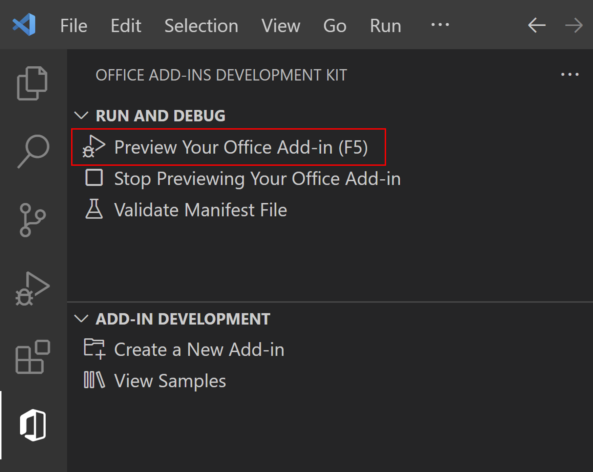

# Use the Excel Chart APIs to analyze data


This sample add-in demonstrates Excel add-in capabilities to help users using chart API to analyze data.

## Features

- Use Table and Range APIs to insert sample data.
- Use Chart APIs to help with data analysis, such as chart formatting, trend lines, and top-value calculations.

## How to run this sample

### Prerequisites

- Download and install [Visual Studio Code](https://visualstudio.microsoft.com/downloads/).
- Install the latest version of [Office Add-ins Development Kit](https://marketplace.visualstudio.com/items?itemName=msoffice.microsoft-office-add-in-debugger) into Visual Studio Code.
- Node.js (the latest LTS version). Visit the [Node.js site](https://nodejs.org/) to download and install the right version for your operating system. To verify if you've already installed these tools, run the commands `node -v` and `npm -v` in your terminal.
- Office connected to a Microsoft 365 subscription. You might qualify for a Microsoft 365 E5 developer subscription through the [Microsoft 365 Developer Program](https://developer.microsoft.com/microsoft-365/dev-program), see [FAQ](https://learn.microsoft.com/office/developer-program/microsoft-365-developer-program-faq#who-qualifies-for-a-microsoft-365-e5-developer-subscription-) for details. Alternatively, you can [sign up for a 1-month free trial](https://www.microsoft.com/microsoft-365/try?rtc=1) or [purchase a Microsoft 365 plan](https://www.microsoft.com/microsoft-365/buy/compare-all-microsoft-365-products).
  
### Run the add-in using Office Add-ins Development Kit extension

We recommend you try this sample by using the [Office Add-ins Development Kit](https://marketplace.visualstudio.com/items?itemName=msoffice.microsoft-office-add-in-debugger). The Office Add-ins Development Kit is an end-to-end developer tool for building Office add-ins. It helps create, run, and debug an Office Add-in.

1. **Download the sample code**

   To download this sample code, either:
   * Open the Office Add-ins Development Kit extension and view samples in the **Sample gallery**. Select the **Create** button in the top-right corner of the sample page.
   * [Clone](https://docs.github.com/repositories/creating-and-managing-repositories/cloning-a-repository) this repository or download this sample to a folder on your computer. Then, open the folder in Visual Studio Code.
   
1. **Open the Office Add-ins Development Kit**
    
    Select the  icon in the **Activity Bar** to open the extension.

1. **Preview Your Office Add-in (F5)**

    Select **Preview Your Office Add-in(F5)** to launch the add-in and debug the code. In the drop down menu, select the option **Desktop (Edge Chromium)**.

    

    The extension then checks that the prerequisites are met before debugging starts. Check the terminal for detailed information if there are issues with your environment. After this process, the Excel desktop application launches and opens a new workbook with the sample add-in.

1. **Stop Previewing Your Office Add-in**

    Once you are finished testing and debugging the add-in, select **Stop Previewing Your Office Add-in**. This closes the web server and removes the add-in from the registry and cache.

## Use the sample add-in

1. Select the **Add Sample data** button to import some sample data representing sales figures. This adds a new table with content into a worksheet named "Sample".
1. Select the **Sales in different locations** button. This adds a new chart that uses the sample data.
1. Select the **Reverse vertical axis order** button. This reverses the vertical axis order on the chart.
1. Select the **Customize title and legend** button. This changes the chart title and legend.
1. Select the buttons under **Do analysis against source data** for different ways to view the sample data with charts.

## Explore sample files

These are the important files in the sample project.

```
| .eslintrc.json
| .gitignore
| .vscode/
|   | extensions.json
|   | launch.json               Launch and debug configurations
|   | settings.json             
|   | tasks.json                
| assets/                       Static assets, such as images
| babel.config.json
| manifest.xml                  Manifest file
| package.json                  
| README.md                     
| RUN_WITH_EXTENSION.md         
| src/                          Add-in source code
|   | commands/
|   |   | commands.html        
|   |   | commands.ts
|   | taskpane/
|   |   | taskpane.css          Task pane style
|   |   | taskpane.html         Task pane entry HTML
|   |   | taskpane.ts           Add API calls and logic here
| webpack.config.js             Webpack config
```

## Troubleshooting

If you have problems running the sample, take these steps.

- Close any open instances of Excel.
- Close the previous web server started for the sample with the **Stop Previewing Your Office Add-in** Office Add-ins Development Kit extension option.

If you still have problems, see [troubleshoot development errors](https://learn.microsoft.com//office/dev/add-ins/testing/troubleshoot-development-errors) or [create a GitHub issue](https://aka.ms/officedevkitnewissue) and we'll help you.  

For information on running the sample on Excel on the web, see [Sideload Office Add-ins to Office on the web](https://learn.microsoft.com/office/dev/add-ins/testing/sideload-office-add-ins-for-testing).

For information on debugging on older versions of Office, see [Debug add-ins using developer tools in Microsoft Edge Legacy](https://learn.microsoft.com/office/dev/add-ins/testing/debug-add-ins-using-devtools-edge-legacy).

## Make code changes

Once you understand the sample, make it your own! All the information about Office Add-ins is found in our [official documentation](https://learn.microsoft.com/office/dev/add-ins/overview/office-add-ins). You can also explore more samples in the Office Add-ins Development Kit. Select **View Samples** to see more samples of real-world scenarios.

If you edit the manifest as part of your changes, use the **Validate Manifest File** option in the Office Add-ins Development Kit. This shows you errors in the manifest syntax.

## Engage with the team

Did you experience any problems with the sample? [Create an issue]( https://github.com/OfficeDev/Office-Samples/issues/new) and we'll help you out.

Want to learn more about new features and best practices for the Office platform? [Join the Microsoft Office Add-ins community call](https://learn.microsoft.com/office/dev/add-ins/overview/office-add-ins-community-call).

## Copyright

Copyright (c) 2024 Microsoft Corporation. All rights reserved.
This project has adopted the [Microsoft Open Source Code of Conduct](https://opensource.microsoft.com/codeofconduct/). For more information, see the [Code of Conduct FAQ](https://opensource.microsoft.com/codeofconduct/faq/) or contact [opencode@microsoft.com](mailto:opencode@microsoft.com) with any additional questions or comments.

## Disclaimer

**THIS CODE IS PROVIDED *AS IS* WITHOUT WARRANTY OF ANY KIND, EITHER EXPRESS OR IMPLIED, INCLUDING ANY IMPLIED WARRANTIES OF FITNESS FOR A PARTICULAR PURPOSE, MERCHANTABILITY, OR NON-INFRINGEMENT.**
