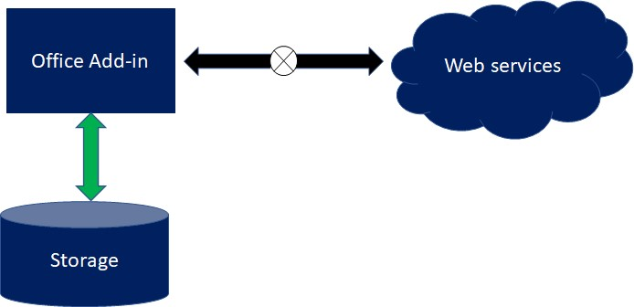

# Techniques to access data from an Office Add-in when offline

This sample demonstrates how you can implement `localStorage` to enable limited functionality for your Office Add-in when a user experiences lost connection.



## Applies to

- Excel, PowerPoint, Word on Windows, Mac, and in a browser.

## Prerequisites

Before running this sample, make sure you have installed a recent version of [npm](https://www.npmjs.com/get-npm) and [Node.js](https://nodejs.org/en/) on your computer. To check if you have already installed these tools, run the commands `node -v` and `npm -v` in your terminal.

## Solution

Solution | Author(s)
---------|----------
Excel.OfflineStorageAddin | Nancy Wang, Albert Dotson (**Microsoft**)

## Version history

Version  | Date | Comments
---------| -----| --------
1.0  | July 19, 2019 | Initial release
1.1  | July 21, 2025 | Added option for unified manifest

## Scenario: Storing data using local storage

This sample Office Add-in inserts a table of fictitious basketball players' stats in your file, retrieved from a local file named `sampleData.json`. In this sample code, data from the add-in is stored in `localStorage` to allow users who previously opened the add-in with online connection to insert the table of stats offline.

While this add-in gets its data from a local server, implementation of `localStorage` as shown in this sample can be extended to add-ins that get their data from online sources. Furthermore, although this sample runs only in Excel, `localStorage` can be used to offline data across Word, Excel, and PowerPoint.

**Note**: `localStorage` can store up to 5MB of data. To store larger amounts of data offline and for improved performance, consider using [IndexedDB](https://developer.mozilla.org/en-US/docs/Web/API/IndexedDB_API). Note that as of now, IndexedDB isn't supported by all browsers used by Office Add-ins. Check [here](https://learn.microsoft.com/office/dev/add-ins/concepts/browsers-used-by-office-web-add-ins) to see which browsers are supported by Office Add-ins and [here](https://caniuse.com/#search=indexedDB) to see which browsers can support IndexedDB.
As another option, you can store your add-in's data in [`Office.Settings`](https://learn.microsoft.com/javascript/api/office/office.settings?view=office-js). Using Office.Settings will enable your add-in's offline capabilities to persist within the file (e.g. if you'd like to share your file with others).

## Download the sample

1. Clone or download this repository. 
2. In the command line, go to the **Excel.OfflineStorageAddin** folder from your root directory.

The following code sample shows you how to do these two steps: 
```command&nbsp;line

$ git clone https://github.com/OfficeDev/PnP-OfficeAddins.git
$ cd PnP-OfficeAddins
$ cd Samples
$ cd Excel.OfflineStorageAddin
```

## Choose a manifest type

By default, the sample uses an add-in only manifest. However, you can switch the project between the add-in only manifest and the unified manifest. For more information about the differences between them, see [Office Add-ins manifest](https://learn.microsoft.com/office/dev/add-ins/develop/add-in-manifests).


If you want to continue with the add-in only manifest, skip ahead to the [Run the sample](#run-the-sample) section.

### To switch to the Unified manifest for Microsoft 365

Copy all files from the **manifest-configurations/unified** subfolder to the sample's root folder, replacing any existing files that have the same names. We recommend that you delete the **manifest.xml** file from the root folder, so only files needed for the unified manifest are present in the root. Then continue with the [Run the sample](#run-the-sample) section.

### To switch back to the Add-in only manifest

If you want to switch back to the add-in only manifest, copy the files in the **manifest-configurations/add-in-only** subfolder to the sample's root folder. We recommend that you delete the **manifest.json** file from the root folder.

## Run the sample

You can try out this sample by running the following commands.

```command&nbsp;line
# This will download the node modules needed to run this add-in.
$ npm install

# this will build the add-in 
$ npm run build

# This will start the server on your desktop and launch your add-in on Excel.
$ npm run start
```

To simulate the add-in in offline mode, keep the add-in open in the taskpane and shut down the server by closing the terminal window running the server. You will see that you can still create the table of basketball player stats without an online connection, indicating that the data has been stored successfully into `localStorage`.

## Key parts of this sample

Go to *Excel.OfflineStorageAddin/src/taskpane/taskpane.js* to find the implementation of `localStorage` described below. 

### Implementing `localStorage` to offline data
The *Excel.OfflineStorageAddin/src/taskpane/taskpane.js* file contains the `loadTable()` function, that uses `localStorage` to display a table of fictitious basketball player stats when a user loses connection.

In the sample code, the `loadTable()` function first attempts to perform an AJAX call to retrieve information from  the offline data file, `sampleData.json`. In this example, the data from our local file does not ever change; however, performing the AJAX call allows the add-in to always retrieve the most up to date information. If the AJAX call is successful, the function passes the data returned from the file to `createTable()` to produce a table. Before being stored into `localStorage`, the data is also converted into a JSON object so that it can be easily parsed when `localStorage` is accessed. This process is shown in the following code:

```js
$.ajax({
    dataType: "json",
    url: "sampleData.json",
    success: function (result, status, xhr) {
        // Stores the JSON retrieved from the AJAX call as a string in
        // local storage under the key "PlayerData"
        localStorage.PlayerData = JSON.stringify(result);

        // Sends the new data to the table
        createTable(result);
    },
```

If the function fails to successfully get the data from the AJAX call, the function first checks if the basketball player data was previously cached into local storage, as shown in the code below. If it exists, the data is parsed from JSON into a readable text format before being passed to `createTable()`, a function which creates a table from the given data. Otherwise, the function returns an error back to the console.

```js
error: function (xhr, status, error) {
    // If the connections fails, checks if "PlayerData" was previously stored in local storage
    if (localStorage.PlayerData) {
        // Retrieves the string saved earlied under the key "PlayerData"
        // and parses it into an object
        let dataObject = JSON.parse(localStorage.PlayerData);

        // Sends the saved data to the table
        createTable(dataObject);
    }
    else {
        console.log("Player data failed to load with error: " + error);
    }
}
```

## Security notes

- There may be security issues in packages used by this sample. Be sure to run `npm audit` to identify any security vulnerabilities.
- In the webpack.config.js file, a header is set to  `"Access-Control-Allow-Origin": "*"`. This is only for development purposes. In production code, you should list the allowed domains and not leave this header open to all domains.
- You'll be prompted to install certificates for trusted access to https://localhost. The certificates are intended only for running and studying this code sample. Do not reuse them in your own code solutions or in production environments.

You can install or uninstall the certificates by running the following commands in the project folder.

```command&nbsp;line
npx office-addin-dev-certs install
npx office-addin-dev-certs uninstall
```

## Questions and feedback

- Did you experience any problems with the sample? [Create an issue](https://github.com/OfficeDev/Office-Add-in-samples/issues/new/choose) and we'll help you out.
- We'd love to get your feedback about this sample. Go to our [Office samples survey](https://aka.ms/OfficeSamplesSurvey) to give feedback and suggest improvements.
- For general questions about developing Office Add-ins, go to [Microsoft Q&A](https://learn.microsoft.com/answers/topics/office-js-dev.html) using the office-js-dev tag.

## Additional resources

* [Office Add-ins documentation](https://learn.microsoft.com/office/dev/add-ins/overview/office-add-ins)

## Copyright

Copyright (c) 2019 - 2025, Microsoft Corporation. All rights reserved.

This project has adopted the [Microsoft Open Source Code of Conduct](https://opensource.microsoft.com/codeofconduct/). For more information, see the [Code of Conduct FAQ](https://opensource.microsoft.com/codeofconduct/faq/) or contact [opencode@microsoft.com](mailto:opencode@microsoft.com) with any additional questions or comments.


