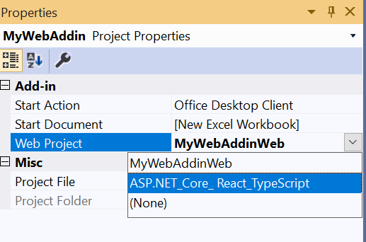
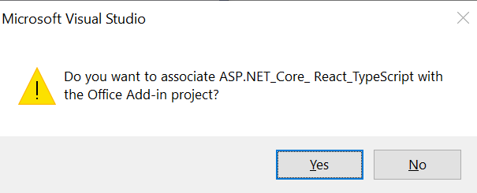
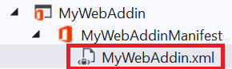
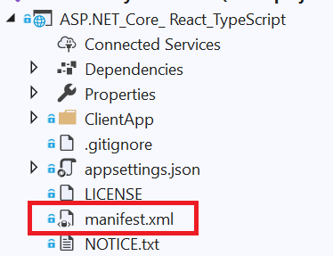

# ASP.NET Core, React.js and Office UI Fabric React sample task pane web projects for Visual Studio 2019

This sample shows how to add Office UI Fabric React to an Excel Web Add-in project in Visual Studio 2019. You can build great cross-platform UI using the style and controls of Office UI Fabric React. This sample uses [React.js](https://reactjs.org/), [Office UI Fabric React](https://github.com/OfficeDev/office-ui-fabric-react), and the [React project template with ASP.NET Core](https://learn.microsoft.com/aspnet/core/client-side/spa/react). The template is equivalent to creating both an ASP.NET Core project and a standard create-react-app (CRA) React project to act as a UI, but with the convenience of hosting both in a single app project that you can build and publish as a single unit. To develop an add-in from the template, you can either add a Web API to the ASP.NET Core project or you can develop the project as a single-page React add-in. Since the project uses React as the UI, you should not attempt to use UI features of ASP.NET Core.

We'd like to hear about your experience with this sample and using ASP.NET Core with Office UI Fabric React and Office Add-ins. Just submit a new issue in this repo to let us know if you have any questions or suggestions.

## Sample Web Projects

- excel-ts: contains sample TypeScript web project that can be used with Office web add-in in Visual Studio.
- excel-js: contains sample JavaScript web project that can be used with Office web add-in in Visual Studio.

## Applies to

- Microsoft 365
- Visual Studio 2019

## Prerequisites

- Visual Studio 2019 (16.3 Preview 3 or newer) and the following Workloads and Optional Components installed:

  - ASP.NET and web development
  - Node.js development
  - Office/SharePoint development
  - Net Core 3.1 Runtime (individual component)

- Node.js, install from https://nodejs.org

> **Note:** Visual Studio 2019 can be downloaded from https://visualstudio.microsoft.com/downloads/

## Solution

| Solution                                                           | Author(s) |
| ------------------------------------------------------------------ | --------- |
| Add ASP.NET Core with Office UI Fabric React to your Office Add-in | Microsoft |

## Instructions

### Create a new Office Web add-in project

1. Start Visual Studio 2019.
2. Choose **Create a new project**.
3. Type "Excel" into the search box at the top of the dialog.
4. Choose the Excel Web Add-in template, then choose **Next**.
5. Give the new project a name on the **Configure your new project** page (for example, `MyWebAddin`). Use the default values for the remaining fields and then choose **Create**.
6. On the choose the add-in type page, select **Add new functionalities to Excel**. Then choose Finish.

### Add the ASP.NET Core React.js web project to the solution

1. Download or clone this repo. This will create a **Office-Add-in-samples** folder.
2. In Visual Studio, select and hold (or right-click) the solution in **Solution Explorer** and choose **Add > Existing Project**.
3. In the **Add Existing Project** dialog, go to the **Office-Add-in-samples/Samples/Office.ASP.NETCoreReactAddins** folder. There are two project folders there: **excel-js** (JavaScript) and **excel-ts** (TypeScript). Choose the folder for the language you want to use, select the .csproj file in the folder, and then choose **Open**.
4. Select and hold (or right-click) the project that you just added in **Solution Explorer** and choose **Build**.
5. Select the add-in project in Solution Explorer. It will have the name you gave the project (such as `MyWebAddin`) and have the icon shown in the following screen shot.

   

6. Press F4 to view the **Properties** window for the project (if it is not already visible).
7. Change the **Web Project** property to the name of ASP .NET Core web project you just added to the solution. The following image shows adding the TypeScript project.

   

8. A confirmation dialog will appear asking if you want to associate the project. Choose **Yes**.

   

   **Note:** The ASP .NET Core web project must be on the same local drive as the Excel Web Add-in project.

9. In the **Solution Explorer** open the manifest.xml file under the Office Add-in project (the project only contains a manifest file). Copy and save the `<Id>` that has the GUID for your project. You will need it later.

   

10. Open the manifest.xml file in the ASP.NET Core project and copy the entire file contents to the clipboard. The following image shows the location for the ASP.NET Core React TypeScript manifest file.

    

11. Return to the manifest file for the Office Add-in project.

    

12. Replace the entire contents of the Office Add-in manifest file with the contents you copied from the ASP.NET Core React manifest file.
13. Find the `<Id>` in the manifest and replace it with the ID of your project that you saved previously. This will ensure you are using a uniquely generated ID.
14. Press F5 to debug the Office Web Add-in project.

**Note:** npm install should run and install the packages prior to building the ASP.NET Core web project but you may need to watch the output window for errors. If errors occur, please try running npm install from the ./ClientApp folder.

## Known Issues

1. If you are using Visual Studio 2019 Update 3 on Windows 10 version 1903 or later and Office version 16.0.11424.10000 or later, there is a known issue that effects your ability to hit breakpoints in JavaScript files. For more information and instructions on how to work around this please see https://developercommunity.visualstudio.com/content/problem/740413/office-development-inconsistent-script-debugging-b.html

2. The ASP.NET Core web project must be on the same local drive as the Office Manifest project. If it is not you will see the error "Property value is not valid" when trying to switch the Web Project property.

## Feedback

Fill out this form to let us know your experience with this sample: [Developing with the ASP.NET Core + Fabric React Office Add-in sample](https://forms.microsoft.com/Pages/ResponsePage.aspx?id=v4j5cvGGr0GRqy180BHbR9Kwcf15u95EqS7NUgPuo5xUN0dYSFdQNVhFRDBaMjI1SDNXNFlKSkFNMC4u)

## Version history

| Version | Date               | Comments                           |
| ------- | ------------------ | ---------------------------------- |
| 1.0     | September 23, 2019 | Initial Release                    |
| 2.0     | May 14, 2020       | Upgraded from .NET Core 2.2 to 3.1 |

### Disclaimer

**THIS CODE IS PROVIDED _AS IS_ WITHOUT WARRANTY OF ANY KIND, EITHER EXPRESS OR IMPLIED, INCLUDING ANY IMPLIED WARRANTIES OF FITNESS FOR A PARTICULAR PURPOSE, MERCHANTABILITY, OR NON-INFRINGEMENT.**
