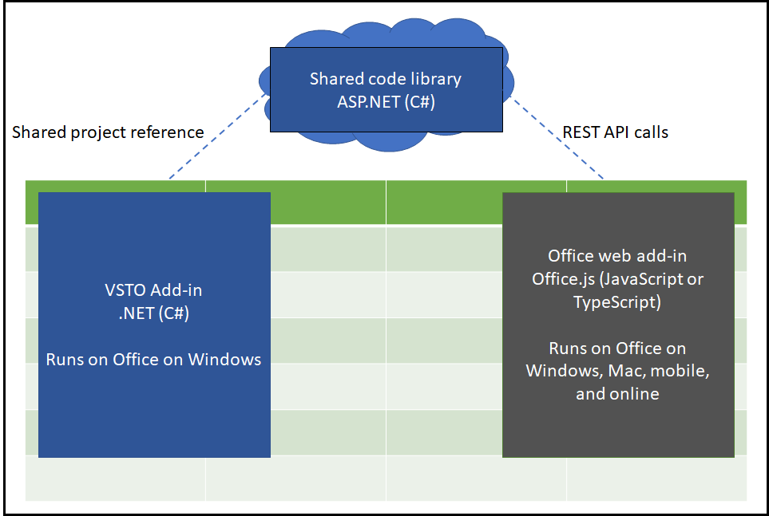
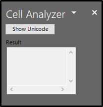

# Use a shared library to migrate your Visual Studio Tools for Office add-in to an Office web add-in

Visual Studio Tools for Office (VSTO) add-ins can only run in Office on Windows. By migrating your code to an Office web add-in, you can expand the reach of your add-in to mobile and online platforms. Migrating the code will involve rewriting it in the JavaScript language, and also updating it to use the Office JavaScript APIs. However, you can reduce migration cost by creating a shared library and keeping some of your existing add-in code in its current language.

This sample includes a **/start** folder that accompanies the [Tutorial: Migrate your VSTO Add-in to an Office web add-in with a shared code library](https://docs.microsoft.com/office/dev/add-ins/pnp/migrate-vsto-to-office-web-add-in-shared-code-library-tutorial). If you want to learn how to go through the steps for creating a shared library for an existing VSTO add-in, follow the tutorial.

The sample contains a **/completed** folder that contains the completed solution. If you want to explore each section of the completed solution, follow the steps in this readme to learn more.

The sample starts with an Excel VSTO add-in that provides functionality for the user to analyze a cell of text. They can view the unicode values of the text characters. The logic to convert the text to unicode is what will be shared to the web add-in.

## Applies to

-  Excel, Outlook, Word, and PowerPoint, on Windows, Mac, and in a browser.

## Prerequisites

To set up your development environment:

1. Install [Visual Studio 2019](https://visualstudio.microsoft.com/downloads/).
2. Install the following workloads:
    - ASP.NET and web development
    - .NET Core cross-platform development. **Note:** You need at least .NET Core version 2.2 or later to run the completed sample.
    - Office/SharePoint development
    - Visual Studio Tools for Office (VSTO). **Note:** This is an **Individual** component.

You will also need an Office 365 account. You can join the [Office 365 Developer Program](https://aka.ms/devprogramsignup) that includes a free 1 year subscription to Office 365.

## Solution

Solution | Author(s)
---------|----------
Shared library VSTO migration | David Chesnut (**Microsoft**)

## Version history

Version  | Date | Comments
---------| -----| --------
1.0  | December 2, 2019 | Initial release

## Disclaimer

**THIS CODE IS PROVIDED *AS IS* WITHOUT WARRANTY OF ANY KIND, EITHER EXPRESS OR IMPLIED, INCLUDING ANY IMPLIED WARRANTIES OF FITNESS FOR A PARTICULAR PURPOSE, MERCHANTABILITY, OR NON-INFRINGEMENT.**

----------
## Analyze your VSTO add-in

The first step to migration is to analyze the code in your VSTO add-in. You'll want to identify each section of code as following into one of the following three categories.

1. UI code that interacts with the user, such as task pane code that uses a WinForm.
2. Document code that interacts with the document through the Office APIs, such as updating Excel range values.
3. Business logic, such as algorithms or helper functions, that can work independently from the UI or document.

UI code and document interaction code will need to be rewritten for the Office web add-in. However, business logic code can be shared between the VSTO add-in and Office web add-in.

## Prepare the solution to run

You'll need to install the required NuGet packages, and add test certificates for the solution to build and run correctly.

1. Start Visual Studio 2019 and open the **/completed/Cell-Analyzer.sln** solution.
2. In **Solution Explorer**, right-click **Solution 'Cell-Analyzer'**, and choose **Restore NuGet Packages**.
3. In **Solution Explorer**, right-click the **Cell-Analyzer** project, and choose **Properties**.
4. Choose the **Signing** category in the properties.
5. Choose **Sign the ClickOnce manifests**, and then chose **Create Test Certificate**.
6. In the **Create Test Certificate** dialog, enter and confirm a password. Then choose **OK**.

## Part 1: Share code in a class library

To share the business logic code, you create a class library. Then refactor the business logic and relocate it into the shared library. The advantage is that you will not need to rewrite the code in JavaScript for the Office web add-in. Later the Office web add-in will access the shared library through REST API calls.

### Explore the shared class library

1. Start Visual Studio 2019 and open the **/completed/Cell-Analyzer.sln** solution.
2. Expand the **CellAnalyzerSharedLibrary** project in the solution explorer and open the **CellOperations.cs** file.

The method **GetUnicodeFromText** is the shared function between both the VSTO add-in and Office web add-in.

### Run the VSTO add-in with the shared class library

1. Start Visual Studio 2019 and open the **/completed/Cell-Analyzer.sln** solution.
2. In **Solution Explorer** right-click the **Cell-Analyzer** project and choose **Set as Startup Project**.
3. From the **Debug** menu, choose **Start Debugging**.

> **Note:** In the completed folder, the Cell Analyzer add-in is already configured to use the shared class library.

## Part 2: Create a REST API wrapper for shared code

The Office web add-in will need to access the shared library. To do this we'll provide a REST API that it can access. We can do this by creating an ASP.NET CORE application that references the class library.

### Explore the REST API project

1. Start Visual Studio 2019 and open the **/completed/Cell-Analyzer.sln** solution.
2. Expand the **CellAnalyzerRESTAPI** project in the solution explorer and open the **/Controllers/AnalyzeUnicodeController.cs** file.

The method **AnalyzeUnicode** is a wrapper that calls into the shared class library to perform the actual operation.

### Run the REST API project

1. Start Visual Studio 2019 and open the **/completed/Cell-Analyzer.sln** solution.
2. In **Solution Explorer** right-click the **CellAnalyzerRESTAPI** project and choose **Set as Startup Project**.
3. From the **Debug** menu, choose **Start Debugging**.
4. In the browser that opens, enter the following URL: **https://localhost:44323/api/analyzeunicode?value=test**

You should see the list of characters returned along with each unicode value.

## Part 3: The Office web add-in

The Office web add-in must be created and then modified to match the VSTO add-in UI and document interactions as much as possible. For UI you will need to create similar controls using HTML, CSS, or your favorite library. You will also need to rewrite code that interacts with the document to use the Office JavaScript API.

### Explore the Office web add-in project

1. Start Visual Studio 2019 and open the **/completed/Cell-Analyzer.sln** solution.
2. Expand the **CellAnalyzer** project in the solution explorer and open the **/Controllers/AnalyzeUnicodeController.cs** file.

The method **AnalyzeUnicode** is a wrapper that calls into the shared class library to perform the actual operation.

### Run the Office web add-in project

1. Start Visual Studio 2019 and open the **/completed/Cell-Analyzer.sln** solution.
2. In **Solution Explorer** right-click the top node **Solution 'Cell-Analyzer'** and choose **Set Startup Projects**.
3. In the **Solution 'Cell-Analyzer' Property Pages** dialog, select **Multiple startup projects**.
4. Enable the Start action for each of the following projects.
    - CellAnalyzerRESTAPI
    - CellAnalyzerWebAddinWeb
    - CellAnalyzerWebAddin
5. Choose **OK**.
6. From the **Debug** menu, choose **Start Debugging**.

Excel will run and sideload the Office web add-in.

## Security notes

### CellAnalyzerRESTAPI notes

The Cell analyzer REST API project is configured to support CORS requests from https://localhost:44397 (the Office web add-in.) This is only for development purposes. In production code, you should configure CORS to support your deployed Office web add-in endpoint.

## Questions and comments

We'd love to get your feedback about this sample. You can send your feedback to us in the Issues section of this repository. Questions about developing Office Add-ins should be posted to Stack Overflow. Ensure your questions are tagged with [office-js].

## Additional resources

- [Office Add-ins documentation](https://docs.microsoft.com/office/dev/add-ins/overview/office-add-ins)

## Copyright

Copyright (c) 2019 Microsoft Corporation. All rights reserved.

This project has adopted the [Microsoft Open Source Code of Conduct](https://opensource.microsoft.com/codeofconduct/). For more information, see the [Code of Conduct FAQ](https://opensource.microsoft.com/codeofconduct/faq/) or contact [opencode@microsoft.com](mailto:opencode@microsoft.com) with any additional questions or comments.

