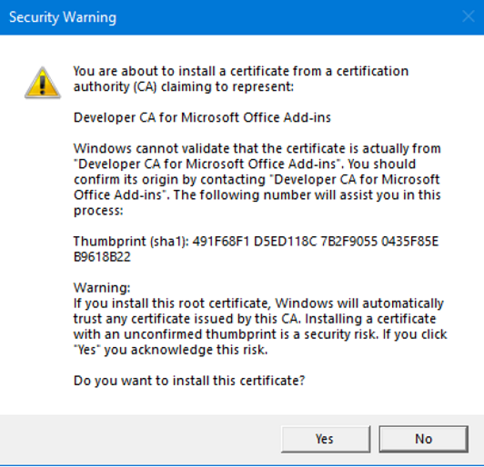

# Get OneDrive data using Microsoft Graph and msal.js in an Office Add-in 

## Summary

Learn how to build a Microsoft Office Add-in, as a single-page application (SPA) with no backend, that connects to Microsoft Graph, finds the first three workbooks stored in OneDrive for Business, fetches their filenames, and inserts the names into an Office document using Office.js.

## Features

Integrating data from online service providers increases the value and adoption of your add-ins. This code sample shows you how to connect your SPA add-in to Microsoft Graph. Use this code sample to:

* Connect to Microsoft Graph from an Office Add-in.
* Use the MSAL.js Library to implement the OAuth 2.0 authorization framework in an add-in, using the Auth Code Flow w/ PKCE for SPAs.
* Use the OneDrive REST APIs from Microsoft Graph.
* Show a dialog using the Office UI namespace.
* Build an Add-in using React, MSAL.js, and Office.js. 
* Use add-in commands in an add-in.

## Applies to

-  Excel on Windows (one-time purchase and subscription)

## Prerequisites

To run this code sample, the following are required.

* [Node and npm](https://nodejs.org/en/), version 10.15.3 or later (npm version 6.2.0 or later). The sample was not tested on earlier versions, but may work with them.

* TypeScript version 3.1.6 or later. The sample was not tested on earlier versions, but may work with them.

* An Office 365 account which you can get by joining the [Office 365 Developer Program](https://aka.ms/devprogramsignup) that includes a free 1 year subscription to Office 365.

* At least three Excel workbooks stored on OneDrive for Business in your Office 365 subscription.

* Office on Windows, version 16.0.6769.2001 or higher.

* A Microsoft Azure Tenant. This add-in requires Azure Active Directory (AD). Azure AD provides identity services that applications use for authentication and authorization. A trial subscription can be acquired here: [Microsoft Azure](https://account.windowsazure.com/SignUp).

* A code editor.

## Solution

Solution | Author(s)
---------|----------
Office Add-in Microsoft Graph React | Microsoft

## Version history

Version  | Date | Comments
---------| -----| --------
1.1  | December 10th, 2020 | Upgrade MSAL.js to v2
1.0  | August 29th, 2019| Initial release
1.1  | January 14th, 2021| Changed system for creating and installing the SSL certificates for HTTPS.

## Disclaimer

**THIS CODE IS PROVIDED *AS IS* WITHOUT WARRANTY OF ANY KIND, EITHER EXPRESS OR IMPLIED, INCLUDING ANY IMPLIED WARRANTIES OF FITNESS FOR A PARTICULAR PURPOSE, MERCHANTABILITY, OR NON-INFRINGEMENT.**

----------

## Build and run the solution

### Configure the solution

1. Register your application using the [Azure Management Portal](https://manage.windowsazure.com). **Log in with the identity of an administrator of your Office 365 tenancy to ensure that you are working in an Azure Active Directory that is associated with that tenancy.** To learn how to register your application, see [Register an application with the Microsoft Identity Platform](https://docs.microsoft.com/graph/auth-register-app-v2). Use the following settings:

 - REDIRCT URI: `https://localhost:3000/login/login.html` (this must be added under "Single-Page Application")
 - SUPPORTED ACCOUNT TYPES: "**Accounts in any organizational directory**"
 - API PERMISSIONS: none. Do not request any. 
 - SECRETS: none. The sample uses the OAuth 2.0 Auth Code Flow w/ PKCE for SPAs, which requires no secrets.

	> Note: After you register your application, copy the **Application (client) ID** on the **Overview** blade of the App Registration in the Azure Management Portal. 
	 
2.  In the code editor, open the `/login/login.ts` file in the project. Near the top is a configuration property called `clientId`. Replace the placeholder value with the application ID you copied from the registration. Save and close the file.

3. Open a **Command Prompt** *as an administrator*.

4. Navigate to the root of the sample, which would normally be `[PATH-TO-YOUR-PROJECTS]\PnP-OfficeAddins\Samples\auth\Office-Add-in-Microsoft-Graph-React`.

5. Run the command `npm install`.

6. Run the command: ```npx office-addin-dev-certs install --machine```.

    If you get the following prompt, click **Yes**.

    

	> Note: If you have worked with another Office Add-in within the last 30 days that was originally created with the Yo Office tool, you may have unexpired certs for localhost already, in which case you will get a message saying that localhost is already trusted. If so, continue with the next section.

### Run the solution

1. In the command prompt, run the command `start npm start`. This will open a second command prompt, build the project and then start a server (with dev mode settings). It takes from 5 to 30 seconds. When it finishes, the last line should say `Compiled successfully`. Minimize this command prompt.
2. Back in the original command prompt, run the command `npm run sideload`. This will launch Excel and install the add-in in it. After a few seconds, a **OneDrive Files** group appears on the right end of the **Home** ribbon with a button named **Open Add-in**.
3. Click the **Open Add-in** to open the task pane add-in.
4. The pages and buttons in the add-in are self-explanatory. 

	> Note: The first time that you press the **Connect to Office 365** button and sign in, you will be prompted to consent to the add-in. 

## Known issues

* When a dialog is opened (with either the **Connect to Office 365** or the **Sign out from Office 365** buttons) on a Windows computer, a process named **Desktop App Web Viewer** starts on the computer. (You can see it in **Task Manager**.) These processes don't always close when the dialog closes. If you are working with the sample a lot, opening and closing dialogs, these processes use more and more memory. Eventually, the login dialog will start to flicker and seem to reload itself over and over. If this happens, use  **Task Manager** to kill the processes.

## Questions and comments

We'd love to get your feedback about this sample. You can send your feedback to us in the *Issues* section of this repository.
Questions about developing Office Add-ins should be posted to [Stack Overflow](http://stackoverflow.com). Ensure your questions are tagged with [office-js] and [MicrosoftGraph].

## Additional resources

* [Microsoft Graph documentation](https://docs.microsoft.com/graph/)
* [Office Add-ins documentation](https://docs.microsoft.com/office/dev/add-ins/overview/office-add-ins)

## Copyright

Copyright (c) 2019 and 2021 Microsoft Corporation. All rights reserved.

This project has adopted the [Microsoft Open Source Code of Conduct](https://opensource.microsoft.com/codeofconduct/). For more information, see the [Code of Conduct FAQ](https://opensource.microsoft.com/codeofconduct/faq/) or contact [opencode@microsoft.com](mailto:opencode@microsoft.com) with any additional questions or comments.


