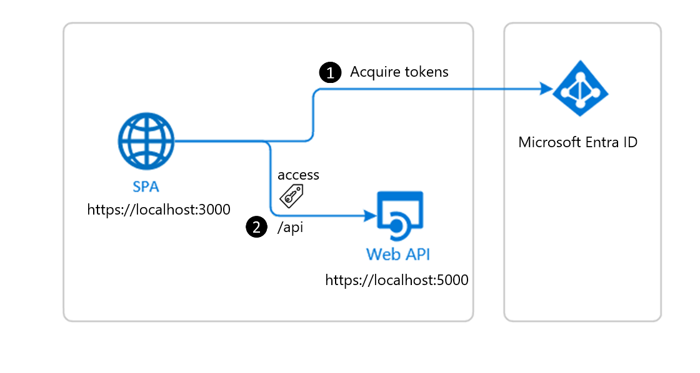

# Send identity claims to resources using nested app authentication (NAA) and SSO

The scenario for this sample is that you need to send the signed-in user's identity claims (such as name, email, or a unique ID) to a resource such as a database. This enables you to associate and track data for each user in the resource. This sample replaces an obsolete pattern for legacy Exchange Online tokens. The obsolete pattern is that Exchange Online identity tokens were passed over the network to share user identity. Using Entra ID tokens, the ID token must never be passed by your Outlook add-in over the network to any resource. It can only be used within the context of the add-in (such as the task pane) itself. To pass user identity over the network, you use the Entra ID access token which contains the identity claims.

This sample shows how to implement a todo list for multiple users with an Outlook add-in.

1. The Outlook add-in (SPA client) uses the MSAL.js library to obtain an access token from Microsoft Entra ID. The MSAL.js library returns an ID token, access token, and refresh token.
1. The access token is passed in a web request to a protected web API service. The web request validates the access token and confirms the user has permissions to perform the action in the API. The access token contains any identity claims the web API needs.



## Applies to

- Outlook on Windows (new and classic), Mac, mobile, and on the web.

## Prerequisites

- Office connected to a Microsoft 365 subscription (including Office on the web).
- [Node.js](https://nodejs.org/) version 16 or greater.
- [npm](https://docs.npmjs.com/downloading-and-installing-node-js-and-npm) version 8 or greater.

## Register the sample applications with your Microsoft Entra tenant

### Register the web API service

The web API service is a Node.js server that requires an application registration to authorize calls to the todo list database.

1. Go to the [Azure portal - App registrations](https://go.microsoft.com/fwlink/?linkid=2083908) page to register your app.
1. Sign in with the **_admin_** credentials to your Microsoft 365 tenancy. For example, **MyName@contoso.onmicrosoft.com**.
1. Select **New registration**. On the **Register an application** page, set the values as follows.

   - Set **Name** to `Contoso-Web-API-Server`.
   - Set **Supported account types** to **Accounts in this organizational directory only**.
   - Select **Register**.

1. In the app's registration screen, select the **Expose an API** blade to the left to open the page where you can publish the permission as an API for which client applications can obtain access tokens for. The first thing that we need to do is to declare the unique resource URI that the clients will be using to obtain access tokens for this API. To declare an resource URI(Application ID URI), follow the following steps:

    - Select **Add** next to the **Application ID URI** to generate a URI that is unique for this app.
    - For this sample, accept the proposed **Application ID URI** (`api://{clientId}`) by selecting **Save**.

    Read more about Application ID URI at [Validation differences by supported account types (signInAudience)](https://docs.microsoft.com/azure/active-directory/develop/supported-accounts-validation).

### Publish delegated permissions

All APIs must publish a minimum of one scope, also called Delegated Permission, for the client apps to obtain an access token for a user successfully. To publish a scope, follow these steps:

1. Select **Add a scope** button open the **Add a scope** screen and Enter the values as indicated below:
- For **Scope name**, use `Todolist.Read`.
- Select **Admins and users** options for **Who can consent?**.
- For **Admin consent display name** type in `Todolist.Read`.
- For **Admin consent description** type in `Allows the app to read the signed-in user's files.`
- For **User consent display name** type in `Todolist.Read`.
- For **User consent description** type in eg. `Allows the app to read your files.`
- Keep **State** set to **Enabled**.
- Select the **Add scope** button on the bottom to save this scope.

Repeat the previous steps to add a second scope named `Todolist.ReadWrite` along with descriptions that indicate the scope will read and write files.

### Publish application permissions

All APIs should publish a minimum of one [App role for applications](https://docs.microsoft.com/azure/active-directory/develop/howto-add-app-roles-in-azure-ad-apps#assign-app-roles-to-applications), also called [Application Permission](https://docs.microsoft.com/azure/active-directory/develop/v2-permissions-and-consent#permission-types), for the client apps to obtain an access token as themselves, i.e. when they are not signing-in a user. Application permissions are the type of permissions that APIs should publish when they want to enable client applications to successfully authenticate as themselves and not need to sign-in users. To publish an application permission, follow these steps:

1. Still on the same app registration, select the **App roles** blade to the left.
1. Select **Create app role**:
    1. For **Display name**, enter a suitable name for your application permission, for instance `Todolist.Read.All`.
    1. For **Allowed member types**, choose **Application** to ensure other applications can be granted this permission.
    1. For **Value**, enter `Todolist.Read.All`.
    1. For **Description**, enter `Allows the app to read the signed-in user's files.`
    1. Select **Apply** to save your changes.

Repeat the previous steps to add another app permission named `Todolist.ReadWrite.All`.

### Configure the service app (Contoso-Web-API-Server) to use your app registration

Open the sample project in Visual Studio Code to configure the code. In the steps below, "ClientID" is the same as "Application ID" or "AppId".

1. Open the API/server-helpers/authConfig.js file.
1. Find the key `Enter_API_Application_Id_Here` and replace the existing value with the application ID (clientId) of Contoso-Web-API-Server app copied from the Microsoft Entra admin center.
1. Save the file.

### Register the client app (Contoso-Outlook-Add-in)

1. Go to the [Azure portal - App registrations](https://go.microsoft.com/fwlink/?linkid=2083908) page to register your app.
1. Sign in with the **_admin_** credentials to your Microsoft 365 tenancy. For example, **MyName@contoso.onmicrosoft.com**.
1. Select **New registration**. On the **Register an application** page, set the values as follows.

   - Set **Name** to `Contoso-Outlook-Add-in`.
   - Set **Supported account types** to **Accounts in this organizational directory only**.
   - Select **Register**.

1. In the **Overview** blade, find and note the **Application (client) ID**. You use this value in your app's configuration file(s) later in your code.
1. In the app's registration screen, select the **Authentication** blade to the left.
1. If you don't have a platform added, select **Add a platform** and select the **Single-page application** option.
    1. In the **Redirect URI** section enter the following redirect URIs:
        1. `http://localhost:3000`
        1. `http://localhost:3000/redirect`
        1. `brk-multihub://localhost:3000`
    1. Click **Save** to save your changes.

Since this app signs-in users, we will now proceed to select **delegated permissions**, which is is required by apps signing-in users.

  1. In the app's registration screen, select the **API permissions** blade in the left to open the page where we add access to the APIs that your application needs:
  1. Select the **Add a permission** button and then:
  1. Ensure that the **My APIs** tab is selected.
  1. In the list of APIs, select the API `Contoso-Web-API-Server`.
  1. In the **Delegated permissions** section, select **Todolist.Read**, **Todolist.ReadWrite** in the list. Use the search box if necessary.
  1. Select the **Add permissions** button at the bottom.

### Configure the client app (Contoso-Outlook-Add-in) to use your app registration

Open the sample project in Visual Studio Code to configure the code.

> In the steps below, "ClientID" is the same as "Application ID" or "AppId".

1. Open the `SPA/src/taskpane/msalconfig.ts` file.
1. Find the key `Enter_Application_Client_Id_Here` and replace the existing value with the application ID (clientId) of `Contoso-Outlook-Add-in` app copied from the Microsoft Entra admin center.
1. Save the file.
1. Open the `SPA/src/taskpane/authConfig.ts` file.
1. Find the key `Enter_API_Application_Id_Here` and replace the existing value with the application ID (clientId) of Contoso-Web-API-Server` app copied from the Microsoft Entra admin center.

## Run the sample

First, start the web API service. In a console window, go to the root project folder of the sample. Run the following commands.

```console
    cd API
    npm start
```

Next, start and sideload the Outlook add-in. In a new console window, go to the root project folder of the sample. Run the following commands.

```console
    cd SPA
    npm start
```

The following instructions assume you are sideloading in Outlook for Windows. To sideload on other platforms, see [Sideload Outlook add-ins for testing](https://learn.microsoft.com/office/dev/add-ins/outlook/sideload-outlook-add-ins-for-testing)

1. Open Outlook (if it isn't already opened) and sign in.
1. Open an existing email item.
1. On the ribbon for the email item, select the **Show Task Pane** button. This will open the task pane of the add-in.
1. In the task pane, enter a new task in the text box, and select **Add**. You can enter multiple tasks.
1. Select **Get todo list** to get the task list.
1. You can also delete tasks in the list itself.

If you sign in as a different user, you will get a list just for that user.

## About the code

### Acquire a Token

**Access Token** requests in **MSAL.js** are meant to be *per-resource-per-scope(s)*. This means that an **Access Token** requested for resource **A** with scope `scp1`:

- cannot be used for accessing resource **A** with scope `scp2`, and,
- cannot be used for accessing resource **B** of any scope.

The intended recipient of an **Access Token** is represented by the `aud` claim; in case the value for the `aud` claim does not mach the resource APP ID URI, the token should be considered invalid. Likewise, the permissions that an Access Token grants is represented by the `scp` claim. See [Access Token claims](https://docs.microsoft.com/azure/active-directory/develop/access-tokens#payload-claims) for more information.

### CORS settings

For the purpose of the sample, **cross-origin resource sharing** (CORS) is enabled for **all** domains and methods, using the Express.js cors middleware. This is insecure and only used for demonstration purposes here. In production, you should modify this as to allow only the domains that you designate. If your web API is going to be hosted on **Azure App Service**, we recommend configuring CORS on the App Service itself. This is illustrated in [app.js](./API/app.js):

```javascript
const express = require('express');
const cors = require('cors');

const app = express();

app.use(cors());
```

### Access token validation

On the web API side, the **validateJwt** function in `/API/server-helpers/validation-helper.js` verifies the incoming access token's signature and validates it's payload against the `issuer` and `audience` claims.

For validation and debugging purposes, developers can decode **JWT**s (*JSON Web Tokens*) using [jwt.ms](https://jwt.ms).

### Access to data

Controllers should check if the presented access token has the necessary permissions to access the data, depending on the type of permission. This is illustrated in [todolist.js](./API/controllers/todolist.js):

```JavaScript
exports.getTodos = (req, res, next) => {
    // Check that caller has the delegated todolist.read permission from the user.
    if (hasRequiredDelegatedPermissions(req.authInfo, authConfig.protectedRoutes.todolist.delegatedPermissions.read)) {

        try {
            const owner = req.authInfo['oid'];

            const todos = db.get('todos')
                .filter({ owner: owner })
                .value();

            res.status(200).send(todos);
        } catch (error) {
            next(error);
        }
    } else {
        next(new Error('User does not have the required permissions.'));
    }
}
```

When granting access to data based on scopes, be sure to follow [the principle of least privilege](https://docs.microsoft.com/azure/active-directory/develop/secure-least-privileged-access).

## More information

Learn more about the Microsoft identity platform:

- [Microsoft identity platform (Microsoft Entra ID for developers)](https://docs.microsoft.com/azure/active-directory/develop/)
- [Overview of Microsoft Authentication Library (MSAL)](https://docs.microsoft.com/azure/active-directory/develop/msal-overview)
- [Understanding Microsoft Entra application consent experiences](https://docs.microsoft.com/azure/active-directory/develop/application-consent-experience)
- [Understand user and admin consent](https://docs.microsoft.com/azure/active-directory/develop/howto-convert-app-to-be-multi-tenant#understand-user-and-admin-consent)
- [Microsoft identity platform and OpenID Connect protocol](https://docs.microsoft.com/azure/active-directory/develop/v2-protocols-oidc)
- [Microsoft identity platform ID Tokens](https://docs.microsoft.com/azure/active-directory/develop/id-tokens)

For more information about how OAuth 2.0 protocols work in this scenario and other scenarios, see [Authentication Scenarios for Microsoft Entra ID](https://docs.microsoft.com/azure/active-directory/develop/authentication-flows-app-scenarios).

## Questions and feedback

- Did you experience any problems with the sample? [Create an issue](https://github.com/OfficeDev/Office-Add-in-samples/issues/new/choose) and we'll help you out.
- We'd love to get your feedback about this sample. Go to our [Office samples survey](https://aka.ms/OfficeSamplesSurvey) to give feedback and suggest improvements.
- For general questions about developing Office Add-ins, go to [Microsoft Q&A](https://learn.microsoft.com/answers/topics/office-js-dev.html) using the office-js-dev tag.

## Copyright

Copyright (c) 2025 Microsoft Corporation. All rights reserved.

This project has adopted the [Microsoft Open Source Code of Conduct](https://opensource.microsoft.com/codeofconduct/). For more information, see the [Code of Conduct FAQ](https://opensource.microsoft.com/codeofconduct/faq/) or contact [opencode@microsoft.com](mailto:opencode@microsoft.com) with any additional questions or comments.

