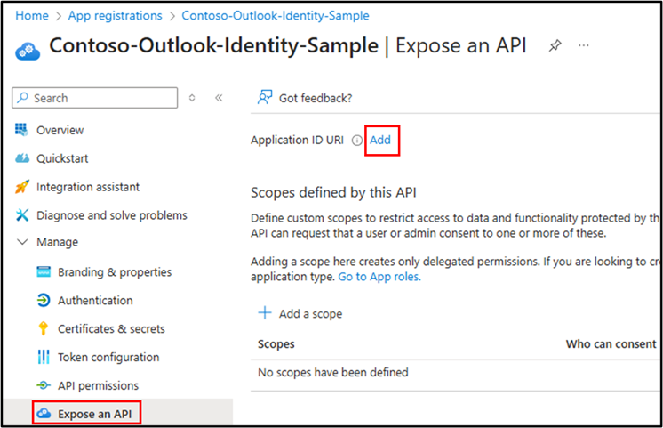
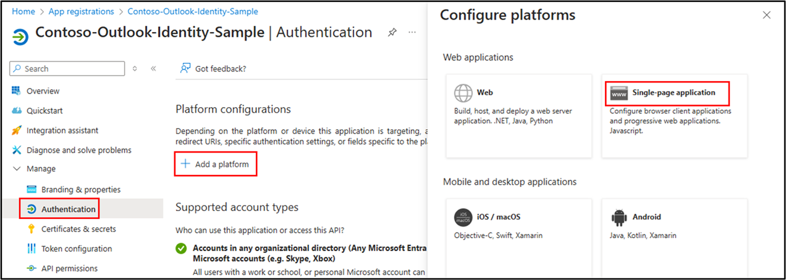
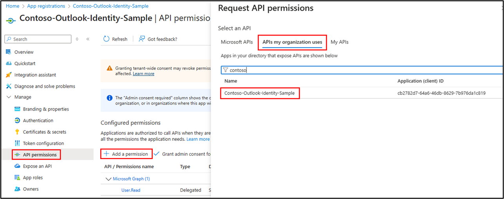

# Send identity claims to resources using nested app authentication (NAA) and SSO

The scenario for this sample is that you need to send the signed-in user's identity claims (such as name, email, or a unique ID) to a resource such as a database. This enables you to associate and track data for each user in the resource. This sample replaces an obsolete pattern for legacy Exchange Online tokens. The obsolete pattern is that Exchange Online identity tokens were passed over the network to share user identity. Using Entra ID tokens, the ID token must never be passed by your Outlook add-in over the network to any resource. It can only be used within the context of the add-in (such as the task pane) itself. To pass user identity over the network, you use the Entra ID access token which contains the identity claims.

This sample shows how to implement a todo list for multiple users with an Outlook add-in.

1. The Outlook add-in (SPA client) uses the MSAL.js library to obtain an access token from Microsoft Entra ID. The MSAL.js library returns an ID token and access token.
1. The access token is passed in a web request to a protected web API service. The web request validates the access token and confirms the user has permissions to perform the action in the API. The access token contains any identity claims the web API needs.


## Applies to

- Outlook on Windows (new and classic), Mac, mobile, and on the web.

## Prerequisites

- Office connected to a Microsoft 365 subscription (including Office on the web).
- [Node.js](https://nodejs.org/) (latest recommended version).
- [npm](https://docs.npmjs.com/downloading-and-installing-node-js-and-npm) version 8 or greater.

## Register the sample applications with your Microsoft Entra tenant

### Create the app registration

The web API service is a Node.js server that requires an application registration to authorize calls to the todo list database. Also the Outlook add-in will require app registration to request access tokens. Although you can create two app registrations for the API service and the add-in client code, this sample combines both into a single app registration to keep it simple.

1. To register your app, go to the [Azure portal - App registrations](https://go.microsoft.com/fwlink/?linkid=2083908) page.
1. Sign in with the **_admin_** credentials to your Microsoft 365 tenancy. For example, **MyName@contoso.onmicrosoft.com**.
1. Select **New registration**. On the **Register an application** page, set the values as follows.

   - Set **Name** to `Contoso-Outlook-Identity-Sample`.
   - Set **Supported account types** to **Accounts in any organizational directory (Any Microsoft Entra ID tenant - Multitenant) and personal Microsoft accounts (e.g. Skype, Xbox)**.
   - Select **Register**.

1. In the **Overview** blade, find and note the **Application (client) ID** and **Directory (tenant) ID**. Save these values to use in the project files later in these steps.
1. In the app's registration screen, select **Manage > Expose an API** to open the page where you can publish the permission as an API for which client applications can obtain access tokens for. The first thing that we need to do is to declare the unique resource URI that the clients will be using to obtain access tokens for this API. To declare a resource URI(Application ID URI), follow the following steps:

    - Select **Add** next to the **Application ID URI** to generate a URI that is unique for this app.

        

    - For this sample, accept the proposed **Application ID URI** (`api://{clientId}`) by selecting **Save**.

    Read more about Application ID URI at [Validation differences by supported account types (signInAudience)](https://docs.microsoft.com/azure/active-directory/develop/supported-accounts-validation).

### Publish delegated permissions

All APIs must publish a minimum of one scope, also called Delegated Permission, for the client apps to obtain an access token for a user successfully. To publish a scope, follow these steps:

1. Select **Add a scope**.

    

1. Enter the following values.

    - For **Scope name**, select `Todolist.Read`.
    - Select **Admins and users** options for **Who can consent?**.
    - For **Admin consent display name** enter `Todolist.Read`.
    - For **Admin consent description** enter `Allows the app to read the signed-in user's files.`
    - For **User consent display name** enter `Todolist.Read`.
    - For **User consent description** enter a description. For example, `Allows the app to read your files.`
    - For **State**, select **Enabled**.
    - To save this scope, select the **Add scope** button.

Repeat the previous steps to add a second scope named `Todolist.ReadWrite` along with descriptions that indicate the scope will read and write files.

Your scopes should appear as shown in the following screenshot.


### Pre-authorize the app registration

You need to pre-authorize the app registration to allow calls to itself.

1. In the same **Expose an API** pane, select **Add a client application**.
1. Enter the client ID of this app registration which is found on the **Overview** page
1. Select both authorized scopes and then select **Add application**.


### Add redirects

1. In the app's registration screen, select the **Manage** > **Authentication** blade on the left pane.
1. Select **Add a platform** and choose the **Single-page application** option.

    

    1. In the **Redirect URI** section, enter the following redirect URI:
        1. `http://localhost:3000`
    1. Select **Configure**.
    1. After the page updates with the new URI, select **Add URI** and add the following redirect URIs:
        1. `http://localhost:3000/redirect`
        1. `brk-multihub://localhost:3000`
    1. To save your changes, select **Save**.

    

Since this app signs-in users, you'll now proceed to select delegated permissions, which is required by apps signing-in users.

1. In the app's registration screen, select the **API permissions** blade on the left pane. This opens the page where you add access to the APIs that your application needs.
1. Select the **Add a permission** button, and choose the **APIs my organization uses** tab.
1. In the list of APIs, choose the API `Contoso-Outlook-Identity-Sample`.
  
    

1. In the **Delegated permissions** section, select **Todolist.Read**, **Todolist.ReadWrite** in the list. Use the search box if necessary.
1. Select the **Add permissions** button.

Your permissions should appear as shown in the following screenshot.


### Define the access token version

The access token version can change if you chose an account type other than **Accounts in any organizational directory (Any Azure AD directory - Multitenant) and personal Microsoft accounts (e.g. Skype, Xbox)**. Use the following steps to ensure the access token version is correct for Office SSO usage.

1. From the left pane, select **Manifest**.
1. Enter **2** as the value for the **requestedAccessTokenVersion** property (in the **api** object).
1. Select **Save**.

### Configure the service app (API) to use your app registration

Open the sample project in Visual Studio Code to configure the code. In the following steps, "ClientID" is the same as "Application ID" or "AppId".

1. Open the `API/server-helpers/authConfig.js` file.
1. Find the key `Enter_API_Application_Id_Here` and replace the existing value with the application ID (clientId) of `Contoso-Outlook-Identity-Sample` app copied from when you created the app registration earlier.
1. Find the key `Enter_API_Application_Id_Here` and replace the existing value with the directory (tenant) ID of `Contoso-Outlook-Identity-Sample` app copied from when you created the app registration earlier.
1. Save the file.

### Configure the client app (SPA) to use your app registration

Open the sample project in Visual Studio Code to configure the code.

1. Open the `SPA/src/taskpane/msalconfig.ts` file.
1. Find the key `Enter_Application_Client_Id_Here` and replace the existing value with the application ID (clientId) of `Contoso-Outlook-Identity-Sample`.
1. Save the file.

Next you need to add the API web server's application ID.

1. Open the `SPA/src/taskpane/authConfig.ts` file.
1. Find the key `Enter_API_Application_Id_Here` and replace the existing value with the application ID (clientId) of `Contoso-Outlook-Identity-Sample`.

Note: If you chose to create a separate app registration for the API server, you'd use that client ID for `Enter_API_Application_Id_Here` placeholders.

## Run the sample

The following instructions sideload the sample in Outlook for Windows. To sideload on other platforms, see [Sideload Outlook add-ins for testing](https://learn.microsoft.com/office/dev/add-ins/outlook/sideload-outlook-add-ins-for-testing)

Start the web API service. In a console window, go to the root project folder of the sample. Run the following commands.

```console
    cd API
    npm install
    npm start
```

Next, start and sideload the Outlook add-in. In a new console window, go to the root project folder of the sample. Run the following commands.

```console
    cd SPA
    npm install
    npm start
```

1. Open Outlook (if it isn't already opened) and sign in.
1. Open an existing email item.
1. On the ribbon for the email item, select the **Show Task Pane** button. This will open the task pane of the add-in.
1. In the task pane, enter a new task in the text box, and select **Add**. You can enter multiple tasks.
1. Select **Get todo list** to get the task list.
1. You can also delete tasks in the list itself.

If you sign in as a different user, you'll get a list just for that user.

## About the code

### Acquire a Token

**Access Token** requests in **MSAL.js** are meant to be *per-resource-per-scope(s)*. This means that an **Access Token** requested for resource **A** with scope `scp1`:

- cannot be used for accessing resource **A** with scope `scp2`, and,
- cannot be used for accessing resource **B** of any scope.

The intended recipient of an **Access Token** is represented by the `aud` claim; in case the value for the `aud` claim does not mach the resource APP ID URI, the token should be considered invalid. Likewise, the permissions that an Access Token grants is represented by the `scp` claim. See [Access Token claims](https://docs.microsoft.com/azure/active-directory/develop/access-tokens#payload-claims) for more information.

### CORS settings

For the purpose of the sample, **cross-origin resource sharing** (CORS) is enabled for **all** domains and methods, using the Express.js cors middleware. This is insecure and only used for demonstration purposes here. In production, you should modify this as to allow only the domains that you designate. If your web API is going to be hosted on **Azure App Service**, we recommend configuring CORS on the App Service itself. This is illustrated in [app.js](./API/app.js):

```javascript
const express = require('express');
const cors = require('cors');

const app = express();

app.use(cors());
```

### Access token validation

On the web API side, the **validateJwt** function in `/API/server-helpers/validation-helper.js` verifies the incoming access token's signature and validates it's payload against the `issuer` and `audience` claims.

For validation and debugging purposes, developers can decode **JWT**s (*JSON Web Tokens*) using [jwt.ms](https://jwt.ms).

### Access to data

Controllers should check if the presented access token has the necessary permissions to access the data, depending on the type of permission. This is illustrated in [todolist.js](./API/controllers/todolist.js):

```JavaScript
exports.getTodos = (req, res, next) => {
    // Check that caller has the delegated todolist.read permission from the user.
    if (hasRequiredDelegatedPermissions(req.authInfo, authConfig.protectedRoutes.todolist.delegatedPermissions.read)) {

        try {
            const owner = req.authInfo['oid'];

            const todos = db.get('todos')
                .filter({ owner: owner })
                .value();

            res.status(200).send(todos);
        } catch (error) {
            next(error);
        }
    } else {
        next(new Error('User does not have the required permissions.'));
    }
}
```

When granting access to data based on scopes, be sure to follow [the principle of least privilege](https://docs.microsoft.com/azure/active-directory/develop/secure-least-privileged-access).

## Learn more about the Microsoft identity platform

- [Microsoft identity platform (Microsoft Entra ID for developers)](https://docs.microsoft.com/azure/active-directory/develop/)
- [Overview of Microsoft Authentication Library (MSAL)](https://docs.microsoft.com/azure/active-directory/develop/msal-overview)
- [Understanding Microsoft Entra application consent experiences](https://docs.microsoft.com/azure/active-directory/develop/application-consent-experience)
- [Understand user and admin consent](https://docs.microsoft.com/azure/active-directory/develop/howto-convert-app-to-be-multi-tenant#understand-user-and-admin-consent)
- [Microsoft identity platform and OpenID Connect protocol](https://docs.microsoft.com/azure/active-directory/develop/v2-protocols-oidc)
- [Microsoft identity platform ID Tokens](https://docs.microsoft.com/azure/active-directory/develop/id-tokens)

For more information about how OAuth 2.0 protocols work in this scenario and other scenarios, see [Authentication Scenarios for Microsoft Entra ID](https://docs.microsoft.com/azure/active-directory/develop/authentication-flows-app-scenarios).

## Questions and feedback

- Did you experience any problems with the sample? [Create an issue](https://github.com/OfficeDev/Office-Add-in-samples/issues/new/choose) and we'll help you out.
- We'd love to get your feedback about this sample. Go to our [Office samples survey](https://aka.ms/OfficeSamplesSurvey) to give feedback and suggest improvements.
- For general questions about developing Office Add-ins, go to [Microsoft Q&A](https://learn.microsoft.com/answers/topics/office-js-dev.html) using the office-js-dev tag.

## Copyright

Copyright (c) 2025 Microsoft Corporation. All rights reserved.

This project has adopted the [Microsoft Open Source Code of Conduct](https://opensource.microsoft.com/codeofconduct/). For more information, see the [Code of Conduct FAQ](https://opensource.microsoft.com/codeofconduct/faq/) or contact [opencode@microsoft.com](mailto:opencode@microsoft.com) with any additional questions or comments.

