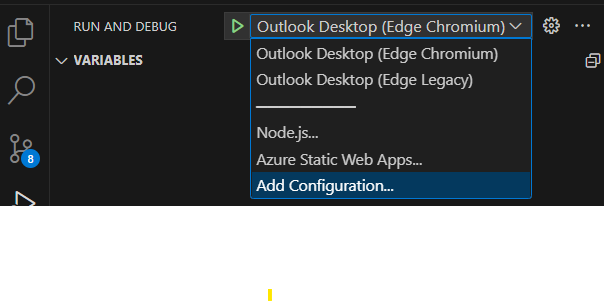

# Outlook add-in with SSO using nested app authentication (preview)

## Summary

This sample shows how to use MSAL.js nested app authentication (NAA) in an Outlook Add-in to access Microsoft Graph APIs for the signed in user. The sample displays the signed in user's name and email. It also inserts the names of files from the user's Microsoft OneDrive account into a new message body.

IMPORTANT: Nested app authentication is currently in preview. To try this feature you need to join the [Microsoft 365 Insider Program](https://insider.microsoft365.com/join) and choose the **Beta Channel**. Don't use NAA in production add-ins. We invite you to try out NAA in test or development environments and welcome feedback on your experience through GitHub (see https://github.com/OfficeDev/office-js/issues).

## Features

- Use MSAL.js NAA to get an access token to call Microsoft Graph APIs.
- Use MSAL.js NAA to get information about the user signed in to Office.

## Applies to

- Outlook on Windows, Mac, and in a browser.

## Prerequisites

- Office connected to a Microsoft 365 subscription (including Office on the web).
- You need to join the [Microsoft 365 Insider Program](https://insider.microsoft365.com/join) to use the NAA preview features. Choose the **Beta Channel** insider level.
- [Node.js](https://nodejs.org/) version 16 or greater.
- [npm](https://docs.npmjs.com/downloading-and-installing-node-js-and-npm) version 8 or greater.

## Build and run the solution

### Create an application registration

1. Go to the [Azure portal - App registrations](https://go.microsoft.com/fwlink/?linkid=2083908) page to register your app.
1. Sign in with the ***admin*** credentials to your Microsoft 365 tenancy. For example, **MyName@contoso.onmicrosoft.com**.
1. Select **New registration**. On the **Register an application** page, set the values as follows.

    - Set **Name** to `Outlook-Add-in-SSO-NAA`.
    - Set **Supported account types** to **Accounts in any organizational directory (Any Microsoft Entra ID tenant - Multitenant) and personal Microsoft accounts (e.g. Skype, Xbox)**.
    - In the **Redirect URI** section, ensure that **Single-page application (SPA)** is selected in the drop down and then set the URI to `brk-multihub://localhost:3000`.
    - Select **Register**.

1. On the **Outlook-Add-in-SSO-NAA** page, copy and save the value for the **Application (client) ID**. You'll use it in the next section.
1. Select the link to modify redirect URIs which should appear as **0 web, 1 spa, 0 public client**.

      

1. In the **Single-page application Redirect URIs** section, select **Add URI**.

      

1. Enter the new URI value `https://localhost:3000/taskpane.html` and select **Save**.

      

**Note**: The `brk-multihub://localhost:3000` redirect is used when running in native hosts like Outlook on Windows or Mac. NAA is required on native hosts. The `https://localhost:3000/taskpane.html` takspane redirect is used when running in a browser where NAA is not used.

For more information on how to register your application, see [Register an application with the Microsoft Identity Platform](https://learn.microsoft.com/graph/auth-register-app-v2).

### Configure the sample

1. Clone or download this repository.
1. From the command line, or a terminal window, go to the root folder of this sample at `/samples/auth/Outlook-Add-in-SSO-NAA`.
1. Open the `src/taskpane/authConfig.ts` file.
1. Replace the placeholder "Enter_the_Application_Id_Here" with the Application ID that you copied.
1. Replace the placeholder "Enter_the_Login_Hint_Here" with your Microsoft 365 user name. For example: **admin@contoso.onmicrosoft.com**.
1. Save the file.

## Run the sample

1. Run the following commands.

`npm install`
`npm run start`

This will start the web server and sideload the add-in to Outlook.

1. In Outlook, compose a new email message.
1. On the ribbon for the message, look for the **Show task pane** button and select it.
1. When the task pane opens, there are two buttons: **Get user data** and **Get user files**.
1. To see the signed in user's name and email, select **Get user data**.
1. To insert the first 10 filenames from the signed in user's Microsoft OneDrive, select **Get user files**.

You will be prompted to consent to the scopes the sample needs when you select the buttons.  

## Debugging steps

You can debug the sample by opening the project in VS Code.

1. Select the **Run and Debug** icon in the **Activity Bar** on the side of VS Code. You can also use the keyboard shortcut **Ctrl+Shift+D**.
1. Select the launch configuration you want from the **Configuration dropdown** in the **Run and Debug** view. For example, **Outlook Desktop (Edge Chromium)**.
1. Start your debug session with **F5**, or **Run > Start Debugging**.

For more information on debugging with VS Code, see [Debugging](https://code.visualstudio.com/Docs/editor/debugging). For more information on debugging Office Add-ins in VS Code, see [Debug Office Add-ins on Windows using Visual Studio Code and Microsoft Edge WebView2 (Chromium-based)](https://learn.microsoft.com/office/dev/add-ins/testing/debug-desktop-using-edge-chromium)

## Key parts of this sample

The `src/taskpane/authConfig.ts` file contains the MSAL code for configuring and using NAA. It contains a class named AccountManager which manages getting user account and token information.

- The `initialize` function is called from Office.onReady to configure and intitialize MSAL to use NAA.
- The `ssoGetToken` function gets an access token for the signed in user to call Microsoft Graph APIs.
- The `ssoGetUserIdentity` function gets the account information of the signed in user. This can be used to get user details such as name and email.

The `src/taskpane/taskpane.ts` file contains code that runs when the user chooses buttons in the task pane. They use the AccountManager class to get tokens or user information depending on which button is chosen.

The `src/taskpane/msgraph-helper.ts` file contains code to construct and make a REST call to the Microsoft Graph API.

## Questions and feedback

- Did you experience any problems with the sample? [Create an issue](https://github.com/OfficeDev/Office-Add-in-samples/issues/new/choose) and we'll help you out.
- We'd love to get your feedback about this sample. Go to our [Office samples survey](https://aka.ms/OfficeSamplesSurvey) to give feedback and suggest improvements.
- For general questions about developing Office Add-ins, go to [Microsoft Q&A](https://learn.microsoft.com/answers/topics/office-js-dev.html) using the office-js-dev tag.

## Copyright

Copyright (c) 2024 Microsoft Corporation. All rights reserved.

This project has adopted the [Microsoft Open Source Code of Conduct](https://opensource.microsoft.com/codeofconduct/). For more information, see the [Code of Conduct FAQ](https://opensource.microsoft.com/codeofconduct/faq/) or contact [opencode@microsoft.com](mailto:opencode@microsoft.com) with any additional questions or comments.

