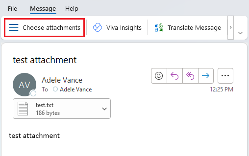
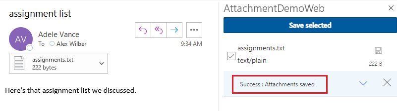
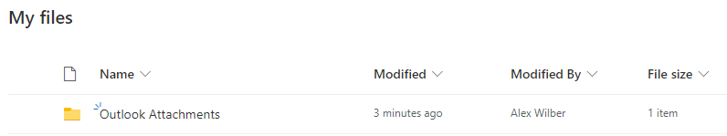

# Single Sign-on (SSO) sample Outlook add-in

**Applies to:** Outlook on Windows | Outlook on Mac | Outlook on the web

## Summary

The sample implements an Outlook add-in that uses Office's SSO feature to give the add-in access to Microsoft Graph data. Specifically, it enables the user to save all attachments to their OneDrive. It also shows how to add custom buttons to the Outlook ribbon. The sample illustrates the following concepts:

- [Use the SSO access token](https://docs.microsoft.com/outlook/add-ins/authenticate-a-user-with-an-sso-token) to call the Microsoft Graph API without prompting the user
- If the SSO token is not available, authenticate to the user's OneDrive using the OAuth2 implicit flow via the [office-js-helpers library](https://github.com/OfficeDev/office-js-helpers)
- Use the [Microsoft Graph API](https://developer.microsoft.com/graph/docs/api-reference/v1.0/resources/onedrive) to create files in OneDrive
- Add [add-in command buttons](https://docs.microsoft.com/outlook/add-ins/add-in-commands-for-outlook) to the Outlook ribbon when reading mail, including a UI-less button and a button that opens a task pane
- Implement a WebAPI to [retrieve attachments via a callback token and the Outlook REST API](https://docs.microsoft.com/office/dev/add-ins/outlook/get-attachments-of-an-outlook-item)

## Register the add-in with Azure AD v2.0 endpoint

1. Navigate to the [Azure portal - App registrations](https://go.microsoft.com/fwlink/?linkid=2083908) page to register your app.

1. Sign in with the ***admin*** credentials to your Microsoft 365 tenancy. For example, MyName@contoso.onmicrosoft.com.

1. Select **New registration**. On the **Register an application** page, set the values as follows:

    * Set **Name** to `AttachmentsDemo`.
    * Set **Supported account types** to **Accounts in any organizational directory (Any Azure AD directory - Multitenant) and personal Microsoft accounts (e.g. Skype, Xbox)**.
    * In the **Redirect URI** section, ensure that **Web** is selected in the dropdown and then set the URI to `https://localhost:44355/AzureADAuth/Authorize`.
    
    **Note:** The port number used for the redirect URI (`44355`) must match the port your web server is running on. When you open the Visual Studio solution in later steps, you can find the web server's port number by selecting the **AttachmentDemoWeb** project in **Solution Explorer**, then looking at the **SSL URL** setting in the properties window.

1. Choose **Register**.

1. On the **AttachmentsDemo** page, copy and save the **Application (client) ID**. You'll use it in later procedures.

1. Under **Manage**, select **Authentication**. Under **Implicit grant**, check the **Access tokens** checkbox, then select **Save**.

1. Under **Manage**, select **Certificates & secrets**. Select the **New client secret** button. Enter a value for **Description**, then select an appropriate option for **Expires**, and choose **Add**.

1. Copy and save the client secret value. You'll use it in later procedures.

1. Under **Manage**, select **Expose an API**.

1. Choose the **Set** link that appears after the text "Application ID URI".

1. In the **Set the App ID URI** panel, change the default value by inserting your host and port number before the GUID listed there. For example, if the default value is `api://05adb30e-50fa-4ae2-9cec-eab2cd6095b0`, and your app is running on `localhost:44355`, the value is `api://localhost:44355/05adb30e-50fa-4ae2-9cec-eab2cd6095b0`.

1. Choose **Save**.

1. Select the **Add a scope** button. In the panel that opens, enter `access_as_user` as the **Scope name**.

1. Set **Who can consent?** to **Admins and users**.

1. Fill in the fields for configuring the admin and user consent prompts with values that are appropriate for the `access_as_user` scope which enables the Office client application to use your add-in's web APIs with the same rights as the current user. Suggestions:

    - **Admin consent display name**: Office can act as the user
    - **Admin consent description**: Enable Office to call the add-in's web APIs with the same rights as the current user
    - **User consent display name**: Office can act as you
    - **User consent description**: Enable Office to call the add-in's web APIs with the same rights that you have

1. Ensure that **State** is set to **Enabled**.

1. Select **Add scope** .

1. In the **Authorized client applications** section, identify the applications that you want to authorize to your add-in's web application. Each of the following IDs needs to be pre-authorized:

    - `d3590ed6-52b3-4102-aeff-aad2292ab01c` (Microsoft Office)
    - `ea5a67f6-b6f3-4338-b240-c655ddc3cc8e` (Microsoft Office)
    - `57fb890c-0dab-4253-a5e0-7188c88b2bb4` (Office on the web)
    - `08e18876-6177-487e-b8b5-cf950c1e598c` (Office on the web)
    - `bc59ab01-8403-45c6-8796-ac3ef710b3e3` (Outlook on the web)

    For each ID, take these steps:

    a. Select **Add a client application** button, and in the panel that opens, set the **Client ID** to the respective GUID and check the box for `api://localhost:44355/$App ID GUID$/access_as_user`.

    b. Select **Add application**.

1. Under **Manage**, select **API permissions** and then select **Add a permission**. On the panel that opens, choose **Microsoft Graph** and then choose **Delegated permissions**.

1. Use the **Select permissions** search box to search the following permissions:

    * Files.ReadWrite
    * Mail.Read
    * offline_access
    * openid
    * profile

    **Note:** The `User.Read` permission may already be listed by default. It's a good practice not to ask for permissions that are not needed, so we recommend that you uncheck the box for this permission if your add-in does not actually need it.

1. Select the check box for each permission as it appears. After selecting the permissions, select the **Add permissions** button at the bottom of the panel.

1. On the same page, choose the **Grant admin consent for [tenant name]** button, and then select **Yes** for the confirmation that appears.

    **Note:** After choosing **Grant admin consent for [tenant name]**, you may see a banner message asking you to try again in a few minutes so that the consent prompt can be constructed. If so, you can start work on the next section, ***but don't forget to come back to the portal and press this button***!

## Configure the Sample

Before you run the sample, you'll need to do a few things to make it work properly.

1. In Visual Studio, open the **AttachmentDemo.sln** solution file for this sample.

1. In the **Solution Explorer**, open **AttachmentDemo > AttachmentDemoManifest > AttachmentDemo.xml**.
1. Find the `<WebApplicationInfo>` section near the bottom of the manifest. Then replace the `[Enter the Client Id (Application ID obtained from the Azure portal)]` value, in both places where it appears, with the application ID you generated as part of the app registration process.

    **Note:** Make sure that the port number in the `Resource` element matches the port used by your project. It should also match the port you used when registering the application.

1. In the **Solution Explorer**, open **AttachmentDemoWeb > Web.config**.
1. Replace the `[Enter the Client Id (Application ID obtained from the Azure portal)]` value in both places where it appears with the application ID you generated as part of the app registration process.
1. Replace the `[Copy the client secret added to the app from the Azure portal]` value with the client secret you generated as part of the app registration process.

## Provide user consent to the app

If you want to try the add-in using a different tenant than the one where you registered the app, you need to do this step.

You have two choices for providing consent: 
- All users. Use an administrator account and consent once for all users in your Office 365 tenant
- Single user. Use any account to consent for just that user

### Provide admin consent for all users

If you have access to a tenant administrator account, this method allows you to provide consent for all users in your organization, which can be convenient if you have multiple developers that need to develop and test your add-in.

1. Browse to `https://login.microsoftonline.com/common/adminconsent?client_id={application_ID}&state=12345`, where `{application_ID}` is the application ID shown in your app registration.
1. Sign in with your administrator account.
1. Review the permissions and click **Accept**.

The browser will attempt to redirect back to your app, which may not be running. You might see a "this site cannot be reached" error after clicking **Accept**. This is OK, the consent was still recorded.

### Provide consent for a single user

If you don't have access to a tenant administrator account, or you just want to limit consent to a few users, this method allows you to provide consent for a single user.

1. Browse to `https://login.microsoftonline.com/common/oauth2/authorize?client_id={application_ID}&state=12345&response_type=code`, where `{application_ID}` is the application ID shown in your app registration.
1. Sign in with your account.
1. Review the permissions and click **Accept**.

The browser will attempt to redirect back to your app, which may not be running. You might see a "this site cannot be reached" error after clicking **Accept**. This is OK, the consent was still recorded.

## Run the Sample

1. Select the **AttachmentDemo** project in **Solution Explorer**, then choose the **Start Action** value you want (under **Add-in** in the properties window). Choose any installed browser to launch Outlook on the web, or you can choose **Office Desktop Client** to launch Outlook on Windows. If you choose **Office Desktop Client**, be sure to configure Outlook to connect to the Office or Outlook.com user you want to install the add-in for.

1. Press **F5** to build and debug the project. You may be prompted to trust the developer certificate.

1. You should be prompted for a user account and password. Provide a user in your Office tenant, or an Outlook.com account. The add-in will be installed for that user, and either Outlook on the web or Outlook on Windows will open.

1. Select any message, **that has one or more attachments**.

1. Open the task pane:
    
    * If you're in Outlook on the web: Select the **...** (**More actions**) drop down menu, and then choose **AttachmentDemoWeb**.<br>

    * If you're in Outlook on Windows or Mac: On the **Home** tab, select **Choose attachments**. Note that if the Outlook app window is too small, that **Choose attachments** will instead be located on the **Home** tab's **...** (**More commands**) button.<br>

    
1. In the **AttachmentDemoWeb** task pane that opens, select the attachments you want to save.

1. Choose **Save selected**

1. You should see a success message in the task pane.<br>


1. Open OneDrive and you should see the attachments saved in a new folder named **Outlook Attachments**.<br>


## Testing the fallback dialog

It's recommended to test all paths when working with SSO. In some scenarios, you'll have to use the fallback dialog by modifying the code as follows:

1. In Visual Studio, open the **MessageRead.js** file.
1. Add the following function to the file.
    
    ```javascript
    function MockSSOError(code) {
        this.code = code;
    } 
    ```
    
1. Find the `saveAttachments` function.
1. Modify the code to throw a fictitious error:
    
    ```javascript
    async function saveAttachments(attachmentIds, options) {
        //Set default SSO options if they are not provided
        if (options === undefined) options = { allowSignInPrompt: true, allowConsentPrompt: true, forMSGraphAccess: true };
        
        showSpinner();

        // Attempt to get an SSO token
        try {
            throw new MockSSOError("13003");
            let bootstrapToken = await OfficeRuntime.auth.getAccessToken(options);
    ```

The line of code that calls `MockSSOError` will throw an error that will be passed to `handleClientSideErrors` in the catch block. This will force `handleClientSideErrors` to call `dialogFallback` and you can test that the fallback dialog is working correctly.

## Troubleshoot manifest issues

Visual Studio may show a warning or error about the `WebApplicationInfo` element being invalid. The error may not show up until you try to build the solution. As of this writing, Visual Studio has not updated the schema files to include the `WebApplicationInfo` element. To work around this problem, use the updated schema file in this repository: [MailAppVersionOverridesV1_1.xsd](manifest-schema-fix/MailAppVersionOverridesV1_1.xsd).

1. On your development machine, locate the existing MailAppVersionOverridesV1_1.xsd. This should be located in your Visual Studio installation directory under `./Xml/Schemas/{lcid}`. For example, on a typical installation of VS 2017 32-bit on an English (US) system, the full path would be `C:\Program Files (x86)\Microsoft Visual Studio\2017\Enterprise\Xml\Schemas\1033`.
1. Rename the existing file to `MailAppVersionOverridesV1_1.old`.
1. Move the version of the file from this repository into the folder.

## Copyright

Copyright (c) 2021 Microsoft Corporation. All rights reserved.

This project has adopted the [Microsoft Open Source Code of Conduct](https://opensource.microsoft.com/codeofconduct/). For more information, see the [Code of Conduct FAQ](https://opensource.microsoft.com/codeofconduct/faq/) or contact [opencode@microsoft.com](mailto:opencode@microsoft.com) with any additional questions or comments.


