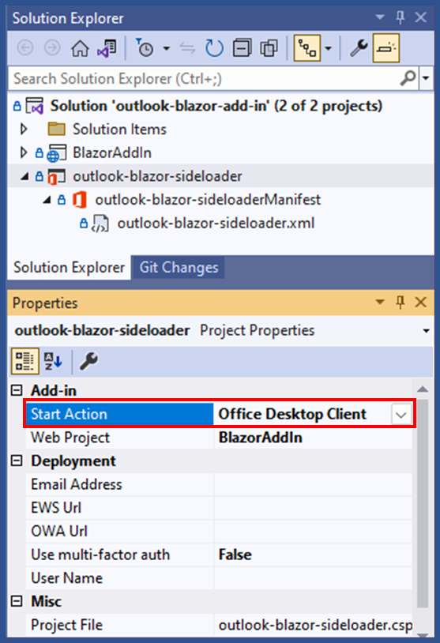
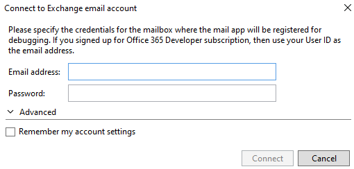

# Create a Blazor Webassembly Outlook add-in

This sample shows how to build an Outlook add-in using .NET Blazor technologies. Blazor Webassembly allows you to build Office Add-ins using .NET, C#, and JavaScript to interact with the Office JavaScript API. The add-in uses JavaScript to work with the document and Office JS APIs, but you build the user interface and all other non-Office interactions in C# and .NET Core Blazor technologies.

Working with Blazor Webassembly in the framework of Office, you can:
- Build cross-platform Office Add-ins using Blazor, C#, and JavaScript Interop
- Initialize the Office JavaScript API library in Blazor context
- Interact with Outlook to work with email and calendar items

## Applies to

- Outlook on the web, Windows, and Mac.

## Prerequisites

- Microsoft 365 - Get a [free developer sandbox](https://developer.microsoft.com/microsoft-365/dev-program#Subscription) that provides a renewable 90-day Microsoft 365 E5 developer subscription.

## Run the sample

1. Download or clone the [Office Add-ins samples repository](https://github.com/OfficeDev/Office-Add-in-samples).
1. Open Visual Studio 2022 and open the **Office-Add-in-samples\Samples\blazor-add-in\outlook-blazor-add-in\outlook-blazor-add-in.sln** solution.
1. In **Solution Explorer** select the **outlook-blazor-sideloader** project. Then display the project properties (F4).
1. In the **Properties** window, set the **Start Action** to **Office Desktop Client**.
   
1. In the **Properties** window, set the **Email Address** to the email address of the account you want to use with this sample.
   In case this was not set before running you might also see this dialog:
   
1. To start the solution, choose **Debug** > **Start Debugging** or press **F5**.
1. When Outlook opens, choose **Home** > **Show Taskpane**.

Next, try out the controls. The task pane will display information about the currently selected email item.

## Understand an Office Add-in in Blazor Context

An Office Add-in is a web application that extends Office with additional functionality for the user. For example, Outlook add-ins can add ribbon buttons, and provide a task pane during compose or read modes. Because an Office Add-in is a web application, you must provide a web server to host the files.
Building the Office Add-in as a Blazor Webassembly allows you to build a .NET Core compliant website that interacts with the Office JS APIs. If your background is with VBA, VSTO, or COM add-in development, you may find that building Office Add-ins using Blazor Webassembly is a familiar development technique.

## Key parts of this sample

This sample uses a Blazor Webassembly file that runs cross-platform in various browsers supporting WASM (Webassembly). The Blazor WASM App demonstrates some basic Outlook functions to read attachments in email items.

The purpose of this sample is to show you how to build and interact with the Blazor, C# and JavaScript Interop options. If you're looking for more examples of interacting with Outlook and Office JS APIs, see [Script Lab](https://aka.ms/getscriptlab).

### Blazor pages

The **Pages** folder contains the Blazor pages, such as **Index.razor**. Each **.razor** page also contain two code-behind pages, for example, named **Index.razor.cs** and **Index.razor.js**. The C# file first establishes an interop connection with the JavaScript file.

```csharp
protected override async Task OnAfterRenderAsync(bool firstRender)
{
  if (firstRender)
  {
    JSModule = await JSRuntime.InvokeAsync<IJSObjectReference>("import", "./Pages/Index.razor.js");
  }
}
```

For any events that need to interact with the Outlook mail item, the C# file calls through interop to the JavaScript file.

```csharp
private async Task<MailRead?> GetEmailData()
{
    MailRead? mailreaditem = await JSModule.InvokeAsync<MailRead>("getEmailData");

    Console.WriteLine("Subject C#: ");
    Console.WriteLine(mailreaditem?.Subject);

    return mailreaditem;
}
```

The JavaScript runs the code to interact with the item and returns (see full code in the sample).

```javascript
export async function getEmailData() {

    try {
        console.log(`Reading mailbox item`);
        const item = Office.context.mailbox.item;
        ...
    } catch (err) {
        console.error(`Index.razor.js(getEmailData) Catch Exception: ${err}`);
        subject = `${err}`;
        return { Subject: subject };
    }
}
```

The fundamental pattern includes the following steps.

1. Call **JSRuntime.InvokeAsync** to set up the interop between C# and JavaScript.
1. Use **JSModule.InvokeVoidAsync/JSModule.InvokeAsync** to call JavaScript functions from your C# code.
1. Call Office JS APIs to interact with the Outlook items from JavaScript code.

## Debugging

This sample is configured to support debugging both JavaScript and C# files. New Blazor projects need the following file updates to support C# debugging.

1. In the **launchSettings.json** file of the web project, make sure all instances of `launchBrowser` are set to `false`.
1. In the **<projectName>.csproj.user** file of the add-in project, add the `<BlazorAppUrl>` and `<InspectUri>` elements as shown in the following example XML.

**Note:** The port number in the following XML is 7126. You must change it to the port number specified in the **launchSettings.json** file for your web project.

```xml
<?xml version="1.0" encoding="utf-8"?>
<Project ToolsVersion="Current" xmlns="http://schemas.microsoft.com/developer/msbuild/2003">
  <PropertyGroup>
    <BlazorAppUrl>https://localhost:7126/</BlazorAppUrl>
    <InspectUri>{wsProtocol}://{url.hostname}:{url.port}/_framework/debug/ws-proxy?browser={browserInspectUri}</InspectUri>
  </PropertyGroup>
</Project>
```

## Questions and feedback

- Did you experience any problems with the sample? [Create an issue](https://github.com/OfficeDev/Office-Add-in-samples/issues/new/choose) and we'll help you out.
- We'd love to get your feedback about this sample. Go to our [Office samples survey](https://aka.ms/OfficeSamplesSurvey) to give feedback and suggest improvements.
- For general questions about developing Office Add-ins, go to [Microsoft Q&A](https://learn.microsoft.com/answers/topics/office-js-dev.html) using the office-js-dev tag.

## Solution

| Solution                                | Authors                                                                 |
| --------------------------------------- | ----------------------------------------------------------------------- |
| Create a Blazor Webassembly Outlook add-in | [Maarten van Stam](https://mvp.microsoft.com/en-us/PublicProfile/33535) |
|  | [Eric Legault](https://www.ericlegaultconsulting.com) |

## Version history

| Version | Date            | Comments           |
| ------- | --------------- | ------------------ |
| 1.0     | August 25, 2022 | Initial release    |
| 2.0     | February 1, 2024     | Upgraded to .NET 8 |
## Copyright

Copyright(c) Maarten van Stam and Eric Legault. All rights reserved. Licensed under the MIT License.

This project has adopted the [Microsoft Open Source Code of Conduct](https://opensource.microsoft.com/codeofconduct/). For more information, see the [Code of Conduct FAQ](https://opensource.microsoft.com/codeofconduct/faq/) or contact [opencode@microsoft.com](mailto:opencode@microsoft.com) with any additional questions or comments.

**Note**: The index.html file contains an image URL that tracks diagnostic data for this sample add-in. Please remove the image tag if you reuse this sample in your own code project.


