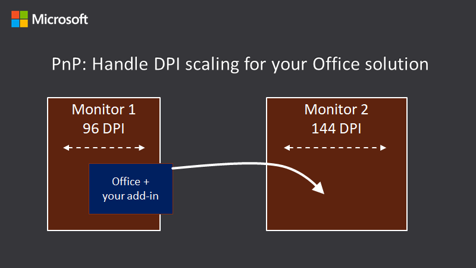

# Dynamic DPI code samples

Many computer and display configurations now support high DPI (dots-per-inch) resolutions, and can connect multiple monitors with different sizes and pixel densities. This requires applications to adjust when the user moves the app to a monitor with a different DPI, or changes the zoom level. Applications that don’t support DPI scaling might look fine on low DPI monitors, but will look stretched and blurry when shown on a high DPI monitor.

The code samples included here will help you with handling DPI changes in your code for VSTO and COM Add-in projects. More information about the code samples and handling DPI can be found in the accompnying article: [Handle high DPI and DPI scaling in your Office solution](https://docs.microsoft.com/office/client-developer/ddpi/handle-high-dpi-and-dpi-scaling-in-your-office-solution)

## Applies to

- VSTO Add-ins
- Custom task panes
- COM Add-ins
- ActiveX controls

## Prerequisites

- Visual Studio 2017 or later with the following workloads
    - .NET desktop development
    - Desktop development with C++
    - Office/SharePoint development
    - latest version of Windows SDK
    > **Note:** Some samples may not compile because they might target an older Windows SDK. If this happens you can right-click the solution and choose **Retarget solution**. Then choose the version of the Windows SDK you have installed.
- An Office 365 account which you can get by joining the [Office 365 Developer Program](https://aka.ms/devprogramsignup) that includes a free 1 year subscription to Office 365.
> **Note:** Many of the samples use the **Developer** tab in Microsoft Excel. If you haven't enabled the **Developer** tab, follow these instructions in the article [Show the Developer tab](https://support.office.com/article/show-the-developer-tab-e1192344-5e56-4d45-931b-e5fd9bea2d45)

## Solution

Solution | Author(s)
---------|----------
Dynamic DPI samples | Shawn McDowell (Microsoft)

## Version history

Version  | Date | Comments
---------| -----| --------
1.0  | September 30 2019 | Initial release

## Disclaimer

**THIS CODE IS PROVIDED *AS IS* WITHOUT WARRANTY OF ANY KIND, EITHER EXPRESS OR IMPLIED, INCLUDING ANY IMPLIED WARRANTIES OF FITNESS FOR A PARTICULAR PURPOSE, MERCHANTABILITY, OR NON-INFRINGEMENT.**

----------

## COMAddinCPP

This sample shows how to handle DPI changes in a COM Add-in using C++.

### To run the sample

1. Clone or download this repo.
2. Run Visual Studio 2017 (or later) as administrator.
3. Open the **COMAddinCPP.sln** file.
4. On the menu bar choose **Build** > **Build Solution**.
    > **Note:** Set your build target to **Win32** or **x64** to match the version of Microsoft Excel you will run (32-bit or 64-bit).
5. Run Excel.
6. On the **Developer** tab, choose **COM Add-ins**.
7. Ensure **COM Add-in C++ with Custom TaskPane** is enabled (checked). Then choose **OK**.

A custom task pane will appear titled **COM Add-in C++**. It will show rectangle coordinates based on the current DPI. You can drag Excel to a monitor with a different DPI to see the coordinates update.

### DPI code

You can find more info about the DPI code in the ATLControl.cpp file.

## VSTO SharedAddin

This shows how to handle DPI changes in a VSTO Add-in. It contains folders for each Office host listed below:
- VSTO Excel Addin
- VSTO OutlookAddIn
- VSTO PowerPointAddIn
- VSTO VisioAddIn
- VSTO WordAddIn

### To run the sample

1. Clone or download this repo.
2. Run Visual Studio 2017 (or later) as administrator.
3. Open the **VSTOSharedAddin.sln** file.

You'll need to create a test certificate for each project. To do so:
1. Right-click on a project, such as **OutlookAddIn1** and choose **Properties**.
2. Choose the **Signing** category in the properties.
3. Choose **Sign the ClickOnce manifests** and then chose **Create Test Certificate**.
4. In the **Create Test Certificate** dialog, enter and confirm a password. Then choose **OK**.
> **Note:** You'll need to create a test certificate for each host project in the solution.

Now you can build and run the solution
1. On the menu bar choose **Build** > **Build Solution**.
    > **Note:** Set your build target to **Win32** or **x64** to match the version of Microsoft Excel you will run (32-bit or 64-bit).
2. Set one of the projects as the startup project. For example, right-click the **ExcelAddin1** project and choose **Set as StartUp Project**.
3. Choose **Start** (or press F5). The debugger will launch Excel and load the add-in.

The task pane for the VSTO Add-in will appear. You can drag Excel to a monitor with a different DPI to see displayed information change. You can explore different scnearios by changing the **Template** and **Context** fields. Then choose **Open Top-level Form** and a top-level form will open using the settings you specified. You can drag it to monitors with different DPI settings to see how it handles the DPI changes.

### DPI code

You can find more info about the DPI code in the DPIContextBlock.cs and DPIHelper.cs files.

## MFCApplicationDPIAware

This is an ActiveX control created from the MFC template that is dynamic DPI aware.

### To run the sample

1. Clone or download this repo.
2. Run Visual Studio 2017 (or later) as administrator.
3. Open the **MFCApplication1.sln** file.
4. On the menu bar choose **Build** > **Build Solution**.
    > **Note:** Set your build target to **Win32** or **x64** to match the version of Microsoft Excel you will run (32-bit or 64-bit).
5. Run Excel.
6. On the **Developer** > **Controls** tab, choose **Insert**. Then choose the **More Controls** icon which is in the **ActiveX Controls** section.
7. Choose **MFCActiveX Control**. Then choose **OK**.
5. Insert the control on the workbook by drawing a rectangle representing the size it should be.
6. You can right-click on the control an dchoose **MFCActiveX Control Object** > **Properties**.
7. On the **MFCActiveX Control Properties** box, enable the **Utilize Dynamic DPI Code** checkbox.

### DPI code

You can find more info about the DPI code in the MFCApplication1.cpp file.

## Window Based ActiveX

This shows how to handle DPI changes in a window-based ActiveX control.

### To run the sample

1. Clone or download this repo.
2. Run Visual Studio 2017 (or later) as administrator.
3. Open the **MFCActiveX.sln** file.
4. On the menu bar choose **Build** > **Build Solution**.
    > **Note:** Set your build target to **Win32** or **x64** to match the version of Microsoft Excel you will run (32-bit or 64-bit).
5. Run Excel.
6. On the **Developer** > **Controls** tab, choose **Insert**. Then choose the **More Controls** icon which is in the **ActiveX Controls** section.
7. Choose **MFCActiveX Control**. Then choose **OK**.
5. Insert the control on the workbook by drawing a rectangle representing the size it should be.
6. Choose the Design Mode button to turn off design mode.

The control will display a pie chart and some other information. You can drag Excel to a monitor with different DPI settings to see how the control redraws.

### DPI code

This is an MFC window-based ActiveX control that supports dynamic DPI on the WM_SIZE event.

You can find more info about the DPI code in the MFCActiveXCtrl.cpp file.

## Windowles ActiveX

This shows how to handle DPI changes in a windowless ActiveX control.

### To run the sample

1. Clone or download this repo.
2. Run Visual Studio 2017 (or later) as administrator.
3. Open the **ODActiveX.sln** file.
4. On the menu bar choose **Build** > **Build Solution**.
    > **Note:** Set your build target to **Win32** or **x64** to match the version of Microsoft Excel you will run (32-bit or 64-bit).
5. Run Excel.
6. On the **Developer** > **Controls** tab, choose **Insert**. Then choose the **More Controls** icon which is in the **ActiveX Controls** section.
7. Choose **ODActiveX Control**. Then choose **OK**.
5. Insert the control on the workbook by drawing a rectangle representing the size it should be.
6. Choose the Design Mode button to turn off design mode.

The control will display some DPI information. You can drag Excel to a monitor with different DPI settings to see how the control redraws.

### DPI code

This is an MFC Windowless ActiveX control that supports dynamic DPI on WM_PAINT. It gets the HWND of the host window from HDC. You can find more info about the DPI code in the ODActiveXCtrl.cpp file.

