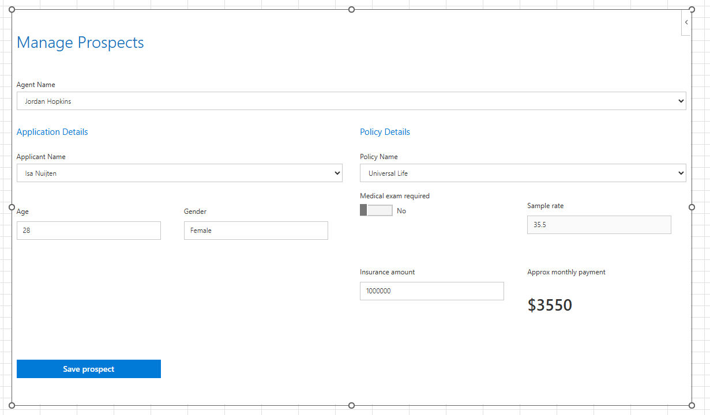

# Excel content add-in: Humongous Insurance

## Summary

This sample is a content add-in for the fictional Humongous Insurance company. shows how to use the Office JavaScript APIs to create an Excel add-in that exists in the grid, instead of as a task pane or ribbon button. Build upon this sample to embed rich, interactive objects into Office documents.

## Features

The Humongous Insurance add-in loads and embeds the content add-in in the grid. This control panel can be resized and moved as needed. The dropdown menus are populated from tables in the workbook. The **Save Prospect** button saves the user's input to the workbook.

The sample also populates the workbook with data when it loads.

## Applies to

- Excel on Windows
- Excel on Mac
- Excel on the web

## Prerequisites

- Excel on Windows with a minimum build of 16.0.14626.10000, or Excel on Mac with a minimum build of 16.55.21102600, or Excel on the web.
- [Node.js](https://nodejs.org/) version 16 or greater.
- [npm](https://docs.npmjs.com/downloading-and-installing-node-js-and-npm) version 8 or greater.

## Solution

Solution | Author(s)
---------|----------
Embed a content add-in in the Excel grid | Microsoft

## Version history

Version  | Date | Comments
---------| -----| --------
1.0 | 7-15-2025 | Ported this add-in to the main samples repo

----------

## Run the sample

Take the following steps to run this sample and set up this add-in.

1. Clone or download this repo.
1. Go to the **Samples/excel-content-add-in** folder via the command line.
1. Run `npm install` to set up the add-in dependencies.
1. Run `npm start`. This command opens Excel, sideloads the add-in in Excel, and embeds the content add-in in the grid.
1. Resize the content add-in as needed.
1. Use the dropdown menus and the **Save prospect** button to add new insurance client prospects.

Note: To sideload this add-in sample in Excel on the web, see [Sideload Office Add-ins to Office on the web](https://learn.microsoft.com/office/dev/add-ins/testing/sideload-office-add-ins-for-testing).

## See also

- [Content Office Add-ins](https://learn.microsoft.com/office/dev/add-ins/design/content-add-ins)

## Questions and feedback

- Did you experience any problems with the sample? [Create an issue](https://github.com/OfficeDev/Office-Add-in-samples/issues/new/choose) and we'll help you out.
- We'd love to get your feedback about this sample. Go to our [Office samples survey](https://aka.ms/OfficeSamplesSurvey) to give feedback and suggest improvements.
- For general questions about developing Office Add-ins, go to [Microsoft Q&A](https://learn.microsoft.com/answers/topics/office-js-dev.html) using the office-js-dev tag.

## Copyright

Copyright (c) 2016 Microsoft Corporation. All rights reserved.

This project has adopted the [Microsoft Open Source Code of Conduct](https://opensource.microsoft.com/codeofconduct/). For more information, see the [Code of Conduct FAQ](https://opensource.microsoft.com/codeofconduct/faq/) or contact [opencode@microsoft.com](mailto:opencode@microsoft.com) with any additional questions or comments.

