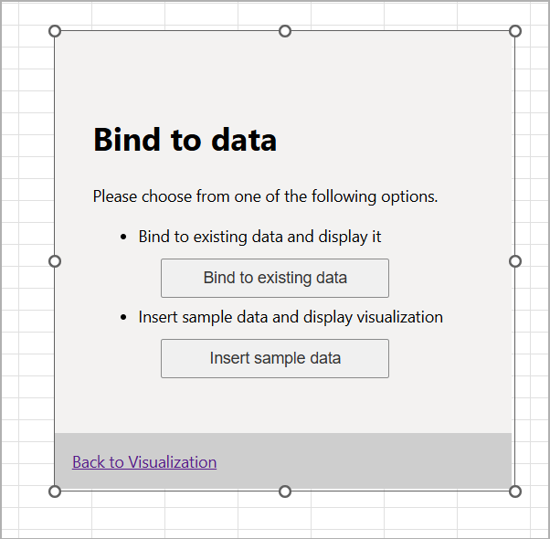

# Create an Excel data-visualization content add-in

## Summary

Learn how to build an Office content add-in that includes data visualization in an Excel workbook.



## Applies to

- Excel on Windows, Mac, and in a browser.

## Prerequisites

- Microsoft 365 - You can get a free developer sandbox by joining the [Microsoft 365 Developer Program](https://developer.microsoft.com/microsoft-365/dev-program#Subscription).

### Visualization of selected data

If there's existing data on the worksheet, the user can use that data by selecting the **Bind to existing data** button on the content add-in's "Bind to data" screen, which calls the `bindToExistingData` function. This function calls `Office.context.document.bindings.addFromPromptAsync()` to prompt user for the data area and associate that data with a table binding. The content add-in then redirects from the "Bind to data" screen to display the data on the add-in's home screen.

```javascript
// Binds the visualization to existing data.
function bindToExistingData() {
    Office.context.document.bindings.addFromPromptAsync(
        Office.BindingType.Table,
        { id: shared.bindingID, sampleData: visualization.generateSampleData() },
        function (result) {
            if (result.status === Office.AsyncResultStatus.Succeeded) {
                window.location.href = 'home.html';
            } else {
                shared.showNotification(result.error.name, result.error.message);
            }
        }
    );
}
```

The content add-in displays a second button, **Insert sample data**, if the APIs used by its click handler are supported by the user's Excel client version. When the user chooses the **Insert sample data** button, the `getDataFromSelection()` function is called. This function calls `Office.context.document.setSelectedDataAsync()` to set generated sample data to a table binding. The content add-in then redirects from the "Bind to data" screen to display the data on the add-in's home screen.

```javascript
// Inserts sample data into the current selection (if supported).
function insertSampleData() {
    Office.context.document.setSelectedDataAsync(visualization.generateSampleData(),
        function (result) {
            if (result.status === Office.AsyncResultStatus.Succeeded) {
                Office.context.document.bindings.addFromSelectionAsync(
                    Office.BindingType.Table, { id: shared.bindingID },
                    function (result) {
                        if (result.status === Office.AsyncResultStatus.Succeeded) {
                            window.location.href = 'home.html';
                        } else {
                            shared.showNotification(result.error.name, result.error.message);
                        }
                    }
                );
            } else {
                shared.showNotification(result.error.name, result.error.message);
            }
        }
    );
}
```

For more information, see [Content add-ins](https://learn.microsoft.com/office/dev/add-ins/design/content-add-ins?tabs=jsonmanifest).


## Run the sample

### Run the sample with GitHub as the host

An Office Add-in requires you to configure a web server to provide all the resources, such as HTML, image, and JavaScript files. The sample is configured so that the files are hosted directly from this GitHub repo, so all you need to do is build the manifest and package, and then sideload the package.

1. Clone or download this sample to a folder on your computer. Then in a command prompt, bash shell, or **TERMINAL** in Visual Studio Code, navigate to the root of the sample folder.
1. Run the command `npm install`.
1. Run the command `npm run build`.
1. Run the command `npm run start:prod`.

   After a few seconds, desktop Excel opens, and after a few seconds more, the content add-in appears over the current worksheet displaying a "Bind to data" screen and a **Bind to existing data** button. An **Insert sample data** button may also be displayed.
     - If the content add-in doesn't appear, open the **Add-ins** button in the **Home** tab of the ribbon, then select the name of the content add-in, "Excel Content Add-in".

1. Choose the **Insert sample data** button if available to add data to the worksheet and show the data visualization.
1. Ensure that you have data on the worksheet. If the **Insert sample data** button isn't available, you'll need to manually add data to the sheet.
1. Choose the **Bind to existing data** button to bind to data already on the worksheet and show visualization.

When you're finished working with the add-in, close Excel, and then in the window where you ran the three npm commands, run `npm run stop:prod`.

### Configure a localhost web server and run the sample from localhost

If you prefer to configure a web server and host the add-in's web files from your computer, use the following steps.

1. Clone or download this sample to a folder on your computer. Then in a command prompt, bash shell, or **TERMINAL** in Visual Studio Code, navigate to the root of the sample folder.
1. Run the command `npm install`.
1. Run the command `npm start`.

   - If you've never developed an Office Add-in on this computer before or it has been more than 30 days since you last did, you'll be prompted to delete an old security cert or install a new one. Agree to both prompts.
   - After a few seconds, a **webpack** dev-server window will open and your files will be hosted there on localhost:3000.
   - When the server is successfully running, desktop Excel opens, and after a few seconds more, the content add-in appears over the current worksheet displaying a "Bind to data" screen and a **Bind to existing data** button. An **Insert sample data** button may also be displayed.
     - If the content add-in doesn't appear, open the **Add-ins** button in the **Home** tab of the ribbon, then select the name of the content add-in, "Excel DV Content Add-in".

1. Choose the **Insert sample data** button if available to add data to the worksheet and show the data visualization.
1. Ensure that you have data on the worksheet. If the **Insert sample data** button isn't available, you'll need to manually add data to the sheet.
1. Choose the **Bind to existing data** button to bind to data already on the worksheet and show visualization.

When you're finished working with the add-in, close Excel, and then in the window where you ran the two npm commands, run `npm stop`.

## Questions and feedback

- Did you experience any problems with the sample? [Create an issue](https://github.com/OfficeDev/Office-Add-in-samples/issues/new/choose) and we'll help you out.
- We'd love to get your feedback about this sample. Go to our [Office samples survey](https://aka.ms/OfficeSamplesSurvey) to give feedback and suggest improvements.
- For general questions about developing Office Add-ins, go to [Microsoft Q&A](https://learn.microsoft.com/answers/topics/office-js-dev.html) using the office-js-dev tag.

## Copyright

Copyright (c) Microsoft Corporation. All rights reserved.

This project has adopted the [Microsoft Open Source Code of Conduct](https://opensource.microsoft.com/codeofconduct/). For more information, see the [Code of Conduct FAQ](https://opensource.microsoft.com/codeofconduct/faq/) or contact [opencode@microsoft.com](mailto:opencode@microsoft.com) with any additional questions or comments.

**Note**: The home.html and data-binding.html files contain an image URL that tracks diagnostic data for this sample add-in. Please remove those image tags if you reuse this sample in your own code project.


