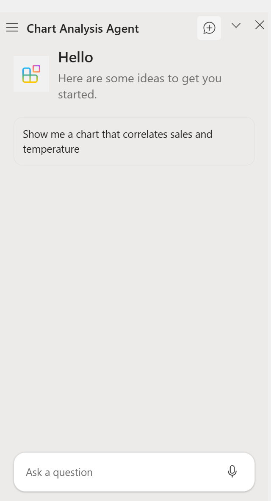

# Create data analysis charts in Excel with a Copilot agent

## Summary

This sample shows how to include a custom Copilot agent in an Excel add-in, and use it to insert charts that plot one column of data against another. 

## Description

The user begins my opening the task pane and using it to insert sample data. Then the user opens Copilot, and opens the **Chart Analysis Agent**. Using natural language, the user asks Copilot to insert into the open worksheet a chart that plots the data of one column in a table against the data of another column. The user specifies the columns, but doesn't have to use the precise column names in the table.


## Applies to

- Excel on Windows
- Excel on the web

## Prerequisites

- Office connected to a Microsoft 365 subscription (including Office on the web).
- A Teams subscription, if it is not included in your Microsoft 365 subscription.
- [Node.js](https://nodejs.org/) version 16 or greater.
- [npm](https://docs.npmjs.com/downloading-and-installing-node-js-and-npm) version 8 or greater.
- Visual Studio Code
- Microsoft 365 Agents Toolkit extension for Visual Studio Code

## Solution

| Solution | Authors |
|----------|-----------|
| How to insert charts with natural language agents | Microsoft |

## Version history

| Version  | Date | Comments |
|----------|------|----------|
| 1.0 | 05-16-2025 | Initial release |

## Install the sample

1. Clone or download this repo.

1. Go to the **Samples\excel-copilot-agent** folder and open it in Visual Studio Code.

1. In command prompt, bash shell, or **TERMINAL** in Visual Studio Code, navigate to the **Samples\excel-copilot-agent** folder and run `npm install`.

1. Open **Microsoft 365 Agents Toolkit** from the **Activity Bar** in Visual Studio Code.

1. In the **ACCOUNTS** pane, ensure that support is enabled for both Copilot and uploading custom apps.

   

## Sideload the sample and start the server

1. In the **LIFECYCLE** pane, select **Provision**. This sideloads the add-in to Microsoft 365, including Excel.

1. In a command prompt, bash shell, or **TERMINAL** in Visual Studio Code at the root of the project, run `npm run dev-server` to start the server on localhost. 

   **Note**: If you are prompted to delete an old certificate and/or to install a new one, agree to both prompts.

   Wait until a line that is similar to the following appears at the bottom of the server window before continuing.

   ```console
   webpack 5.99.8 compiled successfully in 102 ms
   ```

## Try it out

1. The first step in testing depends on the platform.

    - To test in Office on Windows, open Excel, and then open (or create) a workbook.
    - To test in Office on the web, in a browser, navigate to `https://excel.cloud.microsoft`, and then open (or create) a workbook.

1. Wait until the add-in has loaded. This may take as much as two minutes. The **Show Task Pane** button should appear on the **Home** ribbon automatically. If it doesn't, you need to manually activate the add-in: Select the **Add-ins** button on the **Home** ribbon, and then in the flyout that opens, select the **Chart Analysis** add-in. 

1. On the **Home** tab and choose the **Show Task Pane** button in the ribbon to open it.

   

1. Select the **Initialize data** button on the task pane to insert a table of sample data into the workbook. Because this table gets focus, the **Table Design** ribbon opens. 

1. Switch back to the **Home** ribbon.

1. Open **Copilot** from the ribbon and select the hamburger control in the Copilot pane. The **Chart Analysis Agent** agent should be be in the list of agents. You may need to select **See more** to ensure that all agents are listed. If the agent isn't listed, try one or both of the following actions.

   - Wait a few minutes and reload Copilot.
   - With Copilot open to the list of agents, click the cursor on the Copilot window and press Ctrl+R.

   

1. When the agent is listed, select it and the pane for the agent opens.

   

1. Select the **Show me a chart that correlates sales and temperature** conversation starter, and then press the arrow head (send) control in the conversation box at the bottom of the pane. After a few moments, you are prompted to confirm. Select **Confirm**. A chart is inserted onto the worksheet. See the screen shot at the top of this readme file.

1. Try entering natural language prompts for other combinations of columns in the table. 

## Make changes in the app

Live reloading is supported for task pane portion of the app, but not the Copilot agent portion. To make changes, first shut down the server and uninstall the combind agent and add-in with these steps.

1. Close the Office application.

1. In the web server window press Ctrl+C. Choose "Y" in response to the prompt to end the process. 

   **Note**: If the web server doesn't shut down, in a command prompt, bash shell, or Visual Studio Code **TERMINAL** in the root of the project, run `npm run stop`.

1. Clear the Office cache following the instructions at [Manually clear the cache](https://learn.microsoft.com/en-us/office/dev/add-ins/testing/clear-cache#manually-clear-the-cache-in-excel-word-and-powerpoint).

1. Open Teams and select **Apps** from the **Activity Bar**, then select **Manage your apps** at the bottom of the **Apps** pane.

1. Find the **Chart Analysis Agent** agent in the list of apps.

1. Select the arrow head to the left of the name to expand its row.

1. Select the trash can icon near the right end of the row, and then select **Remove** in the prompt.

1. Make your changes and then repeat the steps in **Sideload the sample and start the server** and **Try it out**.

## Questions and feedback

- Did you experience any problems with the sample? [Create an issue](https://github.com/OfficeDev/Office-Add-in-samples/issues/new/choose) and we'll help you out.
- We'd love to get your feedback about this sample. Go to our [Office samples survey](https://aka.ms/OfficeSamplesSurvey) to give feedback and suggest improvements.
- For general questions about developing Office Add-ins, go to [Microsoft Q&A](https://learn.microsoft.com/answers/topics/office-js-dev.html) using the office-js-dev tag.

## Copyright

Copyright (c) 2025 Microsoft Corporation. All rights reserved.

This project has adopted the [Microsoft Open Source Code of Conduct](https://opensource.microsoft.com/codeofconduct/). For more information, see the [Code of Conduct FAQ](https://opensource.microsoft.com/codeofconduct/faq/) or contact [opencode@microsoft.com](mailto:opencode@microsoft.com) with any additional questions or comments.

