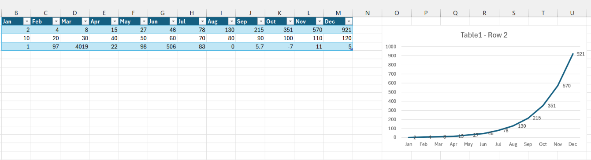
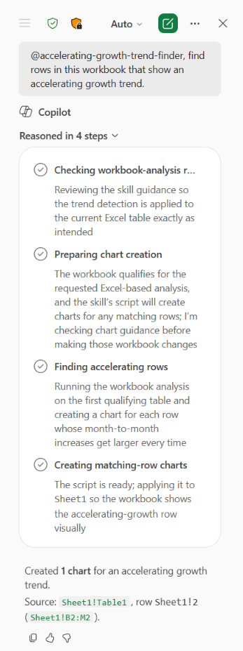
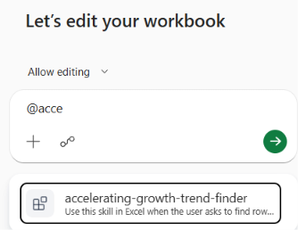

# Skill for Copilot in Excel

This sample shows how to create a custom skill for Copilot in Excel that use the Excel-specific APIs in the Office JavaScript library to find and chart table rows which embody an accelerating growth trend. The skill does *not* run in standalone Microsoft 365 Copilot.




> [!IMPORTANT]
> Although this sample is packaged and sideloaded just like any other App for Microsoft 365, it doesn't have files that are hosted on a web server or cloud service. All the files for the skill are included in the app package. 

## Applies to

- Excel on Windows and Mac
- Copilot in Excel

## Prerequisites

- [Microsoft 365 Agents Toolkit CLI](https://learn.microsoft.com/en-us/microsoftteams/platform/toolkit/microsoft-365-agents-toolkit-cli)
- A Microsoft 365 Developer Account
- Microsoft 365 on Windows version 2608 (Build 20305.20002) or later, or Microsoft 365 on Mac version 16.112.26070718 or later.

   > **Note:** If you don't already have an Microsoft 365 subscription, you might qualify for a Microsoft 365 E5 developer subscription through the [Microsoft 365 Developer Program](https://aka.ms/m365devprogram); for details, see the [FAQ](https://learn.microsoft.com/office/developer-program/microsoft-365-developer-program-faq#who-qualifies-for-a-microsoft-365-e5-developer-subscription-). Alternatively, you can [sign up for a 1-month free trial](https://www.microsoft.com/microsoft-365/try) or [purchase a Microsoft 365 plan](https://www.microsoft.com/microsoft-365/business/compare-all-microsoft-365-business-products-g).

## Run the sample

1. Install @microsoft/m365agentstoolkit-cli in a Windows command prompt, Mac system prompt, or bash shell with the following command.

   ```bash
   npm install -g @microsoft/m365agentstoolkit-cli
   ```

   If you are prompted to sign in, use your Microsoft 365 developer account credentials. 

1. In the window navigate to the root of this sample, and then install the agent package with the following command.

   ```bash
   atk install --file-path "my-copilot-plugin-skills.zip" --scope Personal
   ```

   A successful installation returns output that includes a TitleId and AppId for your account.

1. Open the **Text.xlsx** file in the root of the sample. 
1. Ensure that you are signed in to Excel with your developer account credentials.
1. Open Copilot in Excel, and verify that your skill is installed with the following steps.

    1. Select the **+** icon in the chat area.
    1. The **All Skills** option in the dropdown that opens will be disabled at first. Wait until it is enabled and then select it.
    1. In the chat text box, start to type "@accelerating-growth-trend-finder". The skill should appear in the list of skills.

       

1. Backspace over the name to clear the chat.
1. In the chat, ask the skill to find the table rows with an accelerating growth trend. Somewhere in your prompt, you must mention the full name of the skill as `@accelerating-growth-trend-finder`. The following are examples.

   ```text
   @accelerating-growth-trend-finder, find rows in this workbook that show an accelerating growth trend.
   ```

   ```text
   Find rows in this workbook that show an accelerating growth trend using @accelerating-growth-trend-finder.
   ```

1. Copilot should invoke the skill, create charts of the matching rows, and report the matching worksheet row numbers to the chat, similar to the following two images at the beginning of this README.
1. Change the table so that it doesn't qualify; for example, reduce the number of columns to fewer than 12 or put non-numeric data in one of the table body cells.
1. Repeat your prompt to Copilot. Copilot should compose its own error message and report it in the chat.
1. Reverse your changes so that the table qualifies again.
1. Remove any rows that have an accelerating growth trend.
1. Repeat the prompt to Copilot. Copilot should report the exact error message: "No rows with an accelerating growth trend were found."

> [!IMPORTANT]
> Always uninstall the app completely when you are finished working with it. See [Uninstall the sample](#uninstall-the-sample).

## Uninstall the sample

1. Open Teams and be sure you're signed in with the same credentials you used to install the skill.
1. On the Teams app bar, select the apps button.
1. On the **Apps** pane, select **Manage your apps**.
1. Find the **Accelerating Growth Trends** app in the list of apps.
1. Select the add-in to expand its row.

   

1. Select the trash can icon and then select **Remove** in the prompt.

## Key parts of the sample

The sample, and the zipped package, has the following structure.

```text
|-- manifest.json
|-- color.png
|-- outline.png
|-- skills/
    |-- accelerating-growth-trend-finder/
        |-- SKILL.md
        |-- resources/
            |-- workbook-data-guardrails.md
            |-- excel-vs-agent-execution.md
        |-- scripts/
            |-- find-accelerating-growth-trend-rows.js
```

The SKILL.md file contains the basic instructions to Copilot in Excel about when and how to invoke the skill. The two resource files put further constraints on the use of the skill. The script file contains the function that calls Office.js. For more information about all of these files, see [Create a Copilot skill for Excel that uses the Office JavaScript Library](https://learn.microsoft.com/en-us/office/dev/add-ins/excel/excel-copilot-skill).

## Modify the sample

The source files are in the folder **my-copilot-plugin-skills**. For information about their purposes, see [Create a Copilot skill for Excel that uses the Office JavaScript Library](https://learn.microsoft.com/office/dev/add-ins/excel/excel-copilot-skill).

An app package with the source files in it has already been created in the root of the sample folder. If you make changes to the source files, you must recreate the package with a ZIP utility. Be sure that you have uninstalled the previous version by following the steps in [Uninstall the sample](#uninstall-the-sample), and then reinstall the package as described in [Run the sample](#run-the-sample).

> [!IMPORTANT]
> Don't change the folder structure of the sample. For more information, see [Package the skill](https://learn.microsoft.com/office/dev/add-ins/excel/excel-copilot-skill?branch=main#task-8-package-the-skill).

## Solution

Solution | Author(s)
---------|----------
Create custom skill for Copilot in Excel | Microsoft

## Version history

Version  | Date | Comments
---------| -----| --------
1.0  | July 13th, 2026 | Initial release

