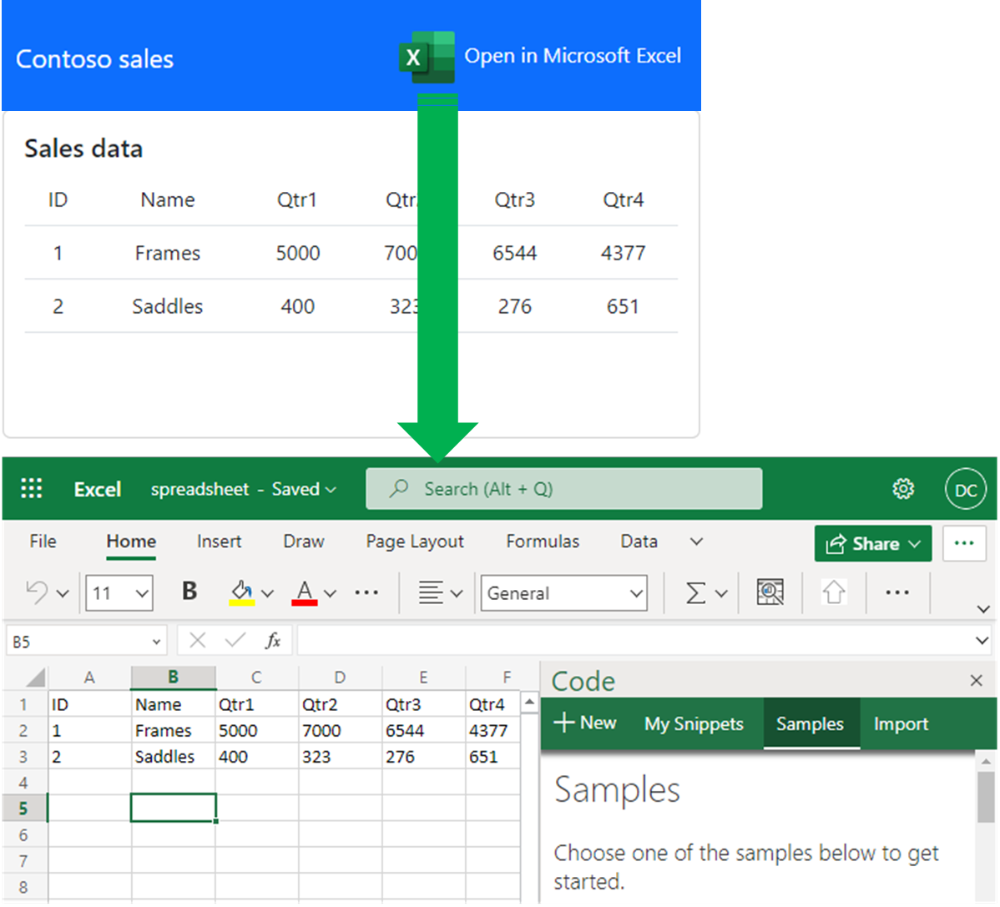

# Create an Excel workbook from a web site with an auto-open task pane

## Summary

This sample demonstrates how to create an Excel workbook from web site data using Node.js, and configure it so that a custom Office Add-in task pane automatically opens when the document is opened. This approach combines server-side workbook generation with the auto-open task pane feature.



## Features

- Create Excel workbooks programmatically using ExcelJS.
- Populate worksheets with data from a web source.
- Upload generated workbooks to OneDrive using Microsoft Graph API.
- Embed a custom Office Add-in into the workbook.
- Configure the add-in to automatically open when the workbook is opened.
- Use Office.js to control auto-open behavior.

## Applies to

- Excel on Windows
- Excel on Mac  
- Excel on the web

## Prerequisites

- [Node.js](https://nodejs.org/) version 16 or higher
- [npm](https://www.npmjs.com/) (included with Node.js)
- Microsoft 365 account with OneDrive - Get a [free developer sandbox](https://developer.microsoft.com/microsoft-365/dev-program#Subscription) that provides a renewable 90-day Microsoft 365 E5 developer subscription.

## Solution

| Solution | Authors |
|----------|-----------|
| Create Excel worksheet from web site | Microsoft |

## Version history

| Version | Date | Comments |
|---------|------|----------|
| 1.0 | January 2023 | Initial release |
| 2.0 | January 2026 | Refactored to Node.js with custom add-in and auto-open |

## Set up the sample

### Register a Microsoft Entra ID application

1. Go to the [Azure portal - App registrations](https://go.microsoft.com/fwlink/?linkid=2083908) to register your app.
1. Sign in with your Microsoft 365 administrator credentials.
1. Select **New registration**.
1. Enter a name for your application (for example, "Excel Worksheet from Website").
1. For **Supported account types**, choose **Accounts in any organizational directory (Any Microsoft Entra ID tenant - Multitenant) and personal Microsoft accounts (e.g. Skype, Xbox)**.
1. Under **Redirect URI**, select **Single-page application (SPA)** and enter `https://localhost:3000/redirect`.
1. Select **Register**.
1. On the application's overview page, copy the **Application (client) ID** - you need this value.
1. Select **API permissions** > **Add a permission** > **Microsoft Graph** > **Delegated permissions**.
1. Add the following permissions:
    - `User.Read`
    - `Files.ReadWrite`
1. Select **Add permissions**.
1. Select **Grant admin consent for [your organization]** to grant consent for all users in your organization.

### Configure the application

1. Clone or download this repository.
1. Navigate to the `Samples/excel-create-worksheet-from-web-site` folder.
1. Run `npm install` to install dependencies.
1. Open `WebApplication/App/authConfig.js` and update the following values:
   - Replace `YOUR_CLIENT_ID` with your Application (client) ID from Microsoft Entra ID
   - Replace `YOUR_TENANT_ID` with your tenant ID (or use `common` for multitenant)

### Generate and trust SSL certificates

Office Add-ins require HTTPS. You need to generate and trust self-signed certificates for local development.

1. If you haven't already installed `office-addin-dev-certs`, install it globally with the following command:

   ```bash
   npm install --global office-addin-dev-certs
   ```

1. Run the following command to generate a self-signed certificate:

   ```bash
   npx office-addin-dev-certs install
   ```

   This command will display the folder location where it generated the certificate files.
   - On Windows, you might be prompted to trust the certificate - select **Yes**.
   - On Mac, you might need to add the certificate to your keychain and mark it as trusted.

1. Copy the **localhost.crt** and **localhost.key** files from the certificate folder (typically `~/.office-addin-dev-certs/` or `%USERPROFILE%\.office-addin-dev-certs\` on Windows) to the root folder of this sample.

1. The server automatically uses the certificate files when you run `npm start`.

## Run the sample

### Start the server

```bash
npm start
```

The server starts on `https://localhost:3000`.

### Sideload the add-in manifest

Before the auto-open feature works, sideload the add-in:

#### Excel on Windows or Mac

1. Open Excel and create a new blank workbook.
1. Go to **Home** > **Add-ins** > **My Add-ins**.
1. On the **Office Add-ins** dialog, select the **MY ADD-INS** tab.
1. Choose **Manage My Add-ins** > **Upload My Add-in**.
1. Browse to and select the `manifest.xml` file in the sample folder.
1. Select **Upload**.

#### Excel on the web

1. Open [Office on the web](https://office.com/).
1. Choose **Excel** and create a new blank workbook.
1. On the ribbon, select **Add-ins**.
1. In the **My Add-ins** panel on the right, scroll to the bottom.
1. Select **Advanced...**.
1. Select **Upload My Add-in**.
1. Browse to and select the `manifest.xml` file in the sample folder.
1. Select **Upload**.

After sideloading, you see a **Show Task Pane** button on the **Home** ribbon.

### Use the sample

1. Open a web browser and go to `https://localhost:3000`.
1. Select **Sign in with Microsoft** and sign in by using your Microsoft 365 account.
1. Select **Open in Excel** to generate a workbook with sample data.
1. The app uploads the workbook to OneDrive and opens it in Excel.
1. Because you previously sideloaded the add-in, the task pane opens automatically.
1. The task pane contains controls to turn auto-open on or off for subsequent opens.

### Alternative: Download directly

If you prefer not to use OneDrive:

1. After signing in, select **Download Directly** instead of **Open in Excel**.
1. The app downloads the file to your computer.
1. Open the downloaded file in Excel.
1. Because you previously sideloaded the add-in, the task pane opens automatically.
1. The task pane contains controls to turn auto-open on or off for subsequent opens.

## How it works

### Server-side workbook generation

The Node.js server uses ExcelJS to create a workbook programmatically.

```javascript
const workbook = new ExcelJS.Workbook();
const worksheet = workbook.addWorksheet('Web Data');

// Add data to the worksheet
tableData.rows.forEach((row, rowIndex) => {
    const excelRow = worksheet.getRow(rowIndex + 1);
    row.columns.forEach((column, colIndex) => {
        excelRow.getCell(colIndex + 1).value = column.value;
    });
});
```

### Embedding the add-in

After creating the workbook, the server embeds a reference to the custom add-in by manipulating the Office Open XML (OOXML) structure.

1. **Generate buffer**: Convert the ExcelJS workbook to a buffer.
1. **Load ZIP**: Load the buffer into JSZip (Excel files are ZIP archives).
1. **Add webextension files**: Add XML files to the `xl/webextensions/` folder:
   - `webextension1.xml` - Defines the add-in reference
   - `taskpanes.xml` - Configures the task pane (visibility, position, size)
   - `_rels/taskpanes.xml.rels` - Links the taskpane to the webextension
1. **Update Content Types**: Modify `[Content_Types].xml` to register the new file types.
1. **Update relationships**: Modify `xl/_rels/workbook.xml.rels` to link the workbook to the taskpanes.

### Auto-open configuration

Configure the auto-open feature through Office.js in the task pane.

```javascript
function setAutoOpenOn() {
    Office.context.document.settings.set(
        'Office.AutoShowTaskpaneWithDocument',
        true
    );
    Office.context.document.settings.saveAsync();
}
```

Save this setting in the document to tell Office to automatically open this specific task pane when the document is opened.

### Important notes

1. **Install the add-in first**: The auto-open feature works only if you sideload or install the add-in. If you don't install the add-in, the embedded reference is ignored.

1. **Auto-open requires user consent**: For security, Office Add-ins can't force themselves to open without user interaction on the first load. The expected workflow is:
   - Open the downloaded file for the **first time**
   - Manually select the **Show Task Pane** button on the ribbon
   - Select **Set auto-open ON** in the task pane
   - Save and close the file
   - **Subsequent opens**: The task pane now auto-opens automatically

   This is standard Office Add-in behavior.

1. **Production considerations**:
   - Replace the self-signed certificate with a proper SSL certificate.
   - Host the add-in on a public HTTPS server.
   - Update the manifest.xml URLs to point to your production server.
   - Add proper authentication and authorization to the API endpoints.
   - Consider distributing the add-in through AppSource instead of sideloading.

## Troubleshooting

### The task pane doesn't auto-open

**Expected behavior**: The task pane doesn't auto-open when you first download and open a file. This behavior is by design for security reasons. You must:

1. Open the file
1. Manually click the **Show Task Pane** button on the ribbon (next to the add-in name)
1. Click **Set auto-open ON** in the task pane  
1. Save and close the file
1. Reopen the file - the task pane now auto-opens automatically

If auto-open still doesn't work after following these steps:

- Check that the manifest ID in manifest.xml matches the ID in [server.js](server.js) (`createWebExtensionXml()` function)
- Ensure the add-in is properly sideloaded (visible on the ribbon)
- Try removing and re-sideloading the manifest

### Certificate and SSL errors

- Make sure you trust the self-signed certificate.
- Try running `npm start` again and accept the certificate prompt.
- On Windows, you might need to run PowerShell as Administrator.

### Upload to OneDrive fails

- Verify your Microsoft Entra ID app registration has `Files.ReadWrite` permission.
- Check that admin consent was granted for the permissions.
- Ensure the redirect URI is set to `https://localhost:3000/redirect`.
- Check the browser console for specific error messages.

### Add-in doesn't appear in ribbon

- Verify the manifest.xml was successfully sideloaded.
- Try restarting Excel.
- Check that the server is running on https://localhost:3000.
- Look in **Home** > **Add-ins** > **My Add-ins** to see if the add-in is listed.

## Learn more

- [Automatically open a task pane with a document](https://learn.microsoft.com/office/dev/add-ins/develop/automatically-open-a-task-pane-with-a-document)
- [Office Add-ins manifest](https://learn.microsoft.com/office/dev/add-ins/develop/add-in-manifests)
- [ExcelJS documentation](https://github.com/exceljs/exceljs)
- [JSZip documentation](https://stuk.github.io/jszip/)
- [Microsoft Graph API](https://learn.microsoft.com/graph/overview)
- [Office JavaScript API](https://learn.microsoft.com/office/dev/add-ins/reference/overview/excel-add-ins-reference-overview)

## Questions and feedback

- Did you experience any problems with the sample? [Create an issue](https://github.com/OfficeDev/Office-Add-in-samples/issues/new) and we'll help you out.
- We'd love to get your feedback about this sample. Go to our [Office samples survey](https://aka.ms/OfficeSamplesSurvey) to give feedback and suggest improvements.
- For general questions about developing Office Add-ins, go to [Microsoft Q&A](https://learn.microsoft.com/answers/topics/office-js-dev.html) using the office-js-dev tag.

## Copyright

Copyright (c) 2026 Microsoft Corporation. All rights reserved.

This project has adopted the [Microsoft Open Source Code of Conduct](https://opensource.microsoft.com/codeofconduct/). For more information, see the [Code of Conduct FAQ](https://opensource.microsoft.com/codeofconduct/faq/) or contact [opencode@microsoft.com](mailto:opencode@microsoft.com) with any additional questions or comments.


