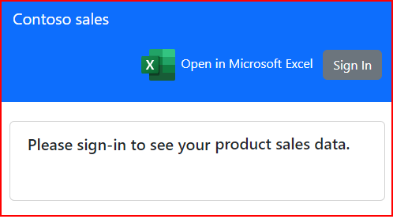
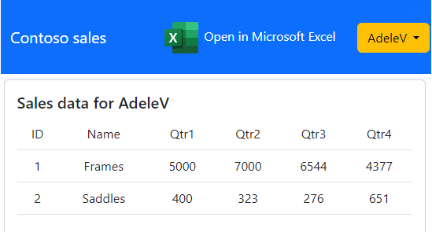

# Create a spreadsheet from your web page, populate it with data, and embed your Excel add-in

This sample accomplishes the following tasks.

- Creates a new Excel spreadsheet from a web page.
- Populates the spreadsheet with data from the web page.
- Embeds the Script Lab add-in into the Excel spreadsheet.
- Opens the spreadsheet on a new browser tab.


This sample implements the pattern described in [Create an Excel spreadsheet from your web page, populate it with data, and embed your Office Add-in](https://learn.microsoft.com/office/dev/add-ins/excel/pnp-open-in-excel)

## Applies to

- Microsoft Excel

## Prerequisites

- [Node.js](https://nodejs.org/) version 16 or later.
- [Visual Studio Code.](https://code.visualstudio.com/Download)
- A Microsoft 365 account. You can get one if you qualify for a Microsoft 365 E5 developer subscription through the [Microsoft 365 Developer Program](https://aka.ms/m365devprogram); for details, see the [FAQ](https://learn.microsoft.com/office/developer-program/microsoft-365-developer-program-faq#who-qualifies-for-a-microsoft-365-e5-developer-subscription-). Alternatively, you can [sign up for a 1-month free trial](https://www.microsoft.com/microsoft-365/try) or [purchase a Microsoft 365 plan](https://www.microsoft.com/microsoft-365/business/compare-all-microsoft-365-business-products-g).
- At least a few files and folders stored on OneDrive for Business in your Microsoft 365 subscription.

## Set up the sample

### Step 1: Clone or download this repository

From your shell or command line:

```console
git clone https://github.com/OfficeDev/Office-Add-in-samples.git
```

or download and extract the repository *.zip* file.

> :warning: To avoid path length limitations on Windows, we recommend cloning into a directory near the root of your drive.

### Step 2: Install project dependencies

Navigate to the sample folder and install the dependencies:

```console
cd Samples/excel-create-worksheet-from-web-site
npm install
```

### Step 3: Register the sample application(s) in your tenant

#### Choose the Microsoft Entra ID tenant where you want to create your applications

1. Sign in to the [Azure portal](https://portal.azure.com).
1. If your account is present in more than one Microsoft Entra ID tenant, select your profile at the top right corner in the menu on top of the page, and then **switch directory** to change your portal session to the desired Microsoft Entra ID tenant.

#### Register the client app (contoso-addin-data-to-excel)

1. Go to the [Azure portal](https://portal.azure.com) and select the **Microsoft Entra ID** service.
1. Select the **App Registrations** blade on the left, then select **New registration**.
1. In the **Register an application page** that appears, enter your application's registration information:
    1. In the **Name** section, enter a meaningful application name that will be displayed to users of the app, for example `contoso-addin-data-to-excel`.
    1. Under **Supported account types**, select **Accounts in this organizational directory only**
    1. Select **Register** to create the application.
1. In the **Overview** blade, find and note the **Application (client) ID**. You use this value in your app's configuration file(s) later in your code.
1. In the app's registration screen, select the **Authentication** blade to the left.
1. If you don't have a platform added, select **Add a platform** and select the **Single-page application** option.
    1. In the **Redirect URI** section enter the following redirect URIs:
        1. `http://localhost:3000`
        1. `http://localhost:3000/redirect`
    1. Click **Save** to save your changes.
1. Since this app signs-in users, we will now proceed to select **delegated permissions**, which is is required by apps signing-in users.
    1. In the app's registration screen, select the **API permissions** blade in the left to open the page where we add access to the APIs that your application needs:
    1. Select the **Add a permission** button and then:
    1. Ensure that the **Microsoft APIs** tab is selected.
    1. In the *Commonly used Microsoft APIs* section, select **Microsoft Graph**
    1. In the **Delegated permissions** section, select **User.Read**, **Contacts.Read**, and **Files.ReadWrite** in the list. Use the search box if necessary.
    1. Select the **Add permissions** button at the bottom.

##### Configure Optional Claims

1. Still on the same app registration, select the **Token configuration** blade to the left.
1. Select **Add optional claim**:
    1. Select **optional claim type**, then choose **ID**.
    1. Select the optional claim **acct**.
    > Provides user's account status in tenant. If the user is a **member** of the tenant, the value is *0*. If they're a **guest**, the value is *1*.
    1. Select the optional claim **login_hint**.
    > An opaque, reliable login hint claim. This claim is the best value to use for the login_hint OAuth parameter in all flows to get SSO. See [optional claims](https://learn.microsoft.com/entra/identity-platform/optional-claims) for more details on this optional claim.
    1. Select **Add** to save your changes.

##### Configure the client app (contoso-addin-data-to-excel) to use your app registration

Open the project in your IDE (like Visual Studio or Visual Studio Code) to configure the code.

> In the steps below, "ClientID" is the same as "Application ID" or "AppId".

1. Open the `WebApplication/App/authConfig.js` file.
1. Find the key `Enter_the_Application_Id_Here` and replace the existing value with the application ID (clientId) of `contoso-addin-data-to-excel` app copied from the Azure portal.
1. Find the key `Enter_the_Tenant_Id_Here` and replace the existing value with your Microsoft Entra ID tenant/directory ID.

## Run the sample

### Start the Node.js server

1. From your shell or command line in the sample root folder, run the following command:

    ```console
    npm start
    ```

   This will start the Node.js server which serves both the web application and provides the API endpoint for creating spreadsheets.

1. In a browser, go to the URL `http://localhost:3000/index.html`.
    
1. Choose the **Sign In** button.
1. You will be prompted to sign in. Sign in with a user name and password from your Microsoft 365 account.

    > Note: You may also be prompted to consent to the app permissions. You'll need to consent before the app can continue successfully.

    Once you sign in, the page will display a table of sales data.
    
1. Choose the Excel icon to open a new tab with a new spreadsheet.

When the spreadsheet opens, you will see the sales data. The embedded Script Lab add-in will be available on the ribbon.

## Key parts of this sample

### Authentication

This sample was built using the code from [Vanilla JavaScript single-page application using MSAL.js to authenticate users to call Microsoft Graph](https://github.com/Azure-Samples/ms-identity-javascript-tutorial/blob/main/2-Authorization-I/1-call-graph/README.md). Please refer to the [readme](https://github.com/Azure-Samples/ms-identity-javascript-tutorial/blob/main/2-Authorization-I/1-call-graph/README.md) for more information on how the authentication works.

### Implement the Excel button

The [WebApplication/App/index.html](WebApplication/App/index.html) page has an `` tag that displays the Excel icon. The click handler calls `openInExcel()` which is in the [WebApplication/App/authPopup.js](WebApplication/App/authPopup.js) file. The `openInExcel` function sends the sales data from [WebApplication/App/tableData.js](WebApplication/App/tableData.js) in a POST request to the Node.js server endpoint at `/api/create-spreadsheet`.

### Construct the spreadsheet

The Node.js server in [server.js](server.js) provides an API endpoint at `/api/create-spreadsheet` that constructs the spreadsheet. The endpoint is triggered by an HTTP POST request. The body of the request contains JSON describing rows and columns of data to populate the spreadsheet. The endpoint expects data in the format shown in [WebApplication/App/tableData.js](WebApplication/App/tableData.js). The endpoint returns the raw data of the new spreadsheet as a binary blob.

The server uses the [ExcelJS](https://github.com/exceljs/exceljs) library to construct the spreadsheet in memory. The code that constructs the spreadsheet is in the `/api/create-spreadsheet` endpoint handler in [server.js](server.js).

- The endpoint inserts the data values from the request into the worksheet.
- Formatting is applied to the header row (bold font, gray background).
- The `embedAddin` function provides a placeholder for embedding add-ins. Note: Full web extension embedding requires additional OOXML manipulation that goes beyond the scope of this sample.

### Upload the spreadsheet to OneDrive

Once the binary blob of the new spreadsheet is returned to the `openInExcel` function, it calls `uploadFile`. The `uploadFile` function uses the Microsoft Graph API to upload the spreadsheet to OneDrive. It creates the URI `'https://graph.microsoft.com/v1.0/me/drive/root:/` for the Microsoft Graph API and adds the folder location and filename. It passes the binary blob as the body, and calls the `callGraph` function to make the actual REST API call.

## Modify the sample for your own web site

To repurpose the code in this sample for your own web site, you'll want to make the following changes.

### Use your own data

The sample uses mock data described in [WebApplication/App/tableData.js](WebApplication/App/tableData.js). You'll need to replace this code to use the actual data from your web site. The data structure is simple JSON with rows and columns:

```javascript
{
  rows: [
    { columns: [{ value: 'Header1' }, { value: 'Header2' }] },
    { columns: [{ value: 'Data1' }, { value: 'Data2' }] }
  ]
}
```

The spreadsheet creation endpoint in [server.js](server.js) iterates through this structure to populate the Excel worksheet. If you need to change the data model, update both the client-side data structure and the server endpoint handler.

### Embed your add-in

The current implementation creates a workbook with data but does not embed an add-in by default. Embedding Office Add-ins requires manipulating the Office Open XML (OOXML) structure of the Excel file, which involves:

1. Creating `webextension.xml` and `webextensions.xml` files
2. Updating `[Content_Types].xml` to register the web extension parts
3. Adding relationships in the `_rels` folder
4. Setting add-in properties like Store ID, version, and visibility

For a complete implementation of add-in embedding, you would need to:

- Use a library like [jszip](https://www.npmjs.com/package/jszip) to manipulate the OOXML structure
- Add the necessary XML files for web extensions
- Configure the add-in reference (AppSource ID or centrally deployed add-in GUID)

Key properties to configure:
- **StoreType**: "OMEX" for AppSource add-ins, or "excatalog" for centrally deployed add-ins
- **Store**: Culture code like "en-US"
- **Id**: The AppSource asset ID or add-in GUID
- **Visibility**: Whether the task pane auto-opens

For more information, see [Automatically open a task pane with a document](https://learn.microsoft.com/office/dev/add-ins/develop/automatically-open-a-task-pane-with-a-document).

Users can manually add the desired add-in after opening the spreadsheet using the **Insert** > **Add-ins** ribbon button.

## Security notes

- There may be security issues in packages used by this sample. Be sure to run `npm audit` to identify any security vulnerabilities and update packages regularly.
- This sample runs on `localhost` for development purposes only. In production, you should:
  - Use HTTPS
  - Implement proper CORS configuration
  - Add authentication and authorization for the API endpoint
  - Validate and sanitize all input data
  - Consider rate limiting to prevent abuse

## Questions and feedback

- Did you experience any problems with the sample? [Create an issue](https://github.com/OfficeDev/Office-Add-in-samples/issues/new/choose) and we'll help you out.
- We'd love to get your feedback about this sample. Go to our [Office samples survey](https://aka.ms/OfficeSamplesSurvey) to give feedback and suggest improvements.
- For general questions about developing Office Add-ins, go to [Microsoft Q&A](https://learn.microsoft.com/answers/topics/office-js-dev.html) using the office-js-dev tag.

## Solution

Solution | Authors
---------|----------
Open data from your web page in a spreadsheet | Microsoft

## Version history

Version  | Date | Comments
---------| -----| --------
1.0  | January 31, 2023 | Initial release
1.1  | April 24, 2024 | Update package versions
1.2 | January 7, 2026 | Changed to no longer require Visual Studio

## Copyright

Copyright (c) 2023 Microsoft Corporation. All rights reserved.

This project has adopted the [Microsoft Open Source Code of Conduct](https://opensource.microsoft.com/codeofconduct/). For more information, see the [Code of Conduct FAQ](https://opensource.microsoft.com/codeofconduct/faq/) or contact [opencode@microsoft.com](mailto:opencode@microsoft.com) with any additional questions or comments.

