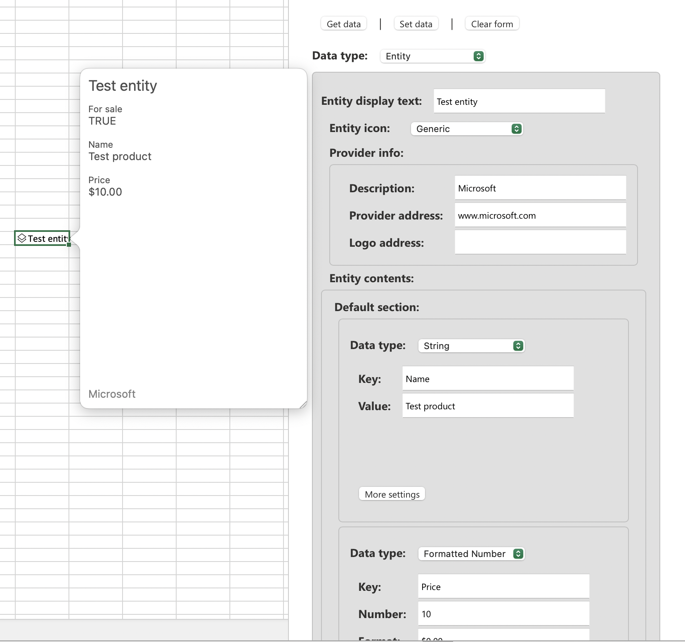

# Create and explore data types in Excel

## Summary

This sample builds an Excel add-in that can create and explore data types in your workbooks. Data types enable add-in developers to organize complex data structures as objects, such as formatted number values, web images, and entities. See [Overview of data types in Excel add-ins](https://learn.microsoft.com/office/dev/add-ins/excel/excel-data-types-overview) to learn more about data types.

## Features

This sample builds and then sideloads a data types explorer add-in that allows you to create and edit data types in an Excel workbook. Once the add-in is sideloaded, you can use it to explore entity, web image, formatted number, string, double, and boolean data types.

In particular, this add-in contains an entity data type builder that you can use to create and explore entity cards. Entity cards extend the potential of Excel add-ins beyond a 2-dimensional grid. To learn more about entity cards, see [Use cards with entity value data types](https://learn.microsoft.com/office/dev/add-ins/excel/excel-data-types-entity-card).

## Applies to

- Excel on Windows
- Excel on Mac
- Excel on the web

## Prerequisites

- Excel on Windows with a minimum build of 16.0.14626.10000, or Excel on Mac with a minimum build of 16.55.21102600, or Excel on the web.
- [Node.js](https://nodejs.org/) (latest recommended version).
- [npm](https://docs.npmjs.com/downloading-and-installing-node-js-and-npm) version 8 or greater.

## Solution

Solution | Author(s)
---------|----------
Create and explore data types in Excel workbooks | Microsoft

## Version history

Version  | Date | Comments
---------| -----| --------
1.0 | 9-7-2022 | Initial release
1.1 | 10-12-2022 | Promote from Preview to GA

----------

## Run the sample

Take the following steps to run this sample and set up the data types explorer add-in.

1. Clone or download this repo.
1. Go to the **Samples/excel-data-types-explorer** folder via the command line.
1. Run `npm install` to set up the add-in dependencies.
1. Run `npm start`. This command opens Excel, sideloads the add-in in Excel, and opens the task pane. If the task pane doesn't open automatically, select **Show Taskpane** in the Excel ribbon.
1. Follow the directions in the task pane to build and explore data types.

Note: To sideload this add-in sample in Excel on the web, see [Sideload Office Add-ins to Office on the web](https://learn.microsoft.com/office/dev/add-ins/testing/sideload-office-add-ins-for-testing).

## See also

An unmaintained version of this data types explorer tool is also available as an [Excel Script Lab sample](https://gist.github.com/mafrenet/e6e1eb26d3ff778edad73a4230b44b5b). To learn more about Script Lab, see [Explore Office JavaScript API using Script Lab](https://learn.microsoft.com/office/dev/add-ins/overview/explore-with-script-lab).

## Questions and feedback

- Did you experience any problems with the sample? [Create an issue](https://github.com/OfficeDev/Office-Add-in-samples/issues/new/choose) and we'll help you out.
- We'd love to get your feedback about this sample. Go to our [Office samples survey](https://aka.ms/OfficeSamplesSurvey) to give feedback and suggest improvements.
- For general questions about developing Office Add-ins, go to [Microsoft Q&A](https://learn.microsoft.com/answers/topics/office-js-dev.html) using the office-js-dev tag.

## Copyright

Copyright (c) 2022 Microsoft Corporation. All rights reserved.

This project has adopted the [Microsoft Open Source Code of Conduct](https://opensource.microsoft.com/codeofconduct/). For more information, see the [Code of Conduct FAQ](https://opensource.microsoft.com/codeofconduct/faq/) or contact [opencode@microsoft.com](mailto:opencode@microsoft.com) with any additional questions or comments.

