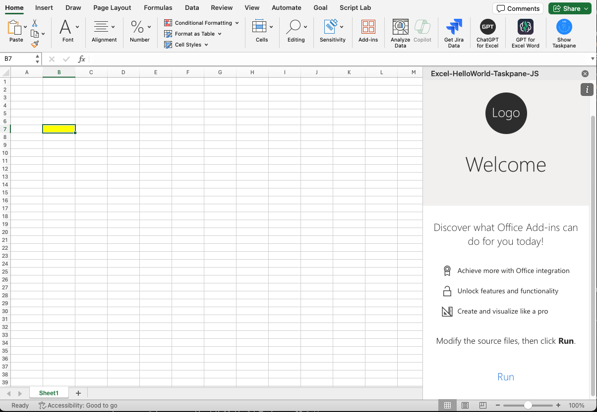

# Get Started with the Office Add-ins Development Kit in Excel



This is a basic Excel add-in that sets the background color of a selected range. It uses a button in the add-in's task pane to do this.

Excel add-ins use the [Excel JavaScript APIs](https://learn.microsoft.com/office/dev/add-ins/reference/overview/excel-add-ins-reference-overview) and [Office Platform capabilities](https://learn.microsoft.com/office/dev/add-ins/overview/office-add-ins) to provide custom functionality and connect web services to the workbook.

## How to run this sample

### Prerequisites

- Download and install [Visual Studio Code](https://visualstudio.microsoft.com/downloads/).
- Install the latest version of the [Office Add-ins Development Kit](https://marketplace.visualstudio.com/items?itemName=msoffice.microsoft-office-add-in-debugger) into Visual Studio Code.
- Node.js (the latest LTS version). Visit the [Node.js site](https://nodejs.org/) to download and install the right version for your operating system. To verify if you've already installed these tools, run the commands `node -v` and `npm -v` in your terminal.
- Microsoft Office connected to a Microsoft 365 subscription. You might qualify for a Microsoft 365 E5 developer subscription through the [Microsoft 365 Developer Program](https://developer.microsoft.com/microsoft-365/dev-program), see [FAQ](https://learn.microsoft.com/office/developer-program/microsoft-365-developer-program-faq#who-qualifies-for-a-microsoft-365-e5-developer-subscription-) for details. Alternatively, you can [sign up for a 1-month free trial](https://www.microsoft.com/microsoft-365/try?rtc=1) or [purchase a Microsoft 365 plan](https://www.microsoft.com/microsoft-365/buy/compare-all-microsoft-365-products).
  
### Run the add-in from the Office Add-ins Development Kit

1. Create a new project with the sample code.

   Open the Office Add-ins Development Kit extension and view samples in the **Sample gallery**. Select the **Create** button in the top-right corner of the sample page. The new project will open in a second Visual Studio Code window. Close the original VSC window.
   
1. Open the Office Add-ins Development Kit.
    
    Select the  icon in the **Activity Bar** to open the extension.

1. Preview Your Office Add-in (F5).

    Select **Preview Your Office Add-in(F5)** to launch the add-in and debug the code. In the drop down menu, select the option **Desktop (Edge Chromium)**.

    

    The extension checks that the prerequisites are met before debugging starts. The terminal will alert you to any issues with your environment. After this process, the Excel desktop application launches and opens a new workbook with the sample add-in sideloaded. The add-in automatically opens as well.

    If this is the first time that you have sideloaded an Office Add-in on your computer (or the first time in over a month), you may be prompted to delete an old certificate and/or to install a new one. Agree to both prompts. The first run requires installing dependency of this project, which might take 2~3 minutes or longer. During this time, there might be a dialog pop up at the lower right of the VSC screen. You should not interact with this dialog before the Office application launched.

1. Stop Previewing Your Office Add-in.

    Once you are finished testing and debugging the add-in, select the  icon and then select **Stop Previewing Your Office Add-in**. This closes the web server and removes the add-in from the registry and cache.

## Use the sample add-in

1. Select a cell in the current worksheet.
2. Select `Run` in the task pane.

## Explore sample files

These are the important files in the sample project.

```
| .eslintrc.json
| .gitignore
| .vscode/
|   | extensions.json
|   | launch.json               Launch and debug configurations
|   | settings.json             
|   | tasks.json                
| assets/                       Static assets, such as images
| babel.config.json
| manifest.xml                  Manifest file
| package.json                  
| README.md                     
| RUN_WITH_EXTENSION.md         
| src/                          Add-in source code
|   | taskpane/
|   |   | taskpane.css          Task pane style
|   |   | taskpane.html         Task pane entry HTML
|   |   | taskpane.js           Office JS API calls and add-in logic
| webpack.config.js             Webpack config
```

## Troubleshooting

If you have problems running the sample, take the following steps.

- Close any open instances of Excel.
- Close the previous web server started for the sample with the **Stop Previewing Your Office Add-in** Office Add-ins Development Kit extension option.
- Try running again.

If you still have problems, see [troubleshoot development errors](https://learn.microsoft.com//office/dev/add-ins/testing/troubleshoot-development-errors) or [create a GitHub issue](https://aka.ms/officedevkitnewissue) and we'll help you.  

For information on running the sample on Excel on the web, see [Sideload Office Add-ins to Office on the web](https://learn.microsoft.com/office/dev/add-ins/testing/sideload-office-add-ins-for-testing).

For information on debugging on older versions of Office, see [Debug add-ins using developer tools in Microsoft Edge Legacy](https://learn.microsoft.com/office/dev/add-ins/testing/debug-add-ins-using-devtools-edge-legacy).

## Make code changes

Once you understand the sample, make it your own! All the information about Office Add-ins is found in our [official documentation](https://learn.microsoft.com/office/dev/add-ins/overview/office-add-ins). You can also explore more samples in the Office Add-ins Development Kit. Select **View Samples** to see more samples of real-world scenarios.

If you edit the manifest as part of your changes, use the **Validate Manifest File** option in the Office Add-ins Development Kit. This shows you any errors in the manifest syntax.

## Engage with the team

Did you experience any problems with the sample? [Create an issue](https://github.com/OfficeDev/Office-Add-in-samples/issues/new/choose) and we'll help you out.

Want to learn more about new features and best practices for the Office platform? [Join the Microsoft Office Add-ins community call](https://learn.microsoft.com/office/dev/add-ins/overview/office-add-ins-community-call).

## Copyright

Copyright (c) 2024 Microsoft Corporation. All rights reserved.
This project has adopted the [Microsoft Open Source Code of Conduct](https://opensource.microsoft.com/codeofconduct/). For more information, see the [Code of Conduct FAQ](https://opensource.microsoft.com/codeofconduct/faq/) or contact [opencode@microsoft.com](mailto:opencode@microsoft.com) with any additional questions or comments.
