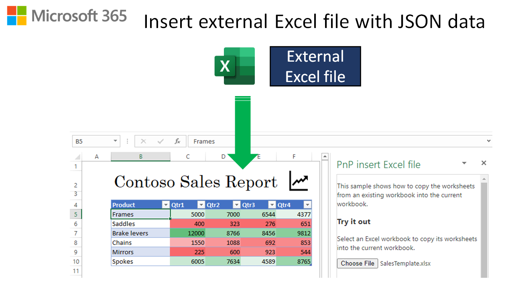

# Insert an external Excel file and populate it with JSON data

## Summary

This sample shows how to insert an existing template from an external Excel file into the currently open Excel file. Then it retrieves data from a JSON web service and populates the template for the customer.



> **Note:** If you don't already have an Microsoft 365 subscription, get one by joining the [Office 365 Developer Program](https://developer.microsoft.com/office/dev-program).

## Features

- Use **insertWorksheetsFromBase64** to insert a worksheet from another Excel file into the open Excel file.
- Get JSON data and add it to the worksheet.

## Applies to

- Excel on Windows, Mac, and on the web.

## Prerequisites

To use this sample, you'll need to [join the Microsoft 365 Insider program](https://insider.microsoft365.com/join).

## Solution

Solution | Author(s)
---------|----------
Insert an external Excel file and populate it with JSON data | Microsoft

## Version history

Version  | Date | Comments
---------| -----| --------
1.0 | 5-18-2021 | Initial release
1.1 | 8-17-2023 | Fix localhost setup steps

----------

## Run the sample

To run the sample you just need to sideload the manifest. The add-in web files are served from this repo on GitHub.

1. Download the **manifest.xml** and **SalesTemplate.xlsx** files from this sample to a folder on your computer.
1. Open [Office on the web](https://www.office.com/).
1. Choose **Excel**, and then open a new document.
1. Select the **Insert** tab, and choose **Add-ins**.
1. On the **Office Add-ins** dialog, select **MY ADD-INS** , choose the **Manage My Add-ins** drop-down, and then choose **Upload My Add-in**.

    

1. Browse to the add-in manifest file, and then select **Upload**.

    

1. Verify that the add-in loaded successfully. You'll see a **PnP Insert Excel file** button on the **Home** tab.

Once the add-in is loaded, use the following steps to try out the functionality.

1. On the **Home** tab, choose **PnP Insert Excel file**.
1. In the task pane, select the **Choose file** button.
1. In the dialog box that opens, select the **SalesTemplate.xlsx** file that you downloaded previously, and choose **Open**.

A **Contoso Sales Report** will be inserted with a table and chart populated with data.

## Key parts of this sample

When you select the **SalesTemplate.xlsx** file, the following code in **index.js** inserts the template. It sets up an object named **options** to identify the sheet by name (**Template**). Then it calls the Office.js **insertWorksheetsFromBase64** API to insert the template into the current worksheet.

```javascript
// STEP 1: Insert the template into the workbook.
const workbook = context.workbook;

// Set up the insert options.
const options = {
  sheetNamesToInsert: ["Template"], // Insert the "Template" worksheet from the source workbook.
  positionType: Excel.WorksheetPositionType.after, // Insert after the `relativeTo` sheet.
  relativeTo: "Sheet1",
}; // The sheet relative to which the other worksheets will be inserted. Used with `positionType`.

// Insert the external worksheet.
workbook.insertWorksheetsFromBase64(workbookContents, options);
```

Next, it gets the JSON which is in the **data.json** file in this repo.

```javascript
// STEP 2: Add data from the "Service".
const sheet = context.workbook.worksheets.getItem("Template");

  // Get data from your REST API. For this sample, the JSON is fetched from a file in the repo.
  let response = await fetch(dataSourceUrl + "/data.json");
  if (response.ok) {
    const json = await response.json();
  } else {
    console.error("HTTP-Error: " + response.status);
  }
```

Finally, it adds the JSON to the table.

```javascript
// Map JSON to table columns.
  const newSalesData = json.salesData.map((item) => [
    item.PRODUCT,
    item.QTR1,
    item.QTR2,
    item.QTR3,
    item.QTR4
  ]);

  // We know that the table in this template starts at B5, so we start with that.
  // Next, we calculate the total number of rows from our sales data.
  const startRow = 5;
  const address = "B" + startRow + ":F" + (newSalesData.length + startRow - 1);
      
  // Write the sales data to the table in the template.
  const range = sheet.getRange(address);
  range.values = newSalesData;
  sheet.activate();
```

## Configure a localhost web server and run the sample from localhost

If you prefer to run the web server and host the add-in's web files from your computer, use the following steps:

1. Clone or download this sample to a folder on your computer. Then go to that folder in a console or terminal window.
1. Open the **index.js** file.
1. Edit line 4 to refer to the localhost:3000 endpoint as shown in the following code.

    ```javascript
    const dataSourceUrl = "https://localhost:3000";
    ```

1. Save the file.
1. Install a recent version of [npm](https://www.npmjs.com/get-npm) and [Node.js](https://nodejs.org/) on your computer. To verify if you've already installed these tools, run the commands `node -v` and `npm -v` in your terminal.
1. You need http-server to run the local web server. If you haven't installed this yet you can do this with the following command:

   ```console
   npm install --global http-server
   ```

1. You need Office-Addin-dev-certs to generate self-signed certificates to run the local web server. If you haven't installed this yet you can do this with the following command:

   ```console
   npm install --global office-addin-dev-certs
   ```

1. Run the following command to generate a self-signed certificate that you can use for the web server.

   ```console
   npx office-addin-dev-certs install
   ```

   The previous command will display the folder location where it generated the certificate files.

1. Go to the folder location where the certificate files were generated. Copy the localhost.crt and localhost.key files to the **excel-insert-file** sample folder.
1. Run the following command:

   ```console
   http-server -S -C localhost.crt -K localhost.key --cors . -p 3000
   ```

   The http-server will run and host the current folder's files on localhost:3000.

1. Follow the steps in [Run the sample](https://github.com/OfficeDev/PnP-OfficeAddins/tree/main/Samples/excel-keyboard-shortcuts#run-the-sample), but upload the `manifest-localhost.xml` file for step 6.

## Questions and feedback

- Did you experience any problems with the sample? [Create an issue](https://github.com/OfficeDev/Office-Add-in-samples/issues/new/choose) and we'll help you out.
- We'd love to get your feedback about this sample. Go to our [Office samples survey](https://aka.ms/OfficeSamplesSurvey) to give feedback and suggest improvements.
- For general questions about developing Office Add-ins, go to [Microsoft Q&A](https://learn.microsoft.com/answers/topics/office-js-dev.html) using the office-js-dev tag.

## Copyright

Copyright (c) 2021 Microsoft Corporation. All rights reserved.

This project has adopted the [Microsoft Open Source Code of Conduct](https://opensource.microsoft.com/codeofconduct/). For more information, see the [Code of Conduct FAQ](https://opensource.microsoft.com/codeofconduct/faq/) or contact [opencode@microsoft.com](mailto:opencode@microsoft.com) with any additional questions or comments.


