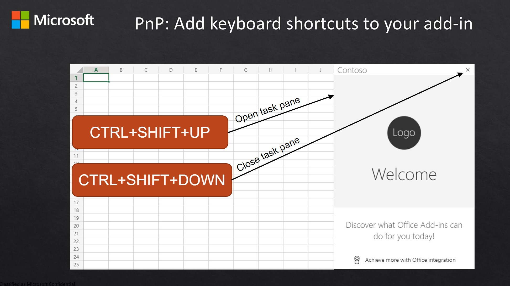

# Use keyboard shortcuts for Office add-in actions

## Summary

This sample shows how to set up a basic Excel add-in project that utilizes keyboard shortcuts. Keyboard shortcuts let power users quickly use you add-in's features and give accessibility options to avoid a mouse. Currently, the sample's shortcuts are configured to show and hide the task pane as well as cycle through colors for a selected cell. Keyboard shortcuts can be used to achieve any action within the add-in runtime.



## Features

- Add keyboard shortcuts to your Office Add-in.
- Enable users to use those keyboard shortcuts to invoke any action within the Office Add-in runtime.

## Applies to

-  Excel on Windows, Mac, and in a browser.

## Prerequisites

- Microsoft 365

## Solution

Solution | Author(s)
---------|----------
Use keyboard shortcuts for Office add-in actions | Microsoft

## Version history

Version  | Date | Comments
---------| -----| --------
1.0 | 11-5-2020 | Initial release
1.1 | May 11, 2021 | Removed yo office and modified to be GitHub hosted

## Disclaimer

**THIS CODE IS PROVIDED *AS IS* WITHOUT WARRANTY OF ANY KIND, EITHER EXPRESS OR IMPLIED, INCLUDING ANY IMPLIED WARRANTIES OF FITNESS FOR A PARTICULAR PURPOSE, MERCHANTABILITY, OR NON-INFRINGEMENT.**

----------

## Scenario: Open/Close taskpane and modify cell color

This sample adds three different shortcuts to the Office Add-in. This enables the user to:

- Use the "Ctrl+Alt+1" keyboard shortcut to open the task pane.
- Use the "Ctrl+Alt+2" keyboard shortcut to close the task pane.
- Use the "Ctrl+Alt+3" keyboard shortcut to cycle through colors for a selected cell.
- Use the "Ctrl+R" keyboard shortcut to test the shortcut conflict modal.

## Run the sample

You can run this sample in Excel in a browser. The add-in web files are served from this repo on GitHub.

1. Download the **manifest.xml** file from this sample to a folder on your computer.
1. Open [Office on the web](https://office.live.com/).
1. Choose **Excel**, and then open a new document.
1. Open the **Insert** tab on the ribbon and choose **Office Add-ins**.
1. On the **Office Add-ins** dialog, select the **MY ADD-INS** tab, choose **Manage My Add-ins**, and then **Upload My Add-in**.
   
1. Browse to the add-in manifest file, and then select **Upload**.
   
1. Verify that the add-in loaded successfully. You will see a **PnP keyboard shortcuts** button on the **Home** tab on the ribbon.

Once the add-in is loaded use the following steps to try out the functionality.

1. Press "Ctrl+Alt+1" on the keyboard to trigger the Show Taskpane action.
2. In the task pane, you will see the additional shortcuts available to try in the sample.

## Key parts of this sample

The manifest.xml is pre-configured to use the shared runtime. To see how to add shared runtime to your own add-in, use the following article:

- [Configure your Excel Add-in to use a shared JavaScript runtime](https://learn.microsoft.com/office/dev/add-ins/excel/configure-your-add-in-to-use-a-shared-runtime)


Additionally, the following changes have been made to enable keyboard shortcuts:

1. Configured the add-in's manifest by adding the new element `ExtendedOverrides` to the end of the manifest.
2. Created the shortcuts JSON file `shortcuts.json`, in the `src/` folder to define actions and their keyboard shortcuts.
3. Mapped actions to runtime calls with the associate method in `src/taskpane.js`.


## Run the sample from Localhost

If you prefer to host the web server for the sample on your computer, follow these steps:

1. Open the **/src/commands/ribbonJSON.js** file.
1. Edit line 9 to refer to the localhost:3000 endpoint as shown in the following code.
    
    ```javascript
    const sourceUrl = "https://localhost:3000";
    ```
    
1. Save the file.
1. You need http-server to run the local web server. If you haven't installed this yet you can do this with the following command:
    
    ```console
    npm install --global http-server
    ```
    
2. Use a tool such as openssl to generate a self-signed certificate that you can use for the web server. Move the cert.pem and key.pem files to the webworker-customfunction folder for this sample.
3. From a command prompt, go to the web-worker folder and run the following command:
    
    ```console
    http-server -S --cors . -p 3000
    ```
    
4. To reroute to localhost run office-addin-https-reverse-proxy. If you haven't installed this you can do this with the following command:
    
    ```console
    npm install --global office-addin-https-reverse-proxy
    ```
    
    To reroute run the following in another command prompt:
    
    ```console
    office-addin-https-reverse-proxy --url http://localhost:3000
    ```
    
5. Follow the steps in [Run the sample](https://github.com/OfficeDev/PnP-OfficeAddins/tree/main/Samples/excel-keyboard-shortcuts#run-the-sample), but upload the `manifest-localhost.xml` file for step 6.

## Questions and feedback

- Did you experience any problems with the sample? [Create an issue](https://github.com/OfficeDev/Office-Add-in-samples/issues/new/choose) and we'll help you out.
- We'd love to get your feedback about this sample. Go to our [Office samples survey](https://aka.ms/OfficeSamplesSurvey) to give feedback and suggest improvements.
- For general questions about developing Office Add-ins, go to [Microsoft Q&A](https://learn.microsoft.com/answers/topics/office-js-dev.html) using the office-js-dev tag.

## Copyright

Copyright (c) 2020 Microsoft Corporation. All rights reserved.

This project has adopted the [Microsoft Open Source Code of Conduct](https://opensource.microsoft.com/codeofconduct/). For more information, see the [Code of Conduct FAQ](https://opensource.microsoft.com/codeofconduct/faq/) or contact [opencode@microsoft.com](mailto:opencode@microsoft.com) with any additional questions or comments.


