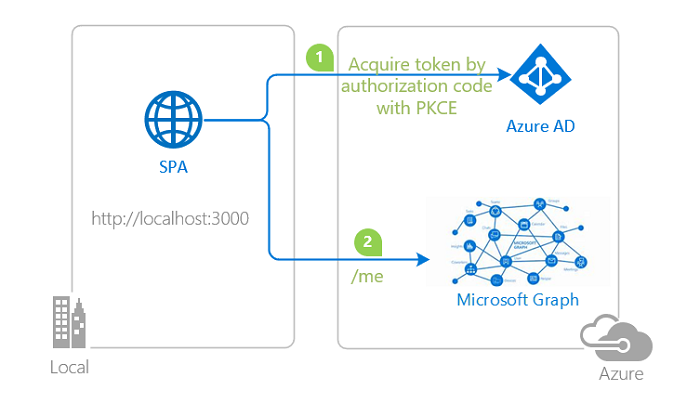

# Vanilla JavaScript single-page application using MSAL.js to authorize users for calling Microsoft Graph

 1. [Overview](#overview)
 1. [Scenario](#scenario)
 1. [Contents](#contents)
 1. [Setup the sample](#setup-the-sample)
 1. [Explore the sample](#explore-the-sample)
 1. [Troubleshooting](#troubleshooting)
 1. [About the code](#about-the-code)
 1. [More information](#more-information)
 1. [Community Help and Support](#community-help-and-support)

## Overview

This sample demonstrates a Vanilla JavaScript single-page application that lets users authenticate against [Azure Active Directory](https://docs.microsoft.com/azure/active-directory/fundamentals/active-directory-whatis) (Azure AD) using the [Microsoft Authentication Library for JavaScript](https://github.com/AzureAD/microsoft-authentication-library-for-js) (MSAL.js), then acquires an **Access Token** for Microsoft Graph and calls the [Microsoft Graph API](https://docs.microsoft.com/graph/overview). In doing so, it also illustrates various authorization concepts, such as [Access Tokens](https://docs.microsoft.com/azure/active-directory/develop/access-tokens), [Authorization Code Grant](https://docs.microsoft.com/azure/active-directory/develop/v2-oauth2-auth-code-flow), [Dynamic Scopes and Incremental Consent](https://docs.microsoft.com/azure/active-directory/develop/v2-permissions-and-consent), **silent requests** and more.

In addition, this sample also demonstrates how to use the [Microsoft Graph JavaScript SDK](https://github.com/microsoftgraph/msgraph-sdk-javascript) client with MSAL as a custom authentication provider to query the Graph API. Note that you are not required to implement a custom provider, as the v3.0 (preview) of the SDK offers a [default provider](https://github.com/microsoftgraph/msgraph-sdk-javascript/blob/dev/docs/AuthCodeMSALBrowserAuthenticationProvider.md) that implements MSAL.js.

## Scenario

1. The client application uses the **MSAL.js** to sign-in a user and obtain a JWT **Access Token** from **Azure AD**:
1. The **Access Token** is used as a *bearer* token to authorize the user to call the **Microsoft Graph API**.
1. **Microsoft Graph API** responds with the resource that the user has access to.



## Contents

| File/folder           | Description                                                               |
|-----------------------|---------------------------------------------------------------------------|
| `AppCreationScripts/` | Contains Powershell scripts to automate app registration.                 |
| `App/authPopup.js`    | Main authentication logic resides here (using Popup flow).                |
| `App/authRedirect.js` | Use this instead of `authPopup.js` for authentication with redirect flow. |
| `App/authConfig.js`   | Contains configuration parameters for the sample.                         |
| `App/graph.js`        | Implements custom authentication provider for Graph SDK.                  |
| `App/ui.js`           | Contains UI logic.                                                        |
| `server.js`           | Simple Express server for `index.html`.                                   |

## Setup the sample

### Step 1: Clone or download this repository

From your shell or command line:

```console
git clone https://github.com/Azure-Samples/ms-identity-javascript-tutorial.git
```

or download and extract the repository *.zip* file.

> :warning: To avoid path length limitations on Windows, we recommend cloning into a directory near the root of your drive.

### Step 2: Install project dependencies

```console
    cd 2-Authorization-I\1-call-graph
    npm install
```

### Step 3: Register the sample application(s) in your tenant

There is one project in this sample. To register it, you can:

* follow the steps below for manually register your apps
* or use PowerShell scripts that:
  * **automatically** creates the Azure AD applications and related objects (passwords, permissions, dependencies) for you.
  * modify the projects' configuration files.

  <details>
   <summary>Expand this section if you want to use this automation:</summary>

    > :warning: If you have never used **Microsoft Graph PowerShell** before, we recommend you go through the [App Creation Scripts Guide](./AppCreationScripts/AppCreationScripts.md) once to ensure that your environment is prepared correctly for this step.
  
    1. On Windows, run PowerShell as **Administrator** and navigate to the root of the cloned directory
    1. In PowerShell run:

       ```PowerShell
       Set-ExecutionPolicy -ExecutionPolicy RemoteSigned -Scope Process -Force
       ```

    1. Run the script to create your Azure AD application and configure the code of the sample application accordingly.
    1. For interactive process -in PowerShell, run:

       ```PowerShell
       cd .\AppCreationScripts\
       .\Configure.ps1 -TenantId "[Optional] - your tenant id" -AzureEnvironmentName "[Optional] - Azure environment, defaults to 'Global'"
       ```

    > Other ways of running the scripts are described in [App Creation Scripts guide](./AppCreationScripts/AppCreationScripts.md). The scripts also provide a guide to automated application registration, configuration and removal which can help in your CI/CD scenarios.

  </details>

#### Choose the Azure AD tenant where you want to create your applications

To manually register the apps, as a first step you'll need to:

1. Sign in to the [Azure portal](https://portal.azure.com).
1. If your account is present in more than one Azure AD tenant, select your profile at the top right corner in the menu on top of the page, and then **switch directory** to change your portal session to the desired Azure AD tenant.

#### Register the client app (ms-identity-javascript-c2s1)

1. Navigate to the [Azure portal](https://portal.azure.com) and select the **Azure Active Directory** service.
1. Select the **App Registrations** blade on the left, then select **New registration**.
1. In the **Register an application page** that appears, enter your application's registration information:
    1. In the **Name** section, enter a meaningful application name that will be displayed to users of the app, for example `ms-identity-javascript-c2s1`.
    1. Under **Supported account types**, select **Accounts in this organizational directory only**
    1. Select **Register** to create the application.
1. In the **Overview** blade, find and note the **Application (client) ID**. You use this value in your app's configuration file(s) later in your code.
1. In the app's registration screen, select the **Authentication** blade to the left.
1. If you don't have a platform added, select **Add a platform** and select the **Single-page application** option.
    1. In the **Redirect URI** section enter the following redirect URIs:
        1. `http://localhost:3000`
        1. `http://localhost:3000/redirect`
    1. Click **Save** to save your changes.
1. Since this app signs-in users, we will now proceed to select **delegated permissions**, which is is required by apps signing-in users.
    1. In the app's registration screen, select the **API permissions** blade in the left to open the page where we add access to the APIs that your application needs:
    1. Select the **Add a permission** button and then:
    1. Ensure that the **Microsoft APIs** tab is selected.
    1. In the *Commonly used Microsoft APIs* section, select **Microsoft Graph**
    1. In the **Delegated permissions** section, select **User.Read**, **Contacts.Read** in the list. Use the search box if necessary.
    1. Select the **Add permissions** button at the bottom.

##### Configure Optional Claims

1. Still on the same app registration, select the **Token configuration** blade to the left.
1. Select **Add optional claim**:
    1. Select **optional claim type**, then choose **ID**.
    1. Select the optional claim **acct**.
    > Provides user's account status in tenant. If the user is a **member** of the tenant, the value is *0*. If they're a **guest**, the value is *1*.
    1. Select **Add** to save your changes.

##### Configure the client app (ms-identity-javascript-c2s1) to use your app registration

Open the project in your IDE (like Visual Studio or Visual Studio Code) to configure the code.

> In the steps below, "ClientID" is the same as "Application ID" or "AppId".

1. Open the `App\authConfig.js` file.
1. Find the key `Enter_the_Application_Id_Here` and replace the existing value with the application ID (clientId) of `ms-identity-javascript-c2s1` app copied from the Azure portal.
1. Find the key `Enter_the_Tenant_Info_Here` and replace the existing value with your Azure AD tenant/directory ID.

### Step 4: Running the sample

```console
    cd 2-Authorization-I\1-call-graph
    npm start
```

## Explore the sample

1. Open your browser and navigate to `http://localhost:3000`.
1. Click the **sign-in** button on the top right corner.
1. Next, click the **See my profile** button on the left. This will make a MS Graph call.
1. Click the **Read my contacts** button below to see your contacts.


> :information_source: Did the sample not work for you as expected? Then please reach out to us using the [GitHub Issues](../../../../issues) page.

## We'd love your feedback!

Were we successful in addressing your learning objective? Consider taking a moment to [share your experience with us](https://forms.office.com/Pages/ResponsePage.aspx?id=v4j5cvGGr0GRqy180BHbR73pcsbpbxNJuZCMKN0lURpUNDVHTkg2VVhWMTNYUTZEM05YS1hSN01EOSQlQCN0PWcu).

## Troubleshooting

<details>
 <summary>Expand for troubleshooting info</summary>

Use [Stack Overflow](http://stackoverflow.com/questions/tagged/msal) to get support from the community. Ask your questions on Stack Overflow first and browse existing issues to see if someone has asked your question before.
Make sure that your questions or comments are tagged with [`azure-active-directory` `msal-js` `ms-identity` `adal` `msal`].

## About the code

### Protected resources and scopes

In order to access a protected resource on behalf of a signed-in user, the app needs to present a valid **Access Token** to that resource owner (in this case, Microsoft Graph). The intended recipient of an **Access Token** is represented by the `aud` claim (in this case, it should be the Microsoft Graph API's App ID); in case the value for the `aud` claim does not mach the resource **APP ID URI**, the token should be considered invalid. Likewise, the permissions that an **Access Token** grants is represented by the `scp` claim. See [Access Token claims](https://docs.microsoft.com/azure/active-directory/develop/access-tokens#payload-claims) for more information.

### Dynamic scopes and incremental consent

In **Azure AD**, the scopes (permissions) set directly on the application registration are called static scopes. Other scopes that are only defined within the code are called dynamic scopes. This has implications on the **login** (i.e. loginPopup, loginRedirect) and **acquireToken** (i.e. `acquireTokenPopup`, `acquireTokenRedirect`, `acquireTokenSilent`) methods of **MSAL.js**. Consider:

```javascript
     const loginRequest = {
          scopes: [ "openid", "profile", "User.Read" ]
     };
     const tokenRequest = {
          scopes: [ "Mail.Read" ]
     };

     // will return an ID Token and an Access Token with scopes: "openid", "profile" and "User.Read"
     msalInstance.loginPopup(loginRequest);

     // will fail and fallback to an interactive method prompting a consent screen
     // after consent, the received token will be issued for "openid", "profile" ,"User.Read" and "Mail.Read" combined
     msalInstance.acquireTokenSilent(tokenRequest);
```

In the code snippet above, the user will be prompted for consent once they authenticate and receive an **ID Token** and an **Access Token** with scope `User.Read`. Later, if they request an **Access Token** for `User.Read`, they will not be asked for consent again (in other words, they can acquire a token *silently*). On the other hand, the user did not consented to `Mail.Read` at the authentication stage. As such, they will be asked for consent when requesting an **Access Token** for that scope. The token received will contain all the previously consented scopes, hence the term *incremental consent*.

### Acquire a Token

**MSAL.js** exposes 3 APIs for acquiring a token: `acquireTokenPopup()`, `acquireTokenRedirect()` and `acquireTokenSilent()`:

```javascript
    myMSALObj.acquireTokenPopup(request)
        .then(response => {
            // do something with response
        })
        .catch(error => {
            console.log(error)
        });
```

For `acquireTokenRedirect()`, you must register a redirect promise handler:

```javascript
    myMSALObj.handleRedirectPromise()
        .then(response => {
            // do something with response
        })
        .catch(error => {
            console.log(error);
        });

    myMSALObj.acquireTokenRedirect(request);
```

The **MSAL.js** exposes the `acquireTokenSilent()` API which is meant to retrieve non-expired token silently.

```javascript
    msalInstance.acquireTokenSilent(request)
        .then(tokenResponse => {
        // Do something with the tokenResponse
        }).catch(async (error) => {
            if (error instanceof InteractionRequiredAuthError) {
                // fallback to interaction when silent call fails
                return myMSALObj.acquireTokenPopup(request);
            }
        }).catch(error => {
            handleError(error);
        });
```

### Access Token validation

Clients should treat access tokens as opaque strings, as the contents of the token are intended for the **resource only** (such as a web API or Microsoft Graph). For validation and debugging purposes, developers can decode **JWT**s (*JSON Web Tokens*) using a site like [jwt.ms](https://jwt.ms).

### Calling the Microsoft Graph API

[Microsoft Graph JavaScript SDK](https://github.com/microsoftgraph/msgraph-sdk-javascript) provides various utility methods to query the Graph API. While the SDK has a default authentication provider that can be used in basic scenarios, it can also be extended to use with a custom authentication provider such as MSAL. To do so, we will initialize the Graph SDK client with [clientOptions](https://github.com/microsoftgraph/msgraph-sdk-javascript/blob/dev/docs/CreatingClientInstance.md) method, which contains an `authProvider` object of class **MyAuthenticationProvider** that handles the token acquisition process for the client.

```javascript
const getGraphClient = () => {
    let clientOptions = {
        authProvider: new MyAuthenticationProvider(),
    };

    const graphClient = Client.initWithMiddleware(clientOptions);

    return graphClient;
}
```

**MyAuthenticationProvider** needs to implement the [IAuthenticationProvider](https://github.com/microsoftgraph/msgraph-sdk-javascript/blob/dev/src/IAuthenticationProvider.ts) interface, which can be done as shown below:

```javascript
class MyAuthenticationProvider {

    /**
     * This method will get called before every request to the ms graph server
     * This should return a Promise that resolves to an accessToken (in case of success) or rejects with error (in case of failure)
     * Basically this method will contain the implementation for getting and refreshing accessTokens
     */
    getAccessToken() {
        return new Promise(async (resolve, reject) => {
            let response;

            response = await msalInstance.acquireTokenSilent({
                account: account,
                scopes: scopes
            });

            if (response.accessToken) {
                resolve(response.accessToken);
            } else {
                reject(Error('Failed to acquire an access token'));
            }
        });
    }
}
```

See [graph.js](./App/graph.js). The Graph client then can be used as shown below:

```javascript
function readContacts() {
    const account = myMSALObj.getAccountByUsername(username);
    getGraphClient({
        account: account,
        scopes: graphConfig.graphContactsEndpoint.scopes,
        interactionType: msal.InteractionType.Popup,
    })
        .api('/me/contacts')
        .responseType('raw')
        .get()
        .then((response) => {
            return handleClaimsChallenge(account, response, graphConfig.graphContactsEndpoint.uri);
        })
        .then((response) => {
            if (response && response.error === 'claims_challenge_occurred') throw response.error;            
            return updateUI(response, graphConfig.graphContactsEndpoint.uri);
        })
        .catch((error) => {
            if (error === 'claims_challenge_occurred') {
                const resource = new URL(graphConfig.graphContactsEndpoint.uri).hostname;
                const claims =
                    account &&
                    getClaimsFromStorage(`cc.${msalConfig.auth.clientId}.${account.idTokenClaims.oid}.${resource}`)
                        ? window.atob(
                              getClaimsFromStorage(
                                  `cc.${msalConfig.auth.clientId}.${account.idTokenClaims.oid}.${resource}`
                              )
                          )
                        : undefined; // e.g {"access_token":{"xms_cc":{"values":["cp1"]}}}
                let request = {
                    account: account,
                    scopes: graphConfig.graphContactsEndpoint.scopes,
                    claims: claims,
                    redirectUri: '/redirect',
                };

                myMSALObj.acquireTokenPopup(request).catch((error) => {
                    console.log(error);
                });
            } else if (error.toString().includes('404')) {
                return updateUI(null, graphConfig.graphContactsEndpoint.uri);
            } else {
                console.log(error);
            }
        });
}
```

### Handle Continuous Access Evaluation (CAE) challenge from Microsoft Graph

Continuous access evaluation (CAE) enables applications to do just-in time token validation, for instance enforcing user session revocation in the case of password change/reset but there are other benefits. For details, see [Continuous access evaluation](https://docs.microsoft.com/azure/active-directory/conditional-access/concept-continuous-access-evaluation).

Microsoft Graph is now CAE-enabled in Preview. This means that it can ask its client apps for more claims when conditional access policies require it. Your can enable your application to be ready to consume CAE-enabled APIs by:

1. Declaring that the client app is capable of handling claims challenges.
1. Processing these challenges when they are thrown by the web API.

#### Declare the CAE capability in the configuration

This sample app declares that it's CAE-capable by adding the `clientCapabilities` property in the configuration in `authConfig.js`:

```javascript
    const msalConfig = {
        auth: {
            clientId: 'Enter_the_Application_Id_Here', 
            authority: 'https://login.microsoftonline.com/Enter_the_Tenant_Info_Here',
            redirectUri: "/", 
            postLogoutRedirectUri: "/",
            navigateToLoginRequestUrl: true, 
            clientCapabilities: ["CP1"] // this lets the resource owner know that this client is capable of handling claims challenge.
        }
    }

    const msalInstance = new PublicClientApplication(msalConfig);
```

#### Processing the CAE challenge from Microsoft Graph

Once the client app receives the CAE claims challenge from Microsoft Graph, it needs to present the user with a prompt for satisfying the challenge via Azure AD authorization endpoint. To do so, we use MSAL's `acquireTokenRedirect` and `acquireTokenPopup` API's and provide the claims challenge as a parameter in the token request. This is shown in [fetch.js](./App/fetch.js), where we handle the response from the Microsoft Graph API with the `handleClaimsChallenge` method:

```javascript
    /**
 * This method inspects the HTTPS response from a fetch call for the "www-authenticate header"
 * If present, it grabs the claims challenge from the header and store it in the localStorage
 * For more information, visit: https://docs.microsoft.com/en-us/azure/active-directory/develop/claims-challenge#claims-challenge-header-format
 * @param {object} response
 * @returns response
 */
const handleClaimsChallenge = async (account,response, apiEndpoint) => {
    if (response.status === 200) {
        return response.json();
    } else if (response.status === 401) {
        if (response.headers.get('www-authenticate')) {
            const authenticateHeader = response.headers.get('www-authenticate');
            const claimsChallenge = parseChallenges(authenticateHeader);
            /**
             * This method stores the claim challenge to the session storage in the browser to be used when acquiring a token.
             * To ensure that we are fetching the correct claim from the storage, we are using the clientId
             * of the application and oid (user’s object id) as the key identifier of the claim with schema
             * cc.<clientId>.<oid>.<resource.hostname>
             */
            addClaimsToStorage(
                claimsChallenge.claims,
                `cc.${msalConfig.auth.clientId}.${account.idTokenClaims.oid}.${new URL(apiEndpoint).hostname}`
            );
            return { error: 'claims_challenge_occurred', payload: claimsChallenge.claims };
        }

        throw new Error(`Unauthorized: ${response.status}`);
    } else {
        throw new Error(`Something went wrong with the request: ${response.status}`);
    }
};
```

After that, we require a new access token via the `acquireTokenPopup` and `acquireTokenRedirect` APIs, fetch the claims challenge from the browser's localStorage, and pass it to the `acquireTokenPopup` and `acquireTokenRedirect` APIs in the request parameter.

```javascript
if (error === 'claims_challenge_occurred') {
    const resource = new URL(graphConfig.graphMeEndpoint.uri).hostname;
    const claims =
        account &&
        getClaimsFromStorage(`cc.${msalConfig.auth.clientId}.${account.idTokenClaims.oid}.${resource}`)
        ? window.atob(
            getClaimsFromStorage(
                `cc.${msalConfig.auth.clientId}.${account.idTokenClaims.oid}.${resource}`
                )
            )
            : undefined; // e.g {"access_token":{"xms_cc":{"values":["cp1"]}}}
    let request = {
        account: account,
        scopes: graphConfig.graphMeEndpoint.scopes,
        claims: claims,
        redirectUri: '/redirect',
        };

    myMSALObj.acquireTokenPopup(request).catch((error) => {
         console.log(error);
    });
} 
```

## Next Tutorial

Continue with the next tutorial: [Protect and call a web API](../../3-Authorization-II/1-call-api/README-incremental.md).

## More information

For more information about how OAuth 2.0 protocols work in this scenario and other scenarios, see [Authentication Scenarios for Azure AD](https://docs.microsoft.com/azure/active-directory/develop/authentication-flows-app-scenarios).

## Community Help and Support

Use [Stack Overflow](http://stackoverflow.com/questions/tagged/msal) to get support from the community.
Ask your questions on Stack Overflow first and browse existing issues to see if someone has asked your question before.
Make sure that your questions or comments are tagged with [`azure-ad` `azure-ad-b2c` `ms-identity` `msal`].

If you find a bug in the sample, please raise the issue on [GitHub Issues](../../issues).

To provide a recommendation, visit the following [User Voice page](https://feedback.azure.com/forums/169401-azure-active-directory).