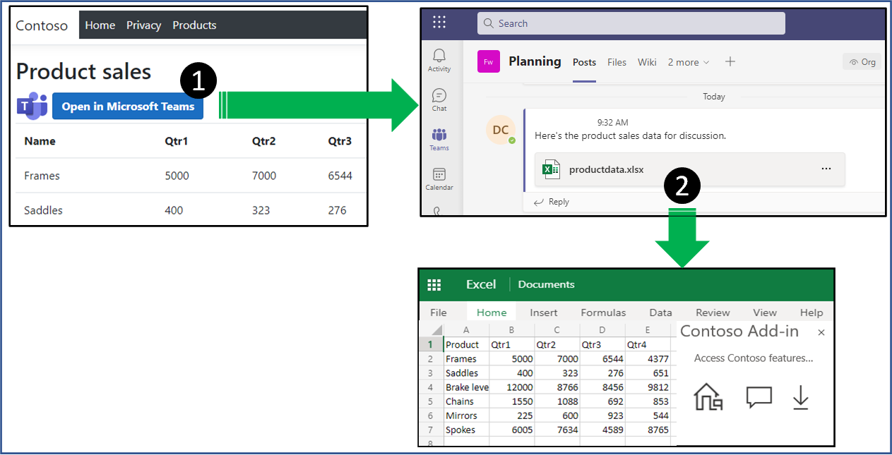
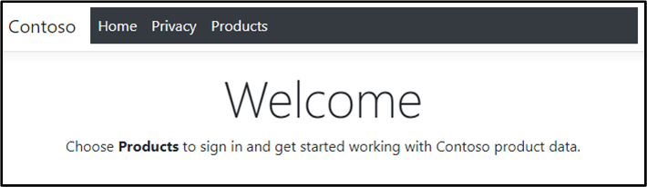
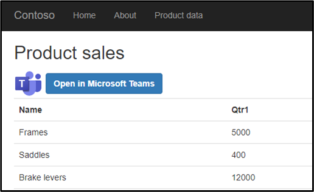
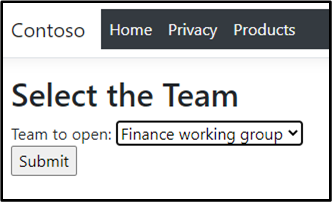
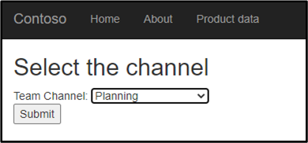
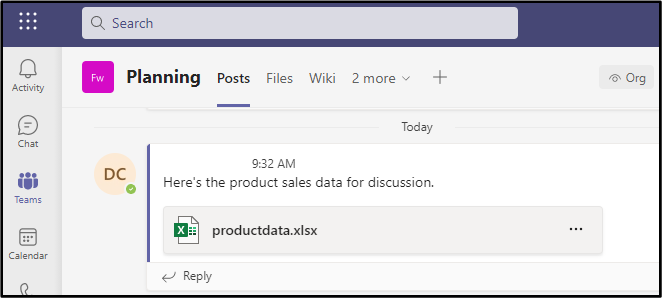

# Open data from your web site in a spreadsheet in Microsoft Teams

This sample accomplishes the following tasks.

- Creates a new Excel spreadsheet in Microsoft Teams containing data you define.
- Embeds your add-in into the Excel spreadsheet.
- Creates a message in Microsoft Teams with a link to the new spreadsheet.



## Applies to

- Microsoft Teams
- Microsoft Excel

## Prerequisites

- Microsoft 365
- At least one Microsoft Team and channel created on your Microsoft 365 tenant

## Register the add-in with Azure AD v2.0 endpoint

1. Navigate to the [Azure portal - App registrations](https://go.microsoft.com/fwlink/?linkid=2083908) page to register your app.

1. Sign in with the ***admin*** credentials to your Microsoft 365 tenancy. For example, MyName@contoso.onmicrosoft.com.

1. Select **New registration**. On the **Register an application** page, set the values as follows:

    - Set **Name** to `OpenInTeamsSample`.
    - Set **Supported account types** to **Accounts in any organizational directory (Any Azure AD directory - Multitenant) and personal Microsoft accounts (e.g. Skype, Xbox)**.
    - In the **Redirect URI** section, ensure that **Web** is selected in the dropdown and then set the URI to `https://localhost:44321/signin-oidc`.
    
    **Note:** The port number used for the redirect URI (`44321`) must match the port your web server is running on. When you open the Visual Studio solution in later steps, you can find the web server's port number in the **launchSettings.json** file under the **Properties** folder for the project.

1. Choose **Register**.

1. On the **OpenInTeamsSample** page, copy and save the **Application (client) ID**. You'll use it in later procedures.

1. Under **Manage**, select **Authentication**.
1. Enter a **Front-channel logout URL** of `https://localhost:44321/signout-oidc`.
1. Choose **Save**.

1. Under **Manage**, select **Certificates & secrets > New client secret**. 
1. Enter a **Description**, for example `clientscret1
1. Select a value for the secret's expiration
1. Choose **Add** and immediately record the secret's **Value** for use in a later step. The secret value is *never displayed again* and is irretrievable by any other means. Record it in a secure location as you would any password.

1. Under **Manage**, select **API permissions** and then select **Add a permission**. On the panel that opens, choose **Microsoft Graph** and then choose **Delegated permissions**.

1. Use the **Select permissions** search box to search the following permissions:

    - Channel.ReadBasic.All
    - ChannelMessage.Send
    - Files.ReadWrite
    - openid
    - profile
    - Team.ReadBasic.All

    **Note:** The `User.Read` permission may already be listed by default. It's a good practice not to ask for permissions that are not needed, so we recommend that you uncheck the box for this permission if your add-in does not actually need it.

1. Select the check box for each permission as it appears. After selecting the permissions, select the **Add permissions** button at the bottom of the panel.

1. On the same page, choose the **Grant admin consent for [tenant name]** button, and then select **Yes** for the confirmation that appears.

    **Note:** After choosing **Grant admin consent for [tenant name]**, you may see a banner message asking you to try again in a few minutes so that the consent prompt can be constructed. If so, you can start work on the next section, ***but don't forget to come back to the portal and press this button***!

## Configure the Sample

Before you run the sample, you'll need to do a few things to make it work properly.

1. In Visual Studio, open the **excel-open-in-teams.sln** solution file for this sample.
1. In the **Solution Explorer**, open **excel-open-in-teams > appsettings.json**.
1. Replace the `Enter_the_Application_Id_here` value with the application ID you generated as part of the app registration process.
1. Replace the `Enter_the_Client_Secret_Here` value with the client secret you generated as part of the app registration process.

> Note: You don't need to change the **Domain** or **TenantID** unless you used different tenant settings when setting up the app registration earlier.

## Run the sample

1. Press **F5** to build and debug the project. The Contoso Web application will open in a browser.

    

1. Choose the **Products** button on the ribbon.
1. You will be prompted to sign in. Sign in with a user name and password from your Microsoft 365 account.
    > Note: You may also be prompted to consent to the app permissions. You'll need to consent before the app can continue successfully.

    The product sales page is displayed.

    

1. Choose **Open in Microsoft Teams** to start the process of opening the data in Microsoft Teams
1. A page will appear titled **Select the Team**. Choose a team from the dropdown list and then choose **Submit**. This will select the team where you want to open the data.

    

1. A page will appear titled **Select the channel**. Choose a channel from the dropdown list and then choose **Submit**. This will select the channel where you want to open the data.

    

1. The page will now redirect to Microsoft Teams. Choose if you want to open Microsoft teams in the browser, or in the app.
1. When Microsoft Teams opens, you will see a chat message in the channel you chose containing a spreadsheet named productdata.xlsx. Choose the spreadsheet and open it.

    

When the spreadsheet opens, you will see the product data. The embedded Script Lab add-in will be available on the ribbon.

## Key parts of this sample

### Authentication

This sample reuses code from [Quickstart: ASP.NET Core web app that signs in users and calls Microsoft Graph on their behalf](https://learn.microsoft.com/azure/active-directory/develop/quickstart-v2-aspnet-core-webapp-calls-graph). To obtain the access token, this sample uses code from [A web app that calls web APIs: Acquire a token for the app](https://learn.microsoft.com/azure/active-directory/develop/scenario-web-app-call-api-acquire-token?tabs=aspnetcore).

### Constructing the spreadsheet

This sample uses the [Open XML SDK](https://learn.microsoft.com/office/open-xml/open-xml-sdk) to construct the spreadsheet in memory before uploading it to OneDrive. The code that constructs the spreadsheet is in **Helpers\SpreadsheetBuilder.cs**.

- The `InsertHeader` method inserts the header for the product data table.
- The `InsertData` method inserts the data values for the product data table.
- The `EmbedAddin` method embeds the script lab add-in.
- Modify the `GenerateWebExtensionPart1Content` method to embed your add-in instead of the script lab add-in. Note that there is a *CUSTOM MODIFICATION BEGIN/END* section where you can specify and custom properties that your add-in needs to load when it starts.

### Interacting with Microsoft Teams through the Microsoft Graph API

This sample uses the Microsoft Graph API to upload the spreadsheet to the OneDrive for Microsoft Teams, and also to create the message that links to the spreadsheet. The **ProductsController.cs** file contains the code that constructs the URL calls for Microsoft Graph. The **Helpers\GraphAPIHelper.cs** file contains code that gets the access token, makes the Microsoft Graph call, and returns the result.

### Sequence of events

When the user chooses to open in Microsoft Teams the following sequence of events occurs.

1. The `TeamsList` method in **ProductsController.cs** is called. `TeamsList` constructs a URL to query Microsoft Graph for all teams the user belongs to. The view is returned to the user containing the list of Teams in a dropdown box.
1. The user chooses which Team they want to open in. The `ChannelsListForTeam` method in  **ProductsController.cs** is called. `ChannelsListForTeam` constructs a URL to query Microsoft Graph for all channels for the selected team. The view is returned to the user containing the list of channels in a dropdown box.
1. The user chooses which channel they want to open in. The `UploadSpreadsheet` method in  **ProductsController.cs** is called. `UploadSpreadsheet` calls helper methods to construct the spreadsheet and upload it to the correct OneDrive location for the selected Team and Channel. Then it calls a helper method to create a new chat message that links to the spreadsheet. It returns a view containing a redirect URI to the new message on Teams.
1. The `UploadToTeams` view loads and redirects to the chat message that was created.

## Modify the sample for your own web site

To repurpose the code in this sample for your own web site, you'll want to make the following changes.

### Use your own data

The sample creates an in memory database that contains a small array of product data. You'll need to replace this code to use the actual data from your web site.

The data models are found in **\Models\IProductData.cs** and **\Models\Product.cs**. Replace these files with the correct models for your web site.

The database is initialized in the `ProductsController` constructor in **\Controllers\ProductsController.cs**. Replace this code with the correct initialization code for your web site data.

The **\Helpers\SpreadsheetBuilder.cs** file contains two methods that are bound to the product model data of this sample. See the `InsertHeader` and `InsertData` methods. You'll need to update these to construct the correct header and table rows for your data model.

### Embed your add-in

The sample embeds the script lab add-in. You'll need to change the code to embed your own add-in.

In the **\Helpers\SpreadsheetBuilder.cs** file, the `GenerateWebExtensionPart1Content` method sets the reference to Script Lab.

```csharp
We.WebExtension webExtension1 = new We.WebExtension() { Id = "{635BF0CD-42CC-4174-B8D2-6D375C9A759E}" };
webExtension1.AddNamespaceDeclaration("we", "http://schemas.microsoft.com/office/webextensions/webextension/2010/11");
We.WebExtensionStoreReference webExtensionStoreReference1 = new We.WebExtensionStoreReference() { Id = "wa104380862", Version = "1.1.0.0", Store = "en-US", StoreType = "OMEX" };
```

In the previous code:

- The **StoreType** value is "OMEX", an alias for the Office Store.
- The **Store** value is "en-US" the culture section of the store where Script Lab is.
- The **Id** value is the Office Store's asset ID for Script Lab.

If you are embedding an add-in from a file share catalog for auto-open, use the following values:

- Set the **StoreType** to "FileSystem".
- Set the **Store** value to the URL of the network share; for example, "\\\MyComputer\MySharedFolder". This must be the exact URL that appears as the share's **Trusted Catalog Address** in the Office **Trust Center**.
- Set the **Id** value to be the app ID in the add-ins manifest.

> **Note**: For more information about alternative values for these attributes, see [Automatically open a task pane with a document](https://learn.microsoft.com/office/dev/add-ins/develop/automatically-open-a-task-pane-with-a-document).

The `GeneratePartContent` method specifies the visibility of the task pane when the file opens.

```csharp
Wetp.WebExtensionTaskpane webExtensionTaskpane1 = new Wetp.WebExtensionTaskpane() { DockState = "right", Visibility = true, Width = 350D, Row = (UInt32Value)4U };
```

In the previous code, the `Visibility` property of the `WebExtensionTaskpane` object is set to `true`. This ensures that the first time that the file is opened after the code is run, the task pane opens with Script Lab in it (after the user accepts the prompt to trust Script Lab). This is what we want for this sample. However, in most scenarios you will probably want this set to `false`. The effect of setting it to false is that the *first* time the file is opened, the user has to install the add-in, from the **Add-in** button on the ribbon. On every *subsequent* opening of the file, the task pane with the add-in opens automatically.

The advantage of setting this property to `false` is that you can use the Office.js to give users the ability to turn on and off the auto-opening of the add-in. Specifically, your script sets the **Office.AutoShowTaskpaneWithDocument** document setting to `true` or `false`. However, if `WebExtensionTaskpane.Visibility` is set to `true`, there is no way for Office.js or, hence, your users to turn off the auto-opening of the add-in. Only editing the OOXML of the document can change `WebExtensionTaskpane.Visibility` to false.

> **Note**: For more information about task pane visibility at the level of the Open XML that these .NET APIs represent, see [Automatically open a task pane with a document](https://learn.microsoft.com/office/dev/add-ins/develop/automatically-open-a-task-pane-with-a-document).

## Questions and feedback

- Did you experience any problems with the sample? [Create an issue](https://github.com/OfficeDev/Office-Add-in-samples/issues/new/choose) and we'll help you out.
- We'd love to get your feedback about this sample. Go to our [Office samples survey](https://aka.ms/OfficeSamplesSurvey) to give feedback and suggest improvements.
- For general questions about developing Office Add-ins, go to [Microsoft Q&A](https://learn.microsoft.com/answers/topics/office-js-dev.html) using the office-js-dev tag.

## Solution

Solution | Authors
---------|----------
Open data from your web site in a spreadsheet in Microsoft Teams | Microsoft

## Version history

Version  | Date | Comments
---------| -----| --------
1.0  | August 13, 2021 | Initial release

## Copyright

Copyright (c) 2021 Microsoft Corporation. All rights reserved.

This project has adopted the [Microsoft Open Source Code of Conduct](https://opensource.microsoft.com/codeofconduct/). For more information, see the [Code of Conduct FAQ](https://opensource.microsoft.com/codeofconduct/faq/) or contact [opencode@microsoft.com](mailto:opencode@microsoft.com) with any additional questions or comments.

