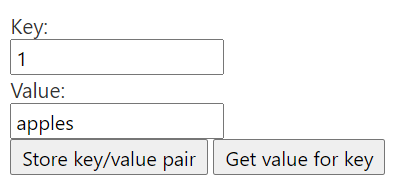

# Share global data with a shared runtime

## Summary

This sample shows how to set up a basic project that uses the shared runtime. The shared runtime runs all parts of the Excel add-in (ribbon buttons, task pane, custom functions) in a single browser runtime. This makes it easy to shared data through local storage, or through global variables.


## Features

- Share data globally with ribbon buttons, the task pane, and custom functions.
- To get started, use a provided manifest XML file to create a new project with a shared runtime.

## Applies to

-  Excel on Windows, Mac, and in a browser.

## Prerequisites

- Microsoft 365

## Solution

Solution | Author(s)
---------|----------
Office Add-in share global data with a shared runtime | Microsoft

## Version history

Version  | Date | Comments
---------| -----| --------
1.0 | 3-15-2020 | Initial release
1.1 | May 26, 2021 | Updated to use GitHub pages for hosting

----------

## Scenario: Sharing key/value pairs

This sample enables a user to store and retrieve key/value pairs by using the task pane or custom functions. The user can select which type of storage is used. They can choose to store key/value pairs in local storage, or choose to use a global variable.

## Run the sample

You can run this sample in Excel in a browser. The add-in web files are served from this repo on GitHub.

1. Download the **manifest.xml** file from this sample to a folder on your computer.
1. Open [Office on the web](https://office.live.com/).
1. Choose **Excel**, and then open a new document.
1. Open the **Insert** tab on the ribbon and choose **Office Add-ins**.
1. On the **Office Add-ins** dialog, select the **MY ADD-INS** tab, choose **Manage My Add-ins**, and then **Upload My Add-in**.
   
1. Browse to the add-in manifest file, and then select **Upload**.
   
1. Verify that the add-in loaded successfully. You will see a **Show Taskpane** button on the **Home** tab on the ribbon.

Once the add-in is loaded use the following steps to try out the functionality.

1. On the `Home` tab, choose `Show TaskPane`.
2. In the task pane, enter a key/value pair, and choose `Store key/value pair`.

3. In any spreadsheet cell, enter the formula `=CONTOSO.GETVALUEFORKEYCF("1")`. Pass the value of the key you created from the task pane.
4. In any spreadsheet cell, enter the formula `=CONTOSO.SETVALUEFORKEYCF("2","oranges")`. The formula should return the text `Stored key/value pair`.
5. In the task pane, enter the key from the previous formula `2` and choose `Get value for key`. The task pane should display the value `oranges`.

The task pane and custom function share data via a global variable in the shared runtime. You can switch the method of storage by choosing either the `Global variable` or `Local storage` radio buttons on the task pane.

## Key parts of this sample

The manifest.xml is configured to use the shared runtime by using the `Runtimes` element as follows:

```xml
<Runtimes>
   <Runtime resid="Shared.Url" lifetime="long" />
</Runtimes>
```

In other parts of the manifest, you'll see that the custom functions and task pane are also configured to use the `Shared.Url` because they all run in the same runtime. `Shared.Url` points to `taskpane.html` which loads the shared runtime.

Global state is tracked in a window object retrieved using a `getGlobal()` function. This is accessible to custom functions, the task pane, and the ribbon (because all the code is running in the same JavaScript runtime.) 

There are no commands.html or functions.html files. These are not necessary because their purpose is to load individual runtimes. These do not apply when using the shared runtime.

## Run the sample from Localhost

If you prefer to host the web server for the sample on your computer, follow these steps:

1. You need http-server to run the local web server. If you haven't installed this yet you can do this with the following command:
    
    ```console
    npm install --global http-server
    ```
    
2. Use a tool such as openssl to generate a self-signed certificate that you can use for the web server. Move the cert.pem and key.pem files to the root folder for this sample.
3. From a command prompt, go to the root folder and run the following command:
    
    ```console
    http-server -S --cors . -p 3000
    ```
    
4. To reroute to localhost run office-addin-https-reverse-proxy. If you haven't installed this you can do this with the following command:
    
    ```console
    npm install --global office-addin-https-reverse-proxy
    ```
    
    To reroute run the following in another command prompt:
    
    ```console
    office-addin-https-reverse-proxy --url http://localhost:3000
    ```
    
5. Follow the steps in [Run the sample](#run-the-sample), but upload the `manifest-localhost.xml` file for step 6.

## Questions and feedback

- Did you experience any problems with the sample? [Create an issue](https://github.com/OfficeDev/Office-Add-in-samples/issues/new/choose) and we'll help you out.
- We'd love to get your feedback about this sample. Go to our [Office samples survey](https://aka.ms/OfficeSamplesSurvey) to give feedback and suggest improvements.
- For general questions about developing Office Add-ins, go to [Microsoft Q&A](https://learn.microsoft.com/answers/topics/office-js-dev.html) using the office-js-dev tag.

## Copyright

Copyright (c) 2020 Microsoft Corporation. All rights reserved.

This project has adopted the [Microsoft Open Source Code of Conduct](https://opensource.microsoft.com/codeofconduct/). For more information, see the [Code of Conduct FAQ](https://opensource.microsoft.com/codeofconduct/faq/) or contact [opencode@microsoft.com](mailto:opencode@microsoft.com) with any additional questions or comments.


