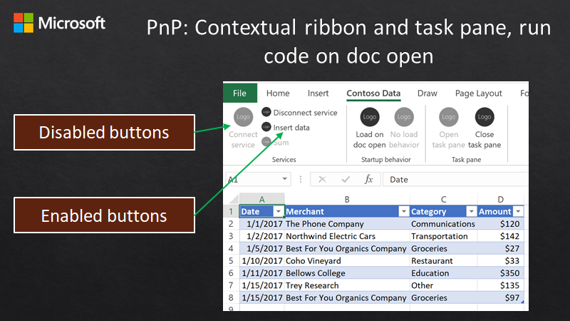

# Manage ribbon and task pane UI, and run code on doc open

## Summary

This sample shows how to create contextual ribbon buttons that are enabled based on the state of your add-in. It also shows how to use the Office.js API to show or hide the task pane. This sample also demonstrates how to run code when the task pane is closed, such as on document open.



## Features

- Contextual ribbon UI that enables or disables the buttons.
- Set load behavior to load the add-in and run code when the document is opened.
- Open and close the task pane through the Office.js API.
- Handle Office.js events even when the task pane is closed.
- Share data globally, such as between custom functions and the task pane.

## Applies to

- Excel on Windows
- Excel on Mac
- Excel on the web

## Prerequisites

- A Microsoft 365 tenant

## Solution

Solution | Author(s)
---------|----------
Office Add-in Shared Runtime Ribbon/Task pane APIs | Microsoft

## Version history

Version  | Date | Comments
---------| -----| --------
1.0 | 3-9-2020 | Initial release
1.1 | 8-5-2021 | Update to GitHub page hosting

## Scenario: A contextual add-in

This sample demonstrates a fictional scenario where the add-in connects to a backend data service to help the user import and work with Contoso data. To keep things simple, the data is mock data and the sample does not require an actual backend data service.

The add-in is aware of whether it is connected. When connected you will see the task pane update to allow you to import data, and also the ribbon buttons will be enabled to let you insert a table and work with the data. 

Additionally the add-in has a custom function that can display a filtered view of the data. The custom function is aware of the connection status, so that when connected, it will display the mock data. When disconnected, it will show `#N/A`.

## Run the sample

You can run this sample in Excel in a browser. The add-in web files are served from this repo on GitHub.

1. Download the **manifest.xml** file from this sample to a folder on your computer.
1. Open [Office on the web](https://office.live.com/).
1. Choose **Excel**, and then open a new document.
1. Open the **Insert** tab on the ribbon and choose **Office Add-ins**.
1. On the **Office Add-ins** dialog, select the **MY ADD-INS** tab, choose **Manage My Add-ins**, and then **Upload My Add-in**.
   
1. Browse to the add-in manifest file, and then select **Upload**.
   
1. Verify that the add-in loaded successfully. You will see a **Contoso** tab on the ribbon.

The add-in's ribbon buttons have the following behavior:

- **Connect service:** Connects to a mock Contoso data service. You can choose a CSV file, or database.
- **Disconnect service:** Disonnects from the mock Contoso data service.
- **Insert data:** Inserts a table from the mock Contoso data service.
- **Sum:** Enabled when you are in the table. Select a range of numerical cells and it will output the sum of those cells.
- **Load on doc open:** Choose this to enable the add-in to run the next time the document is opened. The `Sum` button will work immediately when in the table the next time the document is opened. Note that you need to save the document first to save this change.
- **No load behavior:** Choose this to disable the add-in from running on document open. The Sum button will not work until you activate the add-in in some way (ribbon, task pane or custom function action).
- **Open task pane:** Opens the task pane.
- **Close task pane:** Closes the task pane. The task pane is not shut down and will remember its state.

If the add-in is not connected to a service, the task pane will show a button to connect. Once connected, the task pane lets you choose a category from the data and insert a custom function. The custom function will filter data displayed to the selected category.

## Key parts of this sample

Global state is tracked in a window object retrieved using a `getGlobal()` function. This is accessible to custom functions, the task pane, and the ribbon (because all the code is running in the same JavaScript runtime.) The `ensureStateInitialized()` method initializes global state on startup. The global state tracks many items such as whether the add-in is connected to a service, and whether the task pane is open or closed.

### Enable and disable ribbon buttons

To enable and disable ribbon buttons the add-in uses the `Office.ribbon.requestUpdate` method and passes a JSON description of the buttons. Anytime there is a state change that requires the ribbon buttons to change, the `updateRibbon()` is called which sets if buttons are enabled based on global state variables.

### Open and close the task pane

To open or close the task pane, the add-in uses the `Office.addin.showAsTaskpane()` and `Office.addin.hide()` methods.

### Set runtime load behavior

If the `Load on doc open` button is chosen, the add-in configures the document so that the add-in begins running as soon as the document is opened. This allows the add-in to start running and monitoring Office events before the task pane is displayed. To configure the document to load the add-in on open, the add-in uses the `Office.addin.setStartupBehavior(Office.StartupBehavior.load)` method. To turn off the document load behavior, the add-in uses the `Office.addin.setStartupBehavior(Office.StartupBehavior.none)` method.

### Run code in the background

The add-in has a `Sum` button that is enabled when you move the range selection inside the expenses table. An event in the table is used to detect when the range selection is in or out of the table. If the add-in was configured to load on doc open, the event code will be operational as soon as the document is opened, and the `Sum` button will work even though the task pane is not yet opened.

To run code when the document opens, the add-in relies on the `Office.Initialize` event. This event is called when the document is opened and the load behavior is set for doc open. The add-in calls `ensureInitialize()` to set up the initial global state.

```typescript
Office.initialize = async () => {
    ensureStateInitialized(true);
    
    ...
```

The `ensureStateInitialized()` method will call the `monitorSheetCHanges()` method which will then search for the expenses table. If the expenses table was inserted, it adds an event handler for the `onTableSelectionChange` event. This is how the event handler code is set up on doc open.

```typescript
export async function monitorSheetChanges() {
  try {
    let g = getGlobal() as any;
    if (g.state.isInitialized) {
      await Excel.run(async context => {
        let table = context.workbook.tables.getItem('ExpensesTable');
        if (table !== undefined) {
          table.onSelectionChanged.add(onTableSelectionChange);
          await context.sync();
          updateRibbon();
        } else {
          g.state.isSumEnabled = false;
          updateRibbon();
        }
      ...
```


## Run the sample from Localhost

If you prefer to host the web server for the sample on your computer, follow these steps:

1. You need http-server to run the local web server. If you haven't installed this yet you can do this with the following command:
    
    ```console
    npm install --global http-server
    ```
    
2. Use a tool such as openssl to generate a self-signed certificate that you can use for the web server. Move the cert.pem and key.pem files to the webworker-customfunction folder for this sample.
3. From a command prompt, go to the web-worker folder and run the following command:
    
    ```console
    http-server -S --cors . -p 3000
    ```
    
4. To reroute to localhost run office-addin-https-reverse-proxy. If you haven't installed this you can do this with the following command:
    
    ```console
    npm install --global office-addin-https-reverse-proxy
    ```
    
    To reroute run the following in another command prompt:
    
    ```console
    office-addin-https-reverse-proxy --url http://localhost:3000
    ```
    
5. Follow the steps in Run the sample, but upload the `manifest-localhost.xml` file for step 6.

## Security notes

None

## Copyright

Copyright (c) 2020 Microsoft Corporation. All rights reserved.

This project has adopted the [Microsoft Open Source Code of Conduct](https://opensource.microsoft.com/codeofconduct/). For more information, see the [Code of Conduct FAQ](https://opensource.microsoft.com/codeofconduct/faq/) or contact [opencode@microsoft.com](mailto:opencode@microsoft.com) with any additional questions or comments.


