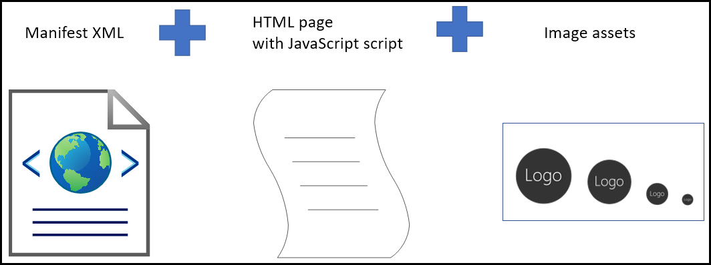

# Create an Office Add-in that displays hello world

## Summary

Learn how to build the simplest Office Add-in with only a manifest, HTML web page, and a logo. This sample will help you understand the fundamental parts of an Office Add-in.

## Features

- Display hello world in Outlook, Word, Excel, or PowerPoint.
- Learn fundamentals of the manifest.
- Learn how to initialize the Office JavaScript API library.
- Interact with document content through Office JavaScript APIs.

## Applies to

- Office on Windows, Mac, and in a browser.

## Prerequisites

- Microsoft 365 - You can get a [free developer sandbox](https://developer.microsoft.com/microsoft-365/dev-program#Subscription) that provides a renewable 90-day Microsoft 365 E5 developer subscription.

## Understand an Office Add-in

An Office Add-in is a web application that can extend Office with additional functionality for the user. For example, an add-in can add ribbon buttons, a task pane, or a content pane with the functionality you want. Because an Office Add-in is a web application you must provide a web server to host the files.

A sample was created for each Office application. Each folder is a sample that is designed to run in the indicated Office application.

- outlook-hello-world: [Hello world sample for Outlook](outlook-hello-world/README.md)
- excel-hello-world: [Hello world sample for Excel](excel-hello-world/README.md)
- word-hello-world: [Hello world sample for Word](word-hello-world/README.md)
- powerpoint-hello-world: [Hello world sample for PowerPoint](powerpoint-hello-world/README.md)

To work with the samples, clone or download this repo. Then go to the folder containing the sample for the Office application you want to work with. All of the following guidance will apply to the sample you choose to work with. Details on internals and how to run the add-in for each host can be found in the matching subfolder.

## Key components

The hello world sample implements the **Manifest** and **Web app** components identified in [Components of an Office Add-in](https://learn.microsoft.com/office/dev/add-ins/overview/office-add-ins#components-of-an-office-add-in).

### Manifest

You only need one manifest file for your add-in. The hello world sample contains two manifest files to support two different hosting scenarios.

- **manifest.xml**: This manifest file will load the add-in from the GitHub repo (through GitHub page hosting). You can run the sample and don't need to configure your own web server.
- **manifest.localhost.xml**: This manifest file will load the add-in from a local web server that you configure. See the README files for the specific hosts on how to run the local web server.

### Web app

The hello world sample implements a task pane named **taskpane.html** that contains HTML and JavaScript. The **taskpane.html** file contains all the code necessary to display a task pane, interact with the user, and write "Hello world!" to the document.

## Details and running the Add-in

For details on the specific hosts (Word, Excel, PowerPoint and Outlook) see the README files for details when using each host and to learn how to run the local web server.

## Copyright

Copyright (c) 2021 Microsoft Corporation. All rights reserved.

This project has adopted the [Microsoft Open Source Code of Conduct](https://opensource.microsoft.com/codeofconduct/). For more information, see the [Code of Conduct FAQ](https://opensource.microsoft.com/codeofconduct/faq/) or contact [opencode@microsoft.com](mailto:opencode@microsoft.com) with any additional questions or comments.

