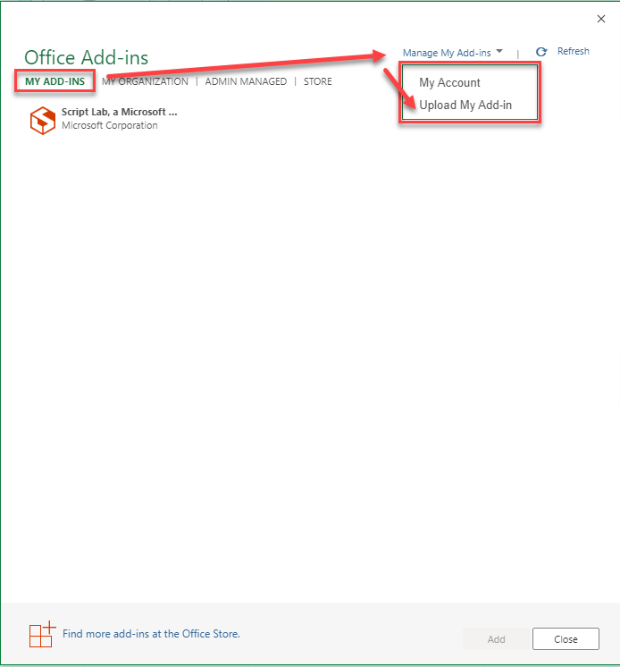
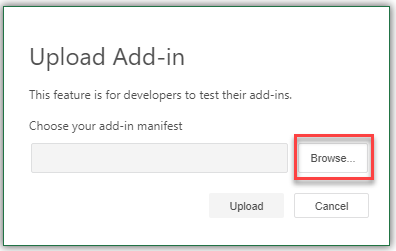

# Create an Excel add-in that displays hello world

## Summary

Learn how to build the simplest Office Add-in with only a manifest, HTML web page, and a logo. This sample will help you understand the fundamental parts of an Office Add-in.

## Features

- Display hello world in Excel.
- Learn fundamentals of the manifest.
- Learn how to initialize the Office JavaScript API library.
- Interact with document content through Office JavaScript APIs.

## Applies to

- Excel on Windows, Mac, and in a browser.

## Prerequisites

- Microsoft 365 - You can get a [free developer sandbox](https://developer.microsoft.com/microsoft-365/dev-program#Subscription) that provides a renewable 90-day Microsoft 365 E5 developer subscription.

## Understand an Office Add-in

An Office Add-in is a web application that can extend Office with additional functionality for the user. For example, an add-in can add ribbon buttons, a task pane, or a content pane with the functionality you want. Because an Office Add-in is a web application you must provide a web server to host the files.

The sample contained in this folder is a sample that is designed to run in Excel.

## Key components

The hello world sample implements the **Manifest** and **Web app** components identified in [Components of an Office Add-in](https://learn.microsoft.com/office/dev/add-ins/overview/office-add-ins#components-of-an-office-add-in).

### Manifest

The manifest file is an XML file that describes your add-in to Office. It contains information such as a unique identifier, name, what buttons to show on the ribbon, and more. Importantly the manifest provides URL locations for where Office can find and download the add-in's resource files.

The hello world sample contains two manifest files to support two different web hosting scenarios.

- **manifest.xml**: This manifest file gets the add-in's HTML page from the original GitHub repo location. This is the quickest way to try out the sample. To get started running the add-in with this manifest, see [Run the sample on Excel on Windows or Mac](#run-the-sample-on-excel-on-windows-or-mac).
- **manifest.localhost.xml**: This manifest file gets the add-in's HTML page from a local web server that you configure. Use this manifest if you want to change the code and experiment. For more information, see [Configure a localhost web server](#configure-a-localhost-web-server).

### Web app

The hello world sample implements a task pane named **taskpane.html** that contains HTML and JavaScript. The **taskpane.html** file contains all the code necessary to display a task pane, interact with the user, and write "Hello world!" into cell 'A1' on the active Worksheet.

### Initialize the Office JavaScript API library

The sample initializes the Office JavaScript API library with a call to `office.onReady()` in the **taskpane.html** file. This is required before you can make any calls to the Office JavaScript APIs. For more information about initialization, see [Initialize your Office Add-in](https://learn.microsoft.com/office/dev/add-ins/develop/initialize-add-in).

```javascript
Office.onReady((info) => {});
```

### Write to the worksheet

When the user chooses the **Say hello** button, the `sayHello()` function is called. This function then calls `Excel.run` to run code and call the Office JavaScript APIs. It uses a `context` object provided by the Office JS API library to get the active worksheet's `A1` range value and set the value to "Hello world!". Calling `context.sync()` runs the command.

For more information see [Tutorial: Create an Excel task pane add-in](https://learn.microsoft.com/office/dev/add-ins/tutorials/excel-tutorial)

```javascript
function sayHello() {
  Excel.run((context) => {
    context.workbook.worksheets.getActiveWorksheet().getRange('A1').values = [
      ['Hello world!'],
    ];
    return context.sync();
  });
}
```

## Run the sample on Excel on web

An Office Add-in requires you to configure a web server to provide all the resources, such as HTML, image, and JavaScript files. The hello world sample is configured so that the files are hosted directly from this GitHub repo. Use the following steps to sideload the manifest.xml file to see the sample run.

1.  Download the **manifest.xml** file from the sample folder for Excel.
1.  Open [Office on the web](https://office.live.com/).
1.  Choose **Excel**, and then open a new document.
1.  On the **Insert** tab on the ribbon in the **Add-ins** section, choose **Office Add-ins**.
1.  On the **Office Add-ins** dialog, select the **MY ADD-INS** tab, choose **Manage My Add-ins**, and then **Upload My Add-in**.

    

1.  Browse to the add-in manifest file, and then select **Upload**.

    

1.  Verify that the add-in loaded successfully. You will see a **Hello world** button on the **Home** tab on the ribbon.

Choose the **Hello world** button on the **Home** tab to display the task pane of the add-in. Choose the **Say hello** button to insert "Hello world!" in cell A1.

## Run the sample on Excel on Windows or Mac

Office Add-ins are cross-platform so you can also run them on Windows, Mac, and iPad. The following links will take you to documentation for how to sideload on Windows, Mac, or iPad. Be sure you have a local copy of the manifest.xml file for the Hello world sample. Then follow the sideloading instructions for your platform.

- [Sideload Office Add-ins for testing from a network share](https://learn.microsoft.com/office/dev/add-ins/testing/create-a-network-shared-folder-catalog-for-task-pane-and-content-add-ins)
- [Sideload Office Add-ins on Mac for testing](https://learn.microsoft.com/office/dev/add-ins/testing/sideload-an-office-add-in-on-mac)
- [Sideload Office Add-ins on iPad for testing](https://learn.microsoft.com/office/dev/add-ins/testing/sideload-an-office-add-in-on-ipad)

## Configure a localhost web server and run the sample from localhost

If you prefer to configure a web server and host the add-in's web files from your computer, use the following steps:

1.  Install a recent version of [npm](https://www.npmjs.com/get-npm) and [Node.js](https://nodejs.org/) on your computer. To verify if you've already installed these tools, run the commands `node -v` and `npm -v` in your terminal.

2.  You need http-server to run the local web server. If you haven't installed this yet you can do this with the following command:

    ```console
    npm install --global http-server
    ```

3.  You need Office-Addin-dev-certs to generate self-signed certificates to run the local web server. If you haven't installed this yet you can do this with the following command:

    ```console
    npm install --global office-addin-dev-certs
    ```

4.  Clone or download this sample to a folder on your computer. Then go to that folder in a console or terminal window.
5.  Run the following command to generate a self-signed certificate that you can use for the web server.

    ```console
    npx office-addin-dev-certs install
    ```

    The previous command will display the folder location where it generated the certificate files.

6.  Go to the folder location where the certificate files were generated. Copy the localhost.crt and localhost.key files to the hello world sample folder.

7.  Run the following command:

    ```console
    http-server -S -C localhost.crt -K localhost.key --cors . -p 3000
    ```

    The http-server will run and host the current folder's files on localhost:3000.

Now that your localhost web server is running, you can sideload the **manifest-localhost.xml** file provided in the excel-hello-world folder. Using the **manifest-localhost.xml** file, follow the steps in [Run the sample on Excel on web](#run-the-sample-on-excel-on-web) to sideload and run the add-in.

## Questions and feedback

- Did you experience any problems with the sample? [Create an issue](https://github.com/OfficeDev/Office-Add-in-samples/issues/new/choose) and we'll help you out.
- We'd love to get your feedback about this sample. Go to our [Office samples survey](https://aka.ms/OfficeSamplesSurvey) to give feedback and suggest improvements.
- For general questions about developing Office Add-ins, go to [Microsoft Q&A](https://learn.microsoft.com/answers/topics/office-js-dev.html) using the office-js-dev tag.

## Copyright

Copyright (c) 2021 Microsoft Corporation. All rights reserved.

This project has adopted the [Microsoft Open Source Code of Conduct](https://opensource.microsoft.com/codeofconduct/). For more information, see the [Code of Conduct FAQ](https://opensource.microsoft.com/codeofconduct/faq/) or contact [opencode@microsoft.com](mailto:opencode@microsoft.com) with any additional questions or comments.

**Note**: The taskpane.html file contains an image URL that tracks diagnostic data for this sample add-in. Please remove the image tag if you reuse this sample in your own code project.


