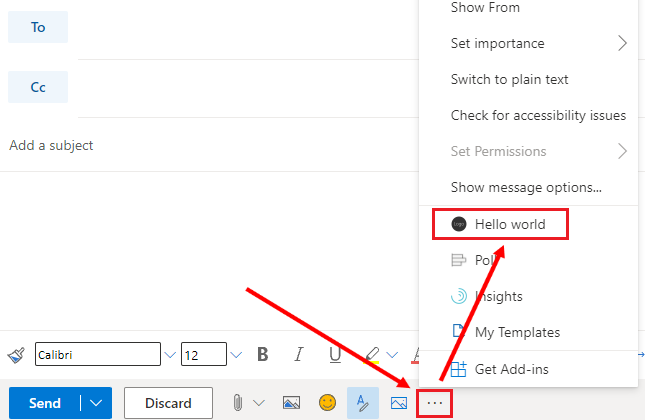
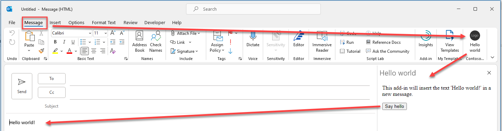

# Create an Outlook add-in that displays hello world

## Summary

Learn how to build the simplest Office Add-in with only a manifest, HTML web page, and a logo. This sample will help you understand the fundamental parts of an Office Add-in.

## Features

- Display hello world in an Outlook email message.
- Learn fundamentals of the manifest.
- Learn how to initialize the Office JavaScript API library.
- Interact with message content through Office JavaScript APIs.

## Applies to

- Outlook on Windows, Mac, and in a browser.

## Prerequisites

- Microsoft 365 - You can get a [free developer sandbox](https://developer.microsoft.com/microsoft-365/dev-program#Subscription) that provides a renewable 90-day Microsoft 365 E5 developer subscription.

## Understand an Office Add-in

An Office Add-in is a web application that can extend Office with additional functionality for the user. For example, an add-in can add ribbon buttons, and a task pane with the functionality you want. Because an Office Add-in is a web application you must provide a web server to host the files.

The sample contained in this folder is a sample that is designed to run in Outlook.

## Key components

The hello world sample implements the **Manifest** and **Web app** components identified in [Components of an Office Add-in](https://learn.microsoft.com/office/dev/add-ins/overview/office-add-ins#components-of-an-office-add-in).

### Manifest

The manifest file is an XML file that describes your add-in to Office. It contains information such as a unique identifier, name, what buttons to show on the ribbon, and more. Importantly the manifest provides URL locations for where Office can find and download the add-in's resource files.

The hello world sample contains two manifest files to support two different web hosting scenarios.

- **manifest.xml**: This manifest file gets the add-in's HTML page from the original GitHub repo location. This is the quickest way to try out the sample. To get started running the add-in with this manifest, see [Run the sample on Outlook on Windows or Mac](#run-the-sample-on-outlook-on-windows-or-mac).
- **manifest.localhost.xml**: This manifest file gets the add-in's HTML page from a local web server that you configure. Use this manifest if you want to change the code and experiment. For more information, see [Configure a localhost web server](#configure-a-localhost-web-server).

### Web app

The hello world sample implements a task pane named **taskpane.html** that contains HTML and JavaScript. The **taskpane.html** file contains all the code necessary to display a task pane, interact with the user, and write "Hello world!" into a new email message.

### Initialize the Office JavaScript API library

The sample initializes the Office JavaScript API library with a call to `office.onReady()` in the **taskpane.html** file. This is required before you can make any calls to the Office JavaScript APIs. For more information about initialization, see [Initialize your Office Add-in](https://learn.microsoft.com/office/dev/add-ins/develop/initialize-add-in).

```javascript
Office.onReady((info) => {});
```

### Write to the email message

When the user chooses the **Say hello** button, the `sayHello()` function is called as shown in the following code sample. This function then calls `Office.context.mailbox.item.body.setAsync()` which is an Office JavaScript API. The `setAsync()` method overwrites the body of the message with "Hello world!". Then it calls the anonymous callback method `function (asyncResult)`. Most Outlook functions in the Office JavaScript API use this callback pattern. In this sample, the callback method checks that the call was successful. If not it writes an error message to the console.

```javascript
/**
 * Writes 'Hello world!' to a new message body.
 */
function sayHello() {
  Office.context.mailbox.item.body.setAsync(
    'Hello world!',
    {
      coercionType: 'html', // Write text as HTML
    },

    // Callback method to check that setAsync succeeded
    function (asyncResult) {
      if (asyncResult.status == Office.AsyncResultStatus.Failed) {
        write(asyncResult.error.message);
      }
    }
  );
}
```

For more information see [Build your first Outlook add-in](https://learn.microsoft.com/office/dev/add-ins/quickstarts/outlook-quickstart)

## Run the sample on Outlook on Web

An Office Add-in requires you to configure a web server to provide all the resources, such as HTML, image, and JavaScript files. The hello world sample is configured so that the files are hosted directly from this GitHub repo.

The process for sideloading an add-in in Outlook on the web depends upon whether you are using the new or classic version.

- If your mailbox toolbar looks like the following image, see [Sideload an add-in in the new Outlook on the web](#new-outlook-on-the-web).

  

- If your mailbox toolbar looks like the following image, see [Sideload an add-in in classic Outlook on the web](#classic-outlook-on-the-web).

  

> [!NOTE]
> If your organization has included its logo in the mailbox toolbar, you might see something slightly different than shown in the preceding images.

### New Outlook on the web

1. Go to [Outlook on the web](https://outlook.office.com).

1. Create a new message.

1. Choose **...** from the bottom of the new message and then select **Get Add-ins** from the menu that appears.

   

1. In the **Add-Ins for Outlook** dialog box, select **My add-ins**.

   

1. Locate the **Custom add-ins** section at the bottom of the dialog box. Select the **Add a custom add-in** link, and then select **Add from file**.

   

1. Locate the **manifest.xml** file in the sample folder for Outlook and install it. Accept all prompts during the installation.

### Classic Outlook on the web

1. Go to [Outlook on the web](https://outlook.office.com).

1. Choose the gear icon in the top-right section of the toolbar and select **Manage add-ins**.

   

1. On the **Manage add-ins** page, select **Add-Ins**, and then select **My add-ins**.

   

1. Locate the **Custom add-ins** section at the bottom of the dialog box. Select the **Add a custom add-in** link, and then select **Add from file**.

   

1. Locate the **manifest.xml** file in the sample folder for Outlook and install it. Accept all prompts during the installation.

> Note: The previous steps are from [Sideload Outlook add-ins for testing](https://learn.microsoft.com/office/dev/add-ins/outlook/sideload-outlook-add-ins-for-testing)

1. Create a new email message.
1. Choose the **More compose actions ...** button, and then choose **Hello world**. The add-in will insert "Hello world!" into the body of the email message.



## Run the sample on Outlook on Windows or Mac

Office Add-ins are cross-platform so you can also run them on Windows, Mac, and iPad. The following links will take you to documentation for how to sideload on Windows, Mac, or iPad. Be sure you have a local copy of the manifest.xml file for the Hello world sample. Then follow the sideloading instructions for your platform.

- [Sideload Outlook add-in on Windows or Mac](https://learn.microsoft.com/office/dev/add-ins/outlook/sideload-outlook-add-ins-for-testing#outlook-on-the-desktop)

## Test the sample on Outlook

1. Verify that the add-in loaded successfully. You will see a **Hello World** button on the Message tab on the ribbon.
2. Choose the **Hello World** button on the Ribbon to see the Add-in Taskpane with the text "This add-in will insert the text 'Hello world!' in a new message."
3. Choose the **Say hello** button to insert "Hello world!" in the message body.



## Configure a localhost web server and run the sample from localhost

If you prefer to configure a web server and host the add-in's web files from your computer, use the following steps:

1. Install a recent version of [npm](https://www.npmjs.com/get-npm) and [Node.js](https://nodejs.org/) on your computer. To verify if you've already installed these tools, run the commands `node -v` and `npm -v` in your terminal.

2. You need http-server to run the local web server. If you haven't installed this yet you can do this with the following command:

   ```console
   npm install --global http-server
   ```

3. You need Office-Addin-dev-certs to generate self-signed certificates to run the local web server. If you haven't installed this yet you can do this with the following command:

   ```console
   npm install --global office-addin-dev-certs
   ```

4. Clone or download this sample to a folder on your computer. Then go to that folder in a console or terminal window.
5. Run the following command to generate a self-signed certificate that you can use for the web server.

   ```console
   npx office-addin-dev-certs install
   ```

   The previous command will display the folder location where it generated the certificate files.

6. Go to the folder location where the certificate files were generated. Copy the localhost.crt and localhost.key files to the hello world sample folder.

7. Run the following command:

   ```console
   http-server -S -C localhost.crt -K localhost.key --cors . -p 3000
   ```

   The http-server will run and host the current folder's files on localhost:3000.

Now that your localhost web server is running, you can sideload the **manifest-localhost.xml** file provided in the outlook-hello-world folder. Using the **manifest-localhost.xml** file, follow the steps in [Run the sample on Outlook on Web](#run-the-sample-on-outlook-on-web) to sideload and run the add-in.

## Questions and feedback

- Did you experience any problems with the sample? [Create an issue](https://github.com/OfficeDev/Office-Add-in-samples/issues/new/choose) and we'll help you out.
- We'd love to get your feedback about this sample. Go to our [Office samples survey](https://aka.ms/OfficeSamplesSurvey) to give feedback and suggest improvements.
- For general questions about developing Office Add-ins, go to [Microsoft Q&A](https://learn.microsoft.com/answers/topics/office-js-dev.html) using the office-js-dev tag.

## Copyright

Copyright (c) 2021 Microsoft Corporation. All rights reserved.

This project has adopted the [Microsoft Open Source Code of Conduct](https://opensource.microsoft.com/codeofconduct/). For more information, see the [Code of Conduct FAQ](https://opensource.microsoft.com/codeofconduct/faq/) or contact [opencode@microsoft.com](mailto:opencode@microsoft.com) with any additional questions or comments.

**Note**: The taskpane.html file contains an image URL that tracks diagnostic data for this sample add-in. Please remove the image tag if you reuse this sample in your own code project.


