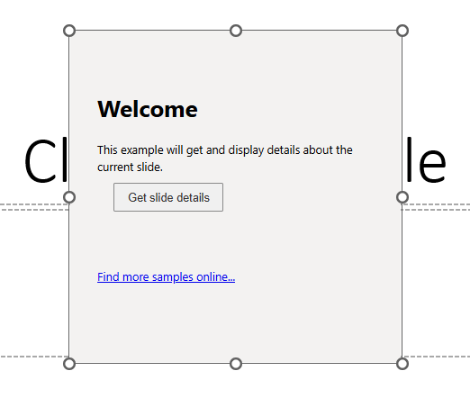

# Create a PowerPoint content add-in that displays slide details

## Summary

Learn how to build an Office content add-in that displays details about the current slide in a PowerPoint presentation.



## Applies to

- PowerPoint on Windows, Mac, and in a browser.

## Version history

| Version  | Date | Comments |
|----------|------|----------|
| 1.0 | 02-03-2026 | Initial release |

## Prerequisites

- Microsoft 365 - You can get a free developer sandbox by joining the [Microsoft 365 Developer Program](https://developer.microsoft.com/microsoft-365/dev-program#Subscription).

### Display slide details

When the user chooses the **Get slide details** button, the `getDataFromSelection()` function is called. This function calls `Office.context.document.getSelectedDataAsync()` to get some details about the current slide. "Hello, world!" and those slide details are then displayed in the content add-in.

For more information, see [Content add-ins](https://learn.microsoft.com/office/dev/add-ins/design/content-add-ins?tabs=jsonmanifest).

```javascript
// Gets and displays some details about the current slide.
function getDataFromSelection() {
    if (Office.context.document.getSelectedDataAsync) {
        Office.context.document.getSelectedDataAsync(Office.CoercionType.SlideRange,
            function (result) {
                if (result.status === Office.AsyncResultStatus.Succeeded) {
                    document.getElementById("selected-data").textContent = 'Hello, world! Some slide details are: ' + JSON.stringify(result.value);
                } else {
                    document.getElementById("selected-data").textContent = 'Error getting slide details.';
                    console.error('Error:', result.error.message);
                }
            });
    } else {
        document.getElementById("selected-data").textContent = 'Error: Getting slide details isn\'t supported by this host application.';
        console.error('Error:', 'Getting slide details isn\'t supported by this host application.');
    }
}
```

## Run the sample

### Run the sample with GitHub as the host

An Office Add-in requires you to configure a web server to provide all the resources, such as HTML, image, and JavaScript files. The Hello World sample is configured so that the files are hosted directly from this GitHub repo, so all you need to do is build the manifest and package, and then sideload the package.

1. Clone or download this sample to a folder on your computer. Then in a command prompt, bash shell, or **TERMINAL** in Visual Studio Code, navigate to the root of the sample folder.
1. Run the command `npm install`.
1. Run the command `npm run build`.
1. Run the command `npm run start:prod`.

   After a few seconds, desktop PowerPoint opens, and after a few seconds more, the content add-in appears over the current slide with a **Get slide details** button.
     - If the content add-in doesn't appear, open the **Add-ins** button in the **Home** tab of the ribbon, then select the name of the content add-in, "PowerPoint Content Add-in".

1. Choose the **Get slide details** button to display "Hello, world!" and slide details.

When you're finished working with the add-in, close PowerPoint, and then in the window where you ran the three npm commands, run `npm run stop:prod`.

### Configure a localhost web server and run the sample from localhost

If you prefer to configure a web server and host the add-in's web files from your computer, use the following steps.

1. Clone or download this sample to a folder on your computer. Then in a command prompt, bash shell, or **TERMINAL** in Visual Studio Code, navigate to the root of the sample folder.
1. Run the command `npm install`.
1. Run the command `npm start`.

   - If you've never developed an Office Add-in on this computer before or it has been more than 30 days since you last did, you'll be prompted to delete an old security cert and/or install a new one. Agree to both prompts.
   - After a few seconds, a **webpack** dev-server window will open and your files will be hosted there on localhost:3000.
   - When the server is successfully running, desktop PowerPoint opens, and after a few seconds more, the content add-in appears over the current slide with a **Get slide details** button.
     - If the content add-in doesn't appear, open the **Add-ins** button in the **Home** tab of the ribbon, then select the name of the content add-in, "PowerPoint Content Add-in".

1. Choose the **Get slide details** button to display "Hello, world!" and slide details.

When you're finished working with the add-in, close PowerPoint, and then in the window where you ran the two npm commands, run `npm stop`.

## Questions and feedback

- Did you experience any problems with the sample? [Create an issue](https://github.com/OfficeDev/Office-Add-in-samples/issues/new/choose) and we'll help you out.
- We'd love to get your feedback about this sample. Go to our [Office samples survey](https://aka.ms/OfficeSamplesSurvey) to give feedback and suggest improvements.
- For general questions about developing Office Add-ins, go to [Microsoft Q&A](https://learn.microsoft.com/answers/topics/office-js-dev.html) using the office-js-dev tag.

## Copyright

Copyright (c) Microsoft Corporation. All rights reserved.

This project has adopted the [Microsoft Open Source Code of Conduct](https://opensource.microsoft.com/codeofconduct/). For more information, see the [Code of Conduct FAQ](https://opensource.microsoft.com/codeofconduct/faq/) or contact [opencode@microsoft.com](mailto:opencode@microsoft.com) with any additional questions or comments.

**Note**: The content.html file contains an image URL that tracks diagnostic data for this sample add-in. Please remove the image tag if you reuse this sample in your own code project.


