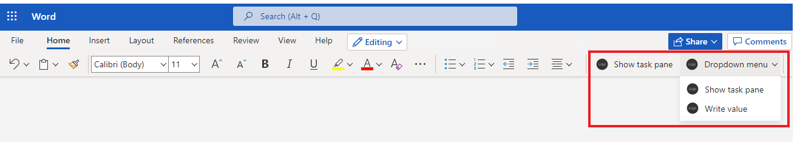
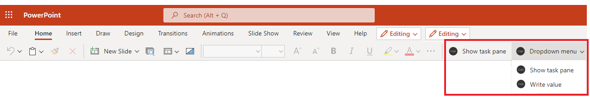

# Office Add-in commands

## Summary

Office Add-in commands enable developers to extend the Office user interface such as the Office Ribbon to create awesome, efficient add-ins. These samples show you how to use add-in commands in Excel, Word, and PowerPoint add-ins.

Here's how the samples look when running:

### Excel

### Word

### PowerPoint

## Applies to

- Excel, Word, and PowerPoint on Windows, Mac, and in a browser.

## Prerequisites

- Microsoft 365 - Get a [free developer sandbox](https://developer.microsoft.com/microsoft-365/dev-program#Subscription) that provides a renewable 90-day Microsoft 365 E5 developer subscription.

## Run a sample

There are three samples for Excel, Word, and PowerPoint. Go to the folder of the sample you want to run and follow the instructions in the readme file there to sideload and run the sample.

- [Excel add-in commands sample](./excel/)
- [Word add-in commands sample](./word/)
- [PowerPoint add-in commands sample](./powerpoint/)

## Documentation

- [Add-in commands for Excel, PowerPoint, and Word](https://learn.microsoft.com/office/dev/add-ins/design/add-in-commands)
- [Create add-in commands in your manifest for Excel, PowerPoint, and Word](https://learn.microsoft.com/office/dev/add-ins/develop/create-addin-commands)
- [FAQ](FAQ.md)
- [Manifest reference](https://learn.microsoft.com/office/dev/add-ins/reference/manifest/extensionpoint)

## Questions and feedback

- Did you experience any problems with the sample? [Create an issue](https://github.com/OfficeDev/Office-Add-in-samples/issues/new/choose) and we'll help you out.
- We'd love to get your feedback about this sample. Go to our [Office samples survey](https://aka.ms/OfficeSamplesSurvey) to give feedback and suggest improvements.
- For general questions about developing Office Add-ins, go to [Microsoft Q&A](https://learn.microsoft.com/answers/topics/office-js-dev.html) using the office-js-dev tag.

## Copyright

Copyright (c) 2021 Microsoft Corporation. All rights reserved.

This project has adopted the [Microsoft Open Source Code of Conduct](https://opensource.microsoft.com/codeofconduct/). For more information, see the [Code of Conduct FAQ](https://opensource.microsoft.com/codeofconduct/faq/) or contact [opencode@microsoft.com](mailto:opencode@microsoft.com) with any additional questions or comments.

