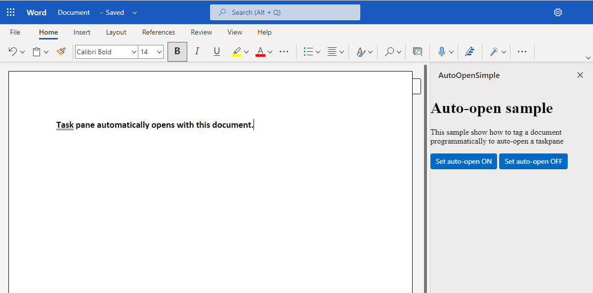

# Auto-open a task pane with a document

## Summary

Your Office Add-in may need the task pane to automatically open in certain documents. This sample shows how to configure a document to start with the add-in's task pane open when the document is opened. The auto-open task pane feature requires the [AddInCommands 1.1](https://learn.microsoft.com/javascript/api/requirement-sets/common/add-in-commands-requirement-sets) requirement set.



## Features

- Configure a task pane to auto-open when the document is opened.

## Applies to

- Word on Windows, on Mac, and on the web.

## Prerequisites

- Microsoft 365 - Get a [free developer sandbox](https://developer.microsoft.com/microsoft-365/dev-program#Subscription) that provides a renewable 90-day Microsoft 365 E5 developer subscription.

## Decide on a manifest type

There are two types of manifests for Office Add-ins. For more information about the differences between them, see [Office Add-ins manifest](https://learn.microsoft.com/en-us/office/dev/add-ins/develop/add-in-manifests).

- **Add-in only manifest**: By default, the sample supports the add-in only manifest. In the root of the sample, there are two versions of the add-in only manifest to support the two ways of hosting the web app part of the add-in: **manifest.xml** and **manifest-localhost.xml**. For convenience, a copy of the files needed for using the add-in only manifest can be found in the **manifest-configurations/add-in-only** subfolder.

   To work with the add-in only manifest continue with the [Use the add-in only manifest](#use-the-add-in-only-manifest) section.

- **Unified manifest for Microsoft 365**: To work the unified manifest (**manifest.json**), you need to copy all the files from the **manifest-configurations/unified** subfolder to the sample's root directory, replacing any existing files that have the same names. (We recommend that you also delete the **manifest.xml** and **manifest-localhost.xml** files from root directory, so only files needed for the unified manifest are present in the root.)

   To work with the unified manifest continue with the [Use the unified manifest](#use-the-unified-manifest) section.

   > **Note:** If you ever want to switch back to the add-in only manifest, copy the files in the **manifest-configurations/add-in-only** subfolder to the sample's root directory. We recommend that you delete the following files the root of the sample, so only files needed for the add-only manifest are present in the root.
   >
   > - **manifest.json**
   > - **package.json**
   > - **package-lock.json**
   > - **webpack.config.js**

### Use the add-in only manifest

#### Run the sample in Word on the web

This sample is hosted directly from this GitHub repo. Use the following steps to sideload the **manifest.xml** file to try the sample.

1. Download the **manifest.xml** file from the folder for this sample.
1. Open [Office on the web](https://office.com/).
1. Choose **Word**, and then open a new document.
1. On the **Insert** tab, choose **Add-ins**.
1. On the **Office Add-ins** dialog, select the **MY ADD-INS** tab, choose **Manage My Add-ins**, and then **Upload My Add-in**.

    

1. Browse to the add-in manifest file, and then select **Upload**. Browse to the location of the **manifest.xml** file and upload it.

    

1. On the **Home** tab, choose the **Auto-open Sample** button to display the task pane of the add-in.
1. Choose **Set auto-open ON**. Then, close and reopen the document. The add-in will open automatically. If you choose **Set auto-open OFF**, then when you reopen the document, the task pane will not open.

#### Configure a localhost web server and run the sample from localhost

If you prefer to configure a web server and host the add-in's web files from your computer, use the following steps.

1. Install a recent version of [npm](https://www.npmjs.com/get-npm) and [Node.js](https://nodejs.org/) on your computer. To verify if you've already installed these tools, run the commands `node -v` and `npm -v` in your terminal.
1. You need http-server to run the local web server. If you haven't installed this yet you can do this with the following command.

    ```console
    npm install --global http-server
    ```

1. You need Office-Addin-dev-certs to generate self-signed certificates to run the local web server. If you haven't installed this yet you can do this with the following command.

    ```console
    npm install --global office-addin-dev-certs
    ```

1. Clone or download this sample to a folder on your computer. Then go to that folder in a console or terminal window.
1. Run the following command to generate a self-signed certificate that you can use for the web server.

    ```console
    npx office-addin-dev-certs install
    ```

    The previous command will display the folder location where it generated the certificate files.

1. Go to the folder location where the certificate files were generated. Copy the localhost.crt and localhost.key files to the **auto-open-task-pane** sample folder.
1. Run the following command.

    ```console
    http-server -S -C localhost.crt -K localhost.key --cors . -p 3000
    ```

    The http-server will run and host the current folder's files on localhost:3000.

Now that your localhost web server is running, you can sideload the **manifest-localhost.xml** file provided in the **auto-open-task-pane** folder. Using the **manifest-localhost.xml** file, follow the steps in [Run the sample in Word on the web](#run-the-sample-in-word-on-the-web) to sideload and run the add-in.

### Use the unified manifest

#### Run the sample with GitHub as the host

An Office Add-in requires you to configure a web server to provide all the resources, such as HTML, image, and JavaScript files. The Hello World sample is configured so that the files are hosted directly from this GitHub repo, so all you need to do is build the manifest and package, and then sideload the package. 

1. Clone or download this sample to a folder on your computer. Then in a command prompt, bash shell, or **TERMINAL** in Visual Studio Code, navigate to the root of the sample folder.
1. Run the command `npm install`.
1. Run the command `npm run build`.
1. Run the command `npm run start:prod`.

   After a few seconds, desktop Word opens, and after a few seconds more, a **Auto-open Sample** button appears on the right end of the **Home** tab.

1. Choose the **Auto-open Sample** button to display the task pane of the add-in.
1. Choose **Set auto-open ON**. Then, close and reopen the document. The add-in will open automatically. If you choose **Set auto-open OFF**, then when you reopen the document, the task pane will not open.

When you're finished working with the add-in, close Word, and then in the window where you ran the three npm commands, run `npm run stop:prod`.

#### Configure a localhost web server and run the sample

If you prefer to configure a web server and host the add-in's web files from your computer, use the following steps.

1. Clone or download this sample to a folder on your computer. Then in a command prompt, bash shell, or **TERMINAL** in Visual Studio Code, navigate to the root of the sample folder.
1. Run the command `npm install`.
1. Run the command `npm start`.

   - If you've never developed an Office add-in on this computer before or it has been more than 30 days since you last did, you'll be prompted to delete an old security cert and/or install a new one. Agree to both prompts. 
   - After a few seconds a **webpack** dev-server window will open and your files will be hosted there on localhost:3000.
   - When the server is successfully running, desktop Word opens, and after a few seconds more, a **Auto-open Sample** button appears on the right end of the **Home** tab. 

1. Choose the **Auto-open Sample** button to display the task pane of the add-in.
1. Choose **Set auto-open ON**. Then, close and reopen the document. The add-in will open automatically. If you choose **Set auto-open OFF**, then when you reopen the document, the task pane will not open.

When you're finished working with the add-in, close Word, and then in the window where you ran the two npm commands, run `npm stop`.

## How is the auto-open feature different from inserting a task pane?

When a user launches add-ins that don't use add-in commands, the add-ins are inserted into the document and persist in that document. When other users open the document, they're prompted to install the add-in and the task pane opens. The challenge there is that in many cases, users don't want the add-in to persist in the document. For example, a student who uses a dictionary add-in in a Word document might not want their classmates or teachers to be prompted to install that add-in when they open the document.

With the auto-open feature, you can explicitly define or allow the user to set whether a specific task pane add-in persists in a specific document.

For more information and best practices on using this feature, see [Automatically open a task pane with a document](https://learn.microsoft.com/office/dev/add-ins/develop/automatically-open-a-task-pane-with-a-document).

## Implementation

### Specify the task pane to open

To specify the task pane to open automatically, the sample sets the **TaskpaneId** value to "Office.AutoShowTaskpaneWithDocument" in the manifest file. You can only set this value on one task pane. If you set this value on multiple task panes, the first occurrence of the value is used and the others are ignored.

```xml
<Action xsi:type="ShowTaskpane">
  <TaskpaneId>Office.AutoShowTaskpaneWithDocument</TaskpaneId>
  <SourceLocation resid="Contoso.Taskpane.Url" />
</Action>
```

### Tag the document to automatically open the task pane

The sample uses the Office JS `settings.set` method to set "Office.AutoShowTaskpaneWithDocument" to `true` as shown in the following code from the **home.js** file. To turn auto-open off, the code calls `settings.remove` to remove the setting.

```javascript
function setAutoOpenOn() {
    Office.context.document.settings.set(
        'Office.AutoShowTaskpaneWithDocument',
        true
    );
    Office.context.document.settings.saveAsync();
    showNotification(
        'The auto-open setting has been set to ON for this document.'
    );
}

function setAutoOpenOff() {
    Office.context.document.settings.remove(
        'Office.AutoShowTaskpaneWithDocument'
    );
    Office.context.document.settings.saveAsync();
    showNotification(
        'The auto-open setting has been set to OFF for this document.'
    );
}
```

> Note: You can also modify the auto-open setting by using OpenXML. For more information, see [Automatically open a task pane with a document](https://learn.microsoft.com/office/dev/add-ins/develop/automatically-open-a-task-pane-with-a-document).

## Add-in installation requirement

Your add-in must already be installed by the user for the auto-open feature to work. If they open a document and don't have your add-in installed, the setting is ignored.

If you need to distribute the add-in with the document, so that users are prompted to install it, you also need to set the pane visibility property to `1`. You can only do this via OpenXML.

## See also

- [Automatically open a task pane with a document](https://learn.microsoft.com/office/dev/add-ins/develop/automatically-open-a-task-pane-with-a-document)

## Questions and feedback

- Did you experience any problems with the sample? [Create an issue](https://github.com/OfficeDev/Office-Add-in-samples/issues/new/choose) and we'll help you out.
- We'd love to get your feedback about this sample. Go to our [Office samples survey](https://aka.ms/OfficeSamplesSurvey) to give feedback and suggest improvements.
- For general questions about developing Office Add-ins, go to [Microsoft Q&A](https://learn.microsoft.com/answers/topics/office-js-dev.html) using the office-js-dev tag.

## Copyright

Copyright (c) 2023 Microsoft Corporation. All rights reserved.

This project has adopted the [Microsoft Open Source Code of Conduct](https://opensource.microsoft.com/codeofconduct/). For more information, see the [Code of Conduct FAQ](https://opensource.microsoft.com/codeofconduct/faq/) or contact [opencode@microsoft.com](mailto:opencode@microsoft.com) with any additional questions or comments.


