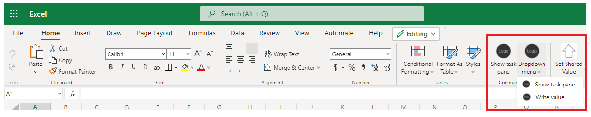

# Create an Excel add-in with command buttons

## Summary

Learn how to build an Office Add-in that has a command button to show the task pane, and a menu dropdown button that can show the task pane, or get data.



## Features

- A button in the ribbon that shows the task pane.
- A dropdown button in the ribbon with two menu commands.

## Applies to

- Excel on Windows, Mac, and in a browser.

## Prerequisites

- Microsoft 365 - Get a [free developer sandbox](https://developer.microsoft.com/microsoft-365/dev-program#Subscription) that provides a renewable 90-day Microsoft 365 E5 developer subscription.

## Run the sample on Excel on the web

This sample is hosted directly from this GitHub repo. Use the following steps to sideload the manifest.xml file to see the sample run.

1.  Download the **manifest.xml** file from the sample folder for Excel.
1.  Open [Office on the web](https://office.live.com/).
1.  Choose **Excel**, and then open a new document.
1.  On the **Insert** tab, in the **Add-ins** section, choose **Office Add-ins**.
1.  On the **Office Add-ins** dialog, select the **MY ADD-INS** tab, choose **Manage My Add-ins**, and then **Upload My Add-in**.

    

1.  Browse to the add-in manifest file, and then select **Upload**.

    

1.  Verify that the add-in loaded successfully. On the ribbon, you'll see a **Show task pane** button and **Dropdown menu** button on the **Home** tab.

On the **Home** tab, choose the **Show task pane** button to display the task pane of the add-in. Choose the **Dropdown menu** button to see a drop down menu. On the menu, you can show the task pane or choose **Write value** to call a command that writes the button's id to the current cell.

## Run the sample on Excel on Windows or Mac

Office Add-ins are cross-platform so you can also run them on Windows, Mac, and iPad. The following links will take you to documentation on how to sideload on Windows, Mac, or iPad. Be sure you have a local copy of the manifest.xml file for the Hello world sample. Then follow the sideloading instructions for your platform.

- [Sideload Office Add-ins for testing from a network share](https://learn.microsoft.com/office/dev/add-ins/testing/create-a-network-shared-folder-catalog-for-task-pane-and-content-add-ins)
- [Sideload Office Add-ins on Mac for testing](https://learn.microsoft.com/office/dev/add-ins/testing/sideload-an-office-add-in-on-mac)
- [Sideload Office Add-ins on iPad for testing](https://learn.microsoft.com/office/dev/add-ins/testing/sideload-an-office-add-in-on-ipad)

## Configure a localhost web server and run the sample from localhost

If you prefer to configure a web server and host the add-in's web files from your computer, use the following steps.

1.  Install a recent version of [npm](https://www.npmjs.com/get-npm) and [Node.js](https://nodejs.org/) on your computer. To verify if you've already installed these tools, run the commands `node -v` and `npm -v` in your terminal.

1.  You need http-server to run the local web server. If you haven't installed this yet. you can do this with the following command.

    ```console
    npm install --global http-server
    ```

1.  You need Office-Addin-dev-certs to generate self-signed certificates to run the local web server. If you haven't installed this yet you can do this with the following command.

    ```console
    npm install --global office-addin-dev-certs
    ```

1.  Clone or download this sample to a folder on your computer. Then go to that folder in a console or terminal window.
1.  Run the following command to generate a self-signed certificate that you can use for the web server.

    ```console
    npx office-addin-dev-certs install
    ```

    The previous command will display the folder location where it generated the certificate files.

1.  Go to the folder location where the certificate files were generated. Copy the localhost.crt and localhost.key files to the hello world sample folder.

1.  Run the following command.

    ```console
    http-server -S -C localhost.crt -K localhost.key --cors . -p 3000
    ```

    The http-server will run and host the current folder's files on localhost:3000.

Now that your localhost web server is running, sideload the **manifest-localhost.xml** file provided in the excel-hello-world folder. Using the **manifest-localhost.xml** file, follow the steps in [Run the sample on Excel on the web](#run-the-sample-on-excel-on-the-web) to sideload and run the add-in.

## Key parts of this sample

### Commands UI

The **manifest.xml** file defines all of the commands UI in the `<ExtensionPoint>` element.
The ribbon buttons and dropdown menu are specified in the `<OfficeTab>` section. Because `<OfficeTab id="TabHome">` specifies `TabHome`, the buttons are located on the **Home** ribbon tab.

For more information about ExtensionPoint elements and options, see [Add ExtensionPoint elements](https://docs.microsoft.com/office/dev/add-ins/develop/create-addin-commands#step-6-add-extensionpoint-elements).

### Commands JavaScript

The **manifest.xml** file contains a `<FunctionFile resid="Commands.Url"/>` element that specifies where to find the JavaScript commands to run when buttons are used. The `Commands.Url` resource id points to `/src/commands/commands.html`. When a button command is chosen, `commands.html` is loaded, which then loads `/src/commands/commands.js`. This is where the `ExecuteFunction` actions are mapped from the `manifest.xml` file.

For example, the following manifest XML maps to the `writeValue` function in `commands.js`.

```xml
<Action xsi:type="ExecuteFunction">
  <FunctionName>writeValue</FunctionName>
</Action>
```

```javascript
async function writeValue(event) {
...
```

For more information about adding commands, see [Add the FunctionFile element](https://docs.microsoft.com/office/dev/add-ins/develop/create-addin-commands#step-5-add-the-functionfile-element).

## Copyright

Copyright (c) 2021 Microsoft Corporation. All rights reserved.

This project has adopted the [Microsoft Open Source Code of Conduct](https://opensource.microsoft.com/codeofconduct/). For more information, see the [Code of Conduct FAQ](https://opensource.microsoft.com/codeofconduct/faq/) or contact [opencode@microsoft.com](mailto:opencode@microsoft.com) with any additional questions or comments.


