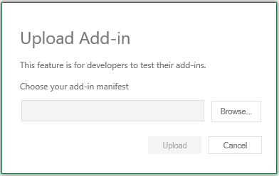

# Save custom settings in your Office Add-in

This sample shows how to save custom settings inside an Office Add-in. The add-in stores data as key/value pairs, using the JavaScript API for an Office property bag, browser cookies, web storage (**localStorage** and **sessionStorage**), or by storing the data in a hidden div in the document.

## Applies to

- Excel, Word, and PowerPoint on Windows, Mac, and the web.

## Prerequisites

- Microsoft 365 - Get a [free developer sandbox](https://developer.microsoft.com/microsoft-365/dev-program#Subscription) that provides a renewable 90-day Microsoft 365 E5 developer subscription.

## Version history

| Version  | Date | Comments |
|----------|------|----------|
| 1.0 | 08-26-2022 | Initial release |
| 1.1 | 04-01-2026 | Add support for the unified manifest for Microsoft 365 |

## Choose a manifest type

By default, the sample uses an add-in only manifest. However, you can switch the project between the add-in only manifest and the unified manifest for Microsoft 365. For more information about the differences between them, see [Office Add-ins manifest](https://learn.microsoft.com/office/dev/add-ins/develop/add-in-manifests).

If you want to continue with the add-in only manifest, skip ahead to the [Work with the add-in only manifest](#work-with-the-add-in-only-manifest) section.

### To switch to the unified manifest for Microsoft 365

Copy all files from the **manifest-configurations/unified** subfolder to the sample's root folder. We recommend that you delete the **manifest.xml** and **manifest-localhost.xml** files from the root folder, so only files needed for the unified manifest are present in the root. Then continue with the [Work with the unified manifest for Microsoft 365](#work-with-the-unified-manifest-for-microsoft-365) section.

### To switch back to the add-in only manifest

If you want to switch back to the add-in only manifest, copy the files in the **manifest-configurations/add-in-only** subfolder to the sample's root folder. We recommend that you delete the **local-hosting.zip** and **remote-hosting.zip** files from the root folder.

## Work with the add-in only manifest

### Run the sample on the web

You can run this sample in Excel, Word, or PowerPoint in a browser. The add-in web files are served from this repo on GitHub.

1. Download the **manifest.xml** file from this sample to a folder on your computer.
1. Open one of the following URLs in a browser.

   - https://word.cloud.microsoft/
   - https://excel.cloud.microsoft/
   - https://powerpoint.cloud.microsoft/

1. Open a new document.
1. Select **Home** > **Add-ins**, then select **Advanced**.
1. On the **Office Add-ins** dialog, select **Upload My Add-in**.

   

1. Browse to the add-in manifest file, and then select **Upload**.
1. Verify the add-in loaded successfully. You'll see a **Custom settings** button on the **Home** tab on the ribbon.

After sideloading, continue with the [Try the sample](#try-the-sample) section below.

### Run the sample in Office on Windows or Mac

Office Add-ins are cross-platform so you can also run them on Windows, Mac, and iPad. The following links will take you to documentation for how to sideload on Windows, Mac, or iPad. Use the **manifest.xml** file for the custom settings sample. Then follow the sideloading instructions for your platform.

- [Sideload Office Add-ins for testing from a network share](https://learn.microsoft.com/office/dev/add-ins/testing/create-a-network-shared-folder-catalog-for-task-pane-and-content-add-ins)
- [Sideload Office Add-ins on Mac for testing](https://learn.microsoft.com/office/dev/add-ins/testing/sideload-an-office-add-in-on-mac)
- [Sideload Office Add-ins on iPad for testing](https://learn.microsoft.com/office/dev/add-ins/testing/sideload-an-office-add-in-on-ipad)

After sideloading, continue with the [Try the sample](#try-the-sample) section.

### Configure a localhost web server and run the sample from localhost

If you prefer to configure a web server and host the add-in's web files from your computer, use the following steps.

1. Install a recent version of [npm](https://www.npmjs.com/get-npm) and [Node.js](https://nodejs.org/) on your computer. To verify if these tools are already installed on your computer, run the commands `node -v` and `npm -v` in your terminal.

1. You need http-server to run the local web server. If you haven't installed this yet, use the following command to install it.

    ```console
    npm install --global http-server
    ```

1. You need Office-Addin-dev-certs to generate self-signed certificates to run the local web server. If you haven't installed this yet, use the following command.

    ```console
    npm install --global office-addin-dev-certs
    ```

1. Clone or download this sample to a folder on your computer. Then go to that folder in a console or terminal window.
1. Run the following command to generate a self-signed certificate that you can use for the web server.

    ```console
    npx office-addin-dev-certs install
    ```

    The previous command will display the folder location where it generated the certificate files.

1. Go to the folder location where the certificate files were generated. Copy the localhost.crt and localhost.key files to your cloned or downloaded sample folder.

1. Run the following command.

    ```console
    http-server -S -C localhost.crt -K localhost.key --cors . -p 3000
    ```

    The http-server will run and host the current folder's files on localhost:3000.

1. Now that your localhost web server is running, sideload the **manifest-localhost.xml** file provided in the office-add-in-save-custom-settings folder. Using the **manifest-localhost.xml** file, follow the steps in either [Run the sample on the web](#run-the-sample-on-the-web) or [Run the sample in Office on Windows or Mac](#run-the-sample-in-office-on-windows-or-mac) to sideload and run the add-in.

## Work with the unified manifest for Microsoft 365

After you have completed the steps in [To switch to the unified manifest for Microsoft 365](#to-switch-to-the-unified-manifest-for-microsoft-365), there are two app package (.zip) files in the root of the folder. To see the contents of either file, you can double-click it in Windows or open it with any zip utility. Both contain a manifest.json file and two required icon files. They differ only in the URLs in the manifest files. The URLs in the **remote-hosting.zip** point to the add-ins css, html, and JavaScript files served on this repo. The URLs in the **local-hosting.zip** point to the localhost:3000 domain.

You can test the add-in either on the web or on Windows as described in the following sections.

> [!NOTE]
> At this time, the unified manifest is not supported on Mac or mobile platforms. For more information, see [Unified manifest for Microsoft 365: Client and platform support](https://learn.microsoft.com/office/dev/add-ins/develop/unified-manifest-overview#client-and-platform-support).

### Run the unified manifest sample on the web

1. Close all Office applications, and then clear the Office cache following the instructions at [Manually clear the cache](https://learn.microsoft.com/office/dev/add-ins/testing/clear-cache#manually-clear-the-cache).
1. In a browser, open https://teams.cloud.microsoft and sign in if you aren't already.
1. Select **Apps** from the app bar, then select **Manage your apps** at the bottom of the **Apps** pane.
1. Select **Upload an app** in the **Apps** dialog, and then in the dialog that opens, select **Upload a custom app**.
1. In the **Open** dialog, navigate to and select the **remote-hosting.zip** in the root for the project.
1. Select **Add** in the dialog that opens.
1. When you're prompted that the app was added, don't open it in Teams. Just close the dialog.
1. Open one of the following URLs in a browser.

   - https://word.cloud.microsoft/
   - https://excel.cloud.microsoft/
   - https://powerpoint.cloud.microsoft/

1. Open a new document. 
1. Wait at least a minute for the add-in to completely load. If the **Custom settings** button doesn't appear on the **Home** ribbon, select **Home** > **Add-ins**, and then select the add-in **office-add-in-save-custom-settings**. (The name may be truncated.)

After sideloading, continue with the [Try the sample](#try-the-sample) section.

### Run the unified manifest sample on Windows

1. Close all Office applications, and then clear the Office cache following the instructions at [Manually clear the cache](https://learn.microsoft.com/office/dev/add-ins/testing/clear-cache#manually-clear-the-cache).
1. Open Teams.
1. Select **Apps** from the app bar, then select **Manage your apps** at the bottom of the **Apps** pane.
1. Select **Upload an app** in the **Apps** dialog, and then in the dialog that opens, select **Upload a custom app**.
1. In the **Open** dialog, navigate to and select the **remote-hosting.zip** in the root for the project.
1. Select **Add** in the dialog that opens.
1. When you're prompted that the app was added, don't open it in Teams. Just close the dialog.
1. Open Word, Excel, or PowerPoint.
1. Open a new document. 
1. Wait at least a minute for the add-in to completely load. If the **Custom settings** button doesn't appear on the **Home** ribbon, select **Home** > **Add-ins**, and then select the add-in **office-add-in-save-custom-settings**. (The name may be truncated.)

After sideloading, continue with the [Try the sample](#try-the-sample) section.

### Work with a localhost server

To run the sample on localhost, follow the steps in the section [Configure a localhost web server and run the sample from localhost](#configure-a-localhost-web-server-and-run-the-sample-from-localhost), ***but don't do the last step***. 

Now that your localhost web server is running, sideload the **localhost-hosting.zip** package provided in the office-add-in-save-custom-settings folder. 

Follow the steps in either [Run the unified manifest sample on the web](#run-the-unified-manifest-sample-on-the-web) or [Run the unified manifest sample on Windows](#run-the-unified-manifest-sample-on-windows) to sideload and run the add-in. ***But be sure to upload the*** **localhost-hosting.zip** ***package, not the*** **remote-hosting.zip** ***package.***

After sideloading, continue with the [Try the sample](#try-the-sample) section.

## Try the sample

Use the task pane to create, save, and retrieve custom settings:

1. Select the **Custom settings** button.
1. **Create a new setting**: Enter a name and value in the text fields, then choose **Create setting**. The setting will be saved using the currently selected storage type.
1. **Get a setting**: Enter the name of a setting you created (case-sensitive), then choose **Get setting** to retrieve its value.
1. **Change storage type**: Use the dropdown menu to switch between different storage methods (Property bag, Browser cookies, Local storage, Session storage, or HTML document div).
1. **View feedback**: All actions display feedback messages in the task pane after the buttons and text boxes, confirming operations or displaying retrieved values.

## Use the sample in your own project

We don't recommend that you use this project as the starting point for your own add-in. It doean't have the tooling that is installed when you create an add-in project with [Microsoft 365 Agent Toolkit](https://learn.microsoft.com/office/dev/add-ins/develop/agents-toolkit-overview) or [Yoeman Generator for Office Add-ins](https://learn.microsoft.com/office/dev/add-ins/develop/yeoman-generator-overview). Among other inconveniences, if you are using the unified manifest for Microsoft 365, whenever you make a change in the manifest, you would have to re-zip it into the package file. But this step is done automatically in projects created with the two tools. 

To reuse the code from this sample you'll want to look at the specific functions that save or get settings in the **taskpane.js** file. For example, the **saveToPropertyBag** and **getFromPropertyBag** files work with the Office settings object to access settings in the property bag. Decide which storage method you want to use. Then copy the corresponding methods for that storage method to your own project. The methods are self-contained and can be called directly from your code.

If you're using the property bag and also want to save the settings into the Excel, Word, or PowerPoint document, you'll need to include the following code. Modify the error handling function as needed for your own project.

```javascript
Office.context.document.settings.saveAsync(function (asyncResult) {
    if (asyncResult.status == Office.AsyncResultStatus.Failed) {
        console.log('Settings save failed. Error: ' + asyncResult.error.message);
    } else {
        console.log('Settings saved.');
    }
});
```

## Additional resources

- [Persist add-in state and settings](https://learn.microsoft.com/office/dev/add-ins/develop/persisting-add-in-state-and-settings)
- [Introduction to Web Storage](http://msdn.microsoft.com/library/cc197062(VS.85).aspx)
- [Settings object](https://learn.microsoft.com/javascript/api/office/office.settings)

## Questions and feedback

- Did you experience any problems with the sample? [Create an issue](https://github.com/OfficeDev/Office-Add-in-samples/issues/new/choose) and we'll help you out.
- We'd love to get your feedback about this sample. Go to our [Office samples survey](https://aka.ms/OfficeSamplesSurvey) to give feedback and suggest improvements.
- For general questions about developing Office Add-ins, go to [Microsoft Q&A](https://learn.microsoft.com/answers/topics/office-js-dev.html) using the office-js-dev tag.

## Copyright

Copyright (c) 2022 - 2026 Microsoft Corporation. All rights reserved.

This project has adopted the [Microsoft Open Source Code of Conduct](https://opensource.microsoft.com/codeofconduct/). For more information, see the [Code of Conduct FAQ](https://opensource.microsoft.com/codeofconduct/faq/) or contact [opencode@microsoft.com](mailto:opencode@microsoft.com) with any additional questions or comments.

