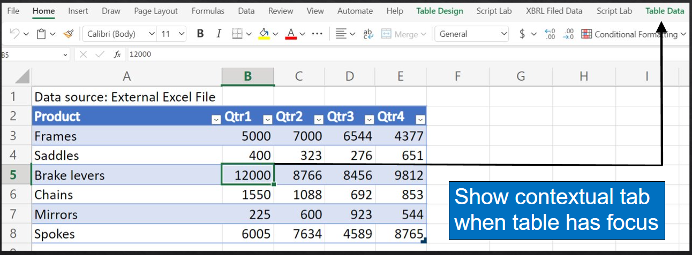

# Create custom contextual tabs on the ribbon

This sample accomplishes the following tasks using Office ribbon APIs.

- Creates a custom contextual tab named **Table Data**.
- Creates a table in Excel. When the focus is inside the table, the custom tab is displayed.
- When the focus is outside the table, the custom tab is hidden.



## Applies to

- Excel on Windows
- Excel on web
- PowerPoint on Windows

## Prerequisites

- Microsoft 365

## Run the sample

Run this sample in Excel in a browser. The add-in web files are served from this repo on GitHub.

1. Download the **manifest.xml** file from this sample to a folder on your computer.
1. Open [Office on the web](https://office.live.com/).
1. Choose **Excel**, and then open a new document.
1. Open the **Insert** tab on the ribbon and choose **Office Add-ins**.
1. On the **Office Add-ins** dialog, select the **MY ADD-INS** tab, choose **Manage My Add-ins**, and then **Upload My Add-in**.

    

1. Browse to the add-in manifest file, and then select **Upload**.

    

1. Verify that the add-in loaded successfully. You will see a **PnP contextual tabs** button on the **Home** tab on the ribbon.

Take the following actions to try out the add-in and the contextual tab.

- Use the task pane to import data from either the the mock Excel file, or mock SQL Database. Selecting **Import data** in the task pane creates the sales table.
- Select a cell, or range, inside the sales table to display the **Table Data** contextual tab on the ribbon.
- On the **Table Data** contextual tab you can:
    - **Submit** changes you made in the table to the mock data source.
    - **Refresh** the table from the mock data source which overwrites any changes you made.
    - Use **Show task pane** to show the add-in's task pane if it was closed.
    - **Import data** and update the table to use data from the mock Excel file or mock SQL database.
- Select a cell, or range, outside the sales table to hide the **Table Data** contextual tab.

## Key parts of this sample

This sample inserts a table of fictitious sales data for Contoso. The data is pulled from one of two mock data sources: a mock Excel file, or a mock SQL database. The user can select which data source to use either in the task pane, or in the contextual tab.

After the sales table is created, the sample creates a contextual tab named **Table Data**. When you select any cell or range inside the table, the contextual tab is displayed on the ribbon. When you select any cell or range outside the table, the contextual tab is hidden.

The contextual tab supports commands related to working with the sales data. When you make changes you can submit them and update the mock data source. Or you can refresh the table from the mock data source.

### Shared JavaScript runtime

Contextual tabs requires the manifest.xml file to specify loading the shared JavaScript runtime. For more information on configuring the shared runtime, see [Configure your Office Add-in to use a shared JavaScript runtime](https://docs.microsoft.com/office/dev/add-ins/develop/configure-your-add-in-to-use-a-shared-runtime)

### Describe and update the contextual tab using JSON

The `src/commands/ribbonJSON.js` file describes the full contextual tab's buttons, groups, and menu items. It returns the JSON from the `getContextualRibbonJSON()` function and the sample code stores this JSON in a global variable. 

### Update the contextual tab UI visibility

As buttons, or the tab itself are set to be visible or not, the `g.contextualTab` global variable is used to always maintain the correct contextual tab state. When the tab needs to be updated on the ribbon (to turn a UI element on or off) a call is made to `Office.ribbon.requestUpdate()`. This occurs in the `setContextualTabVisibility()` function in `src/utilities/utilities.js`.

### Handle context changes

When you build your own add-in, you'll need to decide what context determines which tabs or UI elements are shown. For this sample, we want to show the contextual tab when the focus is in the table. Also we want to enable the **Refresh** and **Submit** buttons when changes are made to the table.

When the user imports data to create the table, `createSampleTable()` adds an `onSelectionChanged` event handler, and `onChanged` event handler. Later, as the user moves the selection into or out of the table, the onSelectionChanged() function is called, which can display the contextual tab when the selection is inside the table. When the user makes changes to the table, `onSelectionChange()` is called, and the **Refresh** and **Submit** buttons are enabled.

See more details in the following code excerpt, or refer to these functions in the `src/utilities/utilities.js` file.

```javascript
async function createSampleTable(mockDataSource) {
  //...//

     //Add event handlers
    salesTable.onSelectionChanged.add(onSelectionChange);
    salesTable.onChanged.add(onChanged);

    //...//
}

/**
 * Handles the onSelectionChange event. If selection is inside the table, the Contoso custom tab is shown.
 * Otherwise the Contoso custom tab is hidden.
 * @param  {} args The arguments for the selection changed event.
 */
function onSelectionChange(args) {
  let g = getGlobal();
  if (g.isTableSelected !== args.isInsideTable) {
    g.isTableSelected = args.isInsideTable;
    setContextualTabVisibility(args.isInsideTable);
  }
}

/**
 * Handles the onChanged event. When data in the sales table is changed,
 * enable the refresh and submit buttons.
 */
function onChanged() {
  let g = getGlobal();
  //check if dirty flag was set (flag avoids extra unnecessary ribbon operations)
  if (!g.isTableDirty) {
    g.isTableDirty = true;

    //Enable the Refresh and Submit buttons
    setSyncButtonEnabled(true);
  }
}
```

## Run the sample from Localhost

If you prefer to host the web server for the sample on your computer, follow these steps.

1. Open the **/src/commands/ribbonJSON.js** file.
1. Edit line 9 to refer to the localhost:3000 endpoint as shown in the following code.
    
    ```javascript
    const sourceUrl = "https://localhost:3000";
    ```
    
1. Save the file.
1. You need http-server to run the local web server. If you haven't installed this yet you can do this with the following command.
    
    ```console
    npm install --global http-server
    ```
    
1. Use a tool such as openssl to generate a self-signed certificate that you can use for the web server. Move the cert.pem and key.pem files to the webworker-customfunction folder for this sample.
1. From a command prompt, go to the web-worker folder and run the following command.
    
    ```console
    http-server -S --cors . -p 3000
    ```
    
1. To reroute to localhost run office-addin-https-reverse-proxy. If you haven't installed this you can do this with the following command.
    
    ```console
    npm install --global office-addin-https-reverse-proxy
    ```
    
    To reroute run the following in another command prompt.
    
    ```console
    office-addin-https-reverse-proxy --url http://localhost:3000
    ```
    
1. Follow the steps in [Run the sample](https://github.com/OfficeDev/PnP-OfficeAddins/tree/main/Samples/office-contextual-tabs#run-the-sample), but upload the `manifest-localhost.xml` file for step 6.

## Questions and comments

We'd love to get your feedback about this sample. Please send your feedback to us in the Issues section of this repository. Questions about developing Office Add-ins should be posted to [Microsoft Q&A](https://docs.microsoft.com/answers/topics/office-js-dev.html) using the office-js-dev tag.

## Additional resources

- [Create custom contextual tabs in Office Add-ins](https://docs.microsoft.com/office/dev/add-ins/design/contextual-tabs)

Demonstration video:

[](https://www.youtube.com/watch?v=9tLfm4boQIo)

## Solution

Solution | Authors
---------|----------
Create custom contextual tabs on the ribbon | Microsoft

## Version history

Version  | Date | Comments
---------| -----| --------
1.0  | February 11, 2021 | Initial release
1.1  | May 11, 2021 | Removed yo office and modified to be GitHub hosted

## Copyright

Copyright (c) 2021 Microsoft Corporation. All rights reserved.

This project has adopted the [Microsoft Open Source Code of Conduct](https://opensource.microsoft.com/codeofconduct/). For more information, see the [Code of Conduct FAQ](https://opensource.microsoft.com/codeofconduct/faq/) or contact [opencode@microsoft.com](mailto:opencode@microsoft.com) with any additional questions or comments.


