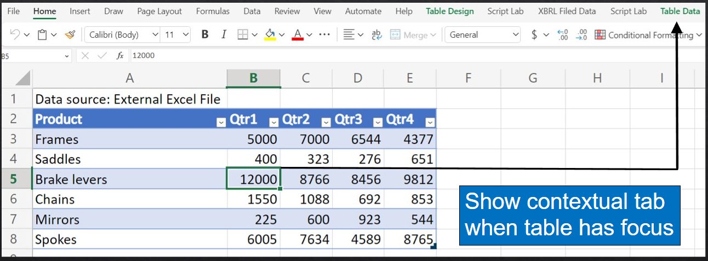

# Create custom contextual tabs on the ribbon

This sample accomplishes the following tasks using Office ribbon APIs.

- Creates a custom contextual tab named **Table Data**.
- Creates a table in Excel. When the focus is inside the table, the custom tab is displayed.
- When the focus is outside the table, the custom tab is hidden.

To learn more about custom contextual tabs, see [Create custom contextual tabs in Office Add-ins](https://learn.microsoft.com/office/dev/add-ins/design/contextual-tabs).



## Applies to

- Excel on Windows
- Excel on Mac
- Excel on the web

## Prerequisites

- Microsoft 365
- Must meet the prerequisites outlined in [Create custom contextual tabs in Office Add-ins](https://learn.microsoft.com/office/dev/add-ins/design/contextual-tabs#prerequisites).

## Choose a manifest type

By default, the sample uses an add-in only manifest. However, you can switch the project between the add-in only manifest and the unified manifest for Microsoft 365. For more information about the differences between them, see [Office Add-ins manifest](https://learn.microsoft.com/office/dev/add-ins/develop/add-in-manifests). To continue with the add-in only manifest, skip ahead to the [Run the sample](#run-the-sample) section.

### To switch to the unified manifest for Microsoft 365

Copy all the files from the **manifest-configurations/unified** subfolder to the sample's root folder, replacing any existing files that have the same names. We recommend that you delete the **manifest.xml** file from the root folder, so only files needed for the unified manifest are present. Then, [run the sample](#run-the-sample).

### To switch back to the add-in only manifest

To switch back to the add-in only manifest, copy the files from the **manifest-configurations/add-in-only** subfolder to the sample's root folder. We recommend that you delete the **manifest.json** file from the root folder.

## Run the sample

Use localhost to run the add-in.

1. Clone or download this repository.
1. From a command prompt, go to the root of the project folder **Samples/office-contextual-tabs**.
1. Run `npm install`.
1. Run `npm start`. This starts the web server on localhost and sideloads the manifest file.

    > **Tip**: To sideload an add-in that uses the add-in only manifest on other Excel clients, see the following:
    > - [Sideload Office Add-ins to Office on the web](https://learn.microsoft.com/office/dev/add-ins/testing/sideload-office-add-ins-for-testing)
    > - [Sideload Office Add-ins on Mac for testing](https://learn.microsoft.com/office/dev/add-ins/testing/sideload-an-office-add-in-on-mac)
1. Follow the steps in [Try it out](#try-it-out) to test the sample.
1. To stop the web server and uninstall the add-in, run `npm stop`.

## Try it out

Once the add-in is loaded, follow the steps to try out the functionality.

1. In Excel, select **Office Add-ins contextual tab** from the ribbon.

    > The add-in's task pane opens.
1. In the task pane, select your preferred data source (**Excel File** or **SQL Database**). Then, select **Import data**.

    > A **Sample** spreadsheet with a sample sales table is added to the workbook.
1. Select any cell in the table.

    > The **Table Data** tab appears in the ribbon.
1. Select the **Table Data** tab from the ribbon. Then, select an action from the tab.
    - **Import data** - Import sales data from an **External Excel file** or **SQL Database**.
    - **Refresh** - Imports data from the selected data source. Overwrites any changes you made to the table. The button is only available when you make changes to the table.
    - **Submit** - Submits your changes to the data source. The button is only available when you make changes to the table.
    - **Show task pane** - Opens the add-in's task pane.

## Key parts of this sample

This sample inserts a table of fictitious sales data for Contoso. The data is pulled from one of two mock data sources: a mock Excel file or a mock SQL database. The user can select which data source to use either in the task pane or in the contextual tab.

After the sales table is created, the sample creates a contextual tab named **Table Data**. When you select any cell or range inside the table, the contextual tab is displayed on the ribbon. When you select any cell or range outside the table, the contextual tab is hidden.

The contextual tab supports commands related to working with the sales data. When you make changes you can submit them and update the mock data source. Or you can refresh the table from the mock data source.

### Use a shared JavaScript runtime

Contextual tabs requires the **manifest.xml** file to specify loading the shared JavaScript runtime. For more information on configuring the shared runtime, see [Configure your Office Add-in to use a shared JavaScript runtime](https://learn.microsoft.com/office/dev/add-ins/develop/configure-your-add-in-to-use-a-shared-runtime).

### Describe and update the contextual tab using JSON

The **src/commands/ribbonJSON.js** file describes the contextual tab's buttons, groups, and menu items. It returns the JSON from the `getContextualRibbonJSON()` function and the sample code stores this JSON in a global variable.

### Update the contextual tab UI visibility

As buttons, or the tab itself, are shown or hidden, the `g.contextualTab` global variable is used to always maintain the correct contextual tab state. When the tab needs to be updated on the ribbon (to turn a UI element on or off), a call is made to [Office.ribbon.requestUpdate()](https://learn.microsoft.com/javascript/api/office/office.ribbon#office-office-ribbon-requestupdate-member(1)). This calls occurs in the `setContextualTabVisibility()` function of the **src/utilities/utilities.js** file.

### Handle context changes

When you build your own add-in, you'll need to decide what context determines which tabs or UI elements are shown. In this sample, the contextual tab appears when focus is inside the table, and the **Refresh** and **Submit** buttons are enabled when the table is changed.

When the user imports data to create the table, `createSampleTable()` adds handlers for the `onSelectionChanged` and `onChanged` events. As the user moves the selection into or out of the table, the `onSelectionChanged()` function is called, which displays the contextual tab when the selection is inside the table. When the user makes changes to the table, `onChanged()` is called, and the **Refresh** and **Submit** buttons are enabled.

The following code snippets highlight the `onSelectionChanged` and `onChanged` event handlers. For the detailed code, see the **src/utilities/utilities.js** file.

```javascript
async function createSampleTable(mockDataSource) {
  ...

    // Add event handlers.
    salesTable.onSelectionChanged.add(onSelectionChange);
    salesTable.onChanged.add(onChanged);

    ...
}

/**
 * Handles the onSelectionChange event. If selection is inside the table, the Contoso custom tab is shown.
 * Otherwise, the Contoso custom tab is hidden.
 * @param {} args The arguments for the selection changed event.
 */
function onSelectionChange(args) {
  let g = getGlobal();
  if (g.isTableSelected !== args.isInsideTable) {
    g.isTableSelected = args.isInsideTable;
    setContextualTabVisibility(args.isInsideTable);
  }
}

/**
 * Handles the onChanged event. When data in the sales table is changed,
 * enable the Refresh and Submit buttons.
 */
function onChanged() {
  let g = getGlobal();
  // Check if dirty flag was set (flag avoids extra unnecessary ribbon operations).
  if (!g.isTableDirty) {
    g.isTableDirty = true;

    // Enable the Refresh and Submit buttons.
    setSyncButtonEnabled(true);
  }
}
```

## Questions and feedback

- Did you experience any problems with the sample? [Create an issue](https://github.com/OfficeDev/Office-Add-in-samples/issues/new/choose) and we'll help you out.
- We'd love to get your feedback about this sample. Go to our [Office samples survey](https://aka.ms/OfficeSamplesSurvey) to give feedback and suggest improvements.
- For general questions about developing Office Add-ins, go to [Microsoft Q&A](https://learn.microsoft.com/answers/topics/office-js-dev.html) using the office-js-dev tag.

## Additional resources

- [Create custom contextual tabs in Office Add-ins](https://learn.microsoft.com/office/dev/add-ins/design/contextual-tabs)

Demonstration video:

[](https://www.youtube.com/watch?v=9tLfm4boQIo)

## Solution

| Solution | Authors |
| -------- | ------- |
| Create custom contextual tabs on the ribbon | Microsoft |

## Version history

| Version | Date | Comments |
| ------- | ---- | -------- |
| 1.0 | February 11, 2021 | Initial release |
| 1.1 | May 11, 2021 | Removed yo office and modified to be GitHub hosted |
| 1.2 | April 27, 2026 | Added support for the unified manifest for Microsoft 365 |

## Copyright

Copyright (c) 2021 Microsoft Corporation. All rights reserved.

This project has adopted the [Microsoft Open Source Code of Conduct](https://opensource.microsoft.com/codeofconduct/). For more information, see the [Code of Conduct FAQ](https://opensource.microsoft.com/codeofconduct/faq/) or contact [opencode@microsoft.com](mailto:opencode@microsoft.com) with any additional questions or comments.


