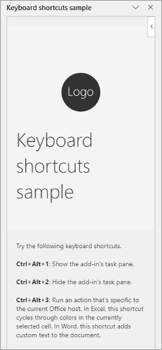
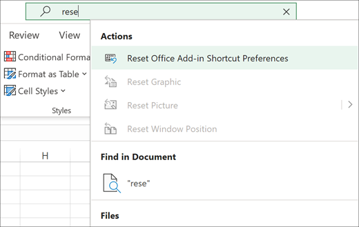

# Use keyboard shortcuts for Office Add-in actions

## Summary

This sample shows how to create custom keyboard shortcuts for an Office Add-in. Keyboard shortcuts let power users quickly use your add-in's features and give accessibility options to avoid using a mouse. In this sample, the following shortcuts are configured.

- **Ctrl+Alt+Up arrow key**: Opens the add-in's task pane.
- **Ctrl+Alt+Down arrow key**: Hides the add-in's task pane.
- **Ctrl+Alt+Q**: Performs an action that's specific to the current Office host.
  - **Excel**: Cycles through colors in the currently selected cell.
  - **Word**: Adds text to the document.

Keyboard shortcuts can be used to achieve any action within the add-in runtime.



## Features

- Add keyboard shortcuts to your Office Add-in.
- Provide users with keyboard shortcuts to invoke any action within the Office Add-in runtime.

## Applies to

- Office on the web
  - Excel
  - Word
- Office on Windows
  - Excel: Version 2111 (Build 14701.10000)
  - Word: Version 2408 (Build 17928.20114)
- Office on Mac
  - Excel: Version 16.55 (21111400)
  - Word: Version 16.88 (24081116)

## Prerequisites

- Microsoft 365

## Solution

| Solution | Authors |
| -------- | --------- |
| Use keyboard shortcuts for Office Add-in actions | Microsoft |

## Version history

| Version | Date | Comments |
| ------- | ---- | -------- |
| 1.0 | 11-5-2020 | Initial release |
| 1.1 | May 11, 2021 | Removed yo office and modified to be GitHub hosted |
| 2.0 | September 27, 2024 | Added support for Word |
| 2.1 | December 5, 2024 | Updated keyboard shortcuts |

## Disclaimer

**THIS CODE IS PROVIDED *AS IS* WITHOUT WARRANTY OF ANY KIND, EITHER EXPRESS OR IMPLIED, INCLUDING ANY IMPLIED WARRANTIES OF FITNESS FOR A PARTICULAR PURPOSE, MERCHANTABILITY, OR NON-INFRINGEMENT.**

## Run the sample

### Run the sample from GitHub

Run this sample in Excel or Word. The add-in web files are served from this repository on GitHub.

1. Download the **manifest.xml** file from this sample to a folder on your computer.
1. Sideload the manifest file in Excel or Word. The sideloading process varies depending on your platform.

    - **Office on the web**: [Manually sideload an add-in to Office on the web](https://learn.microsoft.com/office/dev/add-ins/testing/sideload-office-add-ins-for-testing#manually-sideload-an-add-in-to-office-on-the-web)
    - **Office on Windows**: [Sideload Office Add-ins for testing from a network share](https://learn.microsoft.com/office/dev/add-ins/testing/create-a-network-shared-folder-catalog-for-task-pane-and-content-add-ins)
    - **Office on Mac**: [Sideload Office Add-ins on Mac for testing](https://learn.microsoft.com/office/dev/add-ins/testing/sideload-an-office-add-in-on-mac)
1. Verify that the add-in loaded successfully. You'll see a **Keyboard shortcuts** button on the **Home** tab of the ribbon.
1. Test the sample by following the steps in [Try it out](#try-it-out).

### Run the sample from localhost

If you prefer to host the web server for the sample on your computer, follow these steps.

1. Install a recent version of [npm](https://www.npmjs.com/get-npm) and [Node.js](https://nodejs.org/) on your computer. To verify if you've already installed these tools, run the commands `node -v` and `npm -v` in your terminal.
1. You need http-server to run the local web server. If you haven't installed this yet, you can do this with the following command.

    ```console
    npm install --global http-server
    ```

1. You need Office-Addin-dev-certs to generate self-signed certificates to run the local web server. If you haven't installed this yet, you can do this with the following command.

    ```console
    npm install --global office-addin-dev-certs
    ```

1. Clone or download this sample to a folder on your computer, then go to that folder in a console or terminal window.
1. Run the following command to generate a self-signed certificate to use for the web server.

   ```console
    npx office-addin-dev-certs install
    ```

    This command will display the folder location where it generated the certificate files.

1. Go to the folder location where the certificate files were generated, then copy the **localhost.crt** and **localhost.key** files to the cloned or downloaded sample folder.
1. Run the following command.

    ```console
    http-server -S -C localhost.crt -K localhost.key --cors . -p 3000
    ```

    The http-server will run and host the current folder's files on localhost:3000.

1. Sideload the **manifest-localhost.xml** file in Excel or Word. The sideloading process varies depending on your platform.

    - **Office on the web**: [Manually sideload an add-in to Office on the web](https://learn.microsoft.com/office/dev/add-ins/testing/sideload-office-add-ins-for-testing#manually-sideload-an-add-in-to-office-on-the-web)
    - **Office on Windows**: [Sideload Office Add-ins for testing from a network share](https://learn.microsoft.com/office/dev/add-ins/testing/create-a-network-shared-folder-catalog-for-task-pane-and-content-add-ins)
    - **Office on Mac**: [Sideload Office Add-ins on Mac for testing](https://learn.microsoft.com/office/dev/add-ins/testing/sideload-an-office-add-in-on-mac)
1. Verify that the add-in loaded successfully. You'll see a **Keyboard shortcuts** button on the **Home** tab of the ribbon.
1. Test the sample by following the steps in [Try it out](#try-it-out).

## Try it out

Once the add-in is loaded, try out its functionality.

1. Press **Ctrl+Alt+Up arrow key** on your keyboard to open the add-in's task pane.

  > [!NOTE]
  > If the keyboard shortcut is already in use in Excel or Word, a dialog will be shown so that you can select which action you'd like to map to the shortcut. Once you select an action, you can change your preference by invoking the **Reset Office Add-in Shortcut Preferences** command from the search field.
  >
  > 

1. Try the other available shortcuts shown in the task pane.

## Key parts of this sample

The custom keyboard shortcuts implemented in this sample rely on the following components.

- The add-in manifest (**manifest.xml**) is configured to use a shared runtime. For guidance on how to implement a shared runtime in your add-in, see [Configure your Office Add-in to use a shared runtime](https://learn.microsoft.com/office/dev/add-ins/develop/configure-your-add-in-to-use-a-shared-runtime).
- A shortcuts JSON file (**shortcuts.json**) is included in the sample to define the add-in's actions and their keyboard shortcuts. For guidance on how to construct the JSON file, see the [JSON file schema](https://developer.microsoft.com/json-schemas/office-js/extended-manifest.schema.json).
- The custom actions defined in the JSON file are then mapped to their specific JavaScript functions (**taskpane.js**) using the [Office.actions.associate](https://learn.microsoft.com/javascript/api/office/office.actions#office-office-actions-associate-member(1)) method.

To learn more about each component, see [Add custom keyboard shortcuts to your Office Add-ins](https://learn.microsoft.com/office/dev/add-ins/design/keyboard-shortcuts).

## Questions and feedback

- Did you experience any problems with the sample? [Create an issue](https://github.com/OfficeDev/Office-Add-in-samples/issues/new/choose) and we'll help you out.
- We'd love to get your feedback about this sample. Go to our [Office samples survey](https://aka.ms/OfficeSamplesSurvey) to give feedback and suggest improvements.
- For general questions about developing Office Add-ins, go to [Microsoft Q&A](https://learn.microsoft.com/answers/topics/office-js-dev.html) using the office-js-dev tag.

## Copyright

Copyright (c) 2020 Microsoft Corporation. All rights reserved.

This project has adopted the [Microsoft Open Source Code of Conduct](https://opensource.microsoft.com/codeofconduct/). For more information, see the [Code of Conduct FAQ](https://opensource.microsoft.com/codeofconduct/faq/) or contact [opencode@microsoft.com](mailto:opencode@microsoft.com) with any additional questions or comments.


