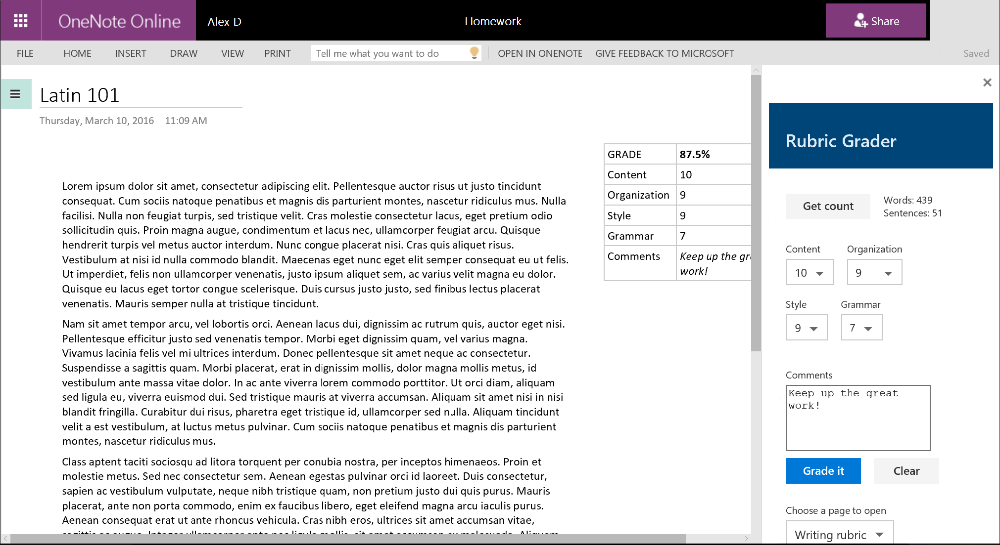

# Rubric grader task pane add-in for OneNote on the web

## Summary

The Rubric Grader sample shows you how to use the OneNote JavaScript API in a OneNote task pane add-in. The add-in gets page content, adds an outline to the page, and opens a different page.

The add-in helps teachers grade writing assignments based on a grading rubric.



## Features

- Interact with OneNote through a custom task pane

## Applies to

- OneNote on the web

## Prerequisites

- A Microsoft 365 tenant

## Solution

| Solution | Author(s) |
|---------|----------|
| Rubric grader task pane add-in for OneNote on the web | Microsoft |

## Version history

| Version  | Date | Comments |
|---------|------|---------|
| 1.0 | 6-17-2025 | Initial release |

## Run the sample
  
You can run this sample in Onenote in a browser. The add-in web files are served from this repo on GitHub.

1. Download the **manifest.xml** file from this sample to a folder on your computer.
1. Open [Office on the web](https://office.live.com/).
1. Under **Apps**, choose **OneNote**.
1. Open a notebook that contains a couple of pages. Make sure at least one page has a paragraph of content.
1. Open the **Insert** tab on the ribbon and choose **Office Add-ins**.
1. On the **Office Add-ins** dialog, select the **MY ADD-INS** tab, choose **Upload My Add-in**.
1. Browse to the add-in manifest file, and then select **Upload**.
1. Verify that the add-in loaded successfully. You will see a **Show Taskpane** button on the **Home** tab on the ribbon.

Once the add-in is loaded use the following steps to try out the functionality.

## Run the sample from localhost

If you prefer to configure a web server and host the add-in's web files from your computer, use the following steps.

1. Install a recent version of [npm](https://www.npmjs.com/get-npm) and [Node.js](https://nodejs.org/) on your computer. To verify if you've already installed these tools, run the commands `node -v` and `npm -v` in your terminal.

1. You need http-server to run the local web server. If you haven't installed this yet, you can do this with the following command.

    ```console
    npm install --global http-server
    ```

1. You need Office-Addin-dev-certs to generate self-signed certificates to run the local web server. If you haven't installed this yet, you can do this with the following command.

    ```console
    npm install --global office-addin-dev-certs
    ```

1. Clone or download this sample to a folder on your computer, then go to that folder in a console or terminal window.

1. Run the following command to generate a self-signed certificate to use for the web server.

   ```console
    npx office-addin-dev-certs install
    ```

    This command will display the folder location where it generated the certificate files.

1. Go to the folder location where the certificate files were generated, then copy the **localhost.crt** and **localhost.key** files to the cloned or downloaded sample folder.

1. Run the following command.

    ```console
    http-server -S -C localhost.crt -K localhost.key --cors . -p 3000
    ```

    The http-server will run and host the current folder's files on localhost:3000.

1. Now that your localhost web server is running, you can sideload the **manifest-localhost.xml** file provided in the sample folder. Using this file, follow the steps in [Run the sample](#run-the-sample) to sideload and run the add-in.

## Questions and feedback

- Did you experience any problems with the sample? [Create an issue](https://github.com/OfficeDev/Office-Add-in-samples/issues/new/choose) and we'll help you out.
- We'd love to get your feedback about this sample. Go to our [Office samples survey](https://aka.ms/OfficeSamplesSurvey) to give feedback and suggest improvements.
- For general questions about developing Office Add-ins, go to [Microsoft Q&A](https://learn.microsoft.com/answers/topics/office-js-dev.html) using the office-js-dev tag.

## Copyright

Copyright (c) 2025 Microsoft Corporation. All rights reserved.

This project has adopted the [Microsoft Open Source Code of Conduct](https://opensource.microsoft.com/codeofconduct/). For more information, see the [Code of Conduct FAQ](https://opensource.microsoft.com/codeofconduct/faq/) or contact [opencode@microsoft.com](mailto:opencode@microsoft.com) with any additional questions or comments.


