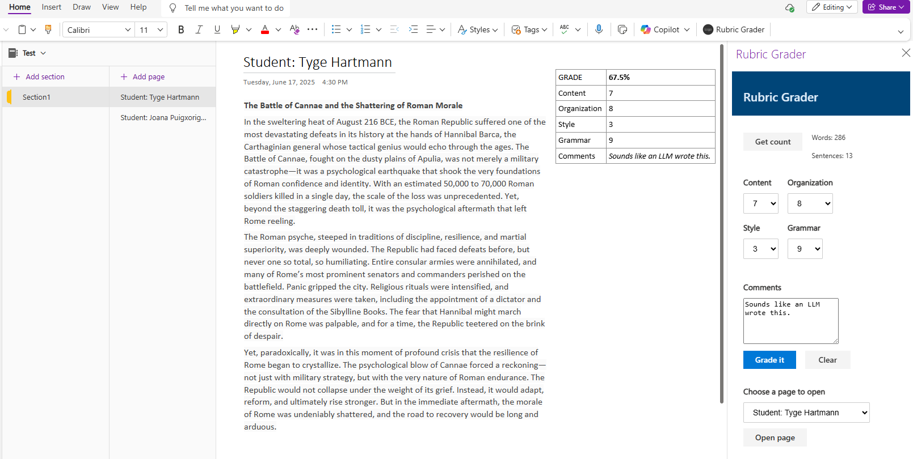

# Rubric grader task pane add-in for OneNote on the web

## Summary

The Rubric Grader sample shows you how to use the OneNote JavaScript API in a OneNote task pane add-in. The add-in gets page content, adds an outline to the page, and opens a different page.

The add-in helps teachers grade writing assignments based on a grading rubric.

## Features

- Interact with OneNote through a custom task pane

## Applies to

- OneNote on the web

## Prerequisites

- A Microsoft 365 tenant

## Solution

| Solution | Author(s) |
|---------|----------|
| Rubric grader task pane add-in for OneNote on the web | Microsoft |

## Version history

| Version  | Date | Comments |
|---------|------|---------|
| 1.0 | 6-17-2025 | Initial release |

## Run the sample
  
You can run this sample in Onenote in a browser. The add-in web files are served from this repo on GitHub.

1. Download the **manifest.xml** file from this sample to a folder on your computer.
1. Open [Office on the web](https://office.live.com/).
1. Under **Apps**, choose **OneNote**.
1. Open a notebook that contains a couple of pages. Make sure at least one page has a paragraph of content.
1. Open the **Insert** tab on the ribbon and choose **Office Add-ins**.
1. On the **Office Add-ins** dialog, select the **MY ADD-INS** tab, choose **Upload My Add-in**.
1. Browse to the add-in manifest file, and then select **Upload**.
1. Verify that the add-in loaded successfully. You will see a **Show Taskpane** button on the **Home** tab on the ribbon.

Once the add-in is loaded use the following steps to try out the functionality.

## Questions and feedback

- Did you experience any problems with the sample? [Create an issue](https://github.com/OfficeDev/Office-Add-in-samples/issues/new/choose) and we'll help you out.
- We'd love to get your feedback about this sample. Go to our [Office samples survey](https://aka.ms/OfficeSamplesSurvey) to give feedback and suggest improvements.
- For general questions about developing Office Add-ins, go to [Microsoft Q&A](https://learn.microsoft.com/answers/topics/office-js-dev.html) using the office-js-dev tag.

## Copyright

Copyright (c) 2025 Microsoft Corporation. All rights reserved.

This project has adopted the [Microsoft Open Source Code of Conduct](https://opensource.microsoft.com/codeofconduct/). For more information, see the [Code of Conduct FAQ](https://opensource.microsoft.com/codeofconduct/faq/) or contact [opencode@microsoft.com](mailto:opencode@microsoft.com) with any additional questions or comments.

