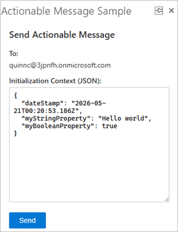
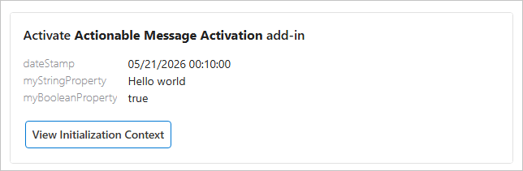
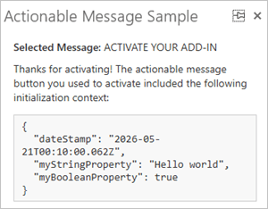
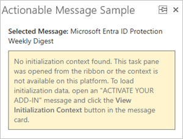

# Invoke an Outlook add-in from an actionable message

**Applies to**: Outlook on the web | Outlook on Windows (new and classic) | Outlook on Mac

## Summary

Perform quick actions without leaving Outlook. This sample demonstrates how to send [actionable messages](https://learn.microsoft.com/outlook/actionable-messages/) that activate an add-in using [Action.InvokeAddInCommand](https://learn.microsoft.com/outlook/actionable-messages/invoke-add-in). The actionable message contains an [Adaptive Card](https://learn.microsoft.com/outlook/actionable-messages/adaptive-card) with initialization context, which is sent using [Nested App Authentication (NAA)](https://learn.microsoft.com/office/dev/add-ins/develop/enable-nested-app-authentication-in-your-add-in) and [Microsoft Graph](https://learn.microsoft.com/office/dev/add-ins/outlook/microsoft-graph). When the add-in is activated from the Adaptive Card, a task pane displays the context using the [getInitializationContextAsync](https://learn.microsoft.com/javascript/api/outlook/office.messageread#outlook-office-messageread-getinitializationcontextasync-member(1)) method.

## Applies to

- Outlook on the web
- New Outlook on Windows
- Classic Outlook on Windows starting in Version 1910 (Build 12130.20272)
- Outlook on Mac (new UI) starting in Version 16.38.506

## Prerequisites

- A Microsoft 365 subscription.

    > **Note**: If you don't have a Microsoft 365 subscription, you might qualify for a free developer subscription that's renewable for 90 days and comes configured with sample data. For details, see the [Microsoft 365 Developer Program FAQ](https://learn.microsoft.com/office/developer-program/microsoft-365-developer-program-faq#who-qualifies-for-a-microsoft-365-e5-developer-subscription-).

- A recent version of [npm](https://www.npmjs.com/get-npm) and [Node.js](https://nodejs.org) to run the web server on localhost. To check if you've already installed these tools, run the following commands from a command prompt.

    ```console
    node -v
    npm -v
    ```

- Administrator access to the [Azure portal](https://portal.azure.com/) to register the add-in.

## Choose a manifest type

By default, the sample uses an add-in only manifest. However, you can switch the project between the add-in only manifest and the unified manifest for Microsoft 365. For more information about the differences between them, see [Office Add-ins manifest](https://learn.microsoft.com/office/dev/add-ins/develop/add-in-manifests). To continue with the add-in only manifest, skip ahead to the [Set up the sample](#set-up-the-sample) section.

> [!NOTE]
> The unified manifest for Microsoft 365 isn't directly supported in Outlook on Mac. Run the sample with the add-in only manifest instead. For more information about clients and platforms supported by the unified manifest, see [Office Add-ins with the unified app manifest for Microsoft 365](https://learn.microsoft.com/office/dev/add-ins/develop/unified-manifest-overview#client-and-platform-support).

### To switch to the unified manifest for Microsoft 365

Copy all the files from the **manifest-configurations/unified** subfolder to the sample's root folder, replacing any existing files that have the same names. We recommend that you delete the **manifest.xml** file from the root folder, so only files needed for the unified manifest are present. Then, [set up the sample](#set-up-the-sample).

### To switch back to the add-in only manifest

To switch back to the add-in only manifest, copy the files from the **manifest-configurations/add-in-only** subfolder to the sample's root folder. We recommend that you delete the **manifest.json** file from the root folder.

## Set up the sample

Because the sample uses NAA to make Microsoft Graph calls, you must first register it on the Azure portal.

1. In your preferred browser, go to the [Azure portal](https://portal.azure.com/) and sign in with your administrator credentials. For guidance on how to register an add-in, see the "Add a trusted broker through SPA redirect" section of [Enable single sign-on in an Office Add-in with nested app authentication](https://learn.microsoft.com/office/dev/add-ins/develop/enable-nested-app-authentication-in-your-add-in#add-a-trusted-broker-through-spa-redirect). Use the following details for the registration.
    - **Name**: `Actionable Message Sample`
    - **Supported account types**: `Any Entra ID Tenant + Personal Microsoft accounts`
    - **Redirect URI platform**: `Single-page application (SPA)`
    - **Redirect URI**: `brk-multihub://localhost:3000`
1. Copy the **Application (client) ID** value from the registration.
1. In the sample's **src/send/send.js** file, update the `CLIENT_ID` variable with the copied ID.
1. [Run the sample](#run-the-sample).

## Run the sample

1. Clone or download this repository.
1. From a command prompt, go to the root of the project folder **Samples/outlook-actionable-message**.
1. Run `npm install`.
1. Run `npm start`. This starts the web server on localhost and sideloads the manifest file.

   > **Note**: In Outlook on Mac, you must manually sideload the manifest after starting the web server. For guidance on sideloading, see [Sideload Outlook add-ins for testing](https://learn.microsoft.com/office/dev/add-ins/outlook/sideload-outlook-add-ins-for-testing?tabs=xmlmanifest#sideload-manually).
1. Follow the steps in [Try it out](#try-it-out) to test the sample.
1. To stop the web server and uninstall the add-in, run `npm stop`.

### Try it out

Once the add-in is loaded in Outlook, perform the following steps.

1. Select any message from your mailbox.
1. From the ribbon, select **Send Add-in Activation**.

   The **Send Actionable Message** task pane opens with pre-populated initialization context data.

   
1. Edit the initialization context JSON if desired, then click **Send**.

   The add-in authenticates using NAA. If prompted, sign in and consent to the requested permissions. Once the message is sent, the following notification appears in the task pane: "Actionable message sent successfully." A message with the subject "ACTIVATE YOUR ADD-IN" then arrives in your inbox.

1. Open the received message. Select **View Initialization Context**.

   

   The initialization context is displayed in a task pane.

   

   > **Note:** The initialization context is available only when the task pane is opened from the actionable message. If you select **View Initialization Context** from the ribbon, the task pane prompts you to select the button in the actionable message instead.
   >
   > 

## Questions and feedback

- Did you experience any problems with the sample? [Create an issue](https://github.com/OfficeDev/Office-Add-in-samples/issues/new/choose) and we'll help you out.
- We'd love to get your feedback about this sample. Go to our [Office samples survey](https://aka.ms/OfficeSamplesSurvey) to give feedback and suggest improvements.
- For general questions about developing Office Add-ins, go to [Microsoft Q&A](https://learn.microsoft.com/answers/topics/office-js-dev.html) using the office-js-dev tag.

## Copyright

Copyright (c) 2026 Microsoft Corporation. All rights reserved.

This project has adopted the [Microsoft Open Source Code of Conduct](https://opensource.microsoft.com/codeofconduct/). For more information, see the [Code of Conduct FAQ](https://opensource.microsoft.com/codeofconduct/faq/) or contact [opencode@microsoft.com](mailto:opencode@microsoft.com) with any additional questions or comments.

## Solution

| Solution | Author(s) |
| ----- | ----- |
| Invoke an Outlook add-in from an actionable message | Microsoft |

## Version history

| Version | Date | Comments |
| ----- | ----- | ----- |
| 1.0 | May 21, 2026 | Modernize archived sample |

