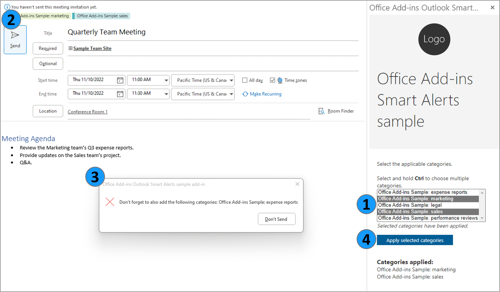
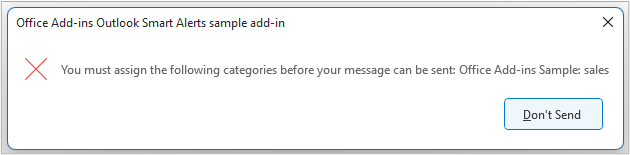

# Verify the color categories of a message or appointment before it's sent using Smart Alerts

**Applies to**: classic Outlook on Windows | Outlook on Mac

## Summary

This sample uses Outlook Smart Alerts to verify that required color categories are applied to a new message or appointment before it's sent. Specific keywords detected in the subject or body of the item determine the required categories. If no categories or only some of the required categories are applied to the message or appointment, the add-in blocks the item from being sent and alerts the user to apply the missing categories. The user can apply categories to the item from the add-in task pane.

For documentation related to this sample, see the following articles.

- [Handle OnMessageSend and OnAppointmentSend events in your Outlook add-in with Smart Alerts](https://learn.microsoft.com/office/dev/add-ins/outlook/onmessagesend-onappointmentsend-events)
- [Automatically check for an attachment before a message is sent](https://learn.microsoft.com/office/dev/add-ins/outlook/smart-alerts-onmessagesend-walkthrough)
- [Activate add-ins with events](https://learn.microsoft.com/office/dev/add-ins/develop/event-based-activation)
- [Get and set categories](https://learn.microsoft.com/office/dev/add-ins/outlook/categories)

## Features



1. Use event-based activation triggered by the `OnNewMessageCompose` and `OnNewAppointmentOrganizer` events to create color categories based on specific keywords.

1. Use event-based activation triggered by the `OnMessageSend` and `OnAppointmentSend` events to verify that a required category is applied to a new message or appointment for each detected keyword in the item's subject or body.

1. Use Outlook Smart Alerts to block a message or appointment from being sent if it's missing any of the required categories.

1. Apply the required categories to the message or appointment using the add-in's task pane.

## Applies to

- Outlook on Windows starting in Version 2206 (Build 15330.20196)
- Outlook on Mac starting in Version 16.65.827.0

> **Note**: Although the Smart Alerts feature is supported in Outlook on the web, on Windows ([new](https://support.microsoft.com/office/656bb8d9-5a60-49b2-a98b-ba7822bc7627) and classic), and on Mac (see the "Supported clients and platforms" section of [Use Smart Alerts and the onMessageSend and OnAppointmentSend events in your Outlook add-in](https://learn.microsoft.com/office/dev/add-ins/outlook/onmessagesend-onappointmentsend-events#supported-clients-and-platforms)), this sample only runs in classic Outlook on Windows and Mac.
>
> As the Office.Categories API can't be used in Compose mode in Outlook on the web and new Outlook on Windows, this sample isn't supported on these client. To learn how to develop a Smart Alerts add-in for Outlook on the web and new Outlook on Windows, see the [Smart Alerts walkthrough](https://learn.microsoft.com/office/dev/add-ins/outlook/smart-alerts-onmessagesend-walkthrough).

## Prerequisites

- A Microsoft 365 subscription. If you don't have a Microsoft 365 subscription, you can get a [free developer sandbox](https://aka.ms/m365/devprogram#Subscription) that provides a renewable 90-day Microsoft 365 E5 subscription for development purposes.

## Solution

| Solution | Authors |
| -------- | --------- |
| Use Outlook Smart Alerts to verify that required color categories are applied to a new message or appointment before it's sent. | Microsoft |

## Choose a manifest type

By default, the sample uses an add-in only manifest. However, you can switch the project between the add-in only manifest and the unified manifest for Microsoft 365. For more information about the differences between them, see [Office Add-ins manifest](https://learn.microsoft.com/office/dev/add-ins/develop/add-in-manifests). To continue with the add-in only manifest, skip ahead to the [Run the sample](#run-the-sample) section.

> [!NOTE]
> The unified manifest for Microsoft 365 isn't directly supported in Outlook on Mac. Run the sample with the add-in only manifest instead. For more information about clients and platforms supported by the unified manifest, see [Office Add-ins with the unified app manifest for Microsoft 365](https://learn.microsoft.com/office/dev/add-ins/develop/unified-manifest-overview#client-and-platform-support).

### To switch to the unified manifest for Microsoft 365

Copy all the files from the **manifest-configurations/unified** subfolder to the sample's root folder, replacing any existing files that have the same names. We recommend that you delete the **manifest.xml** and **manifest-localhost.xml** files from the root folder, so only files needed for the unified manifest are present. Then, [run the sample](#run-the-sample).

### To switch back to the add-in only manifest

To switch back to the add-in only manifest, copy the files from the **manifest-configurations/add-in-only** subfolder to the sample's root folder. We recommend that you delete the **manifest.json** file from the root folder.

## Run the sample

To run the sample, choose whether to host the add-in's web files on localhost or on GitHub.

### Use localhost

1. Clone or download this repository.
1. From a command prompt, go to the root of the project folder **Samples/outlook-check-item-categories**.
1. Run `npm install`.
1. Run `npm start`. This starts the web server on localhost and sideloads the manifest file.
1. Follow the steps in [Try it out](#try-it-out) to test the sample.
1. To stop the web server and uninstall the add-in, run `npm stop`.

### Use GitHub

> [!NOTE]
> The option to use GitHub as the web host only applies to the add-in only manifest.

The quickest way to run the sample is to use GitHub as the web host. However, you can't debug or change the source code. The add-in web files are served from this GitHub repository.

1. Download the **manifest.xml** file from this sample to a folder on your computer.
1. Sideload the manifest by following the manual instructions in [Sideload Outlook add-ins for testing](https://learn.microsoft.com/office/dev/add-ins/outlook/sideload-outlook-add-ins-for-testing?tabs=xmlmanifest#sideload-manually).
1. Follow the steps in [Try it out](#try-it-out) to test the sample.
1. To uninstall the add-in, follow the instructions in [Remove a sideloaded add-in](https://learn.microsoft.com/office/dev/add-ins/outlook/sideload-outlook-add-ins-for-testing?tabs=xmlmanifest#remove-a-sideloaded-add-in).

### Try it out

Once the add-in is loaded, use the following steps to try out its functionality.

1. Create a new message or appointment.

    Color categories named **Office Add-ins Sample...** are created. To verify this from the new message or appointment window, select **File** \> **Info** \> **Properties** \> **Categories**.

1. Add a recipient.

1. Add text to the subject and body of the message or appointment, with one or both fields containing one or more of the following keywords.

   - expense reports

   - legal

   - marketing

   - performance reviews

   - sales

   For example, "The Sales team's performance reviews will be submitted tomorrow."

1. Send the message or appointment.

    An alert appears that reads, "You must assign the following categories before your message can be sent: Office Add-ins Sample: sales, Office Add-ins Sample: performance reviews".

1. Select **Don't Send**.

1. To apply the required color categories to the message or appointment, choose **Select categories** from the ribbon of the message or appointment window.

    The **Office Add-ins Smart Alerts sample** task pane appears.

1. Select the applicable categories from the category list. To apply multiple categories, select and hold <kbd>Ctrl</kbd> while selecting the categories.

1. Select **Apply Selected Categories**.

    The applied categories appear in the **Categories applied** section of the task pane.

    **Note**: Categories applied to a message being composed don't appear on the message itself. They only appear on the message once the message is sent and is accessed from the **Sent Items** folder.

1. Send the message or appointment.

## Key parts of the sample

### Configure event-based activation in the manifest

The manifest configures a runtime to handle event-based activation. Because the Outlook platform uses the client to determine whether to use HTML or JavaScript to load the runtime, both of these files must be referenced in the manifest. Outlook on Windows uses the referenced JavaScript file to load the runtime, while Outlook on Mac uses the HTML file. The markup varies depending on the manifest your add-in uses.

- **Unified manifest for Microsoft 365**: In the `"extensions.runtimes.code"` property, the HTML page resource ID is specified in the `"page"` child property while the JavaScript file resource ID is specified in the `"script"` child property.

    ```json
    "extensions": [
        {
            ...
            "runtimes": [
                {
                    ...
                    "code": {
                        "page": "https://localhost:3000/commands.html",
                        "script": "https://localhost:3000/commands.js"
                    },
                    ...
                },
            ]
            ...
        }
    ]
    ```

- **Add-in only manifest**: The HTML page resource ID is specified in the `<Runtime>` element while the JavaScript file resource ID is specified in the `<Override>` element.

    ```xml
    <Runtime resid="WebViewRuntime.Url">
        <Override type="javascript" resid="JSRuntime.Url"/>
    </Runtime>
    ...
    <bt:Url id="WebViewRuntime.Url" DefaultValue="https://officedev.github.io/Office-Add-in-samples/Samples/outlook-check-item-categories/src/commands.html" />
    <bt:Url id="JSRuntime.Url" DefaultValue="https://officedev.github.io/Office-Add-in-samples/Samples/outlook-check-item-categories/src/commands/commands.js" />
    ```

Additionally, the events that activate the add-in are specified in the manifest and mapped to their respective handler functions. The markup varies depending on the manifest your add-in uses.

- **Unified manifest for Microsoft 365**: The events are specified in the `"extensions.autoRunEvents"` array. To determine how the add-in will handle the `OnMessageSend` and `OnAppointmentSend` events, an additional `"sendMode"` property is specified.

    ```json
    "autoRunEvents": [
        {
            ...
            "events": [
                {
                    "type": "newMessageComposeCreated",
                    "actionId": "onMessageComposeHandler"
                },
                {
                    "type": "newAppointmentOrganizerCreated",
                    "actionId": "onAppointmentComposeHandler"
                },
                {
                    "type": "messageSending",
                    "actionId": "onMessageSendHandler",
                    "options": {
                        "sendMode": "softBlock"
                    }
                },
                {
                    "type": "appointmentSending",
                    "actionId": "onAppointmentSendHandler",
                    "options": {
                        "sendMode": "block"
                    }
                }
            ]
        }
    ]
    ```

- **Add-in only manifest**: The events are specified in the `<LaunchEvents>` element. To determine how the add-in will handle the `OnMessageSend` and `OnAppointmentSend` events, an additional `SendMode` attribute is specified.

    ```xml
    <LaunchEvents>
        <LaunchEvent Type="OnNewMessageCompose" FunctionName="onMessageComposeHandler"/>
        <LaunchEvent Type="OnNewAppointmentOrganizer" FunctionName="onAppointmentComposeHandler"/>
        <LaunchEvent Type="OnMessageSend" FunctionName="onMessageSendHandler" SendMode="SoftBlock"/>
        <LaunchEvent Type="OnAppointmentSend" FunctionName="onAppointmentSendHandler" SendMode="Block"/>
    </LaunchEvents>
    ```

The `OnMessageSend` event uses the `SoftBlock` option to prevent a user from sending a message if any of the required categories are missing. In the event that the add-in becomes unavailable (for example, if the add-in encounters a loading error) and can't check the message for applied categories, the user will still be able to send the message.

The `OnAppointmentSend` event uses the `Block` option to prevent a user from sending a meeting invite if any of the required categories are missing. If the add-in encounters a loading error and can't check the invite for applied categories, the user will not be able to send the invite until the add-in becomes available again.

For additional information on send mode options, see [Available send mode options](https://learn.microsoft.com/office/dev/add-ins/outlook/onmessagesend-onappointmentsend-events#available-send-mode-options).

### Configure the event handlers

The event object is passed to its respective handler in **commands.js** for processing. The `onItemComposeHandler` processes `onNewMessageCompose` and `onNewAppointmentOrganizer` events, while `onItemSendHandler` processes `onMessageSend` and `onAppointmentSend` events.

The `associate` method is called in `commands.js` to map the function IDs specified in the manifest to the appropriate event handler.

```javascript
Office.actions.associate("onMessageComposeHandler", onItemComposeHandler);
Office.actions.associate("onAppointmentComposeHandler", onItemComposeHandler);
Office.actions.associate("onMessageSendHandler", onItemSendHandler);
Office.actions.associate("onAppointmentSendHandler", onItemSendHandler);
```

Once the handler processes the event, it calls the [event.completed](https://learn.microsoft.com/javascript/api/outlook/office.mailboxevent#outlook-office-mailboxevent-completed-member(1)) method. This method uses the [allowEvent](https://learn.microsoft.com/javascript/api/outlook/office.smartalertseventcompletedoptions#outlook-office-smartalertseventcompletedoptions-allowevent-member) property to indicate whether the handled event can continue to execute or must terminate. When the event must terminate because it doesn't meet the add-in's conditions, the [errorMessage](https://learn.microsoft.com/javascript/api/outlook/office.smartalertseventcompletedoptions#outlook-office-smartalertseventcompletedoptions-errormessage-member) property is used to display an alert to the user.

```javascript
let message = `You must assign the following categories before your ${Office.context.mailbox.item.itemType} can be sent: ${requiredCategories.join(", ")}`;
console.log(message);
sendEvent.completed({ allowEvent: false, errorMessage: message });
return;
```



Event-based add-ins should be short-running and lightweight. To prevent the possibility of a long-running operation that may lead to an add-in timeout, the color category creation process is handled by `onItemComposeHandler` instead of `onItemSendHandler`.

### Implement a task pane

A task pane is used to complement event-based activation by providing users with a venue to further interact with the add-in. The `taskpane.html` and `taskpane.js` files configure the UI and functionality of the task pane, respectively. This allows the user to easily choose and apply the required Office Add-ins Sample color categories to the message or appointment.

## Version history

| Version | Date | Comments |
| ------- | ----- | -------- |
| 1.0 | 05-05-2022 | Initial release |
| 1.1 | 09-08-2022 | Update for General Availability (GA) of OnMessageSend and OnAppointmentSend events |
| 1.2 | 12-02-2022 | Add support for new Outlook on Mac |
| 1.3 | 07-25-2025 | Add support for the unified manifest for Microsoft 365 |

## Questions and feedback

- Did you experience any problems with the sample? [Create an issue](https://github.com/OfficeDev/Office-Add-in-samples/issues/new/choose) and we'll help you out.
- We'd love to get your feedback about this sample. Go to our [Office samples survey](https://aka.ms/OfficeSamplesSurvey) to give feedback and suggest improvements.
- For general questions about developing Office Add-ins, go to [Microsoft Q&A](https://learn.microsoft.com/answers/topics/office-js-dev.html) using the office-js-dev tag.

## Copyright

Copyright (c) 2022 Microsoft Corporation. All rights reserved.

This project has adopted the [Microsoft Open Source Code of Conduct](https://opensource.microsoft.com/codeofconduct/). For more information, see the [Code of Conduct FAQ](https://opensource.microsoft.com/codeofconduct/faq/) or contact [opencode@microsoft.com](mailto:opencode@microsoft.com) with any additional questions or comments.

---


