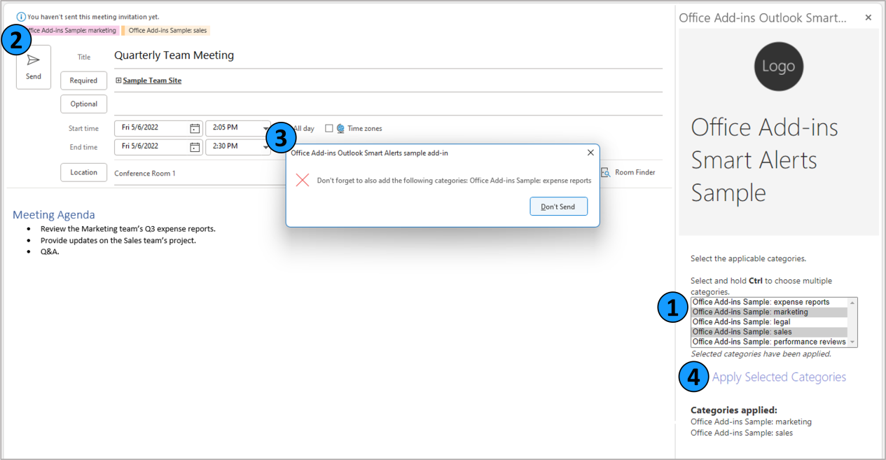

# Use Outlook Smart Alerts

**Applies to**: Outlook on Windows

## Summary

This sample uses Outlook Smart Alerts to verify that required color categories are applied to a new message or appointment before it's sent. Specific keywords detected in the subject or body of the item determine the required categories. If no categories or only some of the required categories are applied to the message or appointment, the add-in blocks the item from being sent and alerts the user to apply the missing categories. The user can apply categories to the item from the add-in task pane.

Smart Alerts and its related events, `OnMessageSend` and `OnAppointmentSend`, are currently available in preview. For documentation related to this sample, see [Use Smart Alerts and the onMessageSend event in your Outlook add-in (preview)](https://docs.microsoft.com/office/dev/add-ins/outlook/smart-alerts-onmessagesend-walkthrough).

## Features



1. Use event-based activation triggered by the `OnNewMessageCompose` and `OnNewAppointmentOrganizer` events to create color categories based on specific keywords.

1. Use event-based activation triggered by the `OnMessageSend` and `OnAppointmentSend` events to verify that a required category is applied to a new message or appointment for each detected keyword in the item's subject or body.

1. Use Outlook Smart Alerts to block a message or appointment from being sent if it's missing some or all of the required categories.

1. Apply the required categories to the message or appointment using the add-in's task pane.

## Applies to

- Outlook on Windows (minimum build - 16.0.14511.10000)

## Prerequisites

- A Microsoft 365 subscription. If you don't have a Microsoft 365 subscription, you can get a [free developer sandbox](https://developer.microsoft.com/microsoft-365/dev-program#Subscription) that provides a renewable 90-day Microsoft 365 E5 subscription for development purposes.


- Outlook on Windows with a minimum build of 16.0.14511.10000. For guidance with client configuration, see [How to preview](https://docs.microsoft.com/office/dev/add-ins/outlook/autolaunch#how-to-preview).

## Solution

| Solution | Author(s) |
| -------- | --------- |
| Use Outlook Smart Alerts to verify that required color categories are applied to a new message or appointment before it's sent | Microsoft |

## Version history

| Version | Date | Comments |
| ------- | ----- | -------- |
| 1.0 | 05-05-2022 | Initial release |

## Run the sample

Run this sample in Outlook on Windows. The add-in web files are served from this repository on GitHub.

1. Download the **manifest.xml** file from this sample to a folder on your computer.

1. Sideload the add-in manifest in Outlook on Windows by following the manual instructions in [Sideload Outlook add-ins for testing](https://docs.microsoft.com/office/dev/add-ins/outlook/sideload-outlook-add-ins-for-testing).

### Try it out

Once the add-in is loaded, use the following steps to try out its functionality.

1. Create a new message or appointment.

    Office Add-ins Sample color categories are created. To verify this from the new message or appointment window, select **File** \> **Info** \> **Properties** \> **Categories**.

1. Add a recipient.

1. Add text to the subject and body of the message or appointment, with one or both fields containing one or more of the following keywords.

   - expense reports

   - legal

   - marketing

   - performance reviews

   - sales

   For example, "The Sales team's performance reviews will be submitted tomorrow."

1. Send the message or appointment.

    An alert appears that reads, "You must assign the following categories before your message can be sent: Office Add-ins Sample: sales, Office Add-ins Sample: performance reviews".

1. Select **Don't Send**.

1. To apply the required color categories to the message or appointment, choose **Select categories** from the ribbon of the message or appointment window.

    The Office Add-ins Smart Alerts Sample task pane appears.

1. Select the applicable categories from the category list. To apply multiple categories, select and hold **Ctrl** while selecting the categories.

1. Select **Apply Selected Categories**.

    The applied categories appear in the **Categories applied** section of the task pane.

1. Send the message or appointment.

## Run the sample from localhost

If you prefer to host the web server for the sample on your computer, follow these steps.

1. Install a recent version of [npm](https://www.npmjs.com/get-npm) and [Node.js](https://nodejs.org/) on your computer. To verify if you've already installed these tools, run the commands `node -v` and `npm -v` in your terminal.

1. You need http-server to run the local web server. If you haven't installed this yet, run the following command.

    ```console
    npm install --global http-server
    ```

1. Use a tool to generate a self-signed certificate, such as openssl, that you can use for the web server. Move the **cert.pem** and **key.pem** files to the root folder of this sample.

1. From a command prompt, go to the root folder and run the following command.

    ```console
    http-server -S --cors . -p 3000
    ```

1. To reroute to localhost, run office-addin-https-reverse-proxy. If you haven't installed this, run the following command.

    ```console
    npm install --global office-addin-https-reverse-proxy 
    ```

    To reroute, run the following in another command prompt.

    ```console
    office-addin-https-reverse-proxy --url http://localhost:3000 
    ```

1. Sideload **manifest-localhost.xml** in Outlook on Windows by following the manual instructions in [Sideload Outlook add-ins for testing](https://docs.microsoft.com/office/dev/add-ins/outlook/sideload-outlook-add-ins-for-testing).

1. [Try out the sample!](#try-it-out)

## Key parts of the sample

### Configure event-based activation in the manifest

The manifest configures a runtime to handle event-based activation. Because the Outlook platform uses the client to determine whether to use HTML or JavaScript to load the runtime, both of these files must be referenced in the manifest. An HTML page resource ID is specified in the `<Runtime>` element, and a JavaScript file resource ID is specified in the `<Override>` element, as shown below. Outlook on Windows uses the referenced JavaScript file, instead of the HTML page, to load the runtime.

```xml
<Runtime resid="WebViewRuntime.Url">
    <Override type="javascript" resid="JSRuntime.Url"/>
</Runtime>
...
<bt:Url id="WebViewRuntime.Url" DefaultValue="https://officedev.github.io/Office-Add-in-samples/Samples/outlook-check-item-categories/src/commands.html" />
<bt:Url id="JSRuntime.Url" DefaultValue="https://officedev.github.io/Office-Add-in-samples/Samples/outlook-check-item-categories/src/commands/commands.js" />
```

The `<LaunchEvents>` element maps the four events that activate the add-in to the functions that handle each event. To determine how the add-in will handle the `OnMessageSend` and `OnAppointmentSend` events, an additional `SendMode` attribute is specified.

```xml
<LaunchEvents>
    <LaunchEvent Type="OnNewMessageCompose" FunctionName="onItemComposeHandler"/>
    <LaunchEvent Type="OnNewAppointmentOrganizer" FunctionName="onItemComposeHandler"/>
    <LaunchEvent Type="OnMessageSend" FunctionName="onItemSendHandler" SendMode="SoftBlock"/>
    <LaunchEvent Type="OnAppointmentSend" FunctionName="onItemSendHandler" SendMode="Block"/>
</LaunchEvents>
```

The `OnMessageSend` event uses the `SoftBlock` option to prevent a user from sending a message if some or all of the required categories are missing. In the event that the add-in becomes unavailable (for example, if the add-in encounters a loading error) and can't check the message for applied categories, the user will still be able to send the message.

The `OnAppointmentSend` event uses the `Block` option to prevent a user from sending a meeting invite if some or all of the required categories are missing. If the add-in encounters a loading error and can't check the invite for applied categories, the user will not be able to send the invite until the add-in becomes available again.

For additional information on `SendMode` options, see [Available SendMode options](https://docs.microsoft.com//javascript/api/manifest/launchevent?view=common-js-preview#available-sendmode-options-preview).

### Configure the event handlers

The event object is passed to its respective handler in **commands.js** for processing. The `onItemComposeHandler` processes `onNewMessageCompose` and `onNewAppointmentOrganizer` events, while `onItemSendHandler` processes `onMessageSend` and `onAppointmentSend` events.

The `associate` method is called in `commands.js` to map the function IDs specified in the manifest to the appropriate event handler.

```javascript
Office.actions.associate("onItemComposeHandler", onItemComposeHandler);
Office.actions.associate("onItemSendHandler", onItemSendHandler);
```

Once the handler processes the event, it calls the `event.completed` method. This method uses the `allowEvent` property to indicate whether the handled event can continue to execute or must terminate. When the event must terminate because it doesn't meet the add-in's conditions, the `errorMessage` property is used to display an alert to the user.

```javascript
let message = `You must assign the following categories before your ${Office.context.mailbox.item.itemType} can be sent: ${requiredCategories.join(", ")}`;
console.log(message);
sendEvent.completed({ allowEvent: false, errorMessage: message });
return;
```


Event-based add-ins should be short-running and lightweight. To prevent the possibility of a long-running operation that may lead to an add-in timeout, the color category creation process is handled by `onItemComposeHandler` instead of `onItemSendHandler`.

### Implement a task pane

Task panes are used to complement event-based activation by providing users with a venue to further interact with the add-in. The `taskpane.html` and `taskpane.js` files configure the UI and functionality of the task pane, respectively. This allows the user to easily choose and apply the required Office Add-ins Sample color categories to the message or appointment.

## Known issues

- In the Windows client, imports are not supported in the JavaScript file where you implement event-based activation handling.

## Copyright

Copyright (c) 2022 Microsoft Corporation. All rights reserved.

This project has adopted the [Microsoft Open Source Code of Conduct](https://opensource.microsoft.com/codeofconduct/). For more information, see the [Code of Conduct FAQ](https://opensource.microsoft.com/codeofconduct/faq/) or contact [opencode@microsoft.com](mailto:opencode@microsoft.com) with any additional questions or comments.

---


