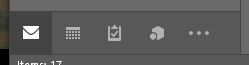
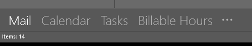
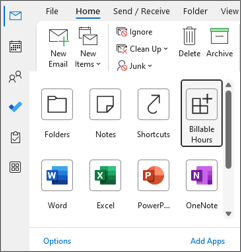
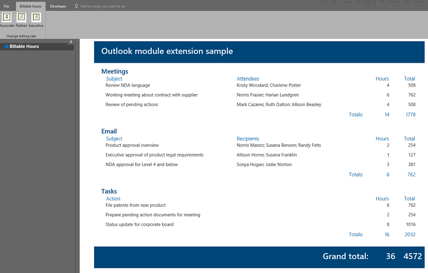

# [ARCHIVED] Compute billable hours with a module extension add-in in Outlook

**Note:** This sample is archived and no longer actively maintained. Security vulnerabilities may exist in the project, or its dependencies. If you plan to reuse or run any code from this repo, be sure to perform appropriate security checks on the code or dependencies first. Don't use this project as the starting point of a production Office Add-in. Always start your production code by using the Office/SharePoint development workload in Visual Studio, or the [Yeoman generator for Office Add-ins](https://github.com/OfficeDev/generator-office), and follow security best practices as you develop the add-in.

## Summary

This sample configures the [Module extension point](https://learn.microsoft.com/javascript/api/manifest/extensionpoint#module) in an Outlook add-in to compute billable hours for meetings, emails, and tasks.

For documentation related to this sample, see [Module extension Outlook add-ins](https://learn.microsoft.com/office/dev/add-ins/outlook/extension-module-outlook-add-ins).

## Applies to

Outlook 2016 on Windows or later.

## Prerequisites

Outlook 2016 on Windows or later.

## Solution

| Solution | Authors |
| -------- | --------- |
| Compute billable hours with a module extension add-in in Outlook. | Microsoft |

## Version history

| Version | Date | Comments |
| ------- | ----- | -------- |
| 1.0 | 03-31-2016 | Initial release |
| 1.1 | 04-04-2016 | Updated the README file |
| 1.2 | 12-20-2023 | Transferred and archived sample |

## Run the sample

Run this sample in Outlook on Windows using one of the following add-in file hosting options.

### Run the sample from GitHub

The add-in's web files are served from this repository on GitHub.

1. Download the **manifest.xml** file from this sample to a folder on your computer.
1. Sideload the add-in manifest in Outlook on Windows by following the manual instructions in [Sideload Outlook add-ins for testing](https://learn.microsoft.com/office/dev/add-ins/outlook/sideload-outlook-add-ins-for-testing?tabs=windows#sideload-manually).
1. Follow the steps in [Try it out](#try-it-out) to test the sample.

### Run the sample from localhost

If you prefer to configure a web server and host the add-in's web files from your computer, use the following steps.

1. Install a recent version of [npm](https://www.npmjs.com/get-npm) and [Node.js](https://nodejs.org/) on your computer. To verify if you've already installed these tools, run the commands `node -v` and `npm -v` in your terminal.
1. You need http-server to run the local web server. If you haven't installed this yet, you can do this with the following command.

    ```console
    npm install --global http-server
    ```

1. You need Office-Addin-dev-certs to generate self-signed certificates to run the local web server. If you haven't installed this yet, you can do this with the following command.

    ```console
    npm install --global office-addin-dev-certs
    ```

1. Clone or download this sample to a folder on your computer, then go to that folder in a console or terminal window.
1. Run the following command to generate a self-signed certificate to use for the web server.

   ```console
    npx office-addin-dev-certs install
    ```

    This command will display the folder location where it generated the certificate files.
1. Go to the folder location where the certificate files were generated, then copy the **localhost.crt** and **localhost.key** files to the cloned or downloaded sample folder.
1. Run the following command.

    ```console
    http-server -S -C localhost.crt -K localhost.key --cors . -p 3000
    ```

    The http-server will run and host the current folder's files on localhost:3000.
1. Now that your localhost web server is running, you can sideload the **manifest-localhost.xml** file provided in the sample folder. To sideload the manifest, follow the manual instructions in [Sideload Outlook add-ins for testing](https://learn.microsoft.com/office/dev/add-ins/outlook/sideload-outlook-add-ins-for-testing?tabs=windows#sideload-manually).
1. Follow the steps in [Try it out](#try-it-out) to test the sample.

## Try it out

Once the add-in is loaded, perform the following steps to try it out.

1. From the Outlook navigation bar, select the **Billable Hours** add-in.

   The appearance of the modules on the navigation bar differ depending on whether you have a compacted or extended navigation bar.

   

   

   > **Note**: In the latest versions of Outlook on Windows, the navigation bar containing the modules appears on the left side of the client (see [New location for the Mail, Calendar, People, and other modules](https://techcommunity.microsoft.com/t5/outlook-global-customer-service/new-location-for-the-mail-calendar-people-and-other-modules/ba-p/3596278)). To access the **Billable Hours** add-in, select **More Apps** > **Billable Hours** from the navigation bar.
   >
   > 
1. The user interface of the add-in is displayed with sample data for testing. To update the computed amounts, from the ribbon, select **Associate Rate**, **Partner Rate**, or **Executive Rate**.



## Key parts of the sample

To integrate the add-in into the Outlook client's navigation bar, you must set the `xsi:type` of the **\<ExtensionPoint>** element to `Module`.

```xml
<ExtensionPoint xsi:type="Module">
  ...
</ExtensionPoint>
```

## Questions and feedback

For general questions about developing Office Add-ins, go to [Microsoft Q&A](https://learn.microsoft.com/answers/topics/office-js-dev.html) using the office-js-dev tag.

## Copyright

Copyright (c) 2023 Microsoft. All rights reserved.

This project has adopted the [Microsoft Open Source Code of Conduct](https://opensource.microsoft.com/codeofconduct/). For more information, see the [Code of Conduct FAQ](https://opensource.microsoft.com/codeofconduct/faq/) or contact [opencode@microsoft.com](mailto:opencode@microsoft.com) with any additional questions or comments.

---


