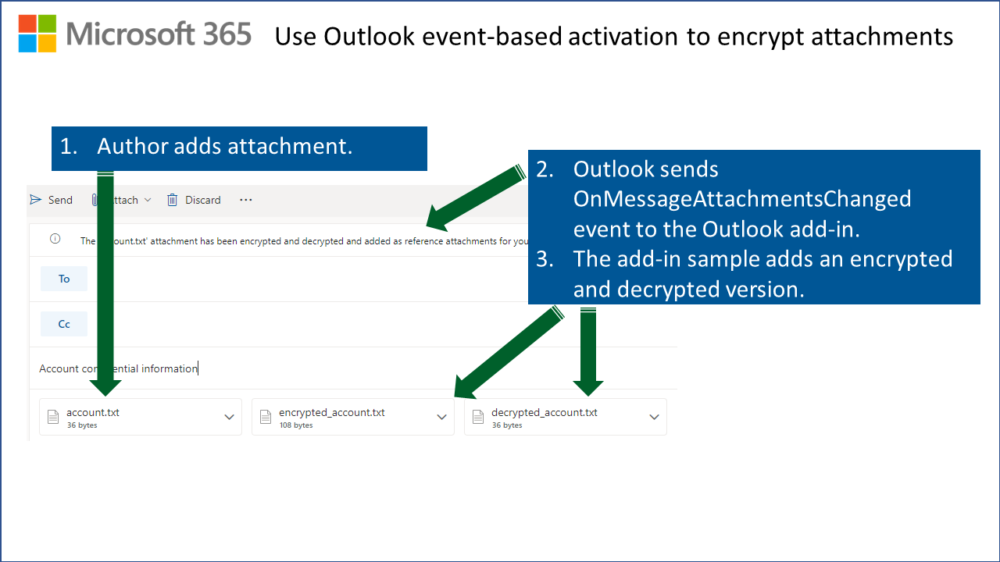

# Encrypt attachments, process meeting request attendees, and react to appointment date/time changes using Outlook event-based activation

**Applies to**: Outlook on Windows ([new](https://support.microsoft.com/office/656bb8d9-5a60-49b2-a98b-ba7822bc7627) and classic) | Outlook on the web



## Summary

---

This sample showcases how to use event-based activation in an Outlook add-in when the user composes an email or appointment/meeting request.  It demonstrates how to run tasks based on events that fire when certain data changes when the user:

- Adds an attachment to an email or appointment/meeting request.
- Adds recipients or distributions lists as required or optional attendees in a meeting request.
- Changes the start date, end date, or time in an appointment/meeting request.
- Adds a notification message to the item when a new email or appointment/meeting request is created, instructing the user to open the task pane for further information.

## Features/Scenario

- **Encryption based on attachment change events.** This sample encrypts the first attachment that is added to a composed email or appointment, and adds it as another attachment with an "encrypted_" prefix on the file name. It then decrypts that attachment and adds it as another attachment with a "decrypted_" prefix on the file name.

  It also adds a notification message to the compose item to denote that encryption and decryption is in progress. When completed, that message is removed (it may only appear for a very brief time, depending on the complexity of the encryption process) and another notification message is added noting that the process has completed.

    

- **Notifications based on recipient changes.** This sample adds notification messages to a meeting request when recipients are added or removed. The notification message are removed when there are no longer any recipients.
  - Shows a message with a running tally of the number of required and optional attendees.
  - Show a message with a warning if one or more distribution lists are invited as an attendee.

- **Notifications based on date/time changes.** This sample adds a notification message to an appointment when the user changes the date/time, showing the original date/time that was set when the appointment was opened. The notification message provides a reference for further date/time edits.

  

## Applies to

---

- Outlook
  - Windows (new and classic)
  - web browser

## Prerequisites

---

- Microsoft 365

> Note: If you don't have a Microsoft 365 subscription, you can get a [free developer sandbox](https://developer.microsoft.com/microsoft-365/dev-program#Subscription) that provides a renewable 90-day Microsoft 365 E5 subscription for development purposes.

## Solution

---

| Solution | Author(s) |
| ---- | ---- |
| Use Outlook event-based activation to process item attachments, meeting request recipients, and appointment date/time changes. | [Eric Legault](https://twitter.com/elegault) |

## Version history

---

| Version | Date       | Comments        |
| ------- | ---------- | --------------- |
| 1.0     | 10-14-2021 | Initial release |

## Run the sample

---

Run this sample in Outlook on Windows or in a browser. The add-in web files are served from this repo on GitHub.

1. Download the **manifest.xml** file from this sample to a folder on your computer.
1. Sideload the add-in manifest in Outlook on the web or on Windows (new or classic) by following the manual instructions in the article [Sideload Outlook add-ins for testing](https://learn.microsoft.com/office/dev/add-ins/outlook/sideload-outlook-add-ins-for-testing).

### Try it out

Once the add-in is loaded, use the following steps to try out the functionality.

#### Manage attachments

1. Create a new message or appointment.
    >A notification appears at the top of the message that reads **Open the task pane for details about running the Outlook event-based activation sample add-in**. | Open task pane | Dismiss
1. Add an attachment.
    > A notification appears at the top of the message that reads **The '{file name} attachment has been encrypted and decrypted and added as reference attachments for your review**. | Dismiss

#### Set up meetings

1. Create a new meeting request. In Outlook on the web and new Outlook on Windows, choose **More options** to expand the request and include all details. Otherwise, you won't see the notifications in the next steps.
1. Add a user as a required or optional attendee.
    > A notification appears at the top of the message that reads **Your appointment has 1 required and 0 optional attendees**. | Dismiss
1. Add a distribution list as a required or optional attendee.
    > A notification appears at the top of the message that reads **Warning! Your appointment has a distribution list! Make sure you have chosen the correct one!** | Dismiss
1. Change the start or end date or time.
    > A notification appears at the top of the message that reads **Original date/time: Start = ##/##/#### #:##:## ##; End = ##/##/#### #:##:## ##**. | Dismiss

## Run the sample from localhost

If you prefer to host the web server for the sample on your computer, follow these steps.

1. Install a recent version of [npm](https://www.npmjs.com/get-npm) and [Node.js](https://nodejs.org/) on your computer. To verify if you've already installed these tools, run the commands `node -v` and `npm -v` in your terminal.
1. You need http-server to run the local web server. If you haven't installed this yet, run the following command.

    ```console
    npm install --global http-server
    ```

1. Use a tool such as openssl to generate a self-signed certificate that you can use for the web server. Move the cert.pem and key.pem files to the root folder for this sample.
1. From a command prompt, go to the root folder and run the following command.

    ```console
    http-server -S --cors . -p 3000
    ```

1. To reroute to localhost, run office-addin-https-reverse-proxy. If you haven't installed this, run the following command.

    ```console
    npm install --global office-addin-https-reverse-proxy 
    ```

    To reroute, run the following in another command prompt.

    ```console
    office-addin-https-reverse-proxy --url http://localhost:3000 
    ```

1. Sideload `manifest.xml` in Outlook on the web or on Windows (new or classic) by following the manual instructions in the article [Sideload Outlook add-ins for testing](https://learn.microsoft.com/office/dev/add-ins/outlook/sideload-outlook-add-ins-for-testing).
1. [Try out the sample!](#try-it-out)

## Key parts of this sample

### Configure event-based activation in the manifest

The manifest configures a runtime that loads a single JavaScript file to handle event-based activation. The following `<Runtime>` element specifies a `commands.html` page resource ID that loads the `commands.js` file in Outlook on the web and new Outlook on Windows. The `<Override>` element directly specifies the `commands.js` JavaScript file to load when running on classic Outlook on Windows. Classic Outlook on Windows doesn't use the HTML page to load the JavaScript file.

```xml
<Runtime resid="WebViewRuntime.Url">
  <Override type="javascript" resid="JSRuntime.Url"/>
...
<bt:Url id="WebViewRuntime.Url" DefaultValue="https://officedev.github.io/Office-Add-in-samples/Samples/outlook-encrypt-attachments/src/commands/commands.html" />
<bt:Url id="JSRuntime.Url" DefaultValue="https://officedev.github.io/Office-Add-in-samples/Samples/outlook-encrypt-attachments/src/commands/commands.js" />
```

The add-in handles six events that are mapped to various functions.

```xml
<LaunchEvents>
  <LaunchEvent Type="OnNewMessageCompose" FunctionName="onMessageComposeHandler" /> 
  <LaunchEvent Type="OnNewAppointmentOrganizer" FunctionName="onAppointmentComposeHandler" />                 
  <LaunchEvent Type="OnAppointmentAttendeesChanged" FunctionName="onAppointmentAttendeesChangedHandler" />
  <LaunchEvent Type="OnAppointmentTimeChanged" FunctionName="onAppointmentTimeChangedHandler" /> 
  <LaunchEvent Type="OnMessageAttachmentsChanged" FunctionName="onMessageAttachmentsChangedHandler" /> 
  <LaunchEvent Type="OnAppointmentAttachmentsChanged" FunctionName="onAppointmentAttachmentsChangedHandler" />
</LaunchEvents>
```

### Handle events

When the user creates a new message or appointment, Outlook loads the `commands.js` file specified in the manifest to handle the following events.

| Event | Handler |
| --- | ---|
| `OnNewMessageCompose` | onMessageComposeHandler |
| `OnNewAppointmentOrganizer` | onAppointmentComposeHandler |
| `OnAppointmentAttendeesChanged` | onAppointmentAttendeesChangedHandler |
| `OnAppointmentTimeChanged` | onAppointmentTimeChangedHandler |
| `OnMessageAttachmentsChanged` | *onItemAttachmentsChangedHandler |
| `OnAppointmentAttachmentsChanged` | *onItemAttachmentsChangedHandler |

> [!NOTE]
> The onItemAttachmentsChangedHandler function handles both OnMessageAttachmentsChanged and OnAppointmentAttachmentsChanged.

Outlook on the web and new Outlook on Windows load the `commands.html` page, which then also loads `commands.js`.

### Task pane code

The task pane code is located under the `taskpane` folder of this project. The task pane HTML and JavaScript files only provide a UI with details about this sample.

- `taskpane_appt_compose.html` is loaded when the user chooses the **Open task pane** link in the notification message or chooses **Show task pane** in the ribbon.
- `taskpane_msg_compose.html` is loaded when the user chooses the **Open task pane** link in the notification message or chooses **Show task pane** in the ribbon.

## Known Issues

- At present, imports are not supported in the JavaScript file where you implement the handling for event-based activation. This means that external libraries (like the `crypto-js` library used in this sample) can't be required directly in the `commands.js` file and must be loaded in `commands.html`. Since classic Outlook on Windows only loads `commands.js`, the `crypto-js` library can't be loaded to perform the encryption of attachments. Only Outlook on the web and new Outlook on Windows can load supporting `.html` files with external library references. Therefore encryption is only implemented for that scenario.
- `console.dir()` methods can't be used in event-based activation code in classic Outlook on Windows.
- `window.localStorage` can't be used in event-based activation code in classic Outlook on Windows.
- Choosing the **Open task pane** link in the InfoBar may not work in Outlook on the web and new Outlook on Windows. A fix has been deployed. For more information, see [Can't open task pane from link in Outlook NotificationMessages](https://github.com/OfficeDev/office-js/issues/2125) issue on GitHub.

## References

- [Configure your Outlook add-in for event-based activation](https://learn.microsoft.com/office/dev/add-ins/outlook/autolaunch)
- [Debug your event-based Outlook add-in](https://learn.microsoft.com/office/dev/add-ins/outlook/debug-autolaunch)
- Other samples:
  - [Use Outlook event-based activation to set the signature](https://github.com/OfficeDev/PnP-OfficeAddins/tree/main/Samples/outlook-set-signature)
  - [Use Outlook event-based activation to tag external recipients](https://github.com/OfficeDev/PnP-OfficeAddins/tree/main/Samples/outlook-tag-external)
- [crypto-js](https://www.npmjs.com/package/crypto-js)
- [Office.SessionData interface](https://learn.microsoft.com/javascript/api/outlook/office.sessiondata)
- [Microsoft Office Add-in Debugger Extension for Visual Studio Code](https://learn.microsoft.com/office/dev/add-ins/testing/debug-with-vs-extension)
- [Develop Office Add-ins with Visual Studio Code](https://learn.microsoft.com/office/dev/add-ins/develop/develop-add-ins-vscode)
- [Office Add-ins with Visual Studio Code](https://code.visualstudio.com/docs/other/office)
- [Debugging with Visual Studio Code](https://code.visualstudio.com/docs/editor/debugging)
- [Node.js debugging in VS Code](https://code.visualstudio.com/docs/nodejs/nodejs-debugging)
- [Office-Addin-Debugging](https://www.npmjs.com/package/office-addin-debugging)
- [Getting recipients and attendees Script Lab sample](https://raw.githubusercontent.com/OfficeDev/office-js-snippets/prod/samples/outlook/30-recipients-and-attendees/get-set-required-attendees-appointment-organizer.yaml)

## Questions and feedback

- Did you experience any problems with the sample? [Create an issue](https://github.com/OfficeDev/Office-Add-in-samples/issues/new/choose) and we'll help you out.
- We'd love to get your feedback about this sample. Go to our [Office samples survey](https://aka.ms/OfficeSamplesSurvey) to give feedback and suggest improvements.
- For general questions about developing Office Add-ins, go to [Microsoft Q&A](https://learn.microsoft.com/answers/topics/office-js-dev.html) using the office-js-dev tag.

## Copyright

Copyright (c) 2021 Microsoft Corporation. All rights reserved.

This project has adopted the [Microsoft Open Source Code of Conduct](https://opensource.microsoft.com/codeofconduct/). For more information, see the [Code of Conduct FAQ](https://opensource.microsoft.com/codeofconduct/faq/) or contact [opencode@microsoft.com](mailto:opencode@microsoft.com) with any additional questions or comments.

---


