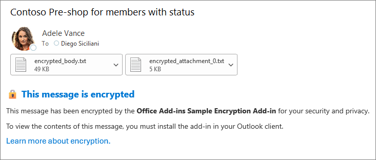
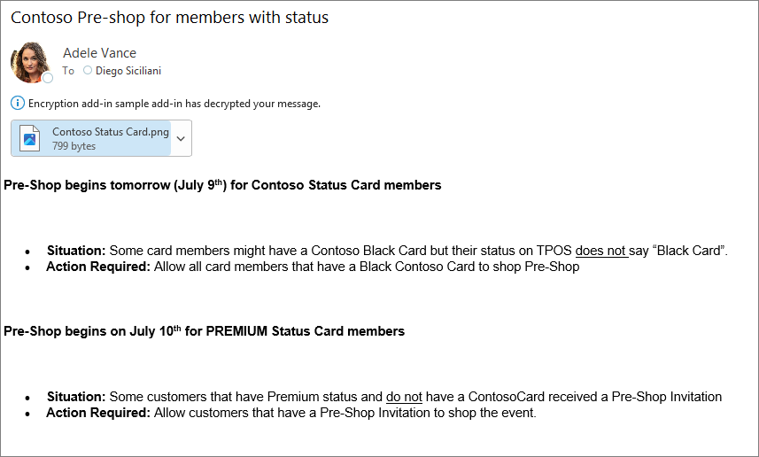

# Encrypt and decrypt messages in Outlook (preview)

**Applies to**: Outlook on Windows (classic)

## Summary

Implement custom encryption and decryption functionality in an Outlook add-in to secure email communications. The sample shows how to:

- Encrypt message content and attachments before sending using the `OnMessageSend` event.
- Automatically identify and decrypt encrypted messages when the recipient opens them using the `OnMessageRead` event.

To learn about key components of this sample, see [Create an encryption Outlook add-in](https://learn.microsoft.com/office/dev/add-ins/outlook/encryption-decryption).

> [!NOTE]
>
> - The `OnMessageRead` event is in preview. Features in preview shouldn't be used in production add-ins.
> - This sample uses simplified encryption and decryption protocols for demonstration purposes only. Don't use these protocols in production add-ins.

## Applies to

- Classic Outlook on Windows starting in Version 2510 (Build 19312.20000)

## Prerequisites

- A Microsoft 365 subscription.

    > **Note**: If you don't have a Microsoft 365 subscription, you might qualify for a free developer subscription that's renewable for 90 days and comes configured with sample data. For details, see the [Microsoft 365 Developer Program FAQ](https://learn.microsoft.com/office/developer-program/microsoft-365-developer-program-faq#who-qualifies-for-a-microsoft-365-e5-developer-subscription-).

- To preview the `OnMessageRead` event in classic Outlook on Windows:
  1. Join the [Microsoft 365 Insider program](https://aka.ms/MSFT365InsiderProgram) and choose the **Beta Channel** in the Outlook client. Your client must be on **Version 2510 (Build 19312.20000)** or later.
  1. Configure your computer's registry to reference the local beta copy of the Office.js API:
        1. In the registry, navigate to `HKEY_CURRENT_USER\SOFTWARE\Microsoft\Office\16.0\Outlook\Options\WebExt\Developer`. If the key doesn't exist, create it.
        1. Create an entry named `EnableBetaAPIsInJavaScript` and set its value to `1`.

- Install a recent version of [npm](https://www.npmjs.com/get-npm) and [Node.js](https://nodejs.org) on your computer if you want to run the web server on localhost. To check if you've already installed these tools, from a command prompt, run the following commands.

    ```console
    node -v
    npm -v
    ```

## Run the sample

To host the web server on localhost, follow these steps.

1. Clone or download this repository.
1. From a command prompt, go to the root of the project folder **/samples/outlook-encrypt-decrypt-messages**.
1. Run the following commands.

    ```console
    npm install
    npm run build
    npm start
    ```

    This starts the web server on localhost and sideloads the **manifest.xml** file to Outlook.

1. Follow the steps in [Try it out](#try-it-out) to test the sample.

1. To stop the web server and uninstall the add-in from Outlook, run the following command.

    ```console
    npm stop
    ```

## Try it out

Once the add-in is loaded in Outlook, use the following steps to try out its functionality.

### Encrypt a message

1. In classic Outlook on Windows, create a new message.
1. Add recipients, a subject, and content to the message body.

   **Note**: The recipient must also have the add-in installed to decrypt the message. To test this sample, send the message to yourself.
1. Optionally, add attachments to the message.

   **Note**: The decryption API doesn't currently support attachments of type `Office.MailboxEnums.AttachmentType.Item`.
1. Select **Send**.

   When the **OnMessageSend** event occurs, the encrypted message body and attachments are added as .txt files to the message. The body is replaced with a placeholder message and the original attachments are removed from the message.

   

### Decrypt a message

Select the encrypted message from the inbox.

The `OnMessageRead` event occurs and decrypts the message content and its attachments. The following notification is displayed: "Office Add-ins Sample Encryption Add-in is decrypting your message".

Once decryption is complete, the message body and attachments are shown and the following notification is displayed: "Office Add-ins Sample Encryption Add-in has decrypted your message".



## Questions and feedback

- Did you experience any problems with the sample? [Create an issue](https://github.com/OfficeDev/Office-Add-in-samples/issues/new/choose) and we'll help you out.
- We'd love to get your feedback about this sample. Go to our [Office samples survey](https://aka.ms/OfficeSamplesSurvey) to give feedback and suggest improvements.
- For general questions about developing Office Add-ins, go to [Microsoft Q&A](https://learn.microsoft.com/answers/topics/office-js-dev.html) using the office-js-dev tag.

## Copyright

Copyright (c) 2026 Microsoft Corporation. All rights reserved.

This project has adopted the [Microsoft Open Source Code of Conduct](https://opensource.microsoft.com/codeofconduct/). For more information, see the [Code of Conduct FAQ](https://opensource.microsoft.com/codeofconduct/faq/) or contact [opencode@microsoft.com](mailto:opencode@microsoft.com) with any additional questions or comments.

## Solution

| Solution | Author(s) |
| ----- | ----- |
| Encrypt and decrypt messages in Outlook | Microsoft |

## Version history

| Version | Date | Comments |
| ----- | ----- | ----- |
| 1.0 | January 27, 2026 | Initial release |


